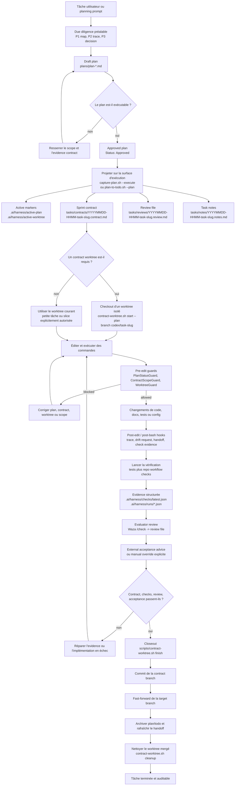
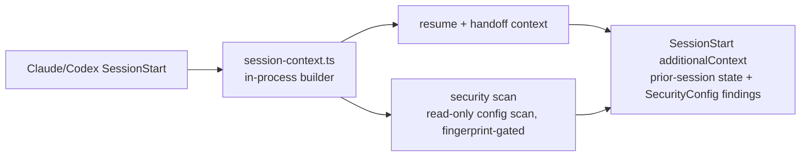
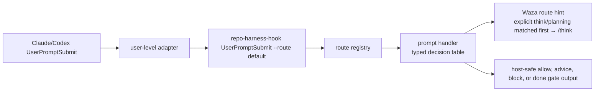

# repo-harness

`repo-harness` transforme les sessions de code Claude/Codex en workflow
repo-local répétable. Il fournit un CLI et des hooks skill/runtime qui écrivent
le contexte, les plans, les handoffs, les checks et les preuves de review dans le
projet, afin que la session d'agent suivante reprenne depuis les fichiers plutôt
que depuis l'historique de chat.

Utilisez-le pour :

- adopter un dépôt existant avec un contrat d'agent tasks-first
- garder Claude et Codex alignés sur les mêmes plans, checks, handoffs et limites
  de contexte
- dépenser moins de tokens à redécouvrir la structure grâce à CodeGraph et au
  chargement progressif du contexte

Donnez à l'agent un PRD ou Sprint complet ; ensuite, votre boucle se limite à
review and `next`, ou à lancer `/goal` puis passer AFK.

[English](README.md) | [简体中文](README.zh-CN.md) | [日本語](README.ja.md) | [Français](README.fr.md) | [Español](README.es.md)

Adresse du dépôt : `https://github.com/Ancienttwo/repo-harness`

## Pourquoi utiliser repo-harness

- **L'état de session vit dans les fichiers, pas dans l'historique de chat.** Des
  sessions d'agent distinctes — Claude, Codex, maintenant ou plus tard — restent
  synchronisées via le dépôt et non via un thread de conversation. Au démarrage
  d'une nouvelle session, le session-context builder in-process
  (`src/cli/hook/session-context.ts`) injecte le resume
  packet de la session précédente (`.ai/harness/handoff/resume.md`,
  `tasks/current.md`) ; à la fin de la session et après chaque édition,
  les typed handlers `session-context`, `stop` et `mutation-observed` réécrivent le handoff suivant. Une
  tâche peut s'interrompre en cours de route, et la session suivante reprend
  directement avec l'étape suivante exacte, les points de blocage et les fichiers
  modifiés, sans avoir à les redéduire.
- **Économe en tokens par conception.** Au lieu de boucles grep+read qui
  rescannent le dépôt à chaque session, le harness s'appuie sur un index CodeGraph
  pré-construit pour les requêtes structurelles (qui appelle, qui est appelé, où
  c'est défini), puis sur un chargement de contexte progressif via
  `.ai/context/context-map.json` et `capabilities.json` : un root context petit et
  stable (environ 12 Ko), plus des blocs capability chargés uniquement quand les
  fichiers que vous touchez en ont besoin. Un agent lit un contrat capability de
  1 Ko ou interroge l'index, au lieu de dépenser des milliers de tokens à
  redécouvrir la structure.

Dans un dépôt adopté, la surface à comprendre reste volontairement réduite :

| Surface | Rôle |
| --- | --- |
| `docs/spec.md` et `docs/reference-configs/` | Standards partagés et intention produit stable lisibles par chaque session d'agent. |
| `plans/`, `plans/prds/` et `plans/sprints/` | Work packages decision-complete avant le début de l'implémentation. |
| `tasks/contracts/`, `tasks/reviews/` et `.ai/harness/checks/` | Scope, vérification et preuves de review pour démontrer que le travail est terminé. |
| `.ai/harness/handoff/` et `tasks/current.md` | Session journal et état resumable dérivés des workflow artifacts plutôt que de la chat memory. |

## Human Review Path

Commencez par `tasks/reviews/<task>.review.md`. La `## Human Review Card` est la
surface de décision sur un seul écran : verdict, change type, fichiers prévus vs
réels, commandes passées, external acceptance, risque résiduel, action du
reviewer et rollback. Inspectez ensuite le contract actif, le dernier trace dans
`.ai/harness/checks/latest.json` et les fichiers modifiés. N'acceptez que lorsque
la review recommande pass, que le verdict de la card est pass et que l'external
acceptance est pass, `not_required` ou un manual override explicite.

## Agent Tracking Path

Les agents lisent les source artifacts avant les résumés dérivés :

| Agent reads first | Human reviews first |
| --- | --- |
| Prompt utilisateur courant et fichiers référencés | Human Review Card de `tasks/reviews/<task>.review.md` |
| `AGENTS.md` / `CLAUDE.md` | Fichiers modifiés et diff |
| Plan actif dans `.ai/harness/active-plan` | Allowed paths et exit criteria du contract actif |
| Contract actif dans `tasks/contracts/` | `.ai/harness/checks/latest.json` et run trace |
| Dernier handoff dans `.ai/harness/handoff/` | Risques résiduels et rollback |

`tasks/current.md` n'est qu'un snapshot d'orientation. S'il diverge du plan
actif, du contract, de la review, des checks ou du handoff, les source artifacts
l'emportent.

## Nouveautés

Les notes de version vivent dans [`docs/CHANGELOG.md`](docs/CHANGELOG.md). La
ligne actuelle est `0.10.1`.

## Comment ça marche

L'ensemble se découpe en trois couches, avec un seul runtime typed pour les host events :

1. **Couche package source** : ce dépôt maintient le CLI, les command skill
   facades, les templates, les hook assets, le workflow contract, les tests et le
   release gate.
2. **Couche contrat du dépôt cible** : `repo-harness adopt` ou une migration écrit
   `docs/spec.md`, `plans/`, `tasks/`, `.ai/context/`, `.ai/harness/` et les helper
   scripts. `.ai/hooks/lib/workflow-state.sh` n'est qu'une projection d'operator helper.
3. **Couche host adapter** : les `~/.claude/settings.json` et `~/.codex/hooks.json`
   de niveau utilisateur routent les events Claude/Codex vers `repo-harness-hook`.
   Après validation de `.ai/harness/workflow-contract.json`, le route registry
   appelle exactement un typed handler pour le tuple `event + routeId + matcher`.

Tous les events suivent `host adapter -> repo-harness-hook -> route registry ->
typed handler`. `UserPromptSubmit.default` utilise `prompt`; edit/bash/stop utilisent
`mutation-observed`, `command-observed` et `stop`. Il n'existe ni second dispatcher
shell ni runtime différent selon le provider.

Invariant central : les faits persistants vivent dans le dépôt, pas dans la
fenêtre de chat. Les typed handlers ne sont que des accélérateurs et des guardrails ;
l'authority réelle, ce sont les fichiers de plan, contract, review, checks et
handoff.

## Task Workflow : de Plan à Closeout

Le diagramme ci-dessous suppose que le harness est déjà installé dans le dépôt
cible. Il montre le cycle normal d'une tâche unique : d'abord former un plan,
puis le projeter dans le sprint contract, faire un checkout d'un worktree isolé
si nécessaire, implémenter sous la protection des hooks, puis vérifier, review,
external acceptance, et enfin closeout.



## Longues boucles produit

Pour le travail Greenfield comme Brownfield, avancez la discovery et le jugement
d'engineering plan dans le parent agent avant de demander à Codex de boucler sur
l'exécution :

1. Avant la création d'un contract, le parent agent invoque `geju` pour ouvrir le
   cadre, puis réalise P1/P2/P3 avec ses propres capacités repo/runtime. Il fige
   l'intention produit, l'architecture, les risques, le falsifier et l'evidence
   contract acceptés dans les development documents.
2. Transformez ces documents en PRD Sprint sous `plans/prds/`, avec un backlog
   ordonné et des sub-plans détaillés pour chaque execution slice.
3. Créez un Codex Goal qui pointe vers ce fichier de sprint. repo-harness peut
   ensuite projeter chaque sprint item dans le flow normal plan -> contract ->
   worktree -> verification.

Ce handoff rend les longues boucles plus précises : le parent agent porte le
jugement large en amont, le PRD Sprint devient la durable source of truth, et
Codex Goal mode reprend sur un sprint concret au lieu de réinterpréter le chat
initial.

## Les 5 premières minutes

C'est le chemin le plus rapide pour évaluer si un dépôt réel se prête à l'adoption
de ce workflow.

Prérequis : un Git working tree, `bash` et `bun` (pour la vérification ultérieure
et le template assembly). `jq` est optionnel pour `--dry-run`, mais recommandé
lors de l'application d'un settings merge.

### 1. Installer le CLI

Le chemin par défaut ne demande pas Node.js : l'installateur utilise Bun >=
1.1.35 comme runtime. Si Bun est absent ou plus ancien, il l'installe ou le met
à niveau avant d'installer le CLI `repo-harness`.

```bash
# macOS / Linux
curl -fsSL https://raw.githubusercontent.com/Ancienttwo/repo-harness/main/install.sh | sh

# Windows (PowerShell)
irm https://raw.githubusercontent.com/Ancienttwo/repo-harness/main/install.ps1 | iex
```

<details>
<summary>Vous avez déjà Bun >= 1.1.35 ? Utilisez Bun en priorité, ou npx en fallback</summary>

```bash
# Bun (recommandé)
bun add -g repo-harness
repo-harness install

# Fallback npx, avec Bun déjà sur PATH car le CLI s'exécute sur Bun
npx -y repo-harness@latest install
```

</details>

### 2. Bootstrap du runtime hôte

```bash
repo-harness install
```

`repo-harness install` sert au bootstrap global, `repo-harness update` au
rafraîchissement user-level, et `repo-harness adopt` au rafraîchissement
repo-local. `repo-harness install` configure le CLI, les hook adapters de niveau
utilisateur, Waza, Mermaid, le brain root et CodeGraph MCP ; l'ancien chemin
Claude plugin `scripts/setup-plugins.sh` est retiré.

### 3. Prévisualiser le contrat repo-local

```bash
repo-harness adopt --dry-run
```

Lancez le dry-run depuis le repo root. Il rapporte les specs, l'état des tasks,
le helper runtime, la cible des hook adapters et les fichiers de vérification qui
seraient créés ou rafraîchis. Il ne doit pas créer de stack applicatif : un dépôt
existant utilise `repo-harness adopt`, un nouveau projet ou module utilise le
mode scaffold de `repo-harness-setup`.

### 4. Appliquer, puis prouver le workflow

```bash
repo-harness adopt
bash scripts/check-task-workflow.sh --strict
bun test
```

Après application, le dépôt doit avoir un contract file-backed auditable plutôt
qu'une configuration de chat propre à un outil. Pour un nouveau projet ou module,
utilisez le mode scaffold de `repo-harness-setup` au lieu de `adopt`. Les maintainers éditant le
package lui-même ont besoin d'un source checkout — voir
[Maintainer Reference](#maintainer-reference).

### À quoi ressemble le succès

La commande doit se terminer par `=== Migration Report ===` et inclure :

- `Project hooks synced from:` : d'où vient le comportement des hooks générés
- `Host hook config target: user-level ~/.claude/settings.json and ~/.codex/hooks.json` : où se trouve la couche adapter
- `Host hook adapters are user-level:` : rappel d'installer les global adapters, et de faire confiance à `~/.codex/hooks.json`
- `Workflow migration:` : le plan de création ou de rafraîchissement des repo-local harness surfaces
- `Helper runtime:` : la chaîne d'outils opérationnels obtenue après application
- `--- External Tooling ---` : le guide de planning parent/Geju, la readiness Waza et CodeGraph et les conseils d'installation/mise à jour advisory

Si la sortie du dry-run est incorrecte, arrêtez-vous ici et lisez
[`docs/reference-configs/hook-operations.md`](docs/reference-configs/hook-operations.md).

## MCP Connector Quickstart

En sidecar optionnel, `repo-harness mcp` n'expose que les workflow artifacts aux
clients MCP. ChatGPT agit comme planner/reviewer qui lit l'état et fait avancer
une idée à travers les artifacts PRD, checklist Sprint et Codex goal handoff —
sans accès en écriture au source-code, sans exécution shell arbitraire ni Codex
runner par défaut. Codex reste l'exécuteur.

Ce sidecar suppose que le CLI est déjà installé via « Les 5 premières minutes »
ci-dessus. Utilisez-le quand vous voulez que ChatGPT planifie sur l'état réel du
dépôt et que Codex exécute le Sprint file-backed qui en résulte.

```bash
repo-harness mcp setup chatgpt --repo .
repo-harness mcp serve --repo . --transport http --host 127.0.0.1 --port 8765 --profile planner
```

Exposez ce server local via un tunnel HTTPS et créez un Connector ChatGPT avec
l'URL `/mcp`. Le guide généré est écrit dans :

```text
docs/repo-harness-chatgpt-mcp-setup.md
```

Le human workflow est le suivant :

1. ChatGPT lit les fichiers de workflow de repo-harness via MCP.
2. ChatGPT écrit un PRD avec `write_prd_from_idea`.
3. ChatGPT écrit un Sprint checklist avec `write_checklist_sprint`.
4. ChatGPT prépare `.ai/harness/handoff/codex-goal.md` avec `prepare_codex_goal_from_sprint`.
5. Codex exécute le prompt host-native `/goal` et stage chaque Sprint phase terminée.

Repli local pour la dernière étape de handoff :

```bash
repo-harness mcp prepare-goal --repo . --prd plans/prds/<feature>.prd.md --sprint plans/sprints/<feature>.sprint.md
```

Le Skill destiné à l'agent est installé dans :

```text
.agents/skills/repo-harness-chatgpt-bridge/SKILL.md
```

Ce Skill explique à Codex comment consommer les artifacts PRD/Sprint/Goal
produits par ChatGPT sans accorder à ChatGPT d'écriture sur le source-code ni
d'exécution shell.

Le Dev Mode peut opter pour l'exécution locale d'agents via MCP. C'est désactivé
par défaut. Quand l'utilisateur active le profile `orchestrator` avec le réglage
dev runner, ChatGPT peut appeler `run_agent_goal`, qui lit uniquement
`.ai/harness/handoff/codex-goal.md` et exécute le handoff fixe via un CLI local
autorisé tel que `codex exec` ou `claude -p`.

```bash
repo-harness mcp serve --repo . --transport http --profile orchestrator --enable-dev-runner --dev-runner-agents codex
```

Ce réglage est réservé au Developer Mode local. Il est borné par un timeout,
audité, et ce n'est pas un shell arbitraire.

## Hook Authority Map

`repo-harness-hook` est l'unique host-event runtime. L'adapter de niveau utilisateur
transmet l'event, puis le route registry utilise le tuple stable `event + routeId + matcher`
pour appeler exactement un typed handler. `assets/hooks/lib/workflow-state.sh` et
`.ai/hooks/lib/workflow-state.sh` sont des projections d'operator helper, pas des dispatchers.

- `~/.claude/settings.json` : adapter Claude de niveau utilisateur.
- `~/.codex/hooks.json` : adapter Codex de niveau utilisateur ; confiance requise dans Settings.
- `.claude/settings.json` / `.codex/hooks.json` repo-locales : inputs legacy à retirer pendant la migration.
- Les changements de handler vivent dans `src/cli/hook/` ; synchronisez la projection avec `bun run sync:hooks`.

The installed adapter owns the managed hook routes. Each route invokes one typed
handler ; il n'existe ni second runtime shell ni runtime propre à un provider.

| Route | Matcher | Typed handler | Function |
| --- | --- | --- | --- |
| `SessionStart.default` | all sessions | `src/cli/hook/session-context.ts` (in-process builder) | Injects prior handoff, sprint status, and read-only config-security findings before work starts. |
| `PreToolUse.edit` | `Edit|Write` | `src/cli/hook/mutation-guard.ts` (in-process handler) | Enforces worktree policy and plan/contract readiness before implementation edits. |
| `PreToolUse.subagent` | `Task|Agent|SendUserMessage` | `subagent` | Keeps delegated work returning through the parent session instead of leaking completion claims. |
| `PostToolUse.edit` | `Edit|Write` | `mutation-observed` | Records the edit journal and controlled-file observations. |
| `PostToolUse.bash` | `Bash` | `command-observed` | Observes command results and captures verification evidence without replacing the command runner. |
| `PostToolUse.always` | all tools | `trace-observer` | Provides low-noise always-on trace and runtime observation. |
| `UserPromptSubmit.default` | all prompts | `prompt` | Classifies prompt intent, routes planning/check/hunt hints, and renders host-safe workflow guidance. |
| `Stop.default` | session stop | `src/cli/hook/stop-handler.ts` (in-process handler) | Finalizes handoff and guards against ending with unresolved draft-plan or completion evidence gaps. |

`SessionStart` exécute le session-context builder in-process, qui assemble le contexte avant le début du travail :



Le prompt guard ajoute une étape interne supplémentaire :



Le typed handler possède le parsing d'entrée, l'état des fichiers et les effets de bord
déclarés ; le runtime uniformise uniquement la sortie host. AcceptanceReceipt est l'authority
de closeout et le review Markdown n'est qu'une projection.

## Hook Failure Playbook

Quand un hook block fonctionne, regardez d'abord la sortie structurée dans le
terminal. Les champs clés sont `guard`, `reason`, `fix`, `failure_class` et
`run_id`.

- Failure log : `.ai/harness/failures/latest.jsonl`
- Trace log : `.claude/.trace.jsonl`
- Guide approfondi : [`docs/reference-configs/hook-operations.md`](docs/reference-configs/hook-operations.md)

Guards courants :

- `PlanStatusGuard` : pas d'active plan, ou le plan n'est pas encore exécutable
- `ContractGuard` : une approved execution n'a pas encore généré le scaffold contract/review/notes
- `ContractGuard` : la tâche est déclarée terminée avant d'avoir passé la contract verification
- `WorktreeGuard` : écriture depuis le primary worktree alors que la politique des linked worktrees est appliquée

## Repo Workflow

- Root routing docs : `CLAUDE.md`, `AGENTS.md`
- Typed hook runtime : `src/cli/hook/` (via `repo-harness-hook`)
- Projection d'operator helper : `.ai/hooks/lib/workflow-state.sh`
- User-level adapter layer : `~/.claude/settings.json`, `~/.codex/hooks.json`
- Active execution surface : `tasks/`
- Plan source of truth : `plans/`
- Durable progress : `tasks/workstreams/`
- Release history : `docs/CHANGELOG.md`

## Release actuelle

- npm package : `repo-harness@0.10.1`
- Generated workflow stamp : `repo-harness@0.10.1+template@0.10.1`
- GitHub repository : `Ancienttwo/repo-harness`
- Release history : [`docs/CHANGELOG.md`](docs/CHANGELOG.md)

## Remerciements

Merci à [Hylarucoder](https://x.com/hylarucoder) pour sa contribution
méthodologique. La méthode P1/P2/P3 due-diligence de `repo-harness`, ainsi que
la pratique Geju qui structure le planning, le trace et le decision rationale,
viennent de sa contribution et de son influence.

Merci à [TW93](https://x.com/HiTw93), auteur de Waza. Les skills centraux
`think`, `hunt`, `check` et `health` structurent le rythme quotidien de planning,
bug hunt et verification de `repo-harness`.

Merci à [Peter Steinberger](https://x.com/steipete), auteur d'Oracle
(`@steipete/oracle`, MIT). C'est le moteur de consult navigateur GPT Pro /
ChatGPT Web par défaut de `chatgpt-browser` : le provider Oracle lance le binaire
oracle externe pour les consults `gptpro`, sans téléchargement automatique, et un
binaire manquant est une erreur franche.


### Attribution GitHub des contributeurs

Lorsque Codex contribue matériellement à un commit, utilisez le trailer co-author standard de GitHub à la fin du commit message :

```text
Co-authored-by: codex <codex@openai.com>
```

Gardez cette attribution opt-in et visible commit par commit. Ne l'intégrez pas aux scripts de commit ni aux hooks repo-harness downstream sauf si ce dépôt adopte explicitement la même politique.

## Action Command Skills

Les packages canoniques se trouvent dans `assets/skills/` (packages canoniques
activés) et `assets/skill-commands/` (survivants qui évoluent sur place) ; ils
préservent la portée de la découverte par skills, tandis que l'exécution
appartient au CLI et aux hooks :

- Router : `repo-harness` (Skill racine, synchronisé sans condition sur chaque
  profile)
- Couche setup : `repo-harness-setup` (modes adopt/init, migrate, upgrade,
  repair, scaffold, et capability-configuration ; router-only, jamais
  découvert automatiquement par un profile)
- Planning : `repo-harness-plan` (crée un plan decision-complete, ou revoit un
  plan existant)
- Couche product planning : `repo-harness-product` (modes PRD, Sprint, et
  Goal ; le mode PRD active `$geju`, puis rédige en Claude-first avec
  `claude -p --model opus`, Codex ne sert que de fallback ; le mode Sprint
  transforme un PRD en backlog ordonné dans `plans/sprints/`, chaque ligne
  étant développée avec `$think` avant le contract flow ; le mode Goal prépare
  des prompts `/goal` Codex/Claude depuis un PRD ou Sprint détaillé et le
  demande d'abord s'il manque)
- Vérification : `repo-harness-check` (contrôles workflow/release plus une
  référence deploy-readiness)
- Release : `repo-harness-ship`
- Architecture : `repo-harness-architecture`
- Cross-model review : `repo-harness-cross-review` (host-aware ; installé sur
  les deux hosts pour le profile strict)
- Intégration ChatGPT : `repo-harness-chatgpt` (consult/continuation Oracle
  browser/GPT Pro, setup MCP Connector, bridge handoff, et read-back
  evidence ; setup explicite uniquement, jamais impliqué par le product
  planning)

La chaîne de planning est volontairement découpée en couches :

```text
idea -> repo-harness-product (mode PRD) -> repo-harness-product (mode Sprint, from-prd) -> repo-harness-product (mode Goal)
```

Utilisez le mode PRD de `repo-harness-product` quand la source est encore une
idée produit : il lance d'abord un direction pass `$geju`, puis demande à
Claude via `claude -p --model opus` de rédiger le PRD, avec Codex seulement en
fallback. Utilisez son mode Sprint (`from-prd <plans/prds/*.prd.md>`) pour
transformer un PRD approuvé en Sprint backlog ordonné avec des lignes
d'acceptance vérifiables par machine. Utilisez son mode Goal seulement lorsqu'un
PRD ou Sprint détaillé existe déjà ; il prépare un prompt `/goal` borné pour
Codex/Claude et garde le PRD/Sprint comme source of truth. Si ce document
manque, le mode Goal doit le demander avant de lancer une implémentation depuis
le chat.

`repo-harness adopt` sert aux dépôts existants ; le mode scaffold de
`repo-harness-setup` sert à créer un nouveau projet ou module. `hooks-init`,
`docs-init` et `create-project-dirs` sont des étapes internes, pas des
commands publiques.

## Maintainer Reference

Les maintainers qui éditent le package lui-même ont besoin d'un source checkout :

```bash
git clone https://github.com/Ancienttwo/repo-harness.git ~/Projects/repo-harness
cd ~/Projects/repo-harness
bun src/cli/index.ts update
```

`~/Projects/repo-harness` est l'unique source of truth éditable ; les chemins
Claude/Codex locaux (`~/.claude/skills/repo-harness`,
`~/.codex/skills/repo-harness`) sont des runtime entrypoints adossés à des
symlinks. Seul `~/.codex/skills/repo-harness` expose `SKILL.md` et
`assets/skill-commands/` ; `scripts/sync-codex-installed-copies.sh` reconstruit
ces alias et supprime les répertoires retirés `repo-harness-skill` /
`project-initializer`. Le script lie par défaut les chemins runtime au dépôt
source ; définissez `AGENTIC_DEV_LINK_INSTALLED_COPIES=0` pour un staging par
copie, ou `CODEX_SKILLS_ROOT` / `CLAUDE_SKILLS_ROOT` pour des racines alternatives.

### Vérifier le workflow contract de ce dépôt

Lancez le gate complet dans [Verification](#verification) ; `bun run check:ci`
est la commande unique équivalente CI.

### Runtime reference docs

Generic repo-harness runtime/reference docs live in the installed package under
`assets/reference-configs/` and are resolved through the CLI:

```bash
repo-harness docs list
repo-harness docs path harness-overview
repo-harness docs show harness-overview
```

Les valeurs par défaut de l'initializer et du runtime (question flow, plan menu,
template vars, routing external-tooling) sont documentées dans `harness-overview.md`
sous **Initializer and Runtime Model**. Generated and migrated repos still keep
`docs/reference-configs/*.md`, but those files are deterministic pointer stubs.
Repo-local workflow state, policy, checks, runs, handoff packets, context maps,
and helper snapshots stay under `.ai/`.

### Template assembly

```bash
bun scripts/assemble-template.ts --plan C --name "MyProject"
bun scripts/assemble-template.ts --target agents --plan C --name "MyProject"
```

### Verification

```bash
bun test
bash scripts/check-task-sync.sh
bash scripts/check-task-workflow.sh --strict
bun scripts/inspect-project-state.ts --repo . --format text
bun src/cli/index.ts adopt --repo . --dry-run
bash scripts/check-agent-tooling.sh --host both --check-updates
bun run benchmark:skills --eval route-workflow-check
```


### Local benchmark skeleton

```bash
bun run benchmark:skills --eval route-workflow-check
```

Eval output is the release/readiness evidence path; dry-run benchmark wiring is only a smoke and is not skill-effectiveness evidence.


### Run one eval across both Claude and Codex

```bash
bun run benchmark:skills --eval repair-agents-task-sync
```

## Key Files

- Skill spec : `SKILL.md`
- Root routing docs : `CLAUDE.md`, `AGENTS.md`
- Plan mapping : `assets/plan-map.json`
- Question-pack : `assets/initializer-question-pack.v4.json`
- Shared hooks : `assets/hooks/`
- Runtime reference docs: `assets/reference-configs/` via `repo-harness docs`
- Workflow contract : `assets/workflow-contract.v1.json`
- Hook operations reference : `docs/reference-configs/hook-operations.md`
- Template assembler : `scripts/assemble-template.ts`
- State inspector : `scripts/inspect-project-state.ts`
- External tooling detector: `scripts/check-agent-tooling.sh`
- Scaffolding scripts:
  - `scripts/init-project.sh`
  - `scripts/create-project-dirs.sh`
- Canonical adoption planner: `src/core/adoption/standard-plan.ts`

## Generated vs Self-Hosted Hook Projection

- Le comportement downstream des hooks est défini par la sortie générée depuis `assets/hooks/` et `assets/reference-configs/`.
- Ce repo dogfoode le même contract, mais le comportement self-host ne se synchronise pas magiquement avec les generated repos ; un changement doit mettre à jour explicitement les deux surfaces lorsque nécessaire.
- Chaque changement de hook doit dire s'il affecte `self-host`, `generated` ou `both`.

## Package Manager Defaults

- Priorité générale par défaut : `bun > pnpm > npm`
- **Plan G/H** (Python-centric) utilise **`uv`** comme primary package manager par défaut.

## Runtime Profiles

- `Plan-only (recommended)` (default)
- `Plan + Permissionless`
- `Standard (ask before each action)`

Configuré dans `assets/initializer-question-pack.v4.json` et consommé par `scripts/initializer-question-pack.ts`.

## Verification

Pour la release review, utilisez le gate unique équivalent CI :

```bash
bun run check:ci
```

Ce gate se développe vers les checks possédés par le repo ; `bun run check:release` ajoute seulement le preflight npm unpublished-version avant de déléguer au même gate.

```bash
bun test
bash scripts/check-deploy-sql-order.sh
bash scripts/check-architecture-sync.sh
bash scripts/check-task-sync.sh
bash scripts/check-task-workflow.sh --strict
bun scripts/inspect-project-state.ts --repo . --format text
bun src/cli/index.ts adopt --repo . --dry-run
bash scripts/check-agent-tooling.sh --host both --check-updates
bun run benchmark:skills --eval route-workflow-check
```
