<div align="center">

# repo-harness

### A file-backed workflow for Claude and Codex, and an authorized runtime for the programs built on top of it


[](https://www.npmjs.com/package/repo-harness)
[](https://opensource.org/licenses/MIT)
[](https://bun.sh)

[English](README.md) | [简体中文](README.zh-CN.md) | [日本語](README.ja.md) | [Français](README.fr.md) | [Español](README.es.md)

**Give the agent a complete PRD or Sprint; after that, your loop is just review and `next`, or start `/goal` and go AFK.**

</div>

`repo-harness` ships a CLI plus skill/runtime hooks that write context, plans,
handoffs, checks, and review evidence back into the project, so the next agent
session continues from files instead of chat memory. It adopts an existing repo
with a tasks-first agent contract that keeps Claude and Codex aligned.

On top of that contract it runs **authorized programs**: long-running work that
holds its own authorization, budget, task offers, and leases, so a Sprint can
advance across sessions without a human driving each step.

## Contents

- [Get Started](#get-started)
- [Why repo-harness](#why-repo-harness)
- [Two Layers](#two-layers)
- [Key Features](#key-features)
- [How It Works](#how-it-works)
- [Task Workflow](#task-workflow)
- [Authorized Programs](#authorized-programs)
- [Hooks](#hooks)
- [Local Human Control Board](#local-human-control-board)
- [MCP Connector](#mcp-connector)
- [Reviewing Work](#reviewing-work)
- [Skills](#skills)
- [Maintainer Reference](#maintainer-reference)
- [Acknowledgements](#acknowledgements)
- [Current Release](#current-release)
- [License](#license)

## Get Started

### 1. Install the CLI

Prerequisites: a Git working tree, `bun`, and usable `herdr` >=0.9.0 for host readiness; macOS/Linux also require `bash`,
while Windows requires Git for Windows (including its Bash and `usr/bin`
tools). `jq` is optional. No Node.js required — the installer uses Bun >=
1.4.0 as the runtime, installing or upgrading Bun first when needed.

```bash
# macOS / Linux
curl -fsSL https://raw.githubusercontent.com/Ancienttwo/repo-harness/main/install.sh | sh

# Windows (PowerShell)
irm https://raw.githubusercontent.com/Ancienttwo/repo-harness/main/install.ps1 | iex
```

With Bun >= 1.4.0 already on PATH, skip the shell installer. Package-manager-owned
Bun installs fail closed with the matching upgrade command (`brew upgrade bun`)
instead of overwriting manager-owned files.

```bash
bunx repo-harness@latest install     # Bun one-shot bootstrap
bun add -g repo-harness              # or install the persistent CLI first
repo-harness install
npx -y repo-harness@latest install   # npx fallback; the CLI still runs on Bun
```

Install herdr from [herdr.dev](https://herdr.dev/) and verify `herdr --version`.
Persistent review hosting requires POSIX process groups; on Windows use WSL.
Missing or unusable herdr blocks host readiness. Before upgrading from tmux,
drain existing reviewers using the previous version and explicitly rebind terminal
endpoints. See [runtime cutover](https://github.com/Ancienttwo/repo-harness/blob/archive/docs-researches-20261004/docs/researches/20260909-herdr-runtime-cutover.md).

### 2. Bootstrap the host runtime

```bash
repo-harness install
```

On Windows, keep Git for Windows on the install/update `PATH`. That explicit
ceremony validates and pins `git.exe`, its matching `bash.exe`/`usr/bin`, and
the install account's absolute `TEMP` directory plus native `System32` tools in the OS account's
`~/.repo-harness/config.json#protectedHelperRuntime`. Protected workflow
helpers do not rediscover tools from a caller's `PATH`; rerun
`repo-harness update` after relocating or replacing Git for Windows.

The global bootstrap: installs the npm package as the global CLI, refreshes
repo-harness skill aliases, installs user-level hook adapters, and records an
explicit install profile. It is idempotent and does not apply repo-local workflow
files to the current directory. `--dry-run --json` lists components to install,
skip, and remove first. Profiles, native Codex delegation authority, refresh commands, and the
read-only `setup check` audit:
[`install-profiles.md`](docs/reference-configs/install-profiles.md).

### 3. Preview the repo-local contract

```bash
repo-harness init --dry-run
```

Run this from the target repository root. It reports the specs, task state,
helper runtime, hook adapter target, and verification files that would be created
or refreshed. It never creates an application stack; new projects and modules use
`repo-harness-setup`'s scaffold mode instead.

### 4. Apply and verify

```bash
repo-harness init
bash scripts/check-task-workflow.sh
bun test
```

### Success looks like this

Successful init enables automatic architecture document projection and proactive
Stop-hook refactor recommendations when those preferences are unset. Explicit
disabled choices are preserved. Suggestions present evidence for a user decision;
they do not authorize a refactor. Dry-run does not write these preferences.

Apply ends with `=== Migration Report ===`, naming where generated hook behavior
comes from, the user-level `~/.claude/settings.json` and `~/.codex/hooks.json`
adapter target, the repo-local surfaces created or refreshed, the
`.ai/harness/scripts/*` helper runtime, and an `--- External Tooling ---`
readiness block. Stable intent then lives in `docs/spec.md`, execution state in
`plans/` and `tasks/`, resume state in `.ai/harness/handoff/`. If the dry run
looks wrong, stop and read
[`hook-operations.md`](docs/reference-configs/hook-operations.md) first.

### Update and remove

```bash
repo-harness update          # reconcile CLI, mandatory deps, profile tooling, and CodeGraph
repo-harness update --check  # read-only repair guidance, no writes
repo-harness upgrade         # check retired leftovers; no writes
repo-harness upgrade --apply # back up and remove only proven owned leftovers
repo-harness uninstall --dry-run # preview owned user configuration cleanup
repo-harness uninstall           # remove owned configuration; preserve user changes/history
repo-harness mcp uninstall --dry-run # preview independent MCP setup cleanup
repo-harness mcp uninstall --services-stopped # after stopping all MCP HTTP services
```

`update` and `setup check` print one leftover count. `update` does not apply
cleanup. Run `upgrade --json` for ownership and proof per item. Use
`--scope project|global|all` to select the scan (default: `all`). Project scope
requires a Git repository. Check exits 1 when any leftover remains.

`upgrade --apply` also refreshes old owned copies of still-shipped skills from
this package. It refreshes the project workflow-state helper and contract
template only when an old ownership hash matches. It keeps changed copies.
Update continues to report counts only. This puts destructive changes and copy
replacement under the same explicit, backed-up transaction.

Old merge-gate state, v0.10.0 archives, and older backups are report-only by
default. Use `upgrade --apply --include-state-artifacts` to select these artifacts
for removal. This flag still requires ownership proof. Unknown artifacts stay.
The third-party `codex@openai-codex` Claude plugin and user rule lines in
`~/.claude/CLAUDE.md` and `~/.codex/AGENTS.md` are always report-only.

Project cleanup supports regular files and host hook entries. Project
directories and symlinks remain report-only. Global cleanup supports verified
owned directories and links.

Cleanup keeps changed and unowned files. It also keeps current global typed
hook adapters and user hook entries. It backs up each target before removal.
Apply exits 0 when all eligible operations succeed, even if report items remain.
A second apply with no eligible items changes no bytes. The command prints the
backup paths and records nonempty runs in
`~/.repo-harness/upgrade-cleanup.log.jsonl`.

For project rollback, use the printed `repo-harness init rollback` command.
For global rollback, replace each target with its numbered snapshot at the
original path in the backup manifest. Do not overlay directory contents.
Restore symlinks verbatim. There is no `install --restore-transaction` command.
Keep the backup until you verify the cleanup. Homes from the older v3.x–v5.x
release line have no supported historical proof and remain report-only.

## Why repo-harness

- **File-backed sessions, not chat memory.** Separate Claude and Codex sessions
  stay coordinated through the repo. `SessionStart` injects the prior session's
  resume packet, `Stop` writes the handoff, and each edit records a small journal
  event. A session can end mid-task and the next one resumes the exact next step,
  blockers, and changed files without re-deriving them.
- **Token-lean by design.** Instead of grep-and-read loops that re-scan the repo
  every session, the harness leans on a pre-built CodeGraph index for structural
  queries and on progressive context loading: a stable ~12KB root context plus
  capability blocks loaded only when the files you touch need them. Agents read a
  ~1KB capability contract instead of rediscovering structure.
- **Review-ready evidence.** Every task leaves a contract, structured check
  evidence, and a review card behind. The human decision surface is one screen —
  verdict, intended vs actual files, commands passed, residual risk, rollback —
  rather than a reconstruction of what the agent claims it did.
- **Unattended work stays accountable.** A program cannot start without a stored
  authorization, cannot exceed its budget ledger, cannot hold a task past its
  lease, and cannot claim acceptance without a receipt. Autonomy is bounded by
  artifacts, not by trust.

In an adopted repo, the surface area is intentionally small:

| Surface | Purpose |
| --- | --- |
| `docs/spec.md` and `docs/reference-configs/` | Shared standards and stable product intent that every agent session can read. |
| `plans/`, `plans/prds/`, and `plans/sprints/` | Decision-complete work packages before implementation starts. |
| `tasks/contracts/`, `tasks/reviews/`, and `.ai/harness/checks/` | Scope, verification, and review evidence for proving the work is done. |
| `.ai/harness/handoff/` and `tasks/current.md` | Session journal and resumable status, derived from workflow artifacts instead of chat memory. |

## Two Layers

The product reads as two layers that share one set of files.

**Layer 1 — the session contract.** One human, one agent session, one task at a
time. Plans, contracts, checks, reviews, and handoffs are the durable authority;
hooks keep the session inside them. This is the whole product for a solo repo,
and everything in [Task Workflow](#task-workflow) belongs here. Nothing below is
required to use it.

**Layer 2 — authorized programs.** Long-running work that outlives a session:
an unattended controller stepping a Sprint, a refactor program driven off the architecture model, a
collaboration plane where several Module Engineers exchange signals and
handoffs. Each program is gated on an operator-minted authorization, draws on a
per-goal budget ledger, and holds work through renewable leases. See
[Authorized Programs](#authorized-programs).

| | Layer 1 | Layer 2 |
| --- | --- | --- |
| Unit of work | One task contract | One authorized program |
| Who drives it | A human in a session | A controller, under caps |
| Authority | Plan, contract, review, checks | The above, plus authorization, budget, lease, receipts |
| Entry point | `repo-harness init` | `repo-harness automation grant mint` |
| Stop condition | Task closeout | Budget exhausted, lease lost, or a terminal receipt |

Layer 2 does not replace layer 1: a program's every step still projects into the
same plan, contract, and review artifacts a human would have written.

## Key Features

| | |
| --- | --- |
| **File-backed sessions** | Plans, contracts, checks, and handoffs live in the repo, so a new session resumes from artifacts instead of a chat thread |
| **Typed hook runtime** | Eight shared managed routes plus three Codex-only delegation routes, each bound to exactly one typed in-process handler, with fail-closed guards at the edit boundary |
| **Plan → Contract → Review** | One lifecycle from approved plan to projected contract, isolated worktree, structured evidence, and a reviewable closeout |
| **Authorized programs** | Refactor, automation, and collaboration programs that hold their own authorization, budget ledger, task offers, and renewable leases |
| **Bounded unattended controller** | One Engineer dispatch loop under hard step, duration, and retry caps, reserving budget before each attempt |
| **Progressive context loading** | A ~12KB stable root context plus ~1KB capability contracts loaded only for the files actually being touched |
| **CodeGraph integration** | Structural queries (callers, callees, definitions) answered from a pre-built index instead of repeated grep-and-read passes |
| **MCP planner sidecar** | ChatGPT reads real repo state and writes PRD/Sprint/Goal artifacts; Codex executes them, with no default source-code write access |
| **Claude + Codex alignment** | One user-level adapter contract, one workflow contract, and one set of repo-local artifacts shared by both hosts |

## How It Works

1. **Source package**: this repository owns the CLI, command facades, templates,
   typed hook handlers, the operator-helper asset, workflow contract, tests, and
   release gate.
2. **Target repo contract**: `repo-harness init` or migration writes repo-local
   files such as `docs/spec.md`, `plans/`, `tasks/`, `.ai/context/`,
   `.ai/harness/`, helper scripts, and `.ai/hooks/`.
3. **Host adapters**: user-level `~/.claude/settings.json` and
   `~/.codex/hooks.json` route Claude/Codex events into `repo-harness-hook`.

The hook entrypoint exits silently for non-opt-in repos. For opted-in repos, the
route registry binds the public event tuple to exactly one packaged typed
handler. `.ai/hooks/` holds operator-helper projection only; it is never a
host-event dispatcher.

The core invariant is that durable truth lives in the repo, not a chat thread.
Hooks are accelerators and guardrails; authority remains the file-backed plan,
contract, review, checks, and handoff artifacts. Prompt-layer plan/spec/contract
gates are advisory routing; hard enforcement lives at the edit boundary. Handler
internals, the minimal-change surface, and policy modes:
[`hook-operations.md`](docs/reference-configs/hook-operations.md) and
[`minimal-change-hooks.md`](docs/reference-configs/minimal-change-hooks.md).

## Task Workflow

The diagram assumes the harness is installed. It shows the normal lifecycle from
a program sprint backlog down to one contract task: select the task, project it
into execution files, check out the contract worktree when policy requires it,
implement under hooks, verify, review, and close out.

```mermaid
flowchart TD
  Program["Program goal or release theme"] --> Sprint{"Sprint layer needed?"}
  Sprint -->|yes| PRD["Upper-layer PRD<br/>plans/prds/*.prd.md"]
  PRD --> SprintDoc["Sprint backlog<br/>plans/sprints/*.sprint.md"]
  SprintDoc --> NextTask["Select next sprint task<br/>sprint-backlog.sh next"]
  Sprint -->|no| UserTask["User task or planning prompt"]
  Heartbeat["Heartbeat triage<br/>scripts/heartbeat-triage.sh<br/>.ai/harness/triage/"] --> UserTask
  NextTask --> UserTask

  UserTask --> Discovery["Due diligence<br/>P1 map, P2 trace, P3 decision"]
  Discovery --> LoopEvidence["Loop evidence when routing changes<br/>state-snapshot --json<br/>affected routing tests"]
  LoopEvidence --> PlanDraft["Draft plan<br/>plans/plan-*.md"]
  PlanDraft --> PlanReview{"Plan ready for execution?"}
  PlanReview -->|no| Refine["Refine plan, scope, evidence contract"]
  Refine --> PlanDraft
  PlanReview -->|yes| Approve["Approved plan<br/>Status: Approved"]

  Approve --> Project["Project plan into execution<br/>capture-plan.sh --execute<br/>or plan-to-todo.sh --plan"]
  Project --> Active["Active markers<br/>.ai/harness/active-plan<br/>.ai/harness/active-worktree"]
  Project --> SprintActive["Sprint projection<br/>active-sprint marker<br/>tasks/current.md"]
  Project --> Contract["Sprint contract<br/>tasks/contracts/YYYYMMDD-HHMM-task-slug.contract.md"]
  Project --> ReviewFile["Review file<br/>tasks/reviews/YYYYMMDD-HHMM-task-slug.review.md"]
  Project --> Notes["Task notes<br/>tasks/notes/YYYYMMDD-HHMM-task-slug.notes.md"]

  Contract --> Delegation["Delegation contract<br/>budget / permission_scope / roles"]
  Delegation --> Delegate{"Use contract-run delegation?"}
  Delegate -->|yes| ContractRun["Worker/verifier child run<br/>scripts/contract-run.ts"]
  Delegate -->|no| WorktreePolicy{"Contract worktree required?"}
  WorktreePolicy -->|yes| Checkout["Checkout isolated worktree<br/>contract-worktree.sh start --plan<br/>branch codex/task-slug"]
  WorktreePolicy -->|no| CurrentTree["Use current worktree<br/>small or explicitly allowed slice"]
  Checkout --> Implement
  CurrentTree --> Implement
  ContractRun --> Changes

  Implement["Edit and run commands"] --> PreHooks["Pre-edit guards<br/>PlanStatusGuard, ContractScopeGuard, WorktreeGuard"]
  PreHooks -->|blocked| ScopeFix["Fix plan, contract, worktree, or scope"]
  ScopeFix --> Implement
  PreHooks -->|allowed| Changes["Code, docs, tests, or config changes"]
  Changes --> PostHooks["Post-edit and post-bash hooks<br/>trace, drift request, handoff, check evidence"]
  PostHooks --> ArchQueue["Architecture queue<br/>architecture-queue.sh record/reindex<br/>check-architecture-sync.sh"]
  ArchQueue --> Verify["Run verification<br/>tests plus repo workflow checks"]

  Verify --> Checks["Structured evidence<br/>.ai/harness/checks/latest.json<br/>.ai/harness/runs/*.json"]
  Checks --> CheckReview["Evaluator review<br/>Waza /check -> review file"]
  CheckReview --> External["External acceptance advice<br/>or explicit manual override"]
  External --> DoneGate{"Contract, checks, review, and acceptance pass?"}
  DoneGate -->|no| Repair["Repair failing evidence or implementation"]
  Repair --> Implement
  DoneGate -->|yes| SprintComplete{"Sprint task active?"}
  SprintComplete -->|yes| MarkSprint["Mark backlog item complete<br/>sprint-backlog.sh complete-task"]
  SprintComplete -->|no| Closeout["Closeout<br/>scripts/contract-worktree.sh finish"]
  MarkSprint --> Closeout

  Closeout --> Commit["Commit contract branch"]
  Commit --> Merge["Fast-forward target branch"]
  Merge --> Archive["Archive plan/todo and refresh handoff"]
  Archive --> Cleanup["Cleanup merged worktree<br/>contract-worktree.sh cleanup"]
  Cleanup --> Done["Reviewable completed task"]
```



For long-running product loops, keep discovery and engineering-plan judgment with
the parent agent before Codex loops on execution: `geju` opens the pre-contract
frame, the parent completes P1/P2/P3 and freezes the accepted direction into an
upper-layer PRD under `plans/prds/` and an ordered sprint backlog under
`plans/sprints/`, then a Codex Goal points at that sprint file. The PRD stays the
upper source of truth and the backlog is the durable execution queue, so a
resumed Goal session never reinterprets the original chat. See
[`agentic-development-flow.md`](docs/reference-configs/agentic-development-flow.md)
and [`workflow-orchestration.md`](docs/reference-configs/workflow-orchestration.md).

## Authorized Programs

A program is work that outlives a session. Every one of them starts from the
same three primitives, and none of them can be started without the first.

```bash
repo-harness automation grant mint   # store one operator ProgramAuthorizationV2
repo-harness automation grant list   # digests held for this repository
repo-harness automation budget show          # the enforceable per-goal ledger
repo-harness automation budget repair        # seal a stopped or expired run's exhaustion receipt
```

- **Authorization.** An operator-minted `ProgramAuthorizationV2` lives in the
  harness home gate store. There is no unauthenticated start path, and a program
  never derives its own actor — the author of every record is resolved from
  `--authorization-id`.
- **Budget.** Agent turns, worker acquisition, and runner invocations reserve against a per-goal ledger before work starts. `budget repair` seals exhaustion under the existing lock. It changes no cap.
- **Lease.** Held work carries a renewable lease with a renewal interval, a
  maximum TTL, and a closed set of evidence sources. An unproven liveness state
  requires attention instead of reclaiming silently.

### Unattended controller

```bash
repo-harness automation controller start --maximum-steps 20 --maximum-duration-ms 300000
repo-harness automation controller step
repo-harness automation controller status
repo-harness automation controller stop
```

One Engineer dispatch loop under hard caps, with deterministic backoff and a
bounded attempt-retry ledger. Each attempt reserves budget before it is
recorded, and a projected outcome outside the closed enum cannot be counted as
satisfied.

### Engineer scheduling

```bash
repo-harness engineer principal enroll        # map an OAuth authorization to a Binding
repo-harness engineer acquire-next --authorization-id <id> --idempotency-key <key>
repo-harness engineer work-demand propose|transition|materialize|status
repo-harness engineer message send|receive|ack
repo-harness engineer board                   # read-only organization attention
```

`acquire-next` selects and claims the first canonical offer for an enrolled
principal. Dependency edges resolve from receipt authorities, not inference, and
Sprint task IDs are immutable identities under backlog schema v2 — run
`repo-harness sprint migrate-schema` once on an older backlog.

Campaign execution moved to the existing Bot skills on 2026-10-04. Use [repo-harness](SKILL.md) to dispatch and collect work through Herdr/OAR. Use [repo-harness-product](assets/skills/repo-harness-product/SKILL.md) for planning and [repo-harness-check](assets/skill-commands/repo-harness-check/SKILL.md) for scope and verification. repo-harness has no campaign runtime.

### Refactor Mode

```bash
repo-harness refactor discover        # bounded shadow scan of one local proposal
repo-harness refactor materialize     # one recommendation into N Work Packages
repo-harness refactor verify-candidate
repo-harness refactor board
```

An ArchContext-backed program that turns an architecture recommendation into
work packages against a single canonical Sprint task authority. Activation is
gated: the canary set and rung-promotion evidence must be refreshed against the
installed provider before it turns on.

### Collaboration plane

```bash
repo-harness collaboration exchange              # one Work Exchange snapshot
repo-harness collaboration threads               # lanes, hotspot scores, opportunities
repo-harness collaboration post                  # append one CoordinationSignalV1
repo-harness collaboration handoff publish|list|adopt
repo-harness collaboration packet build|read
```

Several Module Engineers read one Work Exchange and publish bounded coordination
records. Handoff adoption is deliberately non-exclusive: it grants no Task,
Claim, or Lease.

The substrate keeps one Module Engineer and one writer. Bounded read-only Workers exchange untrusted signals and explicit handoffs. The source-checkout C9 canary is retired. Its historical result did not support multiple reader seats. Shared collaboration runtime tests remain active. Persistent same-capability `EngineerSeatV2`, an independent Review marketplace, and unattended Merge remain inactive.
See [`20260830-c9-real-multi-agent-canary.md`](https://github.com/Ancienttwo/repo-harness/blob/archive/docs-researches-20261004/docs/researches/20260830-c9-real-multi-agent-canary.md).

### External source intake

```bash
repo-harness external-source refresh   # one bounded, explicitly enabled GitHub observation
repo-harness external-source bind      # one immutable revision to one pending canonical task
repo-harness external-source bindings  # binding edges and current drift attention
```

Intake is inert by design. An observed Issue mints no execution authority and
does not become a runnable task on its own; binding attaches an immutable source
revision to a task that already has an approved plan and contract.

### Persistent acceptance review

```bash
repo-harness review round --contract tasks/contracts/<task>.contract.md --reviewer-repo <linked-checkout> --herdr-endpoint <address.json>
repo-harness review status --contract tasks/contracts/<task>.contract.md
repo-harness review close --contract tasks/contracts/<task>.contract.md
```

A dedicated linked checkout hosts one fleet `deep-reasoner` task-agent in the addressed Herdr session for at most three repair rounds. Default selection uses the owner’s opposite harness; `--harness` explicitly selects Claude or Codex. Only a missing executable before start allows a reported fallback. File Results pass domain binding/finding checks and the generic-review Receipt writer/verifier before close. Terminal history is observation. Claude uses an exact result-file allowlist plus mutation fingerprints; production OS write isolation and complete large-packet ingestion remain unverified.

## Hooks

The installed adapter owns eight shared managed hook routes. The route tuple
`event + routeId + matcher` is the stable contract; each tuple binds exactly
one typed in-process handler.

| Route | Matcher | Handler | Function |
| --- | --- | --- | --- |
| `SessionStart.default` | all sessions | `src/cli/hook/session-context.ts` (in-process builder) | Injects prior handoff, sprint status, minimal-change guidance, and read-only config-security findings before work starts. |
| `PreToolUse.edit` | `Edit\|Write` | `src/cli/hook/mutation-guard.ts` (in-process handler) | Enforces worktree policy and plan/contract readiness before implementation edits. |
| `PreToolUse.subagent` | `Task\|Agent\|SendUserMessage` | `src/cli/hook/subagent-handler.ts` | Keeps delegated work returning through the parent session instead of leaking completion claims. |
| `PostToolUse.edit` | `Edit\|Write` | `src/cli/hook/mutation-observed.ts` (in-process handler) | Writes at most one small journal event with dirty bits per qualifying edit; contract verification, architecture/context/capability sync, and minimal-change evidence are deferred to Stop instead of run per edit. |
| `PostToolUse.bash` | `Bash` | `src/cli/hook/command-observed.ts` | Observes command results and captures verification evidence without replacing the command runner. |
| `PostToolUse.always` | all tools | `src/cli/hook/trace-observer.ts` | Provides low-noise always-on trace and runtime observation. |
| `UserPromptSubmit.default` | all prompts | `src/cli/hook/prompt-handler.ts` | Classifies prompt intent, routes planning/check hints, and renders host-safe workflow guidance. |
| `Stop.default` | session stop | `src/cli/hook/stop-handler.ts` (in-process handler) | Finalizes handoff and guards against ending with unresolved draft-plan or completion evidence gaps. |

Codex also installs three Codex-only bounded-delegation routes —
`UserPromptSubmit.delegation`, `SubagentStart.context`, and `SubagentStop.quality`,
all bound to `src/cli/hook/subagent-handler.ts`; Claude keeps only the shared
`PreToolUse.subagent` return-channel route.

`repo-harness-hook` and its typed handler registry are the host-event runtime;
`~/.claude/settings.json` and `~/.codex/hooks.json` are the user-level adapters,
and Codex must mark its file as trusted in Settings before those hooks run.
Repo-local `.claude/settings.json` and `.codex/hooks.json` are legacy config to
retire. Debug in order: adapter config -> `repo-harness-hook` -> route registry
-> typed handler.

When a hook blocks work, read the structured terminal output first: `guard`,
`reason`, `fix`, `failure_class`, and `run_id`. Durable records live in
`.ai/harness/failures/latest.jsonl`, with surrounding tool activity in
`.claude/.trace.jsonl`. The common guards are `PlanStatusGuard` (no active or
executable plan), `ContractGuard` (missing contract scaffold, or completion
claimed before the contract passed), and `WorktreeGuard` (writes from the wrong
worktree). Full playbook:
[`docs/reference-configs/hook-operations.md`](docs/reference-configs/hook-operations.md).

## Local Human Control Board

Run the observe-only operator view on the same machine as the adopted
repositories:

```bash
repo-harness operator serve
```

The command binds to loopback only and prints the local URL. The browser shows
the canonical Fleet summary, an attention-first worklist, a resident task
detail pane, and degraded snapshot states. Refresh is explicit; the board
carries exactly one write action — sending a task-addressed message — and does
not acquire tasks, mutate workflow state, launch agents, or expose repository
paths.

## MCP Connector

As an optional sidecar, `repo-harness mcp` exposes workflow artifacts to MCP
clients through the default `planner` profile. ChatGPT reads real repo state and
moves an idea through PRD, checklist Sprint, and task goal handoff artifacts —
with no default source-code write access, arbitrary shell execution, or default
runner. The task owner directs an explicitly addressed Herdr agent to execute the task goal.

```bash
repo-harness mcp setup chatgpt --repo .
repo-harness mcp serve --repo . --transport http --host 127.0.0.1 --port 8765 --profile planner
```

Expose that local server through an HTTPS tunnel, register the `/mcp` URL, and
the human workflow is:

1. ChatGPT reads repo-harness workflow files through MCP.
2. ChatGPT writes a PRD with `write_prd_from_idea`.
3. ChatGPT writes a checklist Sprint with `write_checklist_sprint`.
4. ChatGPT prepares `.ai/harness/handoff/task-goal.md` with `prepare_task_goal_from_sprint`.
5. The task owner sends the generated execution prompt to an explicitly addressed Herdr agent and stages each completed Sprint phase.

General repo reader/writer tools, snapshot and index consistency, server
profiles, and the opt-in dev runner:
[`general-repo-mcp.md`](docs/reference-configs/general-repo-mcp.md). Direct-coding
profile: [`chatgpt-coding-mcp.md`](docs/reference-configs/chatgpt-coding-mcp.md).
Index-stale, CodeGraph-down, and rollback operations:
[`general-repo-mcp-codegraph.md`](deploy/runbooks/general-repo-mcp-codegraph.md).

## Reviewing Work

Start with `tasks/reviews/<task>.review.md`. Its `## Human Review Card` is the
one-screen decision surface: verdict, change type, intended vs actual files,
commands passed, external acceptance, residual risk, reviewer action, and
rollback. Then inspect the active contract, the latest trace in
`.ai/harness/checks/latest.json`, and the changed files. Accept only when the
review recommends pass, the card verdict is pass, and external acceptance is
pass, `not_required`, or an explicit override.

Execution facts and acceptance are separate authorities: a passing
`verify-contract` run proves a command ran, not that the work is accepted.
Acceptance is its own typed receipt.

Agents read source artifacts before derived summaries:

| Agent reads first | Human reviews first |
| --- | --- |
| Current user prompt and referenced files | `tasks/reviews/<task>.review.md` Human Review Card |
| `AGENTS.md` / `CLAUDE.md` | Changed files and diff |
| Active plan in `.ai/harness/active-plan` | Active contract allowed paths and exit criteria |
| Active contract in `tasks/contracts/` | `.ai/harness/checks/latest.json` and run trace |
| Latest handoff in `.ai/harness/handoff/` | Residual risks and rollback |

`tasks/current.md` is an ignored local orientation snapshot, not a tracked file.
If it disagrees with the active plan, contract, review, checks, or handoff, the
source artifacts win.

Runtime-heavy validators (Unity, browser E2E, mobile simulators, hardware rigs,
staging smoke tests) can publish external verification manifests under the
ignored run-evidence surface — a manual convention today, not an automatic
`repo-harness check` gate. See
[external tooling](docs/reference-configs/external-tooling.md#external-verification-evidence).

## Skills

The manifest in `assets/skill-commands/manifest.json` owns skill names, source
paths, audiences, profiles and invocation policy. Bot skills select scope,
workers and acceptance decisions. Worker skills execute assigned steps.
Both hosts keep the same skill names. Load only the selected technical reference.
List the load groups with `bun scripts/skill-surface-select.ts audience-sources bot`
or `bun scripts/skill-surface-select.ts audience-sources worker`. These groups
control context loading. They do not add a host permission boundary.

| Skill | Group | Purpose |
| --- | --- | --- |
| `repo-harness` | Bot | Route explicit harness actions |
| `repo-harness-check` | Bot | Plan scoped work, review plans, assess recorded checks |
| `repo-harness-product` | Bot | Requested PRD, Sprint or Goal preparation |
| `repo-harness-ship` | Bot | Explicit publication and cleanup decisions |
| `obsidian-memory` | Bot | Explicit memory recall or persistence |
| `repo-harness-cross-review` | Bot | Generic review; direct advisory runtime retired |
| `repo-harness-chatgpt` | Bot | Explicit integration mode and advisory decisions |
| `repo-harness-setup` | Worker | Assigned install, migration, repair or scaffold |
| `repo-harness-test` | Worker | Source tests and real fixtures |
| `repo-harness-architecture` | Worker | Assigned model, projection or diagram work |

Planning is merged into `repo-harness-check`. No separate planning alias remains.
`obsidian-memory` and `repo-harness-ship` stay installed for their
profiles. Both host switches prohibit implicit invocation.
External runtime skills remain user-owned. `think`, `check` and `geju` guide Bot
decisions. `hunt`, `health` and `mermaid` supply worker techniques. This change
does not vendor or edit them. The seven fleet personas remain separate from skills.
Ordinary tasks use a scoped brief and PR description. PRD/Sprint/Goal are optional
product workflows. `merge-gate` is a CLI judge and has no packaged SKILL.md.

`repo-harness init` is for an existing repo; `repo-harness-setup`'s scaffold mode
creates a new project or module. `hooks-init`, `docs-init`, and
`create-project-dirs` are internal steps, not public commands. Per-mode routing
boundaries: [`agentic-development-flow.md`](docs/reference-configs/agentic-development-flow.md)
and `repo-harness docs show harness-overview`.

## Maintainer Reference

Editing the package itself needs a source checkout:

```bash
git clone https://github.com/Ancienttwo/repo-harness.git ~/Projects/repo-harness
cd ~/Projects/repo-harness && bun src/cli/index.ts update
```

That checkout is the only editable source of truth; local Claude/Codex skill
paths are symlink-backed runtime entrypoints rebuilt by
`scripts/sync-codex-installed-copies.sh`.

`bun run check:ci` is the single CI-equivalent gate; `bun run check:release` only
adds the npm unpublished-version preflight before delegating to it.
Runtime routing regressions stay in affected tests. The old routing eval gate is retired.

```bash
bun run check:ci                    # the whole gate
bun run check:context-map           # .ai/context drift against ArchContext nodes
repo-harness docs list              # runtime reference docs, resolved from the package
repo-harness docs show harness-overview
bun scripts/assemble-template.ts --plan C --name "MyProject"
```

Hook changes update canonical `assets/hooks/` once, then run `bun run sync:hooks`
with `bun run check:hooks` in verification. Reference docs are canonical under
`assets/reference-configs/` and projected into `docs/reference-configs/`;
`bun run check:reference-configs` verifies that projection.

## Acknowledgements

`repo-harness` is built around a small set of external skills, repos, and agent
runtimes that shaped the workflow contract. They are not ordinary bundled
dependencies.

| Tool or repo | Used for | Dependency shape |
| --- | --- | --- |
| [Hylarucoder](https://x.com/hylarucoder) / Geju | P1/P2/P3 due-diligence method and Geju practice that shaped the planning, tracing, and decision-rationale discipline in this workflow | Methodology contribution and acknowledgement; not a bundled dependency |
| Waza by [TW93](https://x.com/HiTw93), including `think`, `hunt`, `check`, and `health` | Daily planning, bug hunts, verification, health checks, and Codex-first skill sync | Installed through the skills CLI into host skill roots |
| `mermaid` | Authoring and readability review for Mermaid architecture and system-flow source | Runtime-referenced review skill, not vendored into generated repos and never an HTML artifact generator |
| [herdr](https://herdr.dev/) | Required peer-terminal runtime: notification dispatch, peer collaboration, and hosting the persistent acceptance reviewer | Externally installed binary, checksum-pinned in `.ai/harness/policy.json`; replaces the retired tmux runtime |
| [`reverse-skill-router`](https://github.com/zhaoxuya520/reverse-skill) | Routes reverse-engineering and security tasks to specialist playbooks | Recommended explicit-only Skill (`--with-reverse-skill`); not profile-selected because upstream's target-mention authorization assumption requires independent scope review |
| CodeGraph (`@colbymchenry/codegraph`) | Symbol-aware navigation, impact tracing, and readiness checks for this self-host repo | Dev dependency in this repo; generated repos stay global-MCP-first unless policy opts in |
| [Oracle](https://github.com/steipete/oracle) by [Peter Steinberger](https://x.com/steipete) (`@steipete/oracle`, MIT) | Default GPT Pro / ChatGPT Web browser consult engine that the `chatgpt-browser` Oracle provider shells out to for `gptpro` consults | Externally-resolved binary (`--oracle-bin`, `REPO_HARNESS_ORACLE_BIN`, `node_modules/.bin`, or `PATH`); never auto-downloaded, and a missing binary is a hard `ORACLE_NOT_INSTALLED` failure |
| OpenAI Codex | Primary execution agent for repo-local implementation, verification, and GitHub contributor attribution when a commit materially includes Codex-authored work | External agent runtime; attribution is an explicit commit trailer, not hidden hook automation |

### GitHub Contributor Attribution

When Codex materially contributes to a commit, use GitHub's standard co-author
trailer at the end of the message:

```text
Co-authored-by: codex <codex@openai.com>
```

Keep this opt-in and visible per commit. Do not bake it into downstream
repo-harness commit scripts or hooks unless that repo adopts the same policy.

## Current Release

- npm package: `repo-harness@0.20.0`
- Generated workflow stamp: `repo-harness@0.20.0+template@0.20.0`
- GitHub repository: `Ancienttwo/repo-harness`
- Release notes and history: [`docs/CHANGELOG.md`](docs/CHANGELOG.md)

## License

MIT — see [`LICENSE`](LICENSE).
