<!-- Generated by ArchContext (archctx history). Do not edit by hand. -->

Architecture history contains 78 milestones. Run `archctx history` for the full list.

## 2026-11-10 · 176afd079d9a

feat(operator): observe repository seats from hc events (#2163) (#2201)

Added 1 · Removed 0 · Renamed 0 · Edges +0 −0

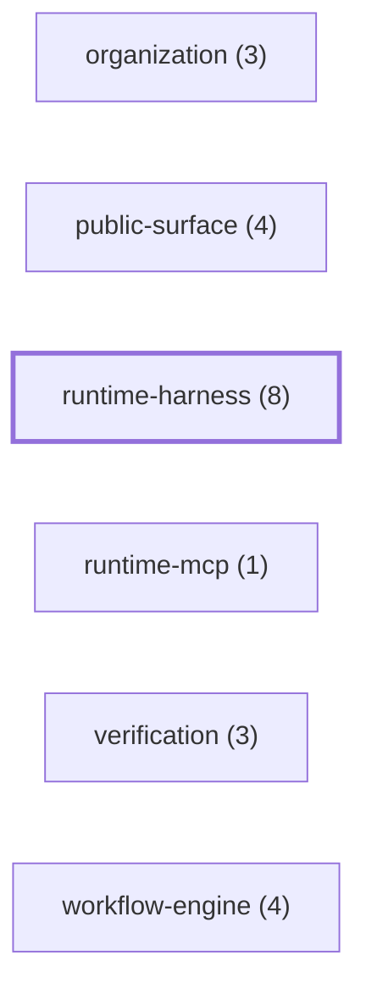
```mermaid
flowchart LR
  d0["organization (3)"]
  d1["public-surface (4)"]
  d2["runtime-harness (8)"]
  d3["runtime-mcp (1)"]
  d4["verification (3)"]
  d5["workflow-engine (4)"]
  class d2 changed
  classDef changed stroke-width:3px
```

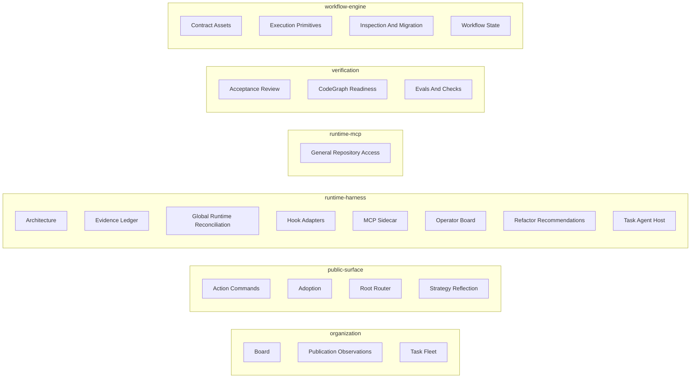
```mermaid
flowchart LR
  subgraph "organization"
    n0["Board"]
    n1["Publication Observations"]
    n2["Task Fleet"]
  end
  subgraph "public-surface"
    n3["Action Commands"]
    n4["Adoption"]
    n5["Root Router"]
    n6["Strategy Reflection"]
  end
  subgraph "runtime-harness"
    n7["Architecture"]
    n8["Evidence Ledger"]
    n9["Global Runtime Reconciliation"]
    n10["Hook Adapters"]
    n11["MCP Sidecar"]
    n12["Operator Board"]
    n13["Refactor Recommendations"]
    n14["Task Agent Host"]
  end
  subgraph "runtime-mcp"
    n15["General Repository Access"]
  end
  subgraph "verification"
    n16["Acceptance Review"]
    n17["CodeGraph Readiness"]
    n18["Evals And Checks"]
  end
  subgraph "workflow-engine"
    n19["Contract Assets"]
    n20["Execution Primitives"]
    n21["Inspection And Migration"]
    n22["Workflow State"]
  end
```

## 2026-11-06 · fe5519c8817e

refactor(runtime): keep closeout, the Herdr skill and the agent fleet in core (#1887) (#1903)

Added 3 · Removed 2 · Renamed 0 · Edges +1 −2

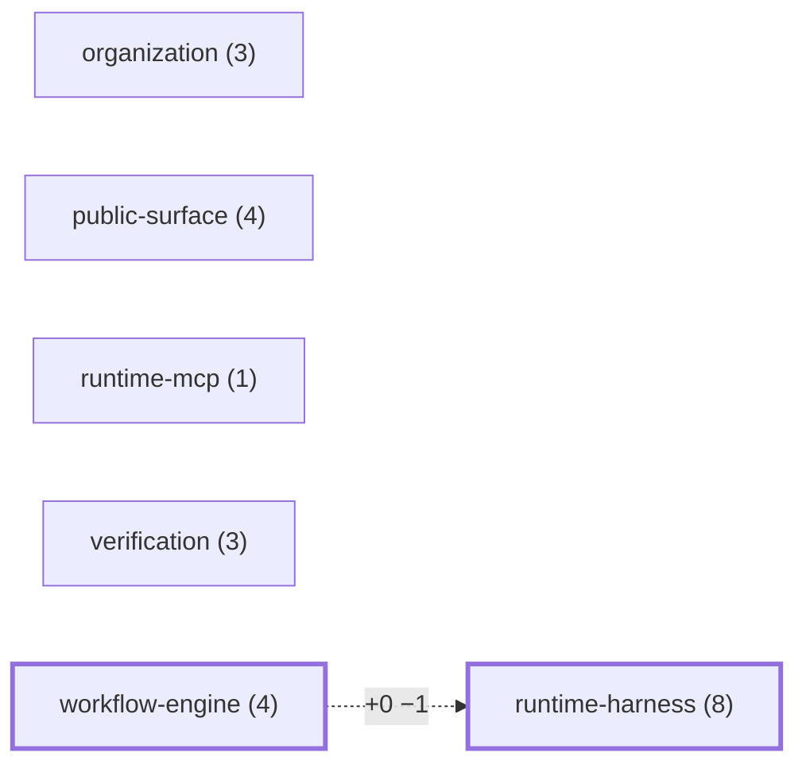
```mermaid
flowchart LR
  d0["organization (3)"]
  d1["public-surface (4)"]
  d2["runtime-harness (8)"]
  d3["runtime-mcp (1)"]
  d4["verification (3)"]
  d5["workflow-engine (4)"]
  d5 -.->|+0 −1| d2
  class d2 changed
  class d5 changed
  classDef changed stroke-width:3px
```

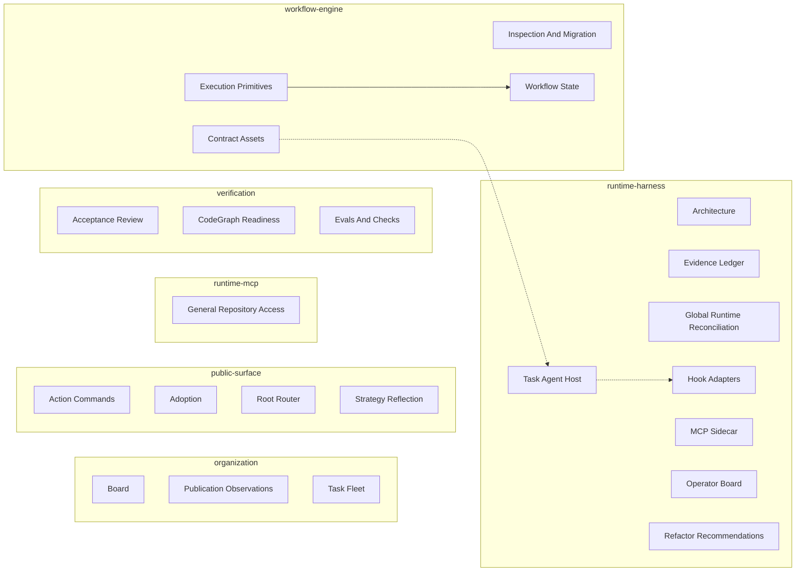
```mermaid
flowchart LR
  subgraph "organization"
    n0["Board"]
    n1["Publication Observations"]
    n2["Task Fleet"]
  end
  subgraph "public-surface"
    n3["Action Commands"]
    n4["Adoption"]
    n5["Root Router"]
    n6["Strategy Reflection"]
  end
  subgraph "runtime-harness"
    n7["Architecture"]
    n8["Evidence Ledger"]
    n9["Global Runtime Reconciliation"]
    n10["Hook Adapters"]
    n11["MCP Sidecar"]
    n12["Operator Board"]
    n13["Refactor Recommendations"]
    n14["Task Agent Host"]
  end
  subgraph "runtime-mcp"
    n15["General Repository Access"]
  end
  subgraph "verification"
    n16["Acceptance Review"]
    n17["CodeGraph Readiness"]
    n18["Evals And Checks"]
  end
  subgraph "workflow-engine"
    n19["Contract Assets"]
    n20["Execution Primitives"]
    n21["Inspection And Migration"]
    n22["Workflow State"]
  end
  n20 --> n22
  n14 -.-> n10
  n19 -.-> n14
```

## 2026-11-06 · 90d78227edb5

feat(publication): own GitHub App hook configuration (#1888) (#1898)

Added 0 · Removed 0 · Renamed 0 · Edges +1 −0

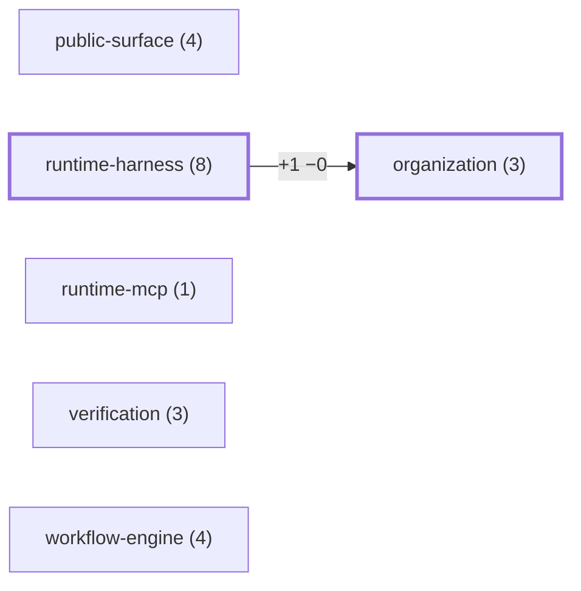
```mermaid
flowchart LR
  d0["organization (3)"]
  d1["public-surface (4)"]
  d2["runtime-harness (8)"]
  d3["runtime-mcp (1)"]
  d4["verification (3)"]
  d5["workflow-engine (4)"]
  d2 -->|+1 −0| d0
  class d0 changed
  class d2 changed
  classDef changed stroke-width:3px
```

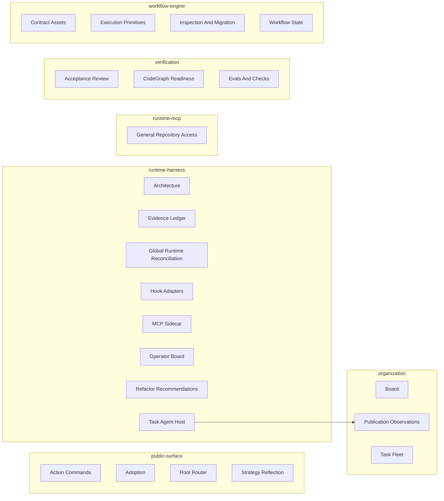
```mermaid
flowchart LR
  subgraph "organization"
    n0["Board"]
    n1["Publication Observations"]
    n2["Task Fleet"]
  end
  subgraph "public-surface"
    n3["Action Commands"]
    n4["Adoption"]
    n5["Root Router"]
    n6["Strategy Reflection"]
  end
  subgraph "runtime-harness"
    n7["Architecture"]
    n8["Evidence Ledger"]
    n9["Global Runtime Reconciliation"]
    n10["Hook Adapters"]
    n11["MCP Sidecar"]
    n12["Operator Board"]
    n13["Refactor Recommendations"]
    n14["Task Agent Host"]
  end
  subgraph "runtime-mcp"
    n15["General Repository Access"]
  end
  subgraph "verification"
    n16["Acceptance Review"]
    n17["CodeGraph Readiness"]
    n18["Evals And Checks"]
  end
  subgraph "workflow-engine"
    n19["Contract Assets"]
    n20["Execution Primitives"]
    n21["Inspection And Migration"]
    n22["Workflow State"]
  end
  n14 --> n1
```

## 2026-11-05 · 7716f464c944

refactor(board): seats and quota move to core Board (#1848) (#1852)

Added 0 · Removed 0 · Renamed 0 · Edges +3 −0

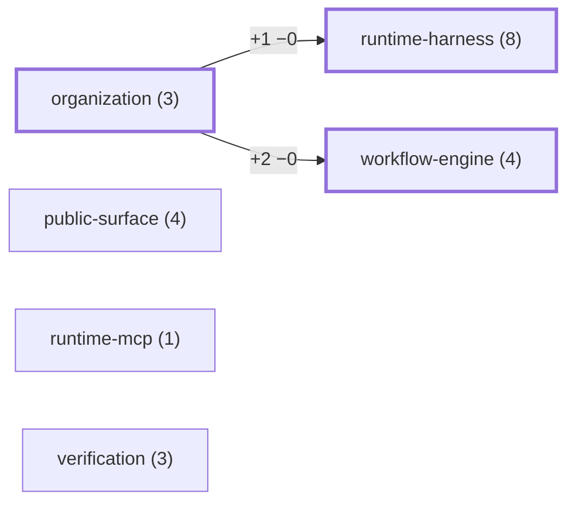
```mermaid
flowchart LR
  d0["organization (3)"]
  d1["public-surface (4)"]
  d2["runtime-harness (8)"]
  d3["runtime-mcp (1)"]
  d4["verification (3)"]
  d5["workflow-engine (4)"]
  d0 -->|+1 −0| d2
  d0 -->|+2 −0| d5
  class d0 changed
  class d2 changed
  class d5 changed
  classDef changed stroke-width:3px
```

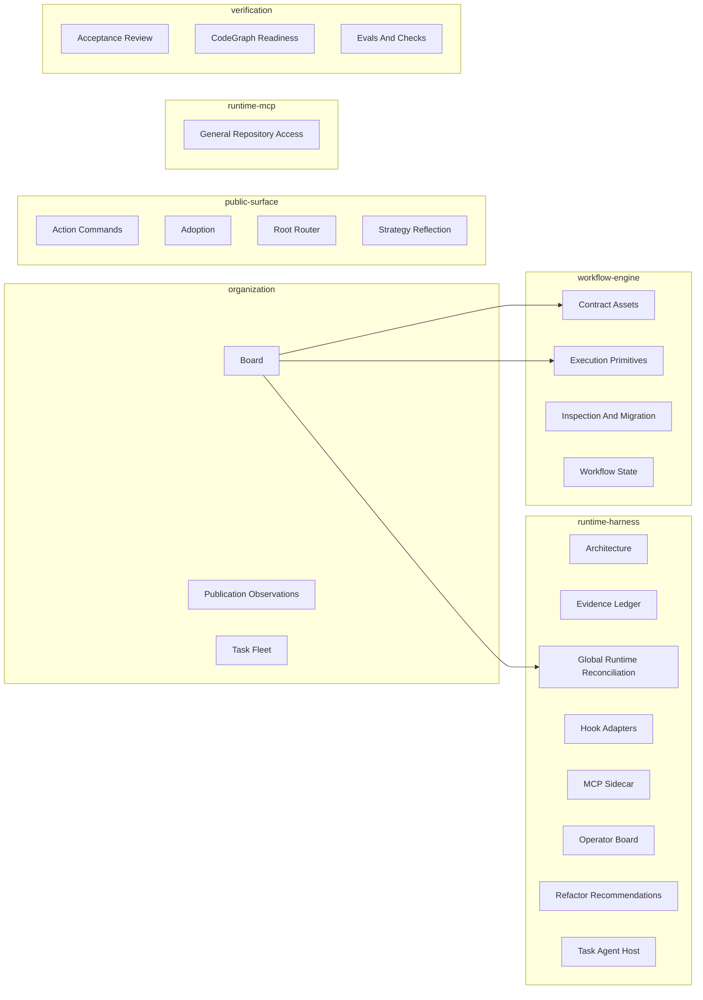
```mermaid
flowchart LR
  subgraph "organization"
    n0["Board"]
    n1["Publication Observations"]
    n2["Task Fleet"]
  end
  subgraph "public-surface"
    n3["Action Commands"]
    n4["Adoption"]
    n5["Root Router"]
    n6["Strategy Reflection"]
  end
  subgraph "runtime-harness"
    n7["Architecture"]
    n8["Evidence Ledger"]
    n9["Global Runtime Reconciliation"]
    n10["Hook Adapters"]
    n11["MCP Sidecar"]
    n12["Operator Board"]
    n13["Refactor Recommendations"]
    n14["Task Agent Host"]
  end
  subgraph "runtime-mcp"
    n15["General Repository Access"]
  end
  subgraph "verification"
    n16["Acceptance Review"]
    n17["CodeGraph Readiness"]
    n18["Evals And Checks"]
  end
  subgraph "workflow-engine"
    n19["Contract Assets"]
    n20["Execution Primitives"]
    n21["Inspection And Migration"]
    n22["Workflow State"]
  end
  n0 --> n9
  n0 --> n19
  n0 --> n20
```

## 2026-11-05 · 36f9711578ae

refactor(mcp): move shared parts out of the MCP directories (#1847) (#1851)

Added 2 · Removed 1 · Renamed 1 · Edges +1 −3

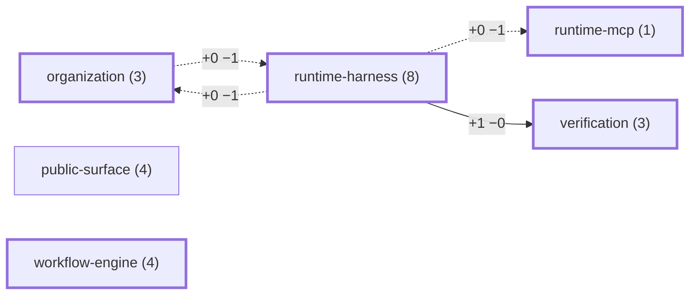
```mermaid
flowchart LR
  d0["organization (3)"]
  d1["public-surface (4)"]
  d2["runtime-harness (8)"]
  d3["runtime-mcp (1)"]
  d4["verification (3)"]
  d5["workflow-engine (4)"]
  d0 -.->|+0 −1| d2
  d2 -.->|+0 −1| d0
  d2 -.->|+0 −1| d3
  d2 -->|+1 −0| d4
  class d0 changed
  class d2 changed
  class d3 changed
  class d4 changed
  class d5 changed
  classDef changed stroke-width:3px
```

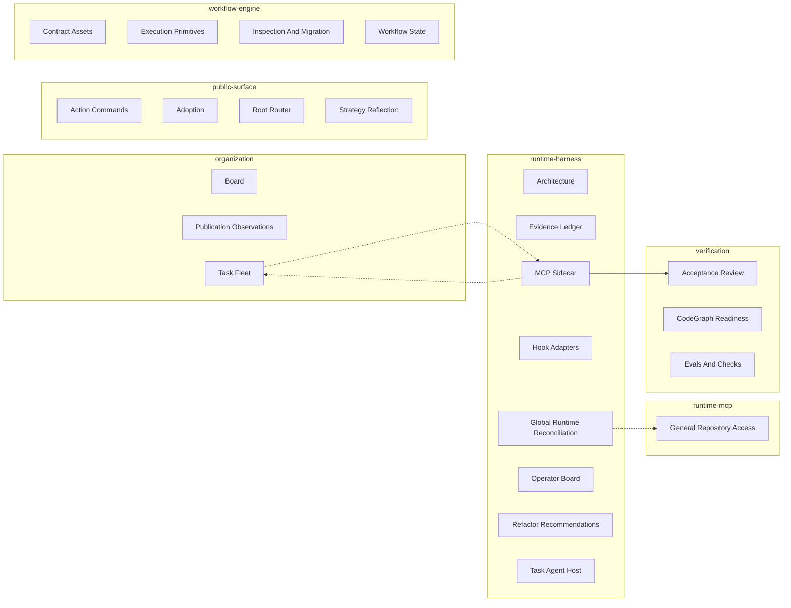
```mermaid
flowchart LR
  subgraph "organization"
    n0["Board"]
    n1["Publication Observations"]
    n2["Task Fleet"]
  end
  subgraph "public-surface"
    n3["Action Commands"]
    n4["Adoption"]
    n5["Root Router"]
    n6["Strategy Reflection"]
  end
  subgraph "runtime-harness"
    n7["Architecture"]
    n8["Evidence Ledger"]
    n9["Global Runtime Reconciliation"]
    n10["Hook Adapters"]
    n11["MCP Sidecar"]
    n12["Operator Board"]
    n13["Refactor Recommendations"]
    n14["Task Agent Host"]
  end
  subgraph "runtime-mcp"
    n15["General Repository Access"]
  end
  subgraph "verification"
    n16["Acceptance Review"]
    n17["CodeGraph Readiness"]
    n18["Evals And Checks"]
  end
  subgraph "workflow-engine"
    n19["Contract Assets"]
    n20["Execution Primitives"]
    n21["Inspection And Migration"]
    n22["Workflow State"]
  end
  n11 --> n16
  n2 -.-> n11
  n9 -.-> n15
  n11 -.-> n2
```

## 2026-11-05 · f4c2d9abe261

refactor(operator): move core-used files out of the operator directories (#1834) (#1836)

Added 4 · Removed 3 · Renamed 0 · Edges +4 −2

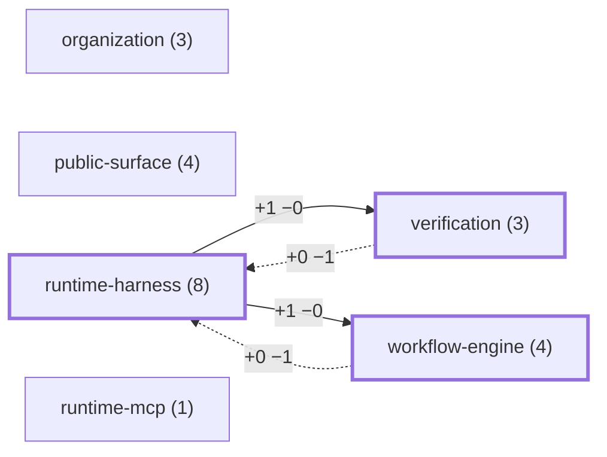
```mermaid
flowchart LR
  d0["organization (3)"]
  d1["public-surface (4)"]
  d2["runtime-harness (8)"]
  d3["runtime-mcp (1)"]
  d4["verification (3)"]
  d5["workflow-engine (4)"]
  d2 -->|+1 −0| d4
  d2 -->|+1 −0| d5
  d4 -.->|+0 −1| d2
  d5 -.->|+0 −1| d2
  class d2 changed
  class d4 changed
  class d5 changed
  classDef changed stroke-width:3px
```

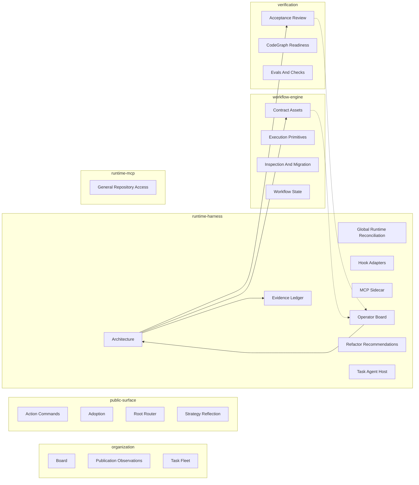
```mermaid
flowchart LR
  subgraph "organization"
    n0["Board"]
    n1["Publication Observations"]
    n2["Task Fleet"]
  end
  subgraph "public-surface"
    n3["Action Commands"]
    n4["Adoption"]
    n5["Root Router"]
    n6["Strategy Reflection"]
  end
  subgraph "runtime-harness"
    n7["Architecture"]
    n8["Evidence Ledger"]
    n9["Global Runtime Reconciliation"]
    n10["Hook Adapters"]
    n11["MCP Sidecar"]
    n12["Operator Board"]
    n13["Refactor Recommendations"]
    n14["Task Agent Host"]
  end
  subgraph "runtime-mcp"
    n15["General Repository Access"]
  end
  subgraph "verification"
    n16["Acceptance Review"]
    n17["CodeGraph Readiness"]
    n18["Evals And Checks"]
  end
  subgraph "workflow-engine"
    n19["Contract Assets"]
    n20["Execution Primitives"]
    n21["Inspection And Migration"]
    n22["Workflow State"]
  end
  n7 --> n8
  n7 --> n16
  n7 --> n19
  n12 --> n7
  n16 -.-> n12
  n19 -.-> n12
```

## 2026-11-03 · 29b23f5421e5

refactor(operator): read module diff owners through the ownership port; owners is a plugin-internals target again (#1670) (#1682)

Added 1 · Removed 0 · Renamed 0 · Edges +0 −0

```mermaid
flowchart LR
  d0["organization (3)"]
  d1["public-surface (4)"]
  d2["runtime-harness (8)"]
  d3["runtime-mcp (1)"]
  d4["verification (3)"]
  d5["workflow-engine (4)"]
  class d2 changed
  classDef changed stroke-width:3px
```

```mermaid
flowchart LR
  subgraph "organization"
    n0["Board"]
    n1["Publication Observations"]
    n2["Task Fleet"]
  end
  subgraph "public-surface"
    n3["Action Commands"]
    n4["Adoption"]
    n5["Root Router"]
    n6["Strategy Reflection"]
  end
  subgraph "runtime-harness"
    n7["Architecture"]
    n8["Evidence Ledger"]
    n9["Global Runtime Reconciliation"]
    n10["Hook Adapters"]
    n11["MCP Sidecar"]
    n12["Operator Board"]
    n13["Refactor Recommendations"]
    n14["Task Agent Host"]
  end
  subgraph "runtime-mcp"
    n15["General Repository Access"]
  end
  subgraph "verification"
    n16["Acceptance Review"]
    n17["CodeGraph Readiness"]
    n18["Evals And Checks"]
  end
  subgraph "workflow-engine"
    n19["Contract Assets"]
    n20["Execution Primitives"]
    n21["Inspection And Migration"]
    n22["Workflow State"]
  end
```

## 2026-11-03 · 65e9d318a41e

feat(architecture): load archctx and CodeGraph only for a selected architecture plugin (#1656) (#1671)

Added 11 · Removed 0 · Renamed 0 · Edges +7 −1

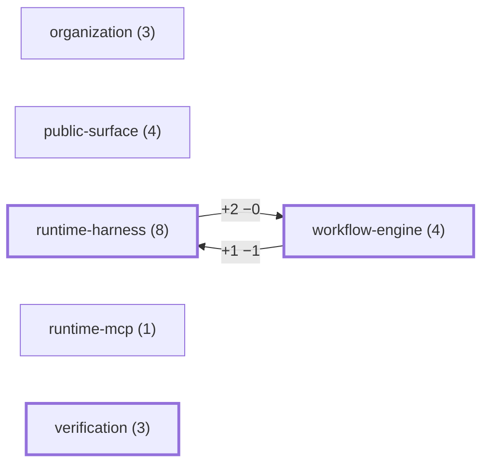
```mermaid
flowchart LR
  d0["organization (3)"]
  d1["public-surface (4)"]
  d2["runtime-harness (8)"]
  d3["runtime-mcp (1)"]
  d4["verification (3)"]
  d5["workflow-engine (4)"]
  d2 -->|+2 −0| d5
  d5 -->|+1 −1| d2
  class d2 changed
  class d4 changed
  class d5 changed
  classDef changed stroke-width:3px
```

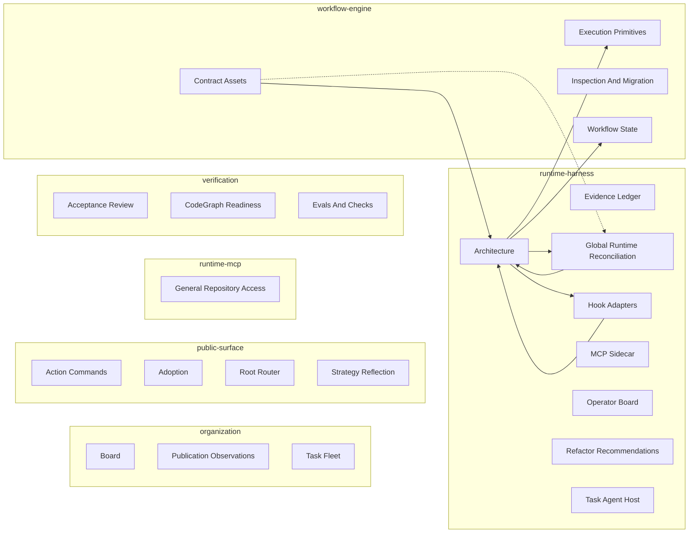
```mermaid
flowchart LR
  subgraph "organization"
    n0["Board"]
    n1["Publication Observations"]
    n2["Task Fleet"]
  end
  subgraph "public-surface"
    n3["Action Commands"]
    n4["Adoption"]
    n5["Root Router"]
    n6["Strategy Reflection"]
  end
  subgraph "runtime-harness"
    n7["Architecture"]
    n8["Evidence Ledger"]
    n9["Global Runtime Reconciliation"]
    n10["Hook Adapters"]
    n11["MCP Sidecar"]
    n12["Operator Board"]
    n13["Refactor Recommendations"]
    n14["Task Agent Host"]
  end
  subgraph "runtime-mcp"
    n15["General Repository Access"]
  end
  subgraph "verification"
    n16["Acceptance Review"]
    n17["CodeGraph Readiness"]
    n18["Evals And Checks"]
  end
  subgraph "workflow-engine"
    n19["Contract Assets"]
    n20["Execution Primitives"]
    n21["Inspection And Migration"]
    n22["Workflow State"]
  end
  n7 --> n9
  n7 --> n10
  n7 --> n20
  n7 --> n22
  n9 --> n7
  n10 --> n7
  n19 --> n7
  n19 -.-> n9
```

## 2026-11-03 · 5335521ae11e

refactor(architecture): core reaches the archctx code only through typed ports (#1655) (#1667)

Added 2 · Removed 0 · Renamed 0 · Edges +1 −0

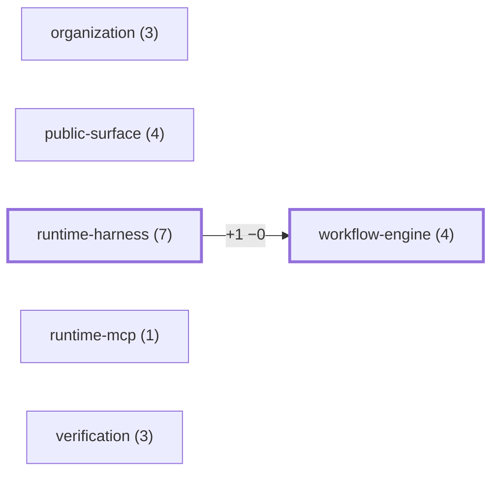
```mermaid
flowchart LR
  d0["organization (3)"]
  d1["public-surface (4)"]
  d2["runtime-harness (7)"]
  d3["runtime-mcp (1)"]
  d4["verification (3)"]
  d5["workflow-engine (4)"]
  d2 -->|+1 −0| d5
  class d2 changed
  class d5 changed
  classDef changed stroke-width:3px
```

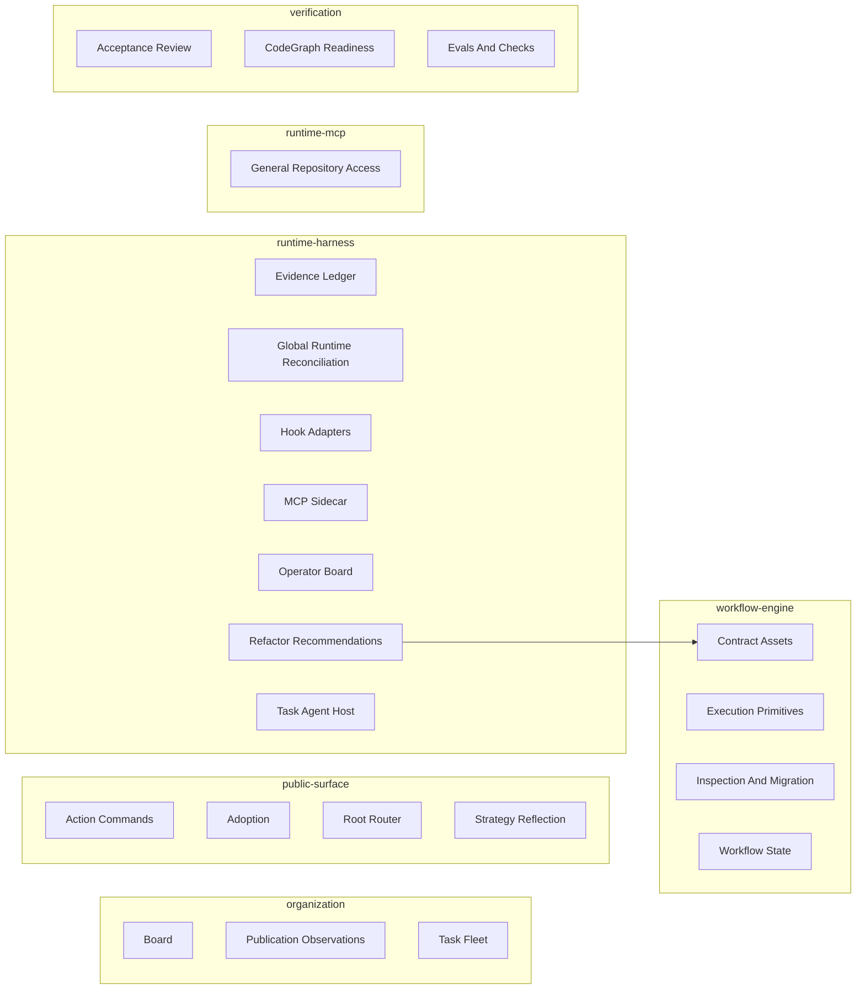
```mermaid
flowchart LR
  subgraph "organization"
    n0["Board"]
    n1["Publication Observations"]
    n2["Task Fleet"]
  end
  subgraph "public-surface"
    n3["Action Commands"]
    n4["Adoption"]
    n5["Root Router"]
    n6["Strategy Reflection"]
  end
  subgraph "runtime-harness"
    n7["Evidence Ledger"]
    n8["Global Runtime Reconciliation"]
    n9["Hook Adapters"]
    n10["MCP Sidecar"]
    n11["Operator Board"]
    n12["Refactor Recommendations"]
    n13["Task Agent Host"]
  end
  subgraph "runtime-mcp"
    n14["General Repository Access"]
  end
  subgraph "verification"
    n15["Acceptance Review"]
    n16["CodeGraph Readiness"]
    n17["Evals And Checks"]
  end
  subgraph "workflow-engine"
    n18["Contract Assets"]
    n19["Execution Primitives"]
    n20["Inspection And Migration"]
    n21["Workflow State"]
  end
  n12 --> n18
```

## 2026-11-03 · 72a94f03d6f1

refactor(hosts)!: delete the DSH plugin and the dsh plugin id (#1653) (#1657)

Added 0 · Removed 2 · Renamed 0 · Edges +0 −2

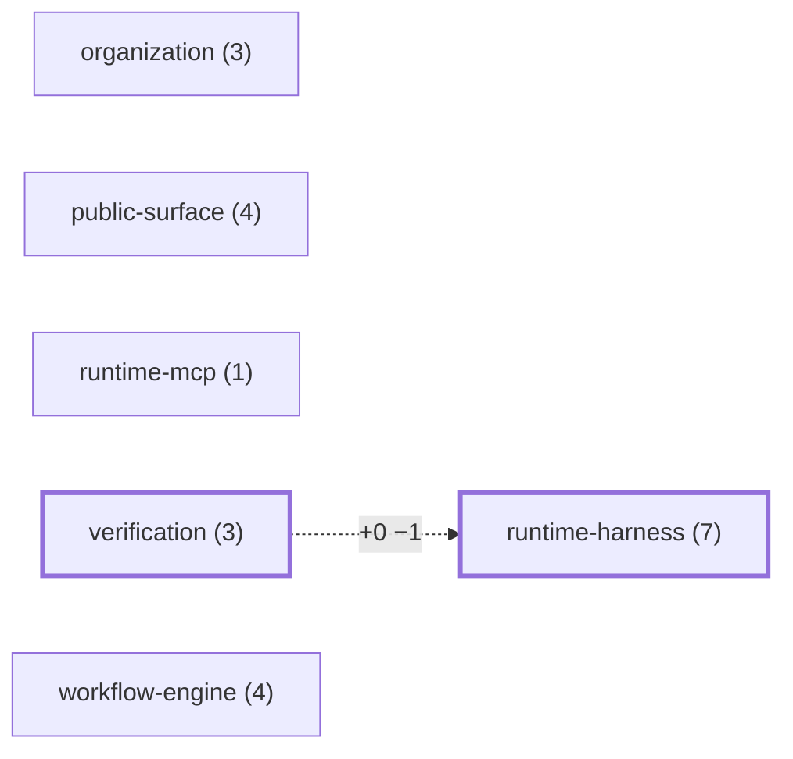
```mermaid
flowchart LR
  d0["organization (3)"]
  d1["public-surface (4)"]
  d2["runtime-harness (7)"]
  d3["runtime-mcp (1)"]
  d4["verification (3)"]
  d5["workflow-engine (4)"]
  d4 -.->|+0 −1| d2
  class d2 changed
  class d4 changed
  classDef changed stroke-width:3px
```

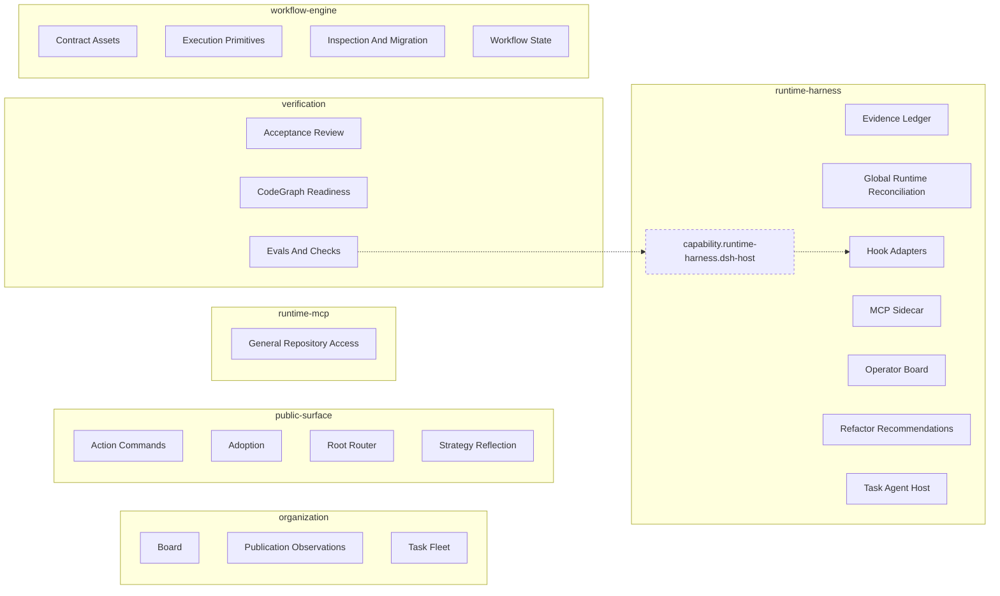
```mermaid
flowchart LR
  subgraph "organization"
    n0["Board"]
    n1["Publication Observations"]
    n2["Task Fleet"]
  end
  subgraph "public-surface"
    n3["Action Commands"]
    n4["Adoption"]
    n5["Root Router"]
    n6["Strategy Reflection"]
  end
  subgraph "runtime-harness"
    n7["capability.runtime-harness.dsh-host"]
    n8["Evidence Ledger"]
    n9["Global Runtime Reconciliation"]
    n10["Hook Adapters"]
    n11["MCP Sidecar"]
    n12["Operator Board"]
    n13["Refactor Recommendations"]
    n14["Task Agent Host"]
  end
  subgraph "runtime-mcp"
    n15["General Repository Access"]
  end
  subgraph "verification"
    n16["Acceptance Review"]
    n17["CodeGraph Readiness"]
    n18["Evals And Checks"]
  end
  subgraph "workflow-engine"
    n19["Contract Assets"]
    n20["Execution Primitives"]
    n21["Inspection And Migration"]
    n22["Workflow State"]
  end
  n7 -.-> n10
  n18 -.-> n7
  class n7 removed
  classDef removed stroke-dasharray: 4 4
```

## 2026-11-03 · f77f3d048674

arch(architecture): typed architecture read module for operator views (#1628) (#1639)

Added 1 · Removed 0 · Renamed 0 · Edges +0 −0

```mermaid
flowchart LR
  d0["organization (3)"]
  d1["public-surface (4)"]
  d2["runtime-harness (8)"]
  d3["runtime-mcp (1)"]
  d4["verification (3)"]
  d5["workflow-engine (4)"]
  class d2 changed
  classDef changed stroke-width:3px
```

```mermaid
flowchart LR
  subgraph "organization"
    n0["Board"]
    n1["Publication Observations"]
    n2["Task Fleet"]
  end
  subgraph "public-surface"
    n3["Action Commands"]
    n4["Adoption"]
    n5["Root Router"]
    n6["Strategy Reflection"]
  end
  subgraph "runtime-harness"
    n7["DSH Host Plugin"]
    n8["Evidence Ledger"]
    n9["Global Runtime Reconciliation"]
    n10["Hook Adapters"]
    n11["MCP Sidecar"]
    n12["Operator Board"]
    n13["Refactor Recommendations"]
    n14["Task Agent Host"]
  end
  subgraph "runtime-mcp"
    n15["General Repository Access"]
  end
  subgraph "verification"
    n16["Acceptance Review"]
    n17["CodeGraph Readiness"]
    n18["Evals And Checks"]
  end
  subgraph "workflow-engine"
    n19["Contract Assets"]
    n20["Execution Primitives"]
    n21["Inspection And Migration"]
    n22["Workflow State"]
  end
```

## 2026-11-03 · 5d24e55107ea

refactor(notify): one read contract module for the notify files, owned by execution-primitives (#1627) (#1638)

Added 2 · Removed 0 · Renamed 0 · Edges +0 −1

```mermaid
flowchart LR
  d0["organization (3)"]
  d1["public-surface (4)"]
  d2["runtime-harness (8)"]
  d3["runtime-mcp (1)"]
  d4["verification (3)"]
  d5["workflow-engine (4)"]
  class d2 changed
  class d5 changed
  classDef changed stroke-width:3px
```

```mermaid
flowchart LR
  subgraph "organization"
    n0["Board"]
    n1["Publication Observations"]
    n2["Task Fleet"]
  end
  subgraph "public-surface"
    n3["Action Commands"]
    n4["Adoption"]
    n5["Root Router"]
    n6["Strategy Reflection"]
  end
  subgraph "runtime-harness"
    n7["DSH Host Plugin"]
    n8["Evidence Ledger"]
    n9["Global Runtime Reconciliation"]
    n10["Hook Adapters"]
    n11["MCP Sidecar"]
    n12["Operator Board"]
    n13["Refactor Recommendations"]
    n14["Task Agent Host"]
  end
  subgraph "runtime-mcp"
    n15["General Repository Access"]
  end
  subgraph "verification"
    n16["Acceptance Review"]
    n17["CodeGraph Readiness"]
    n18["Evals And Checks"]
  end
  subgraph "workflow-engine"
    n19["Contract Assets"]
    n20["Execution Primitives"]
    n21["Inspection And Migration"]
    n22["Workflow State"]
  end
  n12 -.-> n14
```

## 2026-11-03 · 6492736aa026

arch(model): own the hc client, notify secret keys and global configuration outside plugin internals (#1626) (#1633)

Added 2 · Removed 1 · Renamed 0 · Edges +1 −1

```mermaid
flowchart LR
  d0["organization (3)"]
  d1["public-surface (4)"]
  d2["runtime-harness (8)"]
  d3["runtime-mcp (1)"]
  d4["verification (3)"]
  d5["workflow-engine (4)"]
  d2 -.->|+0 −1| d0
  d5 -->|+1 −0| d0
  class d0 changed
  class d2 changed
  class d5 changed
  classDef changed stroke-width:3px
```

```mermaid
flowchart LR
  subgraph "organization"
    n0["Board"]
    n1["Publication Observations"]
    n2["Task Fleet"]
  end
  subgraph "public-surface"
    n3["Action Commands"]
    n4["Adoption"]
    n5["Root Router"]
    n6["Strategy Reflection"]
  end
  subgraph "runtime-harness"
    n7["DSH Host Plugin"]
    n8["Evidence Ledger"]
    n9["Global Runtime Reconciliation"]
    n10["Hook Adapters"]
    n11["MCP Sidecar"]
    n12["Operator Board"]
    n13["Refactor Recommendations"]
    n14["Task Agent Host"]
  end
  subgraph "runtime-mcp"
    n15["General Repository Access"]
  end
  subgraph "verification"
    n16["Acceptance Review"]
    n17["CodeGraph Readiness"]
    n18["Evals And Checks"]
  end
  subgraph "workflow-engine"
    n19["Contract Assets"]
    n20["Execution Primitives"]
    n21["Inspection And Migration"]
    n22["Workflow State"]
  end
  n20 --> n0
  n14 -.-> n0
```

## 2026-11-03 · d0f4223f4d3c

feat(board): hazard list in a versioned asset and the R3 tier rule (#1514) (#1621)

Added 1 · Removed 0 · Renamed 0 · Edges +1 −0

```mermaid
flowchart LR
  d0["organization (3)"]
  d1["public-surface (4)"]
  d2["runtime-harness (8)"]
  d3["runtime-mcp (1)"]
  d4["verification (3)"]
  d5["workflow-engine (4)"]
  d5 -->|+1 −0| d0
  class d0 changed
  class d5 changed
  classDef changed stroke-width:3px
```

```mermaid
flowchart LR
  subgraph "organization"
    n0["Board"]
    n1["Publication Observations"]
    n2["Task Fleet"]
  end
  subgraph "public-surface"
    n3["Action Commands"]
    n4["Adoption"]
    n5["Root Router"]
    n6["Strategy Reflection"]
  end
  subgraph "runtime-harness"
    n7["DSH Host Plugin"]
    n8["Evidence Ledger"]
    n9["Global Runtime Reconciliation"]
    n10["Hook Adapters"]
    n11["MCP Sidecar"]
    n12["Operator Board"]
    n13["Refactor Recommendations"]
    n14["Task Agent Host"]
  end
  subgraph "runtime-mcp"
    n15["General Repository Access"]
  end
  subgraph "verification"
    n16["Acceptance Review"]
    n17["CodeGraph Readiness"]
    n18["Evals And Checks"]
  end
  subgraph "workflow-engine"
    n19["Contract Assets"]
    n20["Execution Primitives"]
    n21["Inspection And Migration"]
    n22["Workflow State"]
  end
  n19 --> n0
```

## 2026-11-03 · f9caf654bcf6

feat(operator): read-only task inbox in the Task drawer (#1577) (#1604)

Added 0 · Removed 0 · Renamed 0 · Edges +1 −0

```mermaid
flowchart LR
  d0["organization (3)"]
  d1["public-surface (4)"]
  d2["runtime-harness (8)"]
  d3["runtime-mcp (1)"]
  d4["verification (3)"]
  d5["workflow-engine (4)"]
  d2 -->|+1 −0| d0
  class d0 changed
  class d2 changed
  classDef changed stroke-width:3px
```

```mermaid
flowchart LR
  subgraph "organization"
    n0["Board"]
    n1["Publication Observations"]
    n2["Task Fleet"]
  end
  subgraph "public-surface"
    n3["Action Commands"]
    n4["Adoption"]
    n5["Root Router"]
    n6["Strategy Reflection"]
  end
  subgraph "runtime-harness"
    n7["DSH Host Plugin"]
    n8["Evidence Ledger"]
    n9["Global Runtime Reconciliation"]
    n10["Hook Adapters"]
    n11["MCP Sidecar"]
    n12["Operator Board"]
    n13["Refactor Recommendations"]
    n14["Task Agent Host"]
  end
  subgraph "runtime-mcp"
    n15["General Repository Access"]
  end
  subgraph "verification"
    n16["Acceptance Review"]
    n17["CodeGraph Readiness"]
    n18["Evals And Checks"]
  end
  subgraph "workflow-engine"
    n19["Contract Assets"]
    n20["Execution Primitives"]
    n21["Inspection And Migration"]
    n22["Workflow State"]
  end
  n12 --> n2
```

## 2026-11-03 · d8f06f313f4e

refactor!: delete the old fleet board stack (#1507) (#1590)

Added 0 · Removed 6 · Renamed 3 · Edges +0 −8

```mermaid
flowchart LR
  d0["organization (3)"]
  d1["public-surface (4)"]
  d2["runtime-harness (8)"]
  d3["runtime-mcp (1)"]
  d4["verification (3)"]
  d5["workflow-engine (4)"]
  d2 -.->|+0 −2| d0
  d2 -.->|+0 −1| d4
  d2 -.->|+0 −2| d5
  d4 -.->|+0 −1| d2
  d5 -.->|+0 −1| d2
  class d0 changed
  class d2 changed
  class d4 changed
  class d5 changed
  classDef changed stroke-width:3px
```

```mermaid
flowchart LR
  subgraph "organization"
    n0["Board"]
    n1["Publication Observations"]
    n2["Task Fleet"]
  end
  subgraph "public-surface"
    n3["Action Commands"]
    n4["Adoption"]
    n5["Root Router"]
    n6["Strategy Reflection"]
  end
  subgraph "runtime-harness"
    n7["DSH Host Plugin"]
    n8["Evidence Ledger"]
    n9["capability.runtime-harness.external-source-intake"]
    n10["Global Runtime Reconciliation"]
    n11["Hook Adapters"]
    n12["MCP Sidecar"]
    n13["Operator Board"]
    n14["Refactor Recommendations"]
    n15["Task Agent Host"]
  end
  subgraph "runtime-mcp"
    n16["General Repository Access"]
  end
  subgraph "verification"
    n17["Acceptance Review"]
    n18["CodeGraph Readiness"]
    n19["Evals And Checks"]
  end
  subgraph "workflow-engine"
    n20["Contract Assets"]
    n21["Execution Primitives"]
    n22["Inspection And Migration"]
    n23["Workflow State"]
  end
  n9 -.-> n2
  n9 -.-> n17
  n9 -.-> n21
  n9 -.-> n23
  n10 -.-> n9
  n13 -.-> n2
  n19 -.-> n9
  n23 -.-> n9
  class n9 removed
  classDef removed stroke-dasharray: 4 4
```

## 2026-11-02 · 278371be2d8f

chore(architecture): model herdr-core and Herdr.app, name the hc reads (#1483) (#1557)

Added 0 · Removed 1 · Renamed 0 · Edges +0 −0

```mermaid
flowchart LR
  d0["organization (3)"]
  d1["public-surface (4)"]
  d2["runtime-harness (9)"]
  d3["runtime-mcp (1)"]
  d4["verification (3)"]
  d5["workflow-engine (4)"]
  class d2 changed
  classDef changed stroke-width:3px
```

```mermaid
flowchart LR
  subgraph "organization"
    n0["Board"]
    n1["Publication Observations"]
    n2["Task Fleet"]
  end
  subgraph "public-surface"
    n3["Action Commands"]
    n4["Adoption"]
    n5["Root Router"]
    n6["Strategy Reflection"]
  end
  subgraph "runtime-harness"
    n7["DSH Host Plugin"]
    n8["Evidence Ledger"]
    n9["External Source Intake"]
    n10["Global Runtime Reconciliation"]
    n11["Hook Adapters"]
    n12["MCP Sidecar"]
    n13["Operator Board"]
    n14["Refactor Recommendations"]
    n15["Task Agent Host"]
  end
  subgraph "runtime-mcp"
    n16["General Repository Access"]
  end
  subgraph "verification"
    n17["Acceptance Review"]
    n18["CodeGraph Readiness"]
    n19["Evals And Checks"]
  end
  subgraph "workflow-engine"
    n20["Contract Assets"]
    n21["Execution Primitives"]
    n22["Inspection And Migration"]
    n23["Workflow State"]
  end
```

## 2026-11-02 · a0d852c26b87

feat(operator): board endpoint, Main board and Task drawer read one parent issue (#1508) (#1536)

Added 0 · Removed 0 · Renamed 0 · Edges +1 −0

```mermaid
flowchart LR
  d0["organization (3)"]
  d1["public-surface (4)"]
  d2["runtime-harness (9)"]
  d3["runtime-mcp (1)"]
  d4["verification (3)"]
  d5["workflow-engine (4)"]
  d2 -->|+1 −0| d0
  class d0 changed
  class d2 changed
  classDef changed stroke-width:3px
```

```mermaid
flowchart LR
  subgraph "organization"
    n0["Board"]
    n1["Publication Observations"]
    n2["Task Fleet"]
  end
  subgraph "public-surface"
    n3["Action Commands"]
    n4["Adoption"]
    n5["Root Router"]
    n6["Strategy Reflection"]
  end
  subgraph "runtime-harness"
    n7["DSH Host Plugin"]
    n8["Evidence Ledger"]
    n9["External Source Intake"]
    n10["Global Runtime Reconciliation"]
    n11["Hook Adapters"]
    n12["MCP Sidecar"]
    n13["Operator Board"]
    n14["Refactor Recommendations"]
    n15["Task Agent Host"]
  end
  subgraph "runtime-mcp"
    n16["General Repository Access"]
  end
  subgraph "verification"
    n17["Acceptance Review"]
    n18["CodeGraph Readiness"]
    n19["Evals And Checks"]
  end
  subgraph "workflow-engine"
    n20["Contract Assets"]
    n21["Execution Primitives"]
    n22["Inspection And Migration"]
    n23["Workflow State"]
  end
  n13 --> n0
```

## 2026-11-02 · 431b87ee5f26

feat(board): board projection, plan block, attention rules and board CLI (#1505) (#1518)

Added 4 · Removed 0 · Renamed 0 · Edges +5 −0

```mermaid
flowchart LR
  d0["organization (3)"]
  d1["public-surface (4)"]
  d2["runtime-harness (9)"]
  d3["runtime-mcp (1)"]
  d4["verification (3)"]
  d5["workflow-engine (4)"]
  d0 -->|+1 −0| d4
  d2 -->|+2 −0| d0
  d4 -->|+1 −0| d0
  class d0 changed
  class d2 changed
  class d4 changed
  classDef changed stroke-width:3px
```

```mermaid
flowchart LR
  subgraph "organization"
    n0["Board"]
    n1["Publication Observations"]
    n2["Task Fleet"]
  end
  subgraph "public-surface"
    n3["Action Commands"]
    n4["Adoption"]
    n5["Root Router"]
    n6["Strategy Reflection"]
  end
  subgraph "runtime-harness"
    n7["DSH Host Plugin"]
    n8["Evidence Ledger"]
    n9["External Source Intake"]
    n10["Global Runtime Reconciliation"]
    n11["Hook Adapters"]
    n12["MCP Sidecar"]
    n13["Operator Board"]
    n14["Refactor Recommendations"]
    n15["Task Agent Host"]
  end
  subgraph "runtime-mcp"
    n16["General Repository Access"]
  end
  subgraph "verification"
    n17["Acceptance Review"]
    n18["CodeGraph Readiness"]
    n19["Evals And Checks"]
  end
  subgraph "workflow-engine"
    n20["Contract Assets"]
    n21["Execution Primitives"]
    n22["Inspection And Migration"]
    n23["Workflow State"]
  end
  n0 --> n1
  n0 --> n19
  n10 --> n0
  n15 --> n0
  n19 --> n0
```

## 2026-11-02 · f10cdd86e189

ci(boundaries): reject core imports of plugin and composition files (#1357) (#1371)

Added 1 · Removed 0 · Renamed 1 · Edges +0 −0

```mermaid
flowchart LR
  d0["organization (2)"]
  d1["public-surface (4)"]
  d2["runtime-harness (9)"]
  d3["runtime-mcp (1)"]
  d4["verification (3)"]
  d5["workflow-engine (4)"]
  class d2 changed
  classDef changed stroke-width:3px
```

```mermaid
flowchart LR
  subgraph "organization"
    n0["Publication Observations"]
    n1["Task Fleet"]
  end
  subgraph "public-surface"
    n2["Action Commands"]
    n3["Adoption"]
    n4["Root Router"]
    n5["Strategy Reflection"]
  end
  subgraph "runtime-harness"
    n6["DSH Host Plugin"]
    n7["Evidence Ledger"]
    n8["External Source Intake"]
    n9["Global Runtime Reconciliation"]
    n10["Hook Adapters"]
    n11["MCP Sidecar"]
    n12["Operator Board"]
    n13["Refactor Recommendations"]
    n14["Task Agent Host"]
  end
  subgraph "runtime-mcp"
    n15["General Repository Access"]
  end
  subgraph "verification"
    n16["Acceptance Review"]
    n17["CodeGraph Readiness"]
    n18["Evals And Checks"]
  end
  subgraph "workflow-engine"
    n19["Contract Assets"]
    n20["Execution Primitives"]
    n21["Inspection And Migration"]
    n22["Workflow State"]
  end
```

