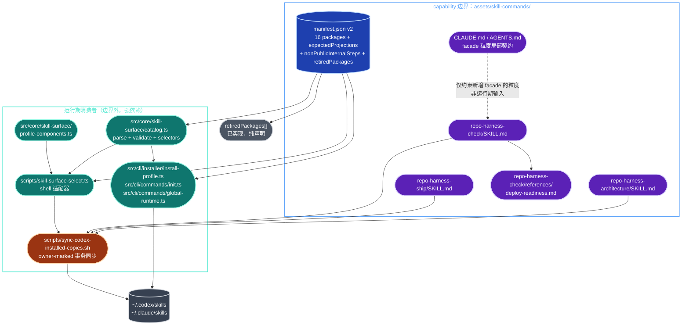
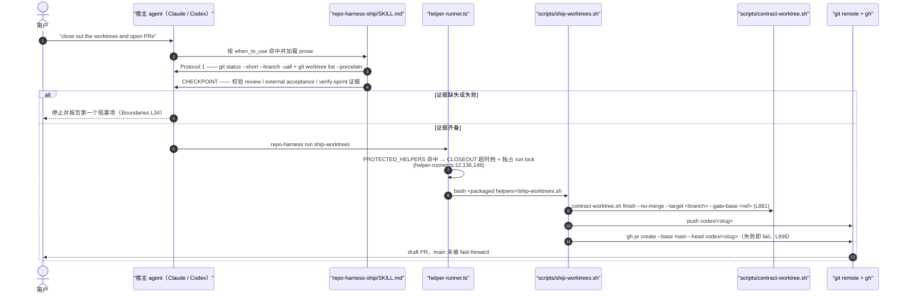

# public-surface/action-commands 架构文档

<!-- BEGIN archctx:intro -->

> 状态：基于 `main` 工作树的 by-capability 架构复核稿。
> Verified against: main@13686d8d（2026-08-08）
> Capability ID: `public-surface-action-commands`
> Matched Prefixes: `assets/skill-commands`
> Local Contracts: `assets/skill-commands/CLAUDE.md`、`assets/skill-commands/AGENTS.md`（两份 byte-identical）
> Verification hints（来自 `.ai/context/capabilities.json`）：`bun test tests/action-command-skills.test.ts`、`bun run benchmark:skills --dry-run`
> 事实优先级：实际源码（`assets/skill-commands/**` 的真实文件 + 消费它的 `src/core/skill-surface/catalog.ts`、`scripts/skill-surface-select.ts`、`scripts/sync-codex-installed-copies.sh`）> 本文 > 任何计划/PRD 描述。本文只画已实现现状；任何尚未落地的形状必须显式标注为**目标设计**。

<!-- END archctx:intro -->

## 0. 阅读约定

| 标记 | 含义 |
| --- | --- |
| **已实现、已接线** | 当前源码存在，且位于真实 runtime path（被 CLI 或 sync 脚本读取） |
| **已实现、纯声明** | 文件存在，被 test 断言，但运行期不产生副作用（只做分类或迁移诊断） |
| **目标设计** | 只存在于计划或提案，尚未成为文件或运行期行为 |

本 capability 的物理边界只有 `assets/skill-commands/`。它是**数据 + prose**，不含任何可执行代码：`manifest.json` 是 runtime discovery authority，三个 `SKILL.md` 是 facade prose，`references/deploy-readiness.md` 是 progressive-load 参考页。执行权威全部在边界之外的 `repo-harness` CLI、`scripts/`、hooks 与 contract files 里。

<!-- BEGIN archctx:p1 -->

## 1. P1：能力架构地图

### 1.1 内部模块与强依赖



### 1.2 模块职责表

| 文件 | 主要 exports / 职责 |
| --- | --- |
| `assets/skill-commands/manifest.json` | 唯一 runtime discovery authority。`version: 2`、`surface: "repo-harness-cli-hooks-command-facades"`、`router: "repo-harness"`（manifest.json:1-5）；`packages[]` 16 条，字段含 `kind`/`source`/`provider`/`hosts`/`profiles`/`discoverability`/`component`/`mutatesRepoByDefault`（manifest.json:6-301）；`expectedProjections` 三张投影表（manifest.json:303-341）；`nonPublicInternalSteps = ["hooks-init","docs-init","create-project-dirs"]`（manifest.json:342-346）；`retiredPackages[]` 19 条迁移诊断（manifest.json:347-443） |
| `assets/skill-commands/repo-harness-check/SKILL.md` | 验证 facade prose。核心不变量在 SKILL.md:14——required-check 列表不自持，唯一真相是目标仓库根 `## Required Checks`；SKILL.md:19-25 定义 skill eval 三档权威（authoritative / non-authoritative / unavailable）；SKILL.md:29 要求 delegation brief 必须粘贴真实命令输出；SKILL.md:33 定义 bugfix contract 的 Root Cause Evidence 四字段复核；SKILL.md:43-47 `## Boundaries` 声明默认不改仓库 |
| `assets/skill-commands/repo-harness-check/references/deploy-readiness.md` | progressive-load 子页，read-only 的 deploy/operations 检查面（`check-deploy-sql-order.sh`、`operations.deploy_sql`、`deploy/sql/`、`_ops/`），由 tests/action-command-skills.test.ts:224-236 逐条钉死 |
| `assets/skill-commands/repo-harness-ship/SKILL.md` | 收尾 facade prose。SKILL.md:14 默认 PR 模式调 `repo-harness run ship-worktrees`；SKILL.md:16 `--local-merge` 为显式 maintainer-only 路径；SKILL.md:17 `--cleanup-merged` 只清已证明 merged 的 worktree；SKILL.md:21 唯一 `CHECKPOINT`（push/PR/merge/cleanup 前必须有 review + external acceptance + `verify-sprint` 证据）；SKILL.md:31-36 禁止 `git reset --hard`/`git clean`/自动 stash 与吸收无关脏改动 |
| `assets/skill-commands/repo-harness-architecture/SKILL.md` | 架构 drift facade prose。SKILL.md:17 用 `capability-resolver match` 定位 capability；SKILL.md:25-26 `archive-architecture-request` 且 `resolved` 必须携带 pending 卡声明的 `> **Architecture Module**:` 路径作为 `--artifact`；SKILL.md:41-45 禁止跑 `repo-harness init`、禁止 hooks 改写架构 prose（hooks 只记录 drift request）、不 vendor `mermaid` |
| `assets/skill-commands/CLAUDE.md` / `AGENTS.md` | 局部契约（两份 byte-identical）。CLAUDE.md:14-16 是本 capability 最硬的三条粒度规则：facade 必须编排多个 CLI 能力或携带超出单命令的领域规则；禁止只为改名一个 CLI 子命令/engine verb 立 skill；禁止 per-engine-verb 兄弟 skill |

### 1.3 规模信号

prefix 下无测试文件，全部为数据与 prose：

| 分组 | files | LOC |
| --- | ---: | ---: |
| `manifest.json` | 1 | 444 |
| `SKILL.md` × 3 | 3 | 128 |
| `references/*.md` | 1 | 30 |
| 局部契约 `CLAUDE.md` + `AGENTS.md` | 2 | 32 |
| **prefix 合计** | **7** | **634** |

边界外、但与本 capability 强耦合的运行期权威（不计入 prefix 规模，用于判断"数据面 vs 执行面"的体量比）：

| 文件 | LOC | 角色 |
| --- | ---: | --- |
| `src/core/skill-surface/catalog.ts` | 761 | 纯核心：解析 + 22 个 diagnostic code + 6 个 selector |
| `src/core/skill-surface/profile-components.ts` | 39 | `PROFILE_COMPONENTS`：minimal 7 组件 / full 12 组件 |
| `scripts/skill-surface-select.ts` | 115 | shell 适配器，5 个子命令 |
| `scripts/sync-codex-installed-copies.sh` | 428 | owner-marked 事务同步 |
| **合计** | **1,343** | |

测试面：`tests/action-command-skills.test.ts`（352）+ `tests/skill-surface/*.ts`（6 文件 1,582）+ `tests/installed-copy-sync.test.ts`（588）= **2,522 LOC**，约为 prefix 自身的 4 倍。

复算命令：

```bash
find assets/skill-commands -type f -print | LC_ALL=C sort | xargs wc -l
wc -l src/core/skill-surface/catalog.ts src/core/skill-surface/profile-components.ts \
      scripts/skill-surface-select.ts scripts/sync-codex-installed-copies.sh
wc -l tests/action-command-skills.test.ts tests/skill-surface/*.ts tests/installed-copy-sync.test.ts
```

### 1.4 依赖边界

**允许的入边**（谁读 prefix）：

- `src/core/skill-surface/catalog.ts` — 只接受**已读好的字符串**（`parseSkillSurfaceCatalog(source: string | null, …)`，catalog.ts:658），自身零 import、不碰 fs/process，路径解析由 caller 负责。
- `src/cli/installer/install-profile.ts:32,47` — `MANIFEST` 常量 + 本地 `loadSkillSurfaceCatalog()`。
- `src/cli/commands/init.ts:82-83`、`src/cli/commands/global-runtime.ts:62-63` — 各自持有 sourceRoot 相对的 loader。
- `scripts/skill-surface-select.ts:33` — `MANIFEST_PATH` 相对脚本自身文件位置解析，因此在 dev checkout 内外、任意 cwd 都可用。
- `tests/action-command-skills.test.ts`、`tests/skill-surface/*`。

**允许的出边**（prefix 依赖谁）：运行期为零。`SKILL.md` 的 prose 只以文本形式引用 `repo-harness run <verb>` CLI 动词与 `scripts/*.sh`；没有 import、没有 include、没有代码执行。

**禁止的边**：

- prefix 内不得出现可执行代码或策略实现——策略归 `scripts/`、`manifest.json`、`docs/reference-configs/`（局部契约 CLAUDE.md:10 + 现有 Optimization Backlog）。
- 不得新增只包装单个 CLI 子命令或单个 engine verb 的 facade（CLAUDE.md:14-16）。
- facade 不得自持 required-check 列表（`repo-harness-check/SKILL.md:47`）。
- `merge-gate` 这类 `hosts: []`、`profiles: []` 的 `kind: "judge"` 条目不得获得 `source` 或 SKILL.md：它对每个 selector 都不可选（manifest.json:158-171，`computeFacadesForProfile` 等 selector 全部按 `kind` + `profiles` 过滤，catalog.ts:177-210）。

### 1.5 分类词表（catalog.ts 的封闭 vocabulary）

| 维度 | 取值 | 源 |
| --- | --- | --- |
| `hosts` | `claude`、`codex` | catalog.ts:10 |
| `profiles` | `minimal`、`full` | catalog.ts:13 |
| `kind` | `router`、`facade`、`provider-skill`、`integration`、`external`、`judge` | catalog.ts:16 |
| `discoverability` | `always`、`profile-facade`、`cli-reference`、`cross-model`、`explicit-setup`、`external-marketplace` | catalog.ts:19-26 |
| `component` | 12 个 `InstallComponent` | profile-components.ts:15-27 |

当前 16 个 package 的实际分布（manifest.json:6-301）：`router` × 1（`repo-harness`）、`facade` × 6（`-setup`/`-plan`/`-check`/`-product`/`-ship`/`-architecture`）、`provider-skill` × 2（`repo-harness-cross-review`、`claude-plan`）、`integration` × 1（`repo-harness-chatgpt`）、`external` × 5（`think`/`hunt`/`check`/`health`/`mermaid`）、`judge` × 1（`merge-gate`）。

**只有 3 个 facade 的 `source` 落在本 capability 的 prefix 内**（`repo-harness-check`、`repo-harness-ship`、`repo-harness-architecture`）；`repo-harness-setup`/`-plan`/`-product` 的 `source` 指向 `assets/skills/<name>`，`repo-harness` router 的 `source` 是 `"."`（仓库根 `SKILL.md`），`external` 与 `judge` 的 `source` 为 `null`。因此本 capability 的 manifest 是**全 surface 的目录**，而 prefix 只托管其中一个子集的 prose。

默认安装投影（manifest.json:303-341，由 catalog.ts:596-630 对 `packages[]` 复算并逐条比对，不一致即 `PROJECTION_MISMATCH`）：

| profile | facades | external skills | host placements |
| --- | --- | --- | --- |
| `minimal` | `repo-harness-plan`、`repo-harness-check` | （空） | claude: 空 / codex: 空 |
| `full` | 上述 2 个 + `repo-harness-product`、`repo-harness-ship` | `think`、`hunt`、`check`、`health`、`mermaid` | claude: `repo-harness-cross-review` / codex: `repo-harness-cross-review`、`claude-plan` |

`repo-harness` router 不在 facade 投影里，因为它由 `sync-codex-installed-copies.sh:408-423` 无条件同步到两个 host；`repo-harness-setup`（`discoverability: "cli-reference"`）与 `repo-harness-chatgpt`（`"explicit-setup"`）的 `profiles` 为空，永远不被任何 profile 隐含。

<!-- END archctx:p1 -->

<!-- BEGIN archctx:p2 -->

## 2. P2：端到端数据流

### 2.1 主路径：manifest 条目 → 用户 host 上真实存在的 skill 目录

```mermaid
sequenceDiagram
  autonumber
  actor User as 用户
  participant CLI as "repo-harness init --apply<br/>(init.ts:603)"
  participant Sync as "sync-codex-installed-copies.sh"
  participant Sel as "skill-surface-select.ts"
  participant Core as "core/skill-surface/catalog.ts"
  participant Man as "assets/skill-commands/manifest.json"
  participant Src as "facade source dir<br/>(assets/skill-commands/* 或 assets/skills/*)"
  participant Host as "~/.codex/skills, ~/.claude/skills"

  User->>CLI: repo-harness init --repo . （或 global-runtime.ts:428 syncRuntimeSkill）
  CLI->>Sync: bash sync-codex-installed-copies.sh<br/>env REPO_HARNESS_INSTALL_PROFILE=<minimal|full>
  Sync->>Sync: 校验 profile 词表，非法即 exit 2 （L35-41）
  Sync->>Sel: profile-projection --profile $INSTALL_PROFILE （L57）
  Sel->>Man: readFileSync(MANIFEST_PATH) （select.ts:50）
  Sel->>Core: parseSkillSurfaceCatalog(src, {declared:true, profileComponents})
  Core->>Core: 结构校验 + 重名/重 source + component×profile 交叉 + 投影自洽
  alt catalog 无效
    Core-->>Sel: status "invalid" + diagnostics[]
    Sel-->>Sync: 逐条打印 code/path/message 后 exit 1
    Sync-->>CLI: 中止，零 host 变更
  else catalog 有效
    Core-->>Sel: SkillSurfaceCatalog
    Sel-->>Sync: "facade\t<name>" 与 "host\t<host> <name>" 行
  end
  Sync->>Sel: facade-sources （无 --profile，全量 name→source 对，L76）
  Sel-->>Sync: "<name>\t<source>" 行
  Sync->>Host: preflight_skill_root（两个 root，L405-406）
  Note over Sync,Host: 对每个已存在的 repo-harness-* 目标断言归属：<br/>symlink target 相符 / owner marker 的 owner+surface+content_hash 相符 /<br/>与 package source byte-identical。任一不符 → exit 1，尚未发生任何写入
  Sync->>Host: remove_retired_owned_facades（未被本 profile 选中或已从目录消失的，L344-366）
  loop FACADE_SOURCES 中每个被 facade_selected 的 name
    Sync->>Src: 要求 $SOURCE_ROOT/$source 存在且含 SKILL.md （L389）
    alt link 模式（默认，本地 HOME 安装）
      Sync->>Host: ln -s $facade_src $root/$name
    else copy 模式
      Sync->>Host: rsync -a --delete + write_owner_marker(content_hash)
    end
  end
  Sync-->>User: "[sync-installed] command facades (<mode>): N into <root>" + OK
```

这是本 capability 唯一产生真实副作用的路径：一条 `packages[]` 记录如何变成 `~/.codex/skills/<name>` 与 `~/.claude/skills/<name>`。输入源头是 `assets/skill-commands/manifest.json`，最终副作用是 host skill root 下的 symlink 或 owner-marked 目录。



关键交叉点：

- **profile → facade 名单**只在 `catalog.ts:177-184` 的 `computeFacadesForProfile` 里算一次；shell 只是消费者。`sync-codex-installed-copies.sh:57` 特意把这次调用放在主 shell 进程、而非 pipeline 的非末段，否则 bash 会 fork 子 shell 并把失败静默降级成"什么都没选中"。
- **facade 名 → 物理源目录**走 `facade-sources`（无 profile 门），因为 facade 的 source 不再统一在 `assets/skill-commands/<name>` 下——`repo-harness-plan` 等已迁到 `assets/skills/<name>`（skill-surface-select.ts:81-95 的注释即为此事实）。
- **provider-skill 不属于本条流水**：`provider_skill_selected_for_root`（L303-313）在 preflight 与 retire 两处都提前 `continue`，把 `repo-harness-cross-review`/`claude-plan` 留给它们自己的 profile component 安装，避免 facade 同步误删。

### 2.2 次路径：一次 facade 调用（`repo-harness-ship`）

facade prose 本身不执行任何东西；它把用户意图翻译成 CLI 动词，执行权威落在 `scripts/`。



### 2.3 错误路径要点

| 触发条件 | 位置 | 行为 |
| --- | --- | --- |
| manifest 缺失且 `declared: true` | catalog.ts:663-669 | `MANIFEST_MISSING`，adapter 打印后 exit 1；不退化成空目录 |
| JSON 语法错误 | catalog.ts:676-682 | `INVALID_JSON`，不做部分解析 |
| `version !== 2` | catalog.ts:492-498 | `UNSUPPORTED_VERSION`，早退，不尝试兼容旧版 |
| 重名 / 重 source | catalog.ts:517-540 | `DUPLICATE_NAME` / `DUPLICATE_SOURCE` |
| package 的 `component` 不在其声明 profile 的组件集内 | catalog.ts:543-556 | `COMPONENT_NOT_IN_PROFILE`；该交叉校验只在 caller 传入 `profileComponents` 时启用，`skill-surface-select.ts:51` 无条件传 |
| `retiredPackages[].replacement` 指向不存在的 live package | catalog.ts:468-475 | `RETIREMENT_REPLACEMENT_UNKNOWN`；`replacement: null` 合法（autoplan） |
| `expectedProjections` 与 `packages[]` 复算不符 | catalog.ts:596-630 | `PROJECTION_MISMATCH`，三张投影表逐一顺序敏感比对 |
| host 上已存在同名目录但无 owner marker、marker 归属/surface 不符、或 content hash 漂移 | sync 脚本 L186-234 | `refuse_unowned_dest` → exit 1，preflight 阶段发生，任何 managed destination 都还没被改 |
| 目录含 `_ops/` 本地状态 | sync 脚本 L207-210 | 拒绝替换或删除 |
| copy 模式缺 `rsync` / link 模式无符号链接能力 | sync 脚本 L111-129 | 打印互补的切换指引后 exit 1，不静默降级 |
| facade 的 canonical source 已从包内消失 | sync 脚本 L344-366 | 视为合法退役而非 preflight 失败——但仍必须先通过 owner marker + content hash 证明是干净托管副本才删 |
| `INSTALL_PROFILE` 不在词表 | sync 脚本 L35-41 | exit 2 |
| facade prose 层面：advisory 工具挂起 / 检查被跳过 | check SKILL.md:38、44 | 必须报告为 unavailable，不得当作通过 |
| facade prose 层面：目标仓库根缺 `## Required Checks` | check SKILL.md:14 | 作为第一条阻塞发现报告，禁止替换成默认清单 |

<!-- END archctx:p2 -->

## 3. P3：设计决策与不变量

### 3.1 为什么是"目录 + prose"而不是"命令实现"

用户选择的是**意图**（plan / check / ship / architecture），而执行步骤归 CLI + hooks。这条分工产生的可检验不变量是：`hooks-init`、`docs-init`、`create-project-dirs` 永远是内部步骤而非公共命令（manifest.json:342-346，由 tests/action-command-skills.test.ts:78-82 钉死；同时 tests/action-command-skills.test.ts:249-262 要求根 `SKILL.md`/`README.md`/`agentic-development-flow.md` 三份公共文档同时提到这三个名字并标注 `not public`）。

### 3.2 单一真相 + 确定性投影

`manifest.json` 是 discovery 的唯一权威，其余全是投影：

- `expectedProjections` 是**声明**，`computeFacadesForProfile` / `computeExternalSkillsForProfile` / `computeHostSkillPlacements` 是**复算**，两者不符即 `PROJECTION_MISMATCH`（catalog.ts:596-630）。selector 只有一份实现，导出的 selector 与内部自洽校验共用（catalog.ts:173-210 的注释即为此意图）。
- shell 侧完全不复制选择逻辑：`sync-codex-installed-copies.sh` 通过 `skill-surface-select.ts` 拿投影结果，一次 `profile-projection` 调用同时返回 facade 与 host placement，避免为了加一条归属边界再付一次 Bun 启动开销（脚本 L51-56 注释）。
- 校验层次也是单一的：`profileComponents` 交叉校验的数据源 `PROFILE_COMPONENTS` 由 core 拥有（profile-components.ts），`install-profile.ts` 原样再导出，因此 adapter 直接 import core 而不必把整个 installer 拉进一个薄壳。

### 3.3 fail-closed 的所有权模型

同步脚本对 host skill root 的每一次写入都先证明归属，证明手段有且仅有三种（sync 脚本 L186-234）：exact package-target symlink、owner marker（`owner` + `surface` + `content_hash` 三项全中）、与 package source byte-identical 的目录（这一条是 marker 引入前的一次性迁移分支）。任何未知或被改动的 surface 在事务开始前就 exit 1。两次 `preflight_skill_root` 在脚本 L405-406、即所有 mutation 之前执行，这是"不做半个事务"的结构保证。

`kind: "judge"` 的 `merge-gate` 是这套模型的补角：它需要出现在 full profile 的 discovery 矩阵里作为一行分类，但 repo-harness 不发布它的 SKILL.md、也不为它做任何 runtime projection。用空 `hosts`/`profiles` 表达"不可选"，比加一个 `installable: false` 布尔更省——所有 selector 本来就按这两个字段过滤。

### 3.4 退役是数据，不是删除

`retiredPackages[]` 是纯迁移诊断（**已实现、纯声明**）：19 条记录每条指向其 live 替代者或 `null`（完全退役，仅 `repo-harness-autoplan`）。它不参与任何投影，只用于让"这个名字去哪了"可被机器回答。与之配套的是同步脚本的退役分支：host 上留下的旧名字目录，只要还是干净的托管副本，就被安全回收而不是变成一条 preflight 硬失败。

### 3.5 facade 粒度闸门

局部契约 CLAUDE.md:14-16 挡住了这个目录最可能的腐化方向：每引入一个 CLI 动词就顺手加一个 skill。规则是 facade 必须编排多个 CLI 能力或携带超出单次命令调用的领域规则；单动词改名归 `--help` 或 `docs/reference-configs/`；per-engine-verb 的兄弟 skill 明令禁止（`repo-harness-chatgpt` 是那一整个 engine 的唯一 facade）。

### 3.6 10x 规模下先垮的点

目录本身可以无限增长——它是 on-demand catalog。真正会先垮的是**默认发现面与路由**：

1. **投影表的人工维护成本**。`expectedProjections` 是顺序敏感的手写数组（catalog.ts:600 用 `arraysEqual` 而非集合比较）。到 50+ package 时，每次插入一个 package 都要手改三张表的对应行，`PROJECTION_MISMATCH` 会从"有效护栏"退化成"每次改动都要修一遍的仪式"。当前 16 条尚在人可读范围内。
2. **两 profile 的表达力**。默认面被 `minimal`/`full` 二元投影钉死（full 是默认的 11 hook 面，显式 minimal 保留 7 hook 基线——由 tests/install-profiles.test.ts:105-106 实测断言）。第三类用户出现时，压力会先落在 profile 词表而不是 manifest 结构上。
3. **同步脚本的 O(n) 目录扫描**。`preflight_skill_root` 与 `remove_retired_owned_facades` 都对 `$root/repo-harness-*` 全量遍历，且每个已 marker 的目标都要重算一次 `managed_tree_hash`（全树 cat + sha256）。facade 数量 ×10 时，每次 `init` 的哈希开销线性增长；这是纯本地 I/O，会先表现为安装变慢而非出错。
4. **prose 与 test 的耦合密度**。`tests/action-command-skills.test.ts` 用 `toContain` 逐句钉死 facade 措辞（例如 ship 的 `Does not run \`git reset --hard\`…`）。这保证了 boundary 不被悄悄放宽，代价是每次改写 prose 都要同步改 test。命令数 ×10 后，这套断言的维护成本会先于 manifest 的结构复杂度成为瓶颈。

新增命令改变路由行为时增加 eval case（见 §5），是对 (2) 的直接对冲。

## 4. 历史决策记录（append-only）

改写前的 `docs/architecture/modules/public-surface/action-commands.md`（`# Architecture Module: public-surface/command-facades`，91 行，含 `## P1 Map` / `## P2 Trace` / `## P3 Decision` / `## Optimization Backlog`）**不含任何带日期的章节**，因此本 ledger 从空开始。后续每条带日期的决策在此追加，逐字保留原文，不改写、不翻译。

_（暂无条目）_

## 5. Optimization Backlog

- Add an eval case whenever a new command changes routing behavior.
- Keep command facades thin; move policy into scripts, manifests, or reference configs.
