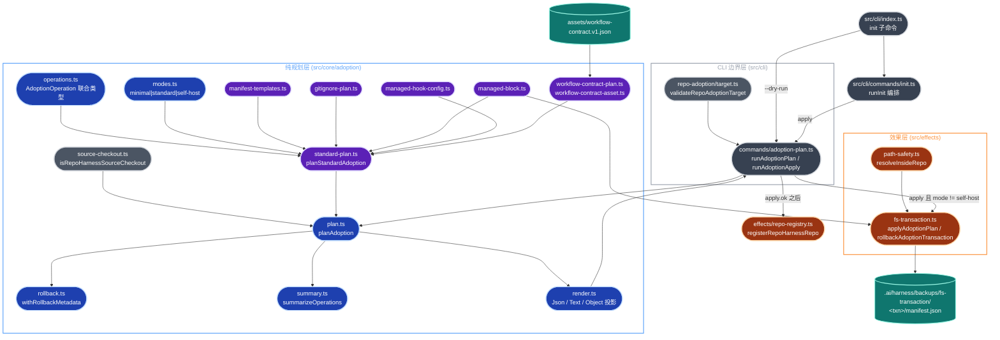
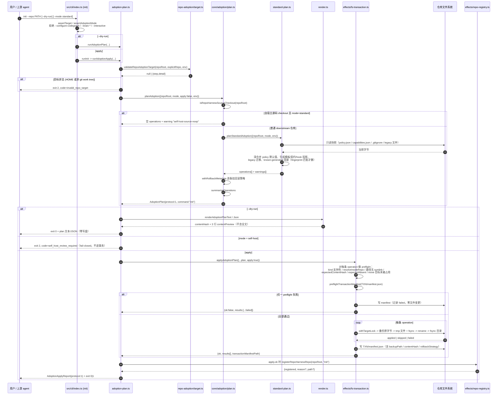
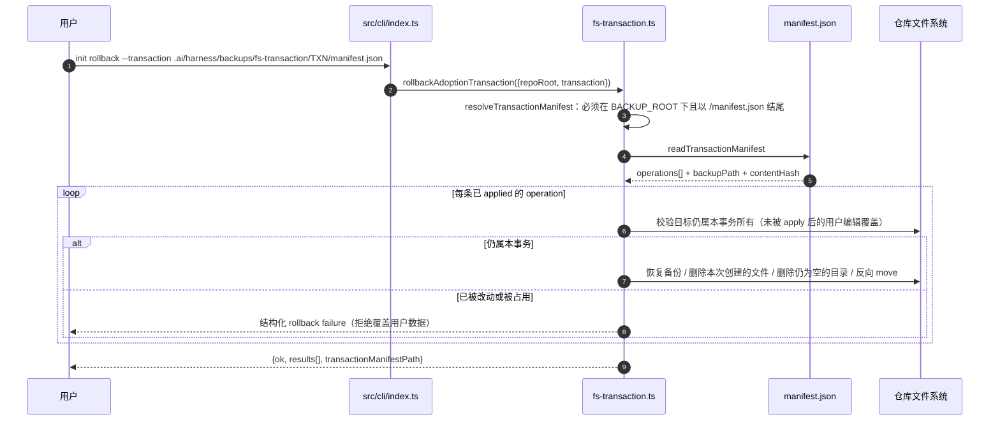

# public-surface/adoption 架构文档

> 状态：基于 `main` 工作树的 by-capability 架构复核稿。
> Verified against: main@13686d8d（2026-08-08）
> **Capability ID**: `public-surface-adoption`
> **Matched Prefixes**: `src/cli/commands/adoption-plan.ts`、`src/core/adoption`、`src/effects/fs-transaction.ts`、`src/effects/path-safety.ts`、`tests/cli/adoption-plan.test.ts`、`tests/fixtures/adoption`
> **Local Contracts**: `AGENTS.md`、`CLAUDE.md`
> **事实优先级**：实际源码 > 本文 > `docs/architecture/transactional-adoption-planner.md` > 任何计划稿。本文只画已实现现状；任何尚未接线的形状必须显式标注为**目标设计**或**保留未接线**。

## 0. 阅读约定

| 标记 | 含义 |
| --- | --- |
| **已实现、已接线** | 当前源码存在，并位于 `repo-harness init` 的真实 runtime path |
| **保留未接线** | 类型/字段已存在，但当前没有生产 producer 或 executor 分支 |
| **门禁拒绝** | 源码存在，但入口显式 fail-closed，不进入写盘路径 |
| **目标设计** | 仅存在于计划文档，尚未落地 |

本 capability 的一句话边界：**把「已检查的仓库状态」翻译成一份完整、可预演、可回滚的文件系统事务，并且只由一个 executor 提交。**规划侧禁止 import effects；effects 只消费已规划好的 operation。

---

## 1. P1：能力架构地图

### 1.1 内部模块与强依赖



### 1.2 模块职责表

| 文件 | 主要 exports / 职责 | 关键锚点 |
| --- | --- | --- |
| `src/cli/commands/adoption-plan.ts` | `runAdoptionPlan`（只渲染，不写盘）、`runAdoptionApply`（唯一 repo-local 事务入口）、`AdoptionApplyReport` protocol-1 报告信封 | `adoption-plan.ts:87` `runAdoptionPlan`；`adoption-plan.ts:123` `runAdoptionApply`；`adoption-plan.ts:138` self-host 门禁；`adoption-plan.ts:150` 唯一 `applyAdoptionPlan` 调用点 |
| `src/cli/repo-adoption/target.ts`（强依赖，不在 prefixes 内） | `validateRepoAdoptionTarget`：拒绝 HOME、非 git work tree 且未显式 `--repo` | `target.ts:33` |
| `src/core/adoption/plan.ts` | `planAdoption`：mode 归一 + self-host 源码 checkout 短路 + 挂 rollback metadata + summary | `plan.ts:22`；`plan.ts:25` 源码 checkout 短路分支 |
| `src/core/adoption/standard-plan.ts` | `planStandardAdoption`、`defaultPolicy`；全部 operation 的唯一 producer：目录、模板、workflow contract、policy 深合并、context/brain manifest、hook 投影、reference stub、legacy 迁移与 known-generated 清理 | `standard-plan.ts:722` 主编排；`standard-plan.ts:269` `defaultPolicy`；`standard-plan.ts:427` `knownGeneratedFile`；`standard-plan.ts:828` self-host `runCheck` |
| `src/core/adoption/operations.ts` | `AdoptionOperation` 8 类联合、`AdoptionPlan` / `AdoptionPlanSummary`、`makeOperationId`、前置条件字段 `expectedContentHash` / `expectedAbsent` | `operations.ts:85` 联合类型；`operations.ts:125` `makeOperationId` |
| `src/core/adoption/modes.ts` | `ADOPTION_MODES = ["minimal","standard","self-host"]`、`isAdoptionMode` | `modes.ts:1` |
| `src/core/adoption/rollback.ts` | `rollbackMetadataForOperation`、`withRollbackMetadata`：把回滚策略在**规划期**固化进 operation | `rollback.ts:11`；`rollback.ts:77` |
| `src/core/adoption/summary.ts` | `summarizeOperations`：byKind/byStatus 计数 + 用户所有权计数 + `requiresVerification` | `summary.ts:5`；`summary.ts:3` `USER_OWNED_PATHS = {".gitignore"}` |
| `src/core/adoption/render.ts` | `renderAdoptionPlanObject/Json/Text`：把 `content` 换成 `contentHash` + 3 行 `contentPreview`，避免 plan 输出携带全文 | `render.ts:14` `renderOperation`；`render.ts:37` |
| `src/core/adoption/managed-block.ts` | `managedBlockMarker`、`renderManagedBlock`、`upsertManagedBlock`、`managedBlockNeedsUpdate`：受管区块的唯一读写语义 | `managed-block.ts:54`；`managed-block.ts:83` |
| `src/core/adoption/managed-hook-config.ts` | `isRepoHarnessManagedHookCommand`、`stripRepoHarnessManagedHooks`：只摘除 repo-harness 自有 hook 命令，保留用户兄弟条目 | `managed-hook-config.ts:27`；`managed-hook-config.ts:51` |
| `src/core/adoption/gitignore-plan.ts` | `GITIGNORE_MANAGED_BLOCK_MARKER/CONTENT`、`LEGACY_GITIGNORE_MANAGED_MARKERS`、`gitignoreManagedBlockOperation` | `gitignore-plan.ts:93` |
| `src/core/adoption/manifest-templates.ts` | `adoptionTemplateFile`：`spec` / `currentStatus` / `deferredGoalLedger` / `lessonsLog` 四份 if-missing 模板 | `manifest-templates.ts:43` |
| `src/core/adoption/workflow-contract-asset.ts` | `WORKFLOW_CONTRACT_ASSET_PATH`、`readWorkflowContractAsset`、`loadWorkflowContractAsset`：从 `assets/workflow-contract.v1.json` 读取 canonical 字节 | `workflow-contract-asset.ts:4` |
| `src/core/adoption/workflow-contract-plan.ts` | `WORKFLOW_CONTRACT_RUNTIME_PATH = ".ai/harness/workflow-contract.json"`、`workflowContractInstallOperation` | `workflow-contract-plan.ts:7` |
| `src/core/adoption/source-checkout.ts` | `isRepoHarnessSourceCheckout`：识别自宿主源码树，避免 downstream 清理误伤产品源码 | `source-checkout.ts:22` |
| `src/effects/path-safety.ts` | `ensureRepoRelativePath`、`resolveInsideRepo`、`resolveParentInsideRepo`：拒绝绝对路径、`..`、NUL、Windows 盘符、`./` 前缀、逃逸 repo root | `path-safety.ts:9`；`path-safety.ts:30` |
| `src/effects/fs-transaction.ts` | 唯一 executor：`applyAdoptionPlan`、`rollbackAdoptionTransaction`、`atomicWriteFile`、六个 `apply*Operation`、manifest 读写与 preflight | `fs-transaction.ts:571` `applyAdoptionPlan`；`fs-transaction.ts:535` `preflightOperation`；`fs-transaction.ts:238` `atomicWriteFile`；`fs-transaction.ts:837` `rollbackAdoptionTransaction` |

### 1.3 operation 类型 vs 执行支持（当前事实）

`operations.ts` 声明 8 类 operation，但执行侧只支持 6 类：

| kind | producer | executor 支持 | 状态 |
| --- | --- | --- | --- |
| `mkdir` | `standard-plan.ts:184` | 是（`fs-transaction.ts:282`） | 已实现、已接线 |
| `writeFile` | `standard-plan.ts:161` | 是（`fs-transaction.ts:297`） | 已实现、已接线 |
| `appendManagedBlock` | `gitignore-plan.ts:93` | 是（`fs-transaction.ts:331`） | 已实现、已接线 |
| `move` | `standard-plan.ts:210` | 是（`fs-transaction.ts:385`） | 已实现、已接线 |
| `remove` | `standard-plan.ts:195` | 是（`fs-transaction.ts:422`） | 已实现、已接线 |
| `gitUntrack` | `standard-plan.ts:596` 附近 | 是（`fs-transaction.ts:446`） | 已实现、已接线 |
| `runCheck` | 仅 self-host（`standard-plan.ts:828`） | **否**，preflight 直接判 unsupported | **门禁拒绝**：与 `runAdoptionApply` 的 self-host 阻断互为双保险 |
| `mergeJson` | **无 producer** | **否** | **保留未接线**：只有类型定义（`operations.ts:59`），全仓无任何构造点 |

`isSupportedAdoptionOperation`（`fs-transaction.ts:110`）是这张表的机器可读版本。

### 1.4 规模信号

| 分组 | 生产文件数 | LOC |
| --- | ---: | ---: |
| `src/core/adoption/*.ts`（14 文件） | 14 | 1,651 |
| 其中 `standard-plan.ts` 单文件 | 1 | 839 |
| `src/effects/fs-transaction.ts` | 1 | 887 |
| `src/effects/path-safety.ts` | 1 | 47 |
| `src/cli/commands/adoption-plan.ts` | 1 | 164 |
| **capability 生产合计** | **17** | **2,749** |
| `tests/cli/adoption-plan.test.ts` | 1 | 559 |
| `tests/fixtures/adoption/*.json`（3 个期望快照） | 3 | 264 |

复算命令：

```bash
find src/core/adoption src/cli/commands/adoption-plan.ts \
     src/effects/fs-transaction.ts src/effects/path-safety.ts \
     -type f -name '*.ts' ! -name '*.test.ts' | sort | xargs wc -l
wc -l tests/cli/adoption-plan.test.ts tests/fixtures/adoption/*.json
```

两个热点很明显：`standard-plan.ts`（839 行）是唯一 producer，`fs-transaction.ts`（887 行）是唯一 executor，二者合计占本 capability 生产 LOC 的 63%。

### 1.5 依赖边界

**允许的出边**

- `src/core/adoption/**` → `src/core/adoption/**`、`assets/workflow-contract.v1.json`（经 `workflow-contract-asset.ts`）、Node 只读 API（`fs` 读取 + `path` + `crypto` 哈希）。
- `src/effects/fs-transaction.ts` → `src/effects/path-safety.ts`、`src/effects/process-runner.ts`、`src/core/adoption/managed-block.ts`（只借用受管区块语义，不反向规划）、`src/core/adoption/operations.ts` 的类型。
- `src/cli/commands/adoption-plan.ts` → `core/adoption/plan|render|modes`、`effects/fs-transaction`、`effects/repo-registry`、`cli/repo-adoption/target`。

**禁止的出边（当前事实即 invariant）**

- `src/core/adoption/**` **禁止** import `src/effects/**`。规划层必须保持无写盘副作用，否则 `--dry-run` 与 apply 的等价性失效。
- 除 `adoption-plan.ts:150` 外**禁止**第二个 `applyAdoptionPlan` 调用点；全仓当前确实只有这一个（`grep -rn 'applyAdoptionPlan(' src/`）。
- **禁止**任何 shell apply 路径、第二套 plan parser、post-apply 的 shell 清理。
- `fs-transaction.ts` **禁止**绕过 `resolveInsideRepo` 直接拼路径。

**入边**

- 唯一 CLI 入边是 `src/cli/index.ts` 的 `init` 子命令（`index.ts:425`）：`--dry-run` 直接进 `runAdoptionPlan`（`index.ts:494`），非 dry-run 进 `runInit`（`index.ts:519`）。
- `runInit` 在 `src/cli/commands/init.ts:646` 二选一调用 `runAdoptionApply` / `runAdoptionPlan`——这是 apply 侧的唯一上游。
- `init rollback --transaction <manifest>`（`index.ts:457`）直接调 `rollbackAdoptionTransaction`，不经过 planner。

**明确不在本 capability 范围**：CodeGraph 索引、host adapter 安装、全局 skill 同步、user-level MCP/brain 配置、`--verify` 之后的工作流检查——这些都是 `runInit` 的兄弟步骤，不属于这份事务。

---

## 2. P2：端到端数据流

### 2.1 `repo-harness init --repo <downstream> --dry-run` 与 apply 的共享路径

下图画 downstream 仓库的完整链路。`--dry-run` 与 apply 共用同一个 `createPlan`，分叉只发生在 `applyAdoptionPlan` 之前。



在自宿主仓库上实测（本文的 verification 面）：

```text
$ bun src/cli/index.ts init --repo . --dry-run
[init-plan] repo: /Users/ancienttwo/Projects/repo-harness
[init-plan] mode: standard
[init-plan] apply: no
[init-plan] operations: 0 total, 0 planned, 0 skipped
[init-plan] warning(low): The repo-harness source checkout owns its workflow surfaces; downstream init is not applicable.
```

即 `plan.ts:25` 的短路分支被命中，`standard-plan.ts` 完全不参与。要观察完整的 operation 列表，需要指向一个真实 downstream 仓库，或使用 `tests/fixtures/adoption/*.expected.json` 三份快照（`empty-repo` / `minimal-repo` / `self-host-repo`）。

### 2.2 回滚路径



### 2.3 错误路径要点

| 触发点 | 位置 | 行为 |
| --- | --- | --- |
| repoRoot 等于 HOME | `target.ts:39` | exit 2，`invalid_repo_target`，绝不写盘 |
| cwd 非 git work tree 且未传 `--repo` | `target.ts:48` | exit 2，提示显式传 `--repo` |
| planner 抛异常 | `adoption-plan.ts:73` | 包成 `invalid_adoption_plan`，exit 2 |
| `--mode self-host` + apply | `adoption-plan.ts:138` | exit 2，`self_host_review_required`；plan 仍然渲染，事务不启动 |
| operation kind 不受支持（`runCheck` / `mergeJson`） | `fs-transaction.ts:536` | preflight 判 failed，整个事务不执行任何写入 |
| 路径为绝对路径 / 含 `..` / 含 NUL / `./` 前缀 | `path-safety.ts:13-26` | preflight 失败 |
| 路径任一段是 symlink | `fs-transaction.ts:118` | preflight 失败（apply 与 rollback 两侧都查） |
| 规划后目标被改动（哈希不符） | `fs-transaction.ts:190` | `target content changed after planning`，失败 |
| 规划时不存在但 apply 前被创建 | `fs-transaction.ts:187` | `target was created after planning`，失败 |
| move 目的地已被占用 / 源不是普通文件 | `fs-transaction.ts:550-551` | preflight 失败 |
| 同一目标已被别的进程持锁 | `fs-transaction.ts:223` | `target is locked: <path>.repo-harness.lock` |
| manifest 落盘失败 | `fs-transaction.ts:500` | 追加一条 `transaction-manifest` failed 结果，整体 `ok=false`——manifest 失败绝不算成功 |
| known-generated 文件字节与声明 fingerprint 不符 | `standard-plan.ts:427` | 保留文件并发 warning，不扩大删除范围 |
| rollback manifest 路径不在 `BACKUP_ROOT` 下 | `fs-transaction.ts:637` | 拒绝，返回结构化错误 |

---

## 3. P3：设计决策与不变量

### 3.1 为什么是这个形状

**规划/执行分离**是这份代码里最贵也最关键的一条线。`planAdoption` 完全纯函数化（只读 fs），使得 `--dry-run` 输出和 apply 真正执行的是**同一个 operation 模型**，而不是两条各自解释意图的代码路径。这直接消掉了「预演说要改 A，实际改了 B」这一类最难 debug 的问题；代价是 `standard-plan.ts` 必须把所有条件判断前移到规划期，因此它膨胀到 839 行。

**前置条件在规划期固化**（`expectedContentHash` / `expectedAbsent`，`operations.ts:26-29`）是对「规划到执行之间存在时间窗」的正面回应。没有它，长事务里一次并发编辑就会被静默覆盖。

**回滚策略也在规划期固化**（`rollback.ts:11`），而不是执行期临时推断。这样 `--dry-run` 的输出本身就是一份可审计的回滚说明书。

**executor 单点**：`applyAdoptionPlan` 在全仓只有一个调用点（`adoption-plan.ts:150`）。这不是巧合，是刻意的收口——多一个 apply 权威就多一份漂移。

### 3.2 必须保持的不变量

1. **单一事实源**：`assets/workflow-contract.v1.json` + `standard-plan.ts` 的默认值定义 canonical 字节；plan、manifest、registry、Markdown 视图全是投影。
2. **规划层无副作用**：`src/core/adoption/**` 不 import `src/effects/**`。
3. **fail closed**：非法路径、哈希不符、所有权歧义、不支持的 kind → 停止或告警，绝不通过扩大删除范围来「让流程走下去」。
4. **保护用户所有权**：`.gitignore` 只动受管区块（`managed-block.ts:54`）；hook 配置只摘 repo-harness 自有命令（`managed-hook-config.ts:51`）；known-generated 清理只删字节匹配声明 fingerprint 的文件。
5. **manifest 与文件效果同事务**：manifest 写失败即整体失败（`fs-transaction.ts:500`）。
6. **回滚只碰本事务拥有的目标**：apply 之后的用户编辑一律拒绝覆盖。
7. **self-host apply 保持 fail-closed**：在 hook/runtime 审查确定性之前，公共 `init` 不得写自宿主形态。

### 3.3 10x 规模下先垮的点

按当前实现，压力不在包结构，而依次在：

1. **preflight 与 apply 之间的时间窗**。当前 preflight 是全量前置扫描，然后串行执行；operation 数量从当前的几十条涨到几百条时，窗口线性拉长，`target content changed after planning` 的误报率上升。先垮的是可用性，不是正确性——这是刻意的取舍。
2. **锁粒度**。`withTargetLock`（`fs-transaction.ts:209`）是 per-target 的 `O_EXCL` 文件锁，没有全事务锁。两个并发 `init` 不会互相覆盖单个文件，但可以交错出一个「一半来自事务 A、一半来自事务 B」的仓库状态。10x 并发下这是第一个真正的正确性缺口。
3. **备份体积**。每次写入都全量保留原字节到 `.ai/harness/backups/fs-transaction/`，没有任何保留期或 GC。事务次数上去之后这个目录单调增长。
4. **`standard-plan.ts` 的单文件复杂度**。839 行、十余个 `add*Operations` 步骤全部依赖同一个可变 `operations` 数组的顺序。再加几类迁移，顺序耦合会变成隐式契约。拆分的正确触发条件是「出现第二个独立的 plan producer」，而不是行数本身。

### 3.4 刻意不做的事

- 不为 `mergeJson` 补 executor：没有 producer 就没有需求，保留类型定义是历史遗留而非能力承诺（如需清理，应作为独立 work-package 删除类型而非补实现）。
- 不引入独立 workspace package：本 capability 与 CLI 同包同发布，缺少第二个独立发布/部署的 consumer。
- 不加 shell 兼容 apply 路径、不加 experimental apply flag、不加第二套 plan parser。

### 3.5 与专题文档的关系

`docs/architecture/transactional-adoption-planner.md` 是本 capability 的主题设计文档（HRD-09 legacy 退役细节、invariant 清单、recovery 语义）。本文与之复验后的两处补充：

- 该文的 P1 称 `standard-plan.ts` 被 `init` 与 `runInit()` 共同消费；源码事实是两者都经过 `planAdoption`（`plan.ts:22`）这一层，且 `planAdoption` 有一个 self-host 源码 checkout 的短路分支，此时 `standard-plan.ts` 根本不被调用。
- 该文未记录 `runAdoptionApply` 对 `mode === "self-host"` 的显式阻断（`adoption-plan.ts:138`，`self_host_review_required`）。它与 `standard-plan.ts:828` 的不可执行 `runCheck` 构成双保险。

---

## 4. 历史决策记录（append-only）

此前版本的 `docs/architecture/modules/public-surface/adoption.md` 不含任何带日期的决策章节，因此本节目前为空。后续所有带日期的决策条目在此按时间追加，原文保留、不得改写。

---

## 5. Verification

```bash
bun test tests/cli/adoption-plan.test.ts
bun run check:type
bun src/cli/index.ts init --repo . --dry-run
```
