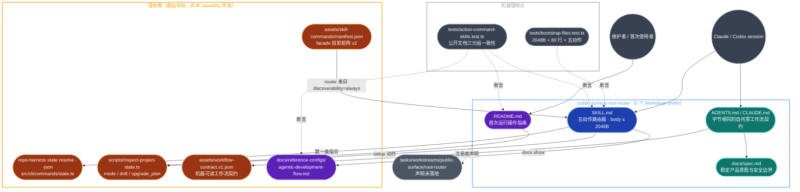
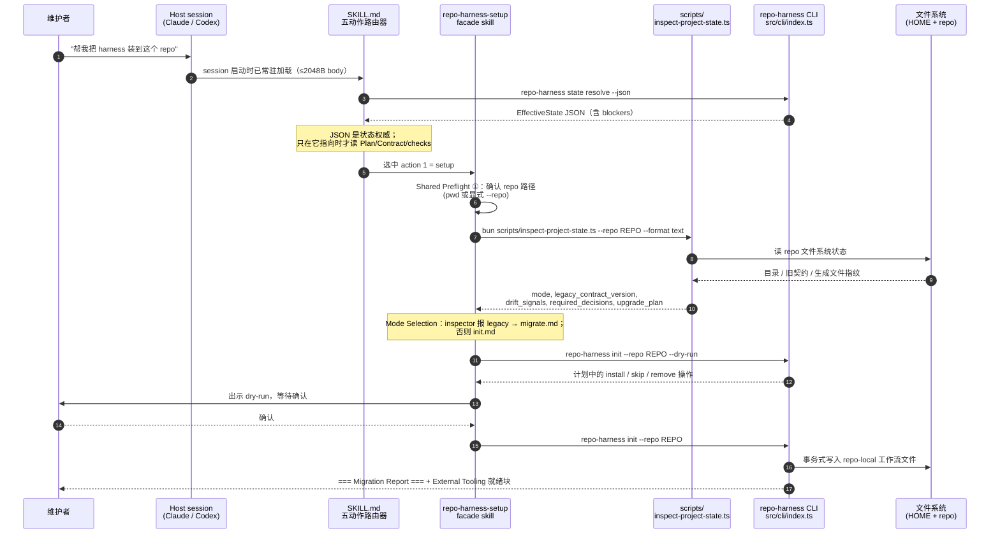

# public-surface/root-router 架构文档

<!-- BEGIN archctx:intro -->

> 状态：基于 `main` 工作树的 by-capability 架构复核稿。
> Verified against: main@13686d8d（2026-08-08）
> **Capability ID**: `public-surface-root-router`
> **Matched Prefixes**: `SKILL.md`、`README.md`、`AGENTS.md`、`CLAUDE.md`、`docs/spec.md`
> **Local Contracts**: `AGENTS.md`、`CLAUDE.md`
> **Workstream（声明值）**: `tasks/workstreams/public-surface/root-router` —— `.ai/context/capabilities.json` 已登记，但当前工作树上**不存在**该目录（见 §3.4）。
> 事实优先级：实际源码与测试断言 > 本文 > 本 capability 内的 prose。本文只画**已实现**现状；任何尚未落地的形态必须显式标注为**目标设计**，未标注即视为当前源码可复验的事实。

<!-- END archctx:intro -->

## 0. 阅读约定

| 标记 | 含义 |
| --- | --- |
| **已实现、已接线** | 当前源码存在，并位于真实 runtime path 或被测试断言锁定 |
| **已实现、约定层** | 只以 Markdown 契约形式存在（agent 读取后执行），没有 TypeScript 强制点 |
| **声明未落地** | 注册表/契约声明了该对象，但工作树上没有对应实体 |
| **目标设计** | 尚未成为源码或文件的规划形态 |

这个 capability 的特殊性：它的五个 prefix 全部是 Markdown，**没有一行属于自己的 TypeScript**。它的"运行时"是模型的上下文窗口——每个 host session 都会先加载 `SKILL.md`，再决定要不要往下走。因此它的强制机制不在实现里，而在 `tests/` 的断言与 `assets/skill-commands/manifest.json` 的投影矩阵里。

<!-- BEGIN archctx:p1 -->

## 1. P1：能力架构地图

### 1.1 内部模块与强依赖



### 1.2 模块职责表

| 文件 | 主要 exports / 职责 | 关键锚点 |
| --- | --- | --- |
| `SKILL.md` | YAML frontmatter（`name` / `description` / `when_to_use`）+ 五个语义动作 setup/plan/execute/verify/handoff；正文第一条指令是把 `repo-harness state resolve --json` 当作**唯一状态权威**，其余文件只在该 JSON 指向时才读 | `SKILL.md:2-4` frontmatter；`SKILL.md:14` 状态入口；`SKILL.md:19-25` 五动作；`SKILL.md:27` 安全边界 fail-closed 声明 |
| `README.md` | 面向人的首次运行路径：装 CLI → `repo-harness install` 引导 host runtime → `repo-harness init --dry-run` 预览 → apply + verify；另含 Hooks / MCP Connector / Skills / Maintainer Reference 等 20 个章节 | `README.md:40-118` Get Started 四步；`README.md:96` verify 命令；`README.md:111-117` update/uninstall |
| `AGENTS.md` / `CLAUDE.md` | 自托管工作流契约：canonical workflow files、operating rules、code optimization principles、required checks、architecture contract 投影块。两文件**字节完全相同**（各 108 行 / 11,630 B，`diff` 无输出） | `AGENTS.md:59-69` Required Checks；`AGENTS.md:16` 与 `:30` 是全仓唯一引用 `workflow-contract` 的 prose 位置 |
| `docs/spec.md` | 稳定产品真相：Product Outcome、Primary Users、Non-Goals、Core Invariants、Workflow Surfaces 表、Safety Boundaries、Acceptance Scenarios、Canonical Terms | `docs/spec.md:40-61` Core Invariants；`docs/spec.md:65-76` Workflow Surfaces 表；`docs/spec.md:100-115` Acceptance Scenarios |

强制点（不属于本 capability，但锁定它的形状）：

| 强制点 | 断言内容 |
| --- | --- |
| `tests/bootstrap-files.test.ts:52` | 去掉 frontmatter 后的 body ≤ 2048 字节。注释把这条写成"每个 host 每个 session 都常驻加载"的预算，不是风格洁癖 |
| `tests/bootstrap-files.test.ts:53` | 整文件 ≤ 80 行 |
| `tests/bootstrap-files.test.ts:57-64` | 必须按序出现 `1. **setup**` … `5. **handoff**`，且不得出现 `Core Plans (A-F)`、`Custom Presets (G-K)`、`## Hook` 这类退役章节 |
| `tests/action-command-skills.test.ts:248-260` | 把 `SKILL.md` + `README.md` + `agentic-development-flow.md` 拼成一个字符串，断言目标 canonical 包名齐全，且 `hooks-init` / `docs-init` / `create-project-dirs` 被标注为 `not public` |
| `assets/skill-commands/manifest.json` | `router` 条目 `discoverability: "always"`、`profiles: ["minimal","full"]`、`mutatesRepoByDefault: false` —— 路由器无条件同步到两个 host，与 install profile 无关 |

### 1.3 规模信号

| 文件 | 行数 | 字节 |
| --- | ---: | ---: |
| `SKILL.md` | 29 | 2,042 |
| `README.md` | 451 | 24,933 |
| `AGENTS.md` | 108 | 11,630 |
| `CLAUDE.md` | 108 | 11,630 |
| `docs/spec.md` | 135 | 7,586 |
| **合计** | **831** | **57,821** |

生产 TypeScript 文件数 = **0**：本 capability 的五个 prefix 全部是 Markdown。

复算命令：

```bash
for f in SKILL.md README.md AGENTS.md CLAUDE.md docs/spec.md; do
  printf "%s %s lines %s bytes\n" "$f" "$(wc -l < "$f")" "$(wc -c < "$f")"
done
diff AGENTS.md CLAUDE.md && echo "AGENTS==CLAUDE identical"
```

`SKILL.md` 当前 2,042 字节，距离 2,048 的天花板只剩 6 字节余量——注意这是**整文件**字节数，测试断言的是**去掉 frontmatter 后的 body**，因此实际余量更大（frontmatter 约 330 字节）。但整文件 29 行对 80 行上限仍是宽松的，真正的紧约束是字节而不是行。

### 1.4 依赖边界

允许的出边：

- `SKILL.md → repo-harness CLI`：`state resolve`、`init --repo . --dry-run`、`docs show <topic>`、`run <helper>`。路由器只允许指向命令名与 reference 名，不复述命令的内部协议。
- `SKILL.md → facade skills`：`repo-harness-setup` / `repo-harness-plan` / `repo-harness-check`，以及 `references/handoff.md`。
- `AGENTS.md/CLAUDE.md → docs/reference-configs/*`、`plans/`、`tasks/`、`.ai/harness/policy.json`、`.ai/context/capabilities.json`。
- `README.md → docs/reference-configs/install-profiles.md`、`hook-operations.md`。

禁止的出边（当前事实，且由测试或契约锁定）：

- 路由器**不得**内联命令目录、scaffold 预设、migration 细节、hook 调试与其他集成——`SKILL.md:29` 明确写成"按需加载"，`tests/bootstrap-files.test.ts:57-64` 用 `## Hook` 的负向断言执行。
- 公开文档**不得**把 `hooks-init`、`docs-init`、`create-project-dirs` 描述成公开命令（`manifest.json#nonPublicInternalSteps`，由 `tests/action-command-skills.test.ts:259` 断言）。
- `docs/spec.md:28-38` 的 Non-Goals 是硬边界：不做 hosted gateway、不接管下游 build/test/deploy 权威、不向下游 vendored helper 脚本、不把 chat history / SQLite / hosted thread 当持久真相源。

入边：

- 唯一的机器入边是 host 的 skill 加载器（`~/.claude/skills`、`~/.codex/skills`），由 `repo-harness install` 的 host-adapters 组件投影；`installed-copy-sync` 保证源目录到两个 host 的同步。
- 唯一的人入边是仓库首页 `README.md`。

<!-- END archctx:p1 -->

<!-- BEGIN archctx:p2 -->

## 2. P2：端到端数据流

### 2.1 主路径：一次 setup 请求从 host session 走到落盘状态

这是本 capability 唯一真正跨越进程边界的路径。输入源头是**用户显式说出的 setup 意图**加上**目标 repo 路径**，不是当前工作目录的猜测；最终副作用是 `~/.repo-harness/install-state.json`（protocol 2）与 repo-local 工作流文件。



全局 bootstrap 分支（`repo-harness install`）与上图并行但输入源头不同：它的真相源是**选中的 host target 与 brain root**，不是当前目录。协议要点（`src/cli/installer/install-profile.ts`、`src/core/skill-surface/profile-components.ts`）：

| 环节 | 事实 | 锚点 |
| --- | --- | --- |
| 封闭词表 | `INSTALL_PROFILES = ['minimal', 'full']` | `src/cli/installer/install-profile.ts:62` |
| 默认值 | 全新安装 dry-run 默认 `full` | `tests/install-profiles.test.ts:131-138` |
| 组件投影 | minimal = 7 个 component；full = 12 个 | `src/core/skill-surface/profile-components.ts:29-39` |
| hook 投影 | minimal = 7 个 managed hook；full = 11 个 | `tests/install-profiles.test.ts:105-106` |
| facade 投影 | minimal = plan/check；full = plan/check/product/ship | `assets/skill-commands/manifest.json#expectedProjections` |
| 落盘状态 | `~/.repo-harness/install-state.json`，`protocol: 2` | `src/cli/installer/install-profile.ts:76`、`:757` |
| 遗留状态 | protocol 1 一律 throw，只有 `--migrate-profile-state` 例外 | `src/cli/installer/install-profile.ts:813-815`、`:845` |

### 2.2 类型变换与权威转移

| 阶段 | 输入类型 | 输出类型 | 权威归属 |
| --- | --- | --- | --- |
| session 启动 | host skill 加载器读到的字节 | 模型上下文里的五动作路由表 | 路由器（只路由，不决策） |
| 状态解析 | repo 文件字节 | `EffectiveState` JSON | `resolveEffectiveState`（`src/cli/commands/state.ts:168-185`） |
| 仓库探测 | repo 文件系统状态 | `{ mode, legacy_contract_version, drift_signals[], required_decisions[], upgrade_plan[] }` | `scripts/inspect-project-state.ts:9-15`、`:252-258` |
| 模式选择 | inspector 文本输出 | 六个 reference 之一（init/migrate/upgrade/repair/scaffold/capability） | `assets/skills/repo-harness-setup/SKILL.md:20-25`（**已实现、约定层**：由 agent 读文档执行，没有 TS 分发器） |
| 事务应用 | 目标 repo 路径 + profile | 落盘文件 + Migration Report | `repo-harness init` |

### 2.3 错误路径要点

- **缺少 repo 路径**：Shared Preflight 第 ① 步先确认路径，在任何写入前停下（`assets/skills/repo-harness-setup/SKILL.md:15`）。
- **inspector 报 legacy**：强制先走 `references/migrate.md` 的 dry-run + apply，不允许直接 template refresh（`references/migrate.md:13-14`）。
- **protocol 1 遗留状态**：`readInstalledProfile` 直接 throw，错误消息把 `--migrate-profile-state --profile <minimal|full>` 写进去；已经是 protocol 2 时再调迁移同样 throw（`install-profile.ts:813-815`、`:845-846`）——两侧都 fail closed，没有静默兼容分支。
- **component 与 profile 不符**：`components do not match profile full` 直接抛错（`tests/install-profiles.test.ts:388`）。
- **跨作用域写入**：repo-scoped 模式禁止写 `HOME`，user-level 只能走 `repo-harness update`（`repo-harness-setup/SKILL.md:29`）。
- **路由器超预算**：body 越过 2048 B 或文件超 80 行，`bun test` 立即红——这是本 capability 唯一会让 CI 变红的自有失败模式。
- **越权动作**：`SKILL.md:27` 声明 scope / worktree ownership / secrets / destructive commands / high-risk paths / checks freshness / review fingerprints 全部 deterministic 且 fail closed，profile override 只能**抬高**风险地板，不能降低。

<!-- END archctx:p2 -->

## 3. P3：设计决策与不变量

### 3.1 为什么路由器故意做薄

工作流的机器可检查不变量太多，prose 无法保持正确。因此策略是：**policy 住在 contract、script 和 test 里；root 文档只做路由和定向**。`SKILL.md` 里没有一条可以脱离 CLI 单独执行的规则——它给的是命令名和 reference 名，真正的协议在被指向的文件里。

2048 字节的天花板不是风格约束，是**常驻上下文预算**：每个 host、每个 session、在任何动作被选中之前都要加载它。测试注释把这层理由写死在 `tests/bootstrap-files.test.ts:48-51`，防止后人把它读成可协商的 lint 规则。

### 3.2 必须保持的不变量

1. **五动作封闭**：setup / plan / execute / verify / handoff，序号与加粗格式被逐字断言。新增公开命令不能变成第六个动作，只能挂在现有动作下的 facade。
2. **状态权威单一**：`repo-harness state resolve --json` 是唯一入口，其他文件"只在该 JSON 指向时才读"。路由器自身不缓存、不复述状态。
3. **AGENTS.md ≡ CLAUDE.md**：两个 host 契约必须字节相同。任何单侧编辑都是漂移。
4. **公开面与内部步骤分离**：`hooks-init` / `docs-init` / `create-project-dirs` 永远不是公开命令。
5. **profile 只增不诱导**：`repo-harness-setup`、`repo-harness-architecture`、`repo-harness-chatgpt` 的 `profiles: []` + `discoverability: cli-reference|explicit-setup` 意味着它们**永不被任何 profile 隐式发现**，只能经路由器或显式安装到达。这是把发现面压在五动作之内的关键机制。
6. **无兼容回落**：protocol 1 → 2 只有一条显式迁移路径，越界一律 throw。

### 3.3 10x 规模下先垮的点

**先垮的是发现面，不是文件大小。** 当公开命令从当前的 ~10 个（`manifest.json#packages`，其中 4 个是 profile-facade，5 个是 external）涨到 100 个时：

- `SKILL.md` 本身不会垮：五动作是常数级，2048 B 预算与命令数无关。
- 垮的是 **`manifest.json#expectedProjections` 的组合爆炸**。当前它手写枚举 `facadesByProfile` × `externalSkillsByProfile` × `hostSkillPlacementsByProfile` 三张表，共 2 个 profile × 2 个 host。命令数 10x 后，这三张表要么手写维护失败，要么必须从 package 条目派生——但派生就意味着 profile 归属从"显式枚举"变成"计算结果"，会削弱当前"新命令默认不可发现"的 fail-closed 姿态。
- 第二个压力点是 `retiredPackages`：当前 19 条退役映射全部内联在同一个 JSON 里。它是只增不减的，10x 后会超过 packages 本身的体积。

当前形状是正确的最小选择：profile-bounded facade 让专用命令**可用但不默认进入模型上下文**，代价是每加一个公开命令要在 manifest、README、`tests/action-command-skills.test.ts` 三处同步——这个代价是刻意的摩擦，不是遗漏。

### 3.4 已知漂移

| 项 | 声明 | 工作树事实 | 判定 |
| --- | --- | --- | --- |
| workstream 目录 | `.ai/context/capabilities.json` 声明 `tasks/workstreams/public-surface/root-router` | 目录不存在（`tasks/workstreams/public-surface/` 整个缺失） | **声明未落地**。该 capability 至今没有产生过需要跨会话承载的 durable progress；不是错误，但注册表与磁盘不一致 |
| verify 命令形态 | `docs/spec.md:36` 规定 canonical helper 调用是 `repo-harness run <helper>`；`AGENTS.md:66` 用 `repo-harness run check-task-workflow --strict` | `README.md:96` 的 Get Started 第 4 步写 `bash scripts/check-task-workflow.sh --strict` | 在本自托管仓库两者都可执行（`scripts/check-task-workflow.sh` 存在，且 `docs/spec.md:46` 明确 root `scripts/` 是自托管 source/runtime）；但 README 是**下游读者**的入口，展示的是非 canonical 形态 |

## 4. 历史决策记录（append-only）

本文件在 main@13686d8d 之前没有带日期的章节。为不丢失既有判断，以下逐字保留改写前版本（`docs/architecture/modules/public-surface/root-router.md`）的 P1 / P2 / P3 全文，英文原文不翻译。

<!-- BEGIN verbatim: pre-rewrite root-router.md, P1/P2/P3 -->

### Pre-rewrite `## P1 Map`

The root router is the human and agent entrypoint for this plugin. `SKILL.md`
defines when the skill is used and exactly five semantic actions: setup, plan,
execute, verify, and handoff. Its body is capped at 2KB. `README.md` owns first-run operator
guidance. `AGENTS.md` and `CLAUDE.md` define the self-hosted repo workflow for
both Codex and Claude. `docs/spec.md` owns the stable product outcome.

Strong dependencies:

- `scripts/inspect-project-state.ts` for state classification.
- `assets/workflow-contract.v1.json` for the machine-readable contract.
- `docs/reference-configs/agentic-development-flow.md` for routing detail that should not bloat root docs.

Weak dependencies:

- `repo-harness install --profile <profile>` owns first-run global bootstrap;
  the closed vocabulary is `minimal|full`, and full is the default.
- `repo-harness uninstall` removes repo-harness managed host adapters without deleting sibling hooks or third-party tools.
- `repo-harness init` owns repo-local harness adoption and refresh.
- `geju` is a pre-contract framing skill; repo-harness has no external knowledge-CLI runtime or readiness dependency. This self-host repo vendors CodeGraph as a dev dependency while downstream generated repos keep global MCP setup explicit unless policy opts in.

Out of scope:

- Runtime hook implementation.
- Migration internals.
- Product scaffold details after initial harness attachment.

### Pre-rewrite `## P2 Trace`

Concrete route: user explicitly asks for setup -> root `SKILL.md` selects setup
-> `repo-harness install` selects full and plans CLI, effective state, guards,
handoff, adapters, planning integrations, agent fleet, verifier, cross-model
acceptance, and release gates -> `--dry-run` lists install/skip/remove -> apply
persists protocol-2 `~/.repo-harness/install-state.json`. Explicit
`--profile minimal` selects the 7-hook baseline; full selects 11. Legacy
protocol-1 state is rejected outside `--migrate-profile-state`.

Concrete route: user asks for an existing repo install -> root `SKILL.md`
selects the setup action -> `repo-harness-setup` (init mode) routes to
`repo-harness init --repo <repo>` ->
the command runs `inspect-project-state.ts --repo <repo> --format text` -> if no
legacy state is found, `repo-harness init --repo <repo>`
installs or refreshes the workflow -> repo-local checks verify the target repo.

Concrete route: user asks for product discovery or a complex/design architecture
plan -> the parent agent invokes `geju` before a contract exists -> the parent
completes P1 architecture mapping, P2 concrete tracing, and P3 design judgment
with its own repo/runtime capabilities -> it reconciles the evidence and freezes
the accepted thesis, falsifier, and execution boundary into the file-backed plan
and contract. The captured contract, not a live planning provider, owns execution.

For global bootstrap, the input source of truth is the selected host target and
brain root, not the current directory. For repo-local adoption, the source of
truth is the target repo path, not the user's wording. The first repo-local type
transformation is repo filesystem state into `mode`,
`legacy_contract_version`, `drift_signals`, `required_decisions`, and
`upgrade_plan`. The final output is either a configured host runtime or a
file-backed harness plus verification report.

Error paths:

- Missing cwd/repo path stops before mutation.
- Legacy docs route to migration before template refresh.
- Missing JSON runtime fails strict workflow verification.

### Pre-rewrite `## P3 Decision`

The root router is intentionally thin because the workflow has too many
machine-checked invariants to keep correct in prose. The invariant is that
policy lives in contracts, scripts, and tests; root docs only route and orient.

Planning has one lifecycle owner: the parent agent. `geju` expands the design
space before capture, while P1/P2/P3 and the final plan remain parent-owned.
This removes a host-dependent external planning gate without weakening the
file-backed approval, scope, review, or verification boundaries.

At 10x command count, this layer fails first through discovery overload. The
five-action router and profile-bounded installed facades keep specialized CLI
commands available without making them default model context.

<!-- END verbatim -->

**改写时的复验批注**（对上述原文，逐条对源码核对）：

- P1 的 5 个 prefix、2KB 上限、strong/weak dependency 列表——**全部复验通过**。
- P2 第一条 route（install profile / 7-hook / 11-hook / protocol-2 / 遗留拒绝）——**全部复验通过**。
- P2 第二条 route 中"`repo-harness init --repo <repo>` -> the command runs `inspect-project-state.ts`"——**与源码冲突**。`src/cli/**` 对 `inspect-project-state` 零引用；该探测是 `repo-harness-setup` 的 Shared Preflight 第 ② 步（`assets/skills/repo-harness-setup/SKILL.md:16`），发生在 mode selection **之前**、`init` 调用**之前**。所有者与时序两处都不同，正确形态见 §2.1。
- P3 的三段判断——**复验通过**，§3 在其基础上补了 manifest 组合爆炸这个具体的 10x 失效机制。

## Optimization Backlog

- Keep the root router body at or below 2KB and default installed discovery at five actions or fewer.
- If another public command is added, update `assets/skill-commands/manifest.json`, README, and `tests/action-command-skills.test.ts` in the same slice.
