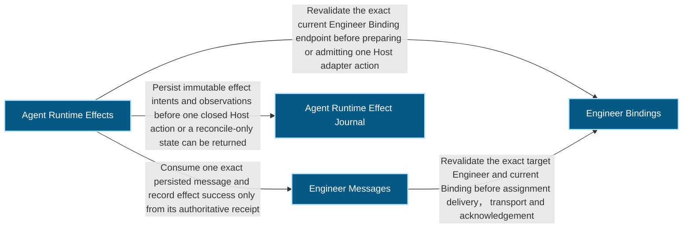
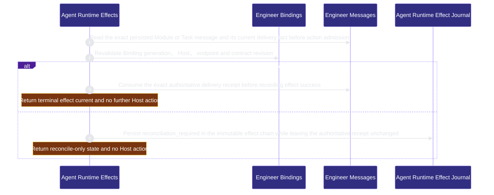

# runtime-harness/agent-runtime-effects 架構文檔

<!-- BEGIN ARCHCONTEXT:generated target="projection_target.entity.capability-runtime-harness-agent-runtime-effects" sourceDigest="sha256:ac4f132b11344961f5e367ab35c32f9b4ab66b86068042f0747383cf992d81fb" rendererVersion="archcontext.docs-renderer/v4" outputDigest="sha256:89dfc817809be4f206c133ec77607395fe409ede91dfb53dda90a2579e0f75c9" -->
> **狀態**:`active`
> **Capability ID**:`capability.runtime-harness.agent-runtime-effects`(kind `capability`)
> **Matched Prefixes**:`src/core/engineers/agent-runtime-effect.ts`、`src/effects/engineers/agent-runtime-effect-store.ts`、`src/effects/engineers/agent-runtime-feature.ts`、`src/effects/engineers/agent-runtime-adapters/**`
> **Local Contracts**:`AGENTS.md`、`CLAUDE.md`
> **事實優先級**:倉庫當前狀態 > 本文檔機器區 > 本文檔人工區。機器區(引言、§1、§2)由 ArchContext 從架構模型與源碼度量投影生成,手改會在下次投影被覆蓋。本文檔不記錄出處;本次投影所驗證的 commit 見 `docs/architecture/.projection-manifest.json`。

Owns the provider-neutral, at-most-once Agent Runtime Effect V2 boundary for closed Codex App Thread and tmux CLI Agent adapters.

## 1. P1:能力架構地圖

### 1.1 架構圖

- Proof: `proven` (`sha256:e466b6ca52dfbcc6e27d20584f7a353fe21bfee2b1694a9816130e992db82187`).
- Semantic nodes: `4`; declared relations: `4`.

### 1.2 模組職責表

| 宣告入口 | 錨點 | 職責 |
| --- | --- | --- |
| `entrypoint.agent-runtime-effects.prepare` | `src/effects/engineers/agent-runtime-effect-store.ts#currentBinding` | `sink.agent-runtime-effects.current-binding` → `src/effects/engineers/binding-store.ts#readEngineerBindingStatus` |
| `entrypoint.agent-runtime-effects.prepare` | `src/effects/engineers/agent-runtime-effect-store.ts#moduleReference` | `sink.agent-runtime-effects.persisted-message` → `src/effects/engineers/module-inbox.ts#readModuleMessageDelivery` |
| `entrypoint.agent-runtime-effects.prepare` | `src/effects/engineers/agent-runtime-effect-store.ts#taskEndpointAndReference` | `sink.agent-runtime-effects.persisted-task-message` → `src/effects/fleet/task-inbox.ts#readTaskMessageDelivery` |
| `entrypoint.agent-runtime-effects.start` | `src/effects/engineers/agent-runtime-effect-store.ts#startAgentRuntimeEffect` | `sink.agent-runtime-effects.started-observation` → `src/core/engineers/agent-runtime-effect.ts#buildAgentRuntimeEffectObservation` |
| `entrypoint.agent-runtime-effects.observe` | `src/effects/engineers/agent-runtime-effect-store.ts#observeAgentRuntimeEffect` | `sink.agent-runtime-effects.reconciliation-observation` → `src/core/engineers/agent-runtime-effect.ts#buildAgentRuntimeEffectObservation` |
| `entrypoint.agent-runtime-effects.observe` | `src/effects/engineers/agent-runtime-effect-store.ts#receiptEvidence` | `sink.agent-runtime-effects.receipt-evidence` → `src/effects/engineers/module-inbox.ts#readModuleMessageDelivery` |

### 1.3 規模信號

- 規模量級:`5–10` 個文件 / `500–1000` 行
- 匹配前綴:`src/core/engineers/agent-runtime-effect.ts`、`src/effects/engineers/agent-runtime-effect-store.ts`、`src/effects/engineers/agent-runtime-feature.ts`、`src/effects/engineers/agent-runtime-adapters/**`
- 推導:掃描 `source.include` 減 `source.exclude`,跳過 `.git/` 與 `node_modules/`,再按 1–2–5 階梯分桶。精確計數不入本文檔:量級足以回答「這個能力有多大」,而逐行計數會讓覆蓋範圍內任何一次源碼改動都改寫本文檔。

### 1.4 依賴邊界

出向關係:

- `calls` → `capability.runtime-harness.engineer-bindings` — Revalidate the exact current Engineer Binding endpoint before preparing or admitting one Host adapter action
- `calls` → `capability.runtime-harness.engineer-messages` — Consume one exact persisted message and record effect success only from its authoritative receipt
- `calls` → `component.agent-runtime-effects.journal` — Persist immutable effect intents and observations before one closed Host action or a reconcile-only state can be returned

入向關係:

- `calls` ← `capability.runtime-harness.engineering-overlay` — Observe exact current runtime-effect and reconciliation states without executing or repairing an effect
- `calls` ← `capability.runtime-harness.mcp-sidecar` — Expose read-only runtime capability and current-effect projections to the authenticated Engineer without Host mutation authority

## 2. P2:端到端數據流

> **Proof**: `proven` (`sha256:e466b6ca52dfbcc6e27d20584f7a353fe21bfee2b1694a9816130e992db82187`); selectors `4/4`.

<!-- END ARCHCONTEXT:generated target="projection_target.entity.capability-runtime-harness-agent-runtime-effects" -->

## 3. P3:設計決策與不變量

### 3.1 兩個 operation 共用一條 effect 鏈(#281)

`AgentRuntimeOperation` 從 `notify_inbox` 擴成 `notify_inbox | wake_for_offer`,
走的是同一條 intent → effect_started → observation → current 鏈,而不是另起一套 daemon。
intent 依 operation 分岔 subject:`notify_inbox` 帶 `message_ref`,`wake_for_offer` 帶
`wake_ref`(repository_id、authorization_revision、snapshot_revision、closed reason)。
Engineer、Binding ID、generation、contract revision 只由 `endpoint_fence` 綁一次,
wake_ref 不重複承載,避免同一個事實在一份 intent 裡有兩個權威。protocol 仍是 2:
既有 `notify_inbox` intent 的 canonical bytes 一個 byte 都沒動。

### 3.2 wake 是提示,不是授權

wake host action 只帶 `repo-harness-wake:` 前綴的 bounded control reference、
repository_id、snapshot_revision 與 reason,不含 claim token、Lease、Task 或 offer body。
成功只認 `ControllerStepReceiptV2`——綁定該 effect 的 control reference、
Engineer/Binding fence 與控制器實際重讀到的 snapshot revision;
message delivery receipt 與 process exit code 都不能結案(`assertAgentRuntimeReceiptKindForOperation`
兩個方向都封閉)。醒來的控制器重讀當前 offers 與 authorization,
snapshot 已過期或空掉就是 no-op,仍算一次已送達的 wake。

### 3.3 每個 Binding 一個 wake 指針

`wakes/<sha256(engineer\0binding\0generation)>.json` 是該 Binding 的耐久 ledger:
上一次消費的 offer 投影 + 唯一的 pending wake 指針 + coalescing 窗口。
只有 empty→eligible 這個確切轉換會 arm wake;同一個 snapshot 重複觀測不寫盤;
更新的 snapshot 只在舊 wake 尚未 start 時取代它(繼承原本的 `requested_at`/`coalesce_until`,
所以窗口有界、不會被連續變更推著走);已 start 的 wake 不被取代,也不會開第二個並行 wake。
被取代的 intent 靠 ledger fence 永遠 start 不了,因此沒有無限重試面:
一次 wake 失敗後,除非 offers 再次從空轉為可用,不會自動重來(retry 屬於 attempt receipt 的權威)。

### 3.4 訂閱面在 effect 層

`listDueOfferWakes` / `subscribeToOfferWakes` 讀 ledger 與 effect current,
由呼叫方提供時鐘、回傳 bounded 事件,非互動控制器不經 CLI 即可消費。
ledger 用 atomic replace 發布,讀取不取鎖,因此鎖序永遠是 wake lock → effect lock 單向。

## 4. 歷史決策記錄(append-only)

## Optimization Backlog
