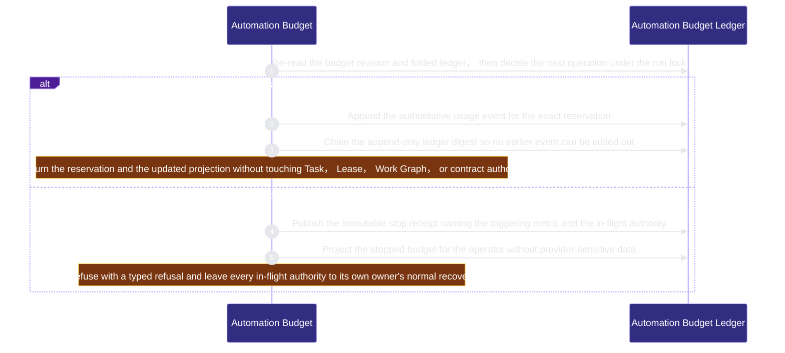

# runtime-harness/automation-budget 架構文檔

<!-- BEGIN ARCHCONTEXT:generated target="projection_target.entity.capability-runtime-harness-automation-budget" sourceDigest="sha256:ef80f6b703842a6c19e68bdf67a289c4b6e9edb98a98bcf9182c8fe7c6c4bd06" rendererVersion="archcontext.docs-renderer/v4" outputDigest="sha256:242db864138c0ef4e61a296690722497d0eadb675199351b6d3a11239e139387" -->
> **狀態**:`active`
> **Capability ID**:`capability.runtime-harness.automation-budget`(kind `capability`)
> **Matched Prefixes**:`src/core/automation/**`、`src/effects/automation/**`、`src/cli/commands/automation.ts`
> **Local Contracts**:`AGENTS.md`、`CLAUDE.md`
> **事實優先級**:倉庫當前狀態 > 本文檔機器區 > 本文檔人工區。機器區(引言、§1、§2)由 ArchContext 從架構模型與源碼度量投影生成,手改會在下次投影被覆蓋。本文檔不記錄出處;本次投影所驗證的 commit 見 `docs/architecture/.projection-manifest.json`。

Enforces one machine-checked per-goal automation budget by reserving before every claim, dispatch, retry, or provider invocation and publishing an immutable stop receipt on exhaustion.

## 1. P1:能力架構地圖

### 1.1 架構圖

- Proof: `proven` (`sha256:531ac1aa0a9cf7997f30f22088f000bdb453a045bf87ca121030dada13372b45`).
- Semantic nodes: `2`; declared relations: `1`.

### 1.2 模組職責表

| 宣告入口 | 錨點 | 職責 |
| --- | --- | --- |
| `entrypoint.automation-budget.reserve` | `src/effects/automation/budget-store.ts#reserveAutomationBudget` | `sink.automation-budget.reservation-decision` → `src/core/automation/budget.ts#evaluateAutomationReservation` |
| `entrypoint.automation-budget.reserve` | `src/effects/automation/budget-store.ts#persistStopReceipt` | `sink.automation-budget.stop-receipt` → `src/core/automation/budget.ts#sealAutomationStopReceipt` |
| `entrypoint.automation-budget.append` | `src/effects/automation/budget-store.ts#commitUsage` | `sink.automation-budget.usage-event` → `src/core/automation/budget.ts#sealAutomationUsageEvent`、`sink.automation-budget.ledger-chain` → `src/core/automation/budget.ts#chainAutomationLedgerDigest` |
| `entrypoint.automation-budget.project` | `src/effects/automation/budget-store.ts#readAutomationBudgetBoardSlice` | `sink.automation-budget.operator-slice` → `src/core/automation/projection.ts#projectAutomationBudgetSlice` |

### 1.3 規模信號

- 規模量級:`5–10` 個文件 / `2000–5000` 行
- 匹配前綴:`src/core/automation/**`、`src/effects/automation/**`、`src/cli/commands/automation.ts`
- 推導:掃描 `source.include` 減 `source.exclude`,跳過 `.git/` 與 `node_modules/`,再按 1–2–5 階梯分桶。精確計數不入本文檔:量級足以回答「這個能力有多大」,而逐行計數會讓覆蓋範圍內任何一次源碼改動都改寫本文檔。

### 1.4 依賴邊界

出向關係:

- `calls` → `component.automation-budget.ledger` — Reserve, charge, and stop one automation run against a create-once ledger held under the Git common directory

入向關係:

- 無。

## 2. P2:端到端數據流

> **Proof**: `proven` (`sha256:531ac1aa0a9cf7997f30f22088f000bdb453a045bf87ca121030dada13372b45`); selectors `5/5`.

<!-- END ARCHCONTEXT:generated target="projection_target.entity.capability-runtime-harness-automation-budget" -->

## 3. P3:設計決策與不變量

1. 調用方(controller、CLI、campaign)對所有決策輸入都是不可信的;可信來源只有 host 進程:它的時鐘、它的檔案系統、倉庫裡的 canonical authorities。調用方只說要做什麼、發生了什麼,不說那值多少、發生在何時。
2. 綁定的 task contract 的位元組在**每一次讀取**時重新驗證:store 依 `contract_path` 讀出 contract、比對 `contract_sha256`、自行解析 `delegation.budget`。因此 run 進行中編輯該 contract 會讓每個 verb 一致地 fail closed(`automation_budget_store_invalid`);恢復方式是還原位元組或另開一個 run,設計上沒有 re-bind 路徑——contract 是 budget 綁定的授權,不是可以中途換掉的參數。
3. `current.json` 是三種 durable record 的投影,不是第二個權威;每個 mutating verb 進 lock 後先重新推導它,read-only 面只回報 drift 不修復。
4. token / cost 硬上限在本 slice 一律 fail closed:沒有 provider-attested usage 權威可讀之前,自證的用量數字比沒有上限更糟。

## 4. 歷史決策記錄(append-only)

## Optimization Backlog
