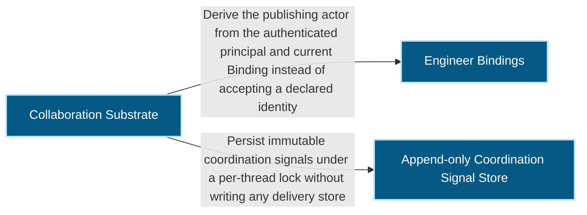
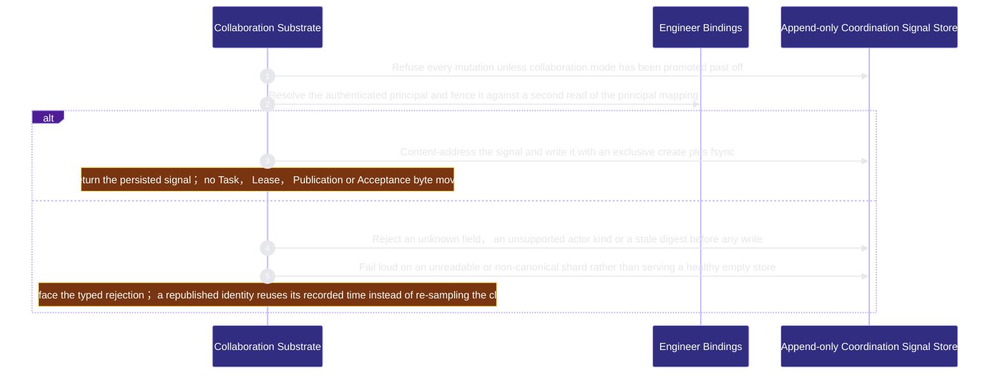

# runtime-harness/collaboration 架構文檔

<!-- BEGIN ARCHCONTEXT:generated target="projection_target.entity.capability-runtime-harness-collaboration" sourceDigest="sha256:7ae73b97d16065f3f27319dc9644c95d24bcb860053ac49026f34429d4de901f" rendererVersion="archcontext.docs-renderer/v4" outputDigest="sha256:ed240f46ebf44c545236a6a36a828a4f5140a309ba53bed9044eb988c7e80f4d" -->
> **狀態**:`active`
> **Capability ID**:`capability.runtime-harness.collaboration`(kind `capability`)
> **Matched Prefixes**:`src/core/collaboration/**`、`src/effects/collaboration/**`
> **Local Contracts**:`AGENTS.md`、`CLAUDE.md`
> **事實優先級**:倉庫當前狀態 > 本文檔機器區 > 本文檔人工區。機器區(引言、§1、§2)由 ArchContext 從架構模型與源碼度量投影生成,手改會在下次投影被覆蓋。本文檔不記錄出處;本次投影所驗證的 commit 見 `docs/architecture/.projection-manifest.json`。

Publishes append-only coordination signals with Host-derived identity and recorded time, holding zero Task, Lease, Publication or Acceptance authority.

## 1. P1:能力架構地圖

### 1.1 架構圖

- Proof: `proven` (`sha256:ba6168c8de638264fdf9780b20b12e20e14e4ac2b5ccb35931439f3ccecfe078`).
- Semantic nodes: `3`; declared relations: `2`.

### 1.2 模組職責表

| 宣告入口 | 錨點 | 職責 |
| --- | --- | --- |
| `entrypoint.collaboration.publish` | `src/effects/collaboration/signal-store.ts#publishCoordinationSignal` | `sink.collaboration.mutation-gate` → `src/effects/collaboration/feature-flag.ts#assertCollaborationMutationEnabled`、`sink.collaboration.signal-schema` → `src/core/collaboration/signal.ts#buildCoordinationSignal` |
| `entrypoint.collaboration.actor-derivation` | `src/effects/collaboration/signal-store.ts#resolveModuleEngineerActor` | `sink.collaboration.authenticated-principal` → `src/effects/engineers/principal.ts#resolveEngineerPrincipal` |
| `entrypoint.collaboration.read` | `src/effects/collaboration/signal-store.ts#readPersistedSignal` | `sink.collaboration.record-identity` → `src/core/collaboration/signal.ts#canonicalCoordinationSignalBytes` |
| `entrypoint.collaboration.shared-mechanics` | `src/core/collaboration/signal.ts#buildCoordinationSignal` | `sink.collaboration.actor-union` → `src/core/collaboration/common.ts#validateCollaborationActorRef` |

### 1.3 規模信號

- 規模量級:`2–5` 個文件 / `500–1000` 行
- 匹配前綴:`src/core/collaboration/**`、`src/effects/collaboration/**`
- 推導:掃描 `source.include` 減 `source.exclude`,跳過 `.git/` 與 `node_modules/`,再按 1–2–5 階梯分桶。精確計數不入本文檔:量級足以回答「這個能力有多大」,而逐行計數會讓覆蓋範圍內任何一次源碼改動都改寫本文檔。

### 1.4 依賴邊界

出向關係:

- `calls` → `capability.runtime-harness.engineer-bindings` — Derive the publishing actor from the authenticated principal and current Binding instead of accepting a declared identity
- `calls` → `component.collaboration.primary` — Persist immutable coordination signals under a per-thread lock without writing any delivery store

入向關係:

- 無。

## 2. P2:端到端數據流

> **Proof**: `proven` (`sha256:ba6168c8de638264fdf9780b20b12e20e14e4ac2b5ccb35931439f3ccecfe078`); selectors `5/5`.

<!-- END ARCHCONTEXT:generated target="projection_target.entity.capability-runtime-harness-collaboration" -->

## 3. P3:設計決策與不變量

### 兩個平面,一個方向

交付平面(Work Graph → EngineerOffer → Claim/Lease → WorkEnvelope → Publication
→ Acceptance)是權威。協作平面只讀它,永不寫它,也沒有一條反向邊。這條邊界由
C0 的 D1 凍結,由 `tests/unit/collaboration-authority-baseline.test.ts` 守住:
封閉掃描證明本能力不在五個被凍結的平面上,另一條斷言證明任何交付平面模組都沒有
import 協作模組。

Child PRD A 記的核心風險是「協作 store 退化成第二個調度器」。防線不是文檔約定,
而是這條 import 方向斷言加上 store 本身零交付寫入的 before/after digest 證據。

### 記錄時間為什麼是一個判別聯合

signal 的 `created_at` 由 Host 派生,且對重試穩定。兩種來源各自對應一條真實的
provenance 鏈:delegated 貢獻取該次運行精確的持久化觀測時間,直接發布在第一次
idempotency 事件裡凍結時鐘。用一組可空欄位表達會允許「兩個都為 null」這種無意義
狀態,所以它是判別聯合。

真正的壓力點在重試路徑:先採樣時鐘再查存在性,會讓一次冪等重試看起來像 payload
衝突。store 因此只在建檔那條分支讀時鐘,比較分支一律用已持久化的值重建候選。

### 身份只能由服務端派生

publish 的入參裡根本沒有 actor 欄位。actor 由 `resolveEngineerPrincipal()` 從
authenticated principal 推導,再對 principal mapping 做第二次讀取,兩次不一致就
fail closed。呼叫方自述的身份不是被忽略,而是無處可寫。

P0 的 wire union 只有 `module_engineer` 與 `delegated_worker`,因為只有這兩類有
不可變的服務端 provenance。`human_operator` 與 `native_subagent` 不進 union,也
不留佔位分支——留下的佔位分支遲早會被填上一個沒有 provenance 的值。

### supersede 的 lineage 邊界

append-only 的修訂只能是 supersede,而 supersede 只能在同一個 actor lineage 內。
lineage 對 Module Engineer 取 `engineer_id`,對 delegated Worker 取
`worker_run_ref_sha256`:重新綁定是同一個持久 Engineer 的換屆,兩次 delegated run
則是兩個參與者。

### 10x 規模下先壞的地方

per-thread lock 讓同一條 thread 的寫入串行。單一 thread 上的高頻寫入會先撞到鎖等待,
而不是磁碟。thread 之間互不阻塞,所以擴展方向是 thread 的數量而不是單 thread 的吞吐。
`listCoordinationSignals()` 是全量掃描,C2 的投影需要它時要綁定來源集合的 digest,
且快取永遠不能成為權威。

### 不變量

- 協作平面對 Task、Lease、Publication、Acceptance 的字節影響為 0。
- 每條 signal 一個不可變檔案,身份級原子寫,同 id 同 payload 冪等、不同 payload 顯式衝突。
- store 不可讀時 fail loud,絕不退化成健康空集。
- `collaboration.mode` 預設 `off`,升級順序 `off -> shadow -> active`,不跳級。
- `src/core/collaboration/common.ts` 在 C1 之後凍結,C2-C9 只消費不修改。

## 4. 歷史決策記錄(append-only)

| 日期 | 決策 | 依據 |
| --- | --- | --- |
| 2026-08-29 | 建立 `capability.runtime-harness.collaboration`,協作平面與交付平面分離 | `docs/researches/20260829-c0-collaboration-two-plane-authority-freeze.md` D1-D12 |
| 2026-08-29 | `ArtifactRefV1` 複用 `WorkerResultV1.evidence_refs` 的同一個校驗器,不引入第二個等價引用類型 | D8;`src/core/engineers/delegation.ts` 的 `validateWorkerEvidenceRefs()` |
| 2026-08-29 | store 根、鎖策略與 canonical JSON 複用既有 `repo-harness/<domain>/v1` 慣例與既有鎖原語,不寫第二個序列化器 | D9 |

## Optimization Backlog

- C2 的 thread/hotspot 投影如果需要快取,快取必須綁定來源集合的 digest 並在不匹配時重算。
- 目前 `listCoordinationSignals()` 讀全量;真實 signal 量級由 C9 的 canary 測出來之後再決定要不要分片。
