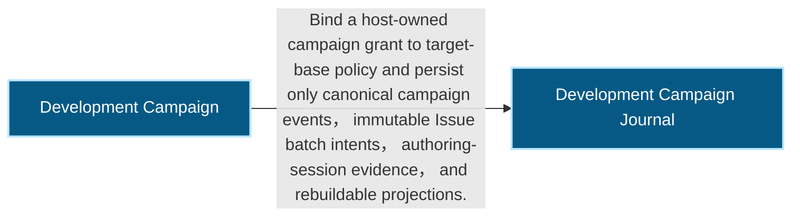
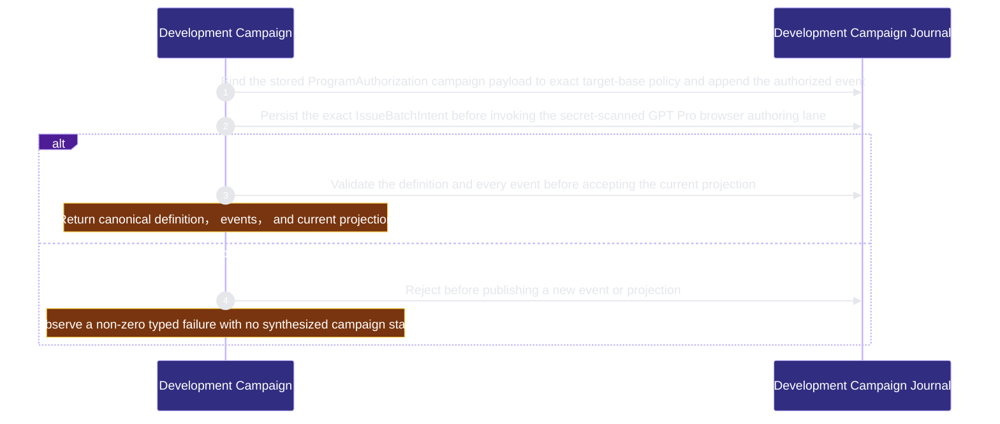

# runtime-harness/development-campaign 架構文檔

<!-- BEGIN ARCHCONTEXT:generated target="projection_target.entity.capability-runtime-harness-development-campaign" sourceDigest="sha256:5bcedf7f53b5a13b6c00bdcffa3d823518270e1d97cde5ee8e0c7420c43a4498" rendererVersion="archcontext.docs-renderer/v4" outputDigest="sha256:9de3ceaebb7fa03ce951ef3d74b502f8ac82c205ff40d67f14a2ea589251b19c" -->
> **狀態**:`active`
> **Capability ID**:`capability.runtime-harness.development-campaign`(kind `capability`)
> **Matched Prefixes**:`src/core/automation/development-campaign.ts`、`src/core/automation/issue-batch.ts`、`src/effects/automation/development-campaign-policy.ts`、`src/effects/automation/development-campaign-store.ts`、`src/effects/automation/issue-batch-store.ts`、`src/effects/automation/gpt-pro-issue-authoring.ts`、`src/cli/commands/campaign.ts`
> **Local Contracts**:`AGENTS.md`、`CLAUDE.md`
> **事實優先級**:倉庫當前狀態 > 本文檔機器區 > 本文檔人工區。機器區(引言、§1、§2)由 ArchContext 從架構模型與源碼度量投影生成,手改會在下次投影被覆蓋。本文檔不記錄出處;本次投影所驗證的 commit 見 `docs/architecture/.projection-manifest.json`。

Owns the host-authorized, policy-bounded campaign journal that will route externally authored repair Issues into existing execution authorities without replacing them.

## 1. P1:能力架構地圖

### 1.1 架構圖

- Proof: `proven` (`sha256:8db6dc213bf29675bbc9b49fdf4c80696ea174aeed829f4b8adcb46cc1b6da92`).
- Semantic nodes: `2`; declared relations: `1`.

### 1.2 模組職責表

| 宣告入口 | 錨點 | 職責 |
| --- | --- | --- |
| `entrypoint.development-campaign.lifecycle` | `src/cli/commands/campaign.ts#runCampaignStart` | `sink.development-campaign.create` → `src/effects/automation/development-campaign-store.ts#createDevelopmentCampaign` |
| `entrypoint.development-campaign.lifecycle` | `src/cli/commands/campaign.ts#runCampaignTransition` | `sink.development-campaign.append` → `src/effects/automation/development-campaign-store.ts#appendDevelopmentCampaignEvent` |
| `entrypoint.development-campaign.lifecycle` | `src/cli/commands/campaign.ts#runCampaignStatus` | `sink.development-campaign.status` → `src/effects/automation/development-campaign-store.ts#readDevelopmentCampaignStatus` |
| `entrypoint.development-campaign.lifecycle` | `src/cli/commands/campaign.ts#runCampaignAuthor` | `sink.development-campaign.issue-authoring-start` → `src/effects/automation/gpt-pro-issue-authoring.ts#startIssueBatchAuthoring` |
| `entrypoint.development-campaign.lifecycle` | `src/cli/commands/campaign.ts#runCampaignAuthorFollowup` | `sink.development-campaign.issue-authoring-followup` → `src/effects/automation/gpt-pro-issue-authoring.ts#continueIssueBatchAuthoring` |

### 1.3 規模信號

- 規模量級:`5–10` 個文件 / `1000–2000` 行
- 匹配前綴:`src/core/automation/development-campaign.ts`、`src/core/automation/issue-batch.ts`、`src/effects/automation/development-campaign-policy.ts`、`src/effects/automation/development-campaign-store.ts`、`src/effects/automation/issue-batch-store.ts`、`src/effects/automation/gpt-pro-issue-authoring.ts`、`src/cli/commands/campaign.ts`
- 推導:掃描 `source.include` 減 `source.exclude`,跳過 `.git/` 與 `node_modules/`,再按 1–2–5 階梯分桶。精確計數不入本文檔:量級足以回答「這個能力有多大」,而逐行計數會讓覆蓋範圍內任何一次源碼改動都改寫本文檔。

### 1.4 依賴邊界

出向關係:

- `depends_on` → `capability.runtime-harness.automation-budget` — Consume the existing host-owned ProgramAuthorizationV1 grant identity without minting or widening automation authority
- `depends_on` → `capability.runtime-harness.collaboration` — Reserve the existing fenced delegated-run boundary as the only later campaign dispatch path
- `depends_on` → `capability.runtime-harness.engineer-scheduling` — Reserve the existing Work Graph and acquire chain as the only later campaign execution path
- `depends_on` → `capability.runtime-harness.external-source-intake` — Require the established external Issue intake policy before campaign startup without acquiring provider mutation authority
- `depends_on` → `capability.runtime-harness.integration-acceptance` — Observe existing acceptance and publication projections later without creating a second acceptance or merge authority
- `calls` → `component.development-campaign.journal` — Bind a host-owned campaign grant to target-base policy and persist only canonical campaign events, immutable Issue batch intents, authoring-session evidence, and rebuildable projections.

入向關係:

- 無。

## 2. P2:端到端數據流

> **Proof**: `proven` (`sha256:8db6dc213bf29675bbc9b49fdf4c80696ea174aeed829f4b8adcb46cc1b6da92`); selectors `3/3`.

<!-- END ARCHCONTEXT:generated target="projection_target.entity.capability-runtime-harness-development-campaign" -->

## 3. P3:設計決策與不變量

## 4. 歷史決策記錄(append-only)

## Optimization Backlog
