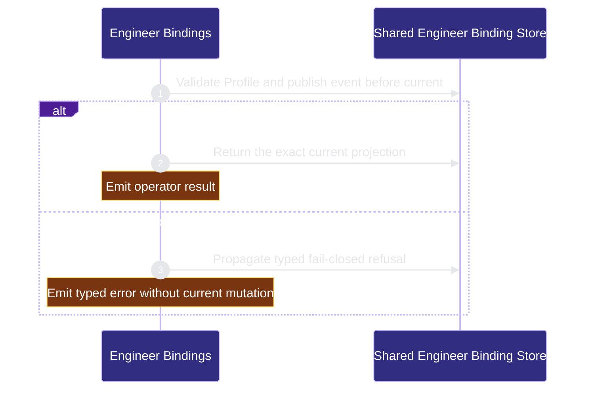

# runtime-harness/engineer-bindings 架構文檔

<!-- BEGIN ARCHCONTEXT:generated target="projection_target.entity.capability-runtime-harness-engineer-bindings" sourceDigest="sha256:a7183fb58363e18c568254338cd289f4d11e0596a6c818d882c47af5d9aaabdd" rendererVersion="archcontext.docs-renderer/v4" outputDigest="sha256:5730280e97652d810b2bce1642909d63639f83a864cb2d0fbe6e5767c77310d6" -->
> **狀態**:`active`
> **Capability ID**:`capability.runtime-harness.engineer-bindings`(kind `capability`)
> **Matched Prefixes**:`agents/engineers/**`、`src/core/engineers/**`、`src/effects/engineers/**`、`src/cli/commands/engineer.ts`
> **Local Contracts**:`AGENTS.md`、`CLAUDE.md`
> **事實優先級**:倉庫當前狀態 > 本文檔機器區 > 本文檔人工區。機器區(引言、§1、§2)由 ArchContext 從架構模型與源碼度量投影生成,手改會在下次投影被覆蓋。本文檔不記錄出處;本次投影所驗證的 commit 見 `docs/architecture/.projection-manifest.json`。

Defines tracked Module Engineer behavior contracts and one crash-consistent binding authority shared by linked worktrees.

## 1. P1:能力架構地圖

### 1.1 架構圖

- Proof: `proven` (`sha256:4c7a86d77605dcb7e7072f722d8eeb023a341439733379647f6b543a35607406`).
- Semantic nodes: `2`; declared relations: `1`.

### 1.2 模組職責表

| 宣告入口 | 錨點 | 職責 |
| --- | --- | --- |
| `entrypoint.engineer-bindings.operator-cli` | `src/cli/commands/engineer.ts#buildEngineerCommand` | `sink.engineer-bindings.shared-store` → `src/effects/engineers/binding-store.ts#bindEngineer` |

### 1.3 規模信號

- 規模量級:`5–10` 個文件 / `1000–2000` 行
- 匹配前綴:`agents/engineers/**`、`src/core/engineers/**`、`src/effects/engineers/**`、`src/cli/commands/engineer.ts`
- 推導:掃描 `source.include` 減 `source.exclude`,跳過 `.git/` 與 `node_modules/`,再按 1–2–5 階梯分桶。精確計數不入本文檔:量級足以回答「這個能力有多大」,而逐行計數會讓覆蓋範圍內任何一次源碼改動都改寫本文檔。

### 1.4 依賴邊界

出向關係:

- `calls` → `component.engineer-bindings.primary` — Publish one operator-authorized Engineer binding transition

入向關係:

- 無。

## 2. P2:端到端數據流

> **Proof**: `proven` (`sha256:4c7a86d77605dcb7e7072f722d8eeb023a341439733379647f6b543a35607406`); selectors `1/1`.

<!-- END ARCHCONTEXT:generated target="projection_target.entity.capability-runtime-harness-engineer-bindings" -->

## 3. P3:設計決策與不變量

### Authority split

- Profile/SOP 是 Git-index tracked 行为契约；filesystem presence 不构成 authority。`.archcontext/model/nodes/*.yaml` 仍是 capability path、entrypoint、interface 与 check 的唯一权威，contract revision 哈希完整 schema-valid selected node；Profile 只保存 `capability_id` 引用。
- `<git-common-dir>/repo-harness/engineers/v1/` 是 linked worktrees 共享的唯一 binding authority。`current.json` 决定当前状态；event 只提供 immutable audit 与同一 idempotency key 的定向恢复。
- ME-0A 只有 local Human operator CLI 能写 binding。bootstrap capsule 是 read-only context，不携带 Principal、credential、Claim、Lease、Publication、Acceptance 或 task mutation authority。

### Publication invariant

每次 mutation 在 per-Engineer exclusive lock 内执行：校验 authoritative current/CAS fence，使用 `O_EXCL|O_NOFOLLOW` 创建 immutable event，fsync event 与 events directory，再以 temp+fsync+rename 发布 current，最后 fsync Engineer directory。event durable 先于 current；任一模糊或 symlink 状态 fail closed。

同一 key/同一 client-authored semantic request 重用首次 event 冻结的 binding ID、时间戳与 target contract revision；operation fingerprint 排除 server-derived target revision，因此 Profile 演进不会封死已 durable event 的 crash recovery，但 Provider/thread/host 等请求字段改变仍返回 `idempotency_conflict`。bootstrap 遇到 current/Profile revision 不一致时拒绝。generation-0 genesis 不落盘；有 event 而无 current 对 status 是 corruption，只有该 exact transition 的 retry 可以完成 genesis crash window。

`replace` event 在 `created_at` 退休 `previous_binding_id` 并发布下一代 current；旧 event 中的 binding 保留 state-at-event，不是第二份 current authority。Engineer caller 单独启用 stale empty-lock recovery：超过 30 秒后重验 ancestor/directory inode 与 emptiness，再以 `rmdir` 为 fence；暂停的原 creator 恢复后仍必须通过唯一 token ownership check，其他共享锁 caller 的默认 fail-closed 语义不变。

### Scale and trade-off

P0 选择每个 Engineer 一个目录与 Profile/node 全量扫描，换取简单、可审计、无需第二索引权威；一次 list 只批量读取一次 Git index 并解析一次 ArchContext registry。10x 时先遇到的是 Profile/node 扫描与目录数量，而非 lock/CAS 正确性；在出现可测量压力前不引入 database、cache authority、background repair 或 batch protocol。

## 4. 歷史決策記錄(append-only)

### 2026-08-24 ME-0A authority foundation

- Approved work-package: `plans/plan-20260824-2126-me0a-engineer-profile-binding.md`.
- Accepted architecture change: `changeset.plan-20260824-2126-me0a-engineer-profile-binding`, bound to archived external approval `event.review-20260824-2050-persistent-module-engineer-me0a-approval`.
- EngineerPrincipal, Session mutation, ClaimActorReceipt, delegation, messaging, Worker Host, Provider lifecycle, handoff, Human Board, and remote access remain separate Draft children and receive no authority from this module.

## Optimization Backlog
