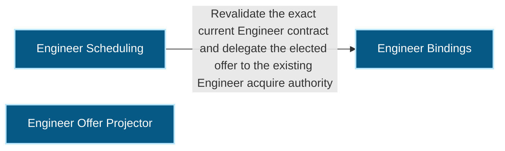
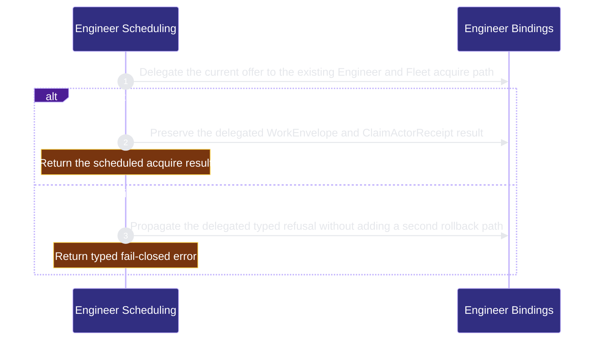

# runtime-harness/engineer-scheduling 架構文檔

<!-- BEGIN ARCHCONTEXT:generated target="projection_target.entity.capability-runtime-harness-engineer-scheduling" sourceDigest="sha256:1199b07a5714320aee8ba5461a075ebcbf629423a3ab28ba746f7619663ad535" rendererVersion="archcontext.docs-renderer/v4" outputDigest="sha256:6b0753946f1cade73047bc700d3c4a7a95821ae950aa5da00edc1e842f01ef06" -->
> **狀態**:`active`
> **Capability ID**:`capability.runtime-harness.engineer-scheduling`(kind `capability`)
> **Matched Prefixes**:`src/core/engineers/scheduling.ts`、`src/effects/engineers/scheduling.ts`、`src/effects/engineers/scheduling-acquire.ts`
> **Local Contracts**:`AGENTS.md`、`CLAUDE.md`
> **事實優先級**:倉庫當前狀態 > 本文檔機器區 > 本文檔人工區。機器區(引言、§1、§2)由 ArchContext 從架構模型與源碼度量投影生成,手改會在下次投影被覆蓋。本文檔不記錄出處;本次投影所驗證的 commit 見 `docs/architecture/.projection-manifest.json`。

Projects explicit same-commit Work Package graphs into revision-fenced Module Engineer offers and revalidates one offer under repository concurrency before delegated acquisition.

## 1. P1:能力架構地圖

### 1.1 架構圖

- Proof: `proven` (`sha256:35859a1c135b8a6f5676c09d33eb53b6003ee8b6857a1eca3cc80df7126693ee`).
- Semantic nodes: `3`; declared relations: `1`.

### 1.2 模組職責表

| 宣告入口 | 錨點 | 職責 |
| --- | --- | --- |
| `entrypoint.engineer-scheduling.offers` | `src/effects/engineers/scheduling.ts#collectEngineerOffers` | `sink.engineer-scheduling.current-binding` → `src/effects/engineers/binding-store.ts#readEngineerBindingStatus` |
| `entrypoint.engineer-scheduling.acquire` | `src/effects/engineers/scheduling-acquire.ts#delegateScheduledEngineerAcquire` | `sink.engineer-scheduling.engineer-acquire` → `src/effects/engineers/acquire.ts#acquireEngineerTask` |

### 1.3 規模信號

- 規模量級:`2–5` 個文件 / `1000–2000` 行
- 匹配前綴:`src/core/engineers/scheduling.ts`、`src/effects/engineers/scheduling.ts`、`src/effects/engineers/scheduling-acquire.ts`
- 推導:掃描 `source.include` 減 `source.exclude`,跳過 `.git/` 與 `node_modules/`,再按 1–2–5 階梯分桶。精確計數不入本文檔:量級足以回答「這個能力有多大」,而逐行計數會讓覆蓋範圍內任何一次源碼改動都改寫本文檔。

### 1.4 依賴邊界

出向關係:

- `calls` → `capability.runtime-harness.engineer-bindings` — Revalidate the exact current Engineer contract and delegate the elected offer to the existing Engineer acquire authority

入向關係:

- `calls` ← `capability.runtime-harness.interface-change` — Verify target-Engineer materialization against the exact tracked ME-1A Work Graph projection at one Git commit
- `calls` ← `capability.runtime-harness.mcp-sidecar` — Project and acquire exact revision-fenced Engineer offers for a verified OAuth principal

## 2. P2:端到端數據流

> **Proof**: `proven` (`sha256:35859a1c135b8a6f5676c09d33eb53b6003ee8b6857a1eca3cc80df7126693ee`); selectors `1/1`.

<!-- END ARCHCONTEXT:generated target="projection_target.entity.capability-runtime-harness-engineer-scheduling" -->

## 3. P3:設計決策與不變量

- Canonical Sprint rows remain the only Task identity authority. The deterministic same-commit `.work-graph.v1.json` sibling owns scheduling metadata and derived Work Package revisions without changing `task_id` or `task_revision`.
- Missing carrier means `unclassified`; `generic-v1` is explicit and has zero Work Packages. `engineering-v2` has exact full Sprint-row coverage and no unknown semantic keys.
- Offers bind graph, Work Package, Task, Profile, Binding, Fleet offer, dependency, concurrency, and authorization observations. An offer grants no authority and any changed observation makes it stale.
- Repository concurrency is elected by one Git-common-dir lock held across final revalidation and the existing synchronous Engineer/Fleet acquire call. ME-1A creates no second Claim, Lease, assignment, or rollback authority.
- Unsupported dependency proof authorities return `authority_unavailable`; scheduling never reconstructs product acceptance or publication state from prose, paths, branch names, or compatibility heuristics.

At 10x scale, full registry/profile/receipt scans and lock hold time fail first. P0 deliberately keeps those costs linear and observable; no index, daemon, cache, or database is introduced before measurements justify a separate work-package.

## 4. 歷史決策記錄(append-only)

- 2026-08-25: Human approved `changeset.plan-20260825-1149-me1a-engineer-scheduling-schema` via `event.review-20260825-1149-me1a-engineer-scheduling-schema-approval`. The fixed-point projection proves the exact `delegateScheduledEngineerAcquire` → `acquireEngineerTask` selector and the MCP → scheduling capability boundary.

## Optimization Backlog
