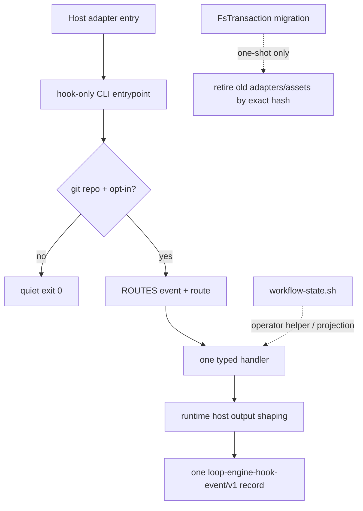

# Architecture Module: runtime-harness/hook-adapters

> **Capability ID**: `runtime-harness-hook-adapters`
> **Authority**: `src/cli/hook/route-registry.ts` → `handler-registry.ts` → `runtime.ts`
> **Adapter projection**: `src/cli/installer/managed-entries.ts`

## P1 — Architecture map

The adapter layer translates host events into the one repo-local typed runtime.
It has deliberately small ownership boundaries:

- `managed-entries.ts` projects the public route registry into user-level
  `~/.codex/hooks.json` and `~/.claude/settings.json` entries. The shell command
  in an adapter is only an invocation envelope; it is not hook logic.
- `route-registry.ts` owns the stable public `(event, routeId, matcher)`
  contract. The 11 tuples are unchanged by HRD-09. Each tuple has exactly one
  `handler` and no `scripts` list.
- `handler-registry.ts` binds the eight typed in-process handlers to those
  tuples. `runtime.ts` resolves the repository and opt-in marker, invokes one
  handler, shapes host output, and finalizes one event telemetry record.
- `assets/hooks/lib/workflow-state.sh` is mirrored to `.ai/hooks/lib/` as an
  operator/workflow-state helper. It is not an event entrypoint. The former
  per-event Bash scripts, `run-hook.sh`, and hook shims are retired.
- `standard-plan.ts` and `fs-transaction.ts` own one-shot migration and exact
  fingerprint retirement. They are not consulted during host-event dispatch.

Runtime state is written under ignored `.ai/harness/*` paths and host runtime
configuration. Durable architectural conclusions belong in this module and
the research surface, not in ignored run caches.

## P2 — Concrete traces

### Host event to typed handler

```text
Claude/Codex event
  -> user-level managed adapter entry
  -> git-root + opt-in check
  -> ROUTES[event, route]
  -> handler-registry binding
  -> handler.run({ payload, repoRoot, collector, dependencies })
  -> runtime hostOutput()
  -> one hook-events.jsonl record
```

The handler receives the captured host payload exactly once. The shared
`StateInputCollector` provides memoized Effective State reads. Handlers return
`HookHandlerResult`; only `runtime.ts` writes file descriptors and decides
whether a success envelope is visible to Codex or Claude.

The route-to-handler mapping is:

| Public tuple | Host scope | Handler |
| --- | --- | --- |
| `SessionStart.default` | both | `session-context` |
| `PreToolUse.edit` (`Edit\|Write`) | both | `mutation-guard` |
| `PreToolUse.subagent` (`Task\|Agent\|SendUserMessage`) | both | `subagent` |
| `PostToolUse.edit` (`Edit\|Write`) | both | `mutation-observed` |
| `PostToolUse.bash` (`Bash`) | both | `command-observed` |
| `PostToolUse.always` | both | `trace-observer` |
| `UserPromptSubmit.default` | both | `prompt` |
| `UserPromptSubmit.delegation` | Codex | `subagent` |
| `SubagentStart.context` | Codex | `subagent` |
| `SubagentStop.quality` | Codex | `subagent` |
| `Stop.default` | both | `stop` |

Important route effects remain typed: prompt planning/acceptance guidance,
mutation decisions, command/trace observations, subagent channel output,
post-edit journal coalescing, and Stop recovery projection. The shell helper
library may be read by the typed implementation where it defines a workflow
state contract, but no host event is dispatched by that library.

### Migration to the typed authority

```text
repo-harness adopt / runInit
  -> standard-plan (pure operation list)
  -> exact-hash retired-file checks + managed adapter stripping
  -> one FsTransaction apply + manifest
  -> user-level adapter projection remains the host boundary
```

The migration detector is scoped to this explicit transaction. A fingerprint
mismatch preserves the file and reports the mismatch. Custom sibling commands,
unknown events, and unrelated adapter blocks remain intact. Runtime dispatch
does not inspect legacy command shapes, so there is no dual-read path.

## Telemetry evidence boundary

`src/cli/hook/event-telemetry.ts` is the sole event-record writer. A valid typed
route record has:

- protocol `loop-engine-hook-event/v1`;
- one valid event/route record with `runtime_entries: 1`;
- one `in_process` handler step;
- `child_processes: 0` for direct route dispatch;
- `opaque_steps: []`.

This proves route dispatch shape, not every internal filesystem operation. File
and write metrics are complete only when explicit handler observers record the
corresponding boundary and the record lists that metric in
`complete_metrics`. Report consumers must retain incomplete metrics as
unavailable; they must not claim complete file coverage, provider calls, or OS
process counts from zero-valued fields.

## Semantic diagram



## P3 — Design decision

The invariant is one public tuple → one typed handler → one host-output
boundary. HRD-09 removes the old second authority in the same work-package:
the Bash host-event runtime and shims are deleted, while the operator helper is
retained as a projection because workflow-state parity still depends on its
contract. Keeping that helper does not keep a second dispatcher alive.

At 10x event volume, synchronous telemetry append contention or incomplete
measurement is the first expected failure. Telemetry is therefore
non-authoritative for safety, but evidence consumers fail closed when required
fields are missing, malformed, duplicated, or mixed-protocol.

## Verification surfaces

- `bun test tests/cli/route-registry.test.ts tests/cli/hook.test.ts`
- `bun test tests/prompt-handler.test.ts tests/subagent-handler.test.ts`
- `bun test tests/command-observed.test.ts tests/trace-observer.test.ts`
- `bun test tests/hook-contracts.test.ts tests/hook-protocol.test.ts`
- `bun run check:type`
- `bun run check:hooks`
- `bash scripts/check-architecture-sync.sh`
