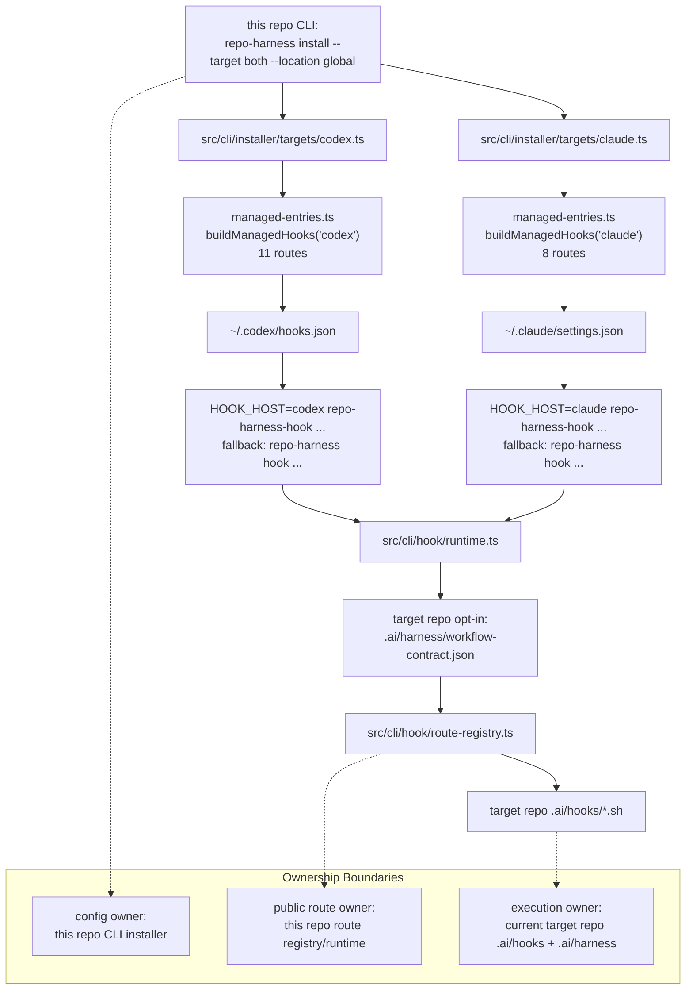

# Architecture Module: runtime-harness/hook-adapters

> **Capability ID**: `runtime-harness-hook-adapters`
> **Matched Prefixes**: `assets/hooks`, `.ai/hooks`, `src/cli/installer`, `src/cli/hook`, `src/cli/hook-entry.ts`, `scripts/run-skill-hook.ts`
> **Local Contracts**: `AGENTS.md`, `CLAUDE.md`

## P1 Map

The hook adapter layer connects agent tool events to the repo-local workflow
contract.

Authoritative split:

- `assets/hooks/`: installable shared hook source.
- `.ai/hooks/`: self-host runtime hook implementation.
- Package helper runtime: generated and downstream repos invoke shared workflow
  helpers through `repo-harness run`; they do not install repo-harness helper
  scripts under repo-local `scripts/` or `.ai/harness/scripts/`. The self-host
  repo keeps source helpers under root `scripts/`.
- `src/cli/installer/targets/*`: user-level adapter writers for `~/.claude/settings.json` and `~/.codex/hooks.json`.
- `src/cli/hook/*`: public route registry and compatibility runtime bridge.
- `src/cli/hook-entry.ts`: minimal hook-only entrypoint that checks repo opt-in and dispatches ordered `.ai/hooks/*` scripts without loading the full CLI.
- `src/cli/commands/security.ts`: read-only security scan for user-level hook config and VS Code folder-open task injection surfaces.
- Repo-local `.claude/settings.json` and `.codex/hooks.json`: retired legacy project-level adapters cleaned by migration.
- Repo-local `.codex/*`: ignored Codex runtime residue.
- `.ai/harness/delegation/`: ignored per-turn delegation state used by Codex
  delegation hooks.
- Codex Settings trust state: user-controlled runtime approval required before Codex executes `~/.codex/hooks.json`.
- `scripts/run-skill-hook.ts`: skill lifecycle hook runner for pre/post migration events.

Runtime state is stored under ignored `.ai/harness/*` paths and `.claude` runtime
files. It is not a product deliverable.

## P2 Trace

Concrete route: Claude or Codex `PreToolUse` for edit/write -> host adapter
runs `repo-harness-hook` from user-level config -> hook entry checks the current repo's
`.ai/harness/workflow-contract.json` opt-in marker -> route registry selects
the ordered scripts -> invokes `worktree-guard.sh` and `pre-edit-guard.sh`
-> guards inspect policy, active plan state, protected paths, and task workflow
expectations -> warning or block is returned to the agent.
After adapter configuration, Codex still requires the user to trust
`~/.codex/hooks.json` in Codex Settings before that route executes.

Subagent return route: Claude `PreToolUse` for `Task|Agent|SendUserMessage`
uses the `subagent` route and runs `subagent-return-channel-guard.sh`. For
spawns, the guard appends a return-channel contract to the prompt through
`updatedInput`. For spawned subagent `SendUserMessage` calls, the guard denies
delivery because subagent final text is the only payload returned to the caller.
Missing copies of this route are soft-skipped so older repo-pinned hook runtimes
do not break subagent creation before a hook refresh.

Codex delegation route: `UserPromptSubmit.delegation` runs
`codex-delegation-advisor.sh`. It does not infer delegation from prompt length.
It reacts to explicit `/delegate`, `/parallel`, imperative subagent,
multi-agent, or parallel-investigation language, excluding mechanism/design
questions that only mention `spawn subagent(s)`. When no explicit trigger is
present, `delegation.mode=auto` in global `~/.repo-harness/config.json` or repo
policy is treated as standing permission only; the global value wins when it is
exactly `auto` or `explicit`. Auto mode emits contract-bound context only when
the active plan and matching Active/Ready/Executing contract both exist and
`repo-harness-hook prompt-route` resolves the current prompt to execute or
verify. Explicit delegation without that state emits permission-only context.
The script writes scoped runtime state under `.ai/harness/delegation/` with
`latest.json` as the current pointer and emits
`hookSpecificOutput.additionalContext`; `runtime.ts` supplies the canonical
prompt-route entrypoint and forwards stdout only for this route and only when
the JSON is valid for `UserPromptSubmit`.

Codex subagent lifecycle routes: `SubagentStart.context` runs
`subagent-start-context.sh` after a subagent exists, marks explicit delegation
state as spawned, and injects role/evidence/final-response requirements.
`SubagentStop.quality` runs `subagent-stop-quality.sh` and forwards valid
decision JSON only when the final report is clearly incomplete, with one retry
keyed by session/run identity, subagent identity, and message hash.
`Stop.default` runs `stop-orchestrator.sh` and refreshes handoff state. Lite
terminates after that compact recovery write; Standard/Strict may additionally
run review freshness, plan completeness, and delegation fallback. Codex
suppresses Stop decision JSON because current Codex Desktop rejects that
turn-finalization stdout as an unsupported content type; Claude can still
consume the direct `stop-orchestrator.sh` decision JSON path. These Codex
delegation routes are host-scoped in `route-registry.ts` and are not installed
into Claude adapters.

Post-edit route: edit/write -> `post-edit-guard.sh` -> architecture-sensitive
paths call `architecture-queue.sh` -> capability resolver binds the changed file
to a capability -> pending request is written under `docs/architecture/requests`
and an event is appended under `.ai/harness/architecture/events.jsonl`.

Session-start security route: `SessionStart.default` runs
`session-start-context.sh` and then `security-sentinel.sh` under the same
adapter entry. The runtime aggregates SessionStart stdout from ordered scripts
into one `additionalContext` JSON payload, so adding the sentinel does not
create a new Codex trust entry or emit invalid multiple JSON documents.

Error paths:

- Hook input parsing falls back across stdin JSON, env, and argv compatibility.
- Worktree guard warns by default and blocks only when marker policy is enabled.
- Runtime write failures should produce structured warnings or failure logs without corrupting the repo contract.

## 2026-07-14 Review Subject and Acceptance Authority Cutover

- `src/cli/hook/diff-fingerprint.ts` now builds review subject schema v2 from
  normalized final path/content/mode/deletion state. Target revision is
  provenance metadata; only target movement overlapping reviewed paths forces
  re-acceptance.
- Review Rubric v2 is the sole active schema. Both the top review metadata and
  canonical `## External Acceptance Advice` bind the current
  `Reviewed Subject SHA256`, normalized-final-content scope, target revision,
  and current benchmark evidence SHA-256.
- Human Review Card remains the reviewer-facing summary but has no external
  acceptance semantics. Missing, malformed, stale, non-pass, or noncanonical
  acceptance fails closed; there is no manual-override or legacy rubric path.
- At 10x review volume the first failure would be churn from unrelated target
  ancestry. Content subjects preserve real-change invalidation without that
  false-stale cost.

## Semantic Diagram

### Complete Hook Workflow

```mermaid
flowchart TD
  subgraph Install["Adapter Install / Migration"]
    Init["repo-harness init/install"] --> Targets["installer targets: codex.ts / claude.ts"]
    Targets --> Managed["managed-entries.ts: buildManagedHooks()"]
    Managed --> Registry["route-registry.ts: ROUTES"]
    Managed --> CodexCfg["~/.codex/hooks.json user-level"]
    Managed --> ClaudeCfg["~/.claude/settings.json or .claude/settings.json"]
    CodexCfg --> Trust["Codex Settings trust hash"]
  end

  subgraph Host["Host Event"]
    ClaudeCfg --> Event["Claude/Codex hook event"]
    Trust --> Event
    Event --> Match{"event + matcher"}
    Match --> Cmd["HOOK_HOST=host repo-harness-hook EVENT --route ROUTE_ID<br/>fallback: repo-harness hook"]
  end

  subgraph Dispatch["Runtime Dispatch"]
    Cmd --> Entry{"minimal bin available?"}
    Entry -->|yes| HookEntry["src/cli/hook-entry.ts"]
    Entry -->|fallback| FullCli["src/cli/commands/hook.ts"]
    HookEntry --> Runtime["src/cli/hook/runtime.ts: runHook()"]
    FullCli --> Runtime
    Runtime --> Git{"inside git repo?"}
    Git -->|no| Exit0A["exit 0 silently"]
    Git -->|yes| OptIn{".ai/harness/workflow-contract.json exists?"}
    OptIn -->|no| Exit0B["exit 0 non-opt-in"]
    OptIn -->|yes| Route{"getRoute(event, route)"}
    Route -->|unknown| Exit2["exit 2 unknown route"]
    Route -->|ok| Spawn["spawn bash .ai/hooks/SCRIPT<br/>set HOOK_REPO_ROOT"]
    Spawn --> Quiet{"HOOK_HOST=codex and event != SessionStart?"}
    Quiet -->|Stop success output| StopDecision["suppress stdout/stderr<br/>avoid unsupported content type"]
    Quiet -->|other success stdout| QuietStdout["stdout piped/emptied on success<br/>failure stdout moved to stderr"]
    Quiet -->|no| Inherit["stdio inherited"]
  end

  subgraph Routes["Public Route Registry"]
    Route --> SS["SessionStart.default"]
    SS --> SSC["session-start-context.sh"]
    SSC --> SecuritySentinel["security-sentinel.sh<br/>changed-only config scan"]

    Route --> PreEdit["PreToolUse.edit<br/>matcher: Edit|Write"]
    PreEdit --> Worktree["worktree-guard.sh"]
    Worktree --> PreGuard["pre-edit-guard.sh"]

    Route --> PreSubagent["PreToolUse.subagent<br/>matcher: Task|Agent|SendUserMessage"]
    PreSubagent --> SubagentGuard["subagent-return-channel-guard.sh<br/>final-text return-channel guard"]

    Route --> PostEdit["PostToolUse.edit<br/>matcher: Edit|Write"]
    PostEdit --> PostGuard["post-edit-guard.sh"]

    Route --> PostBashRoute["PostToolUse.bash<br/>matcher: Bash"]
    PostBashRoute --> PostBash["post-bash.sh"]

    Route --> Always["PostToolUse.always<br/>all tools"]
    Always --> Observer["post-tool-observer.sh<br/>trace + lightweight advisories"]

    Route --> Prompt["UserPromptSubmit.default"]
    Prompt --> PromptGuard["prompt-guard.sh"]
    Route --> Delegation["UserPromptSubmit.delegation"]
    Delegation --> DelegationAdvisor["codex-delegation-advisor.sh<br/>explicit or auto bounded spawn contract"]

    Route --> SubagentStart["SubagentStart.context"]
    SubagentStart --> SubagentContext["subagent-start-context.sh<br/>role + evidence requirements"]

    Route --> SubagentStop["SubagentStop.quality"]
    SubagentStop --> SubagentQuality["subagent-stop-quality.sh<br/>one-shot quality continuation"]

    Route --> Stop["Stop.default"]
    Stop --> StopOrchestrator["stop-orchestrator.sh"]
  end

  subgraph Shared["Shared Hook Libraries"]
    Input["hook-input.sh<br/>stdin/env/argv parser"]
    Workflow["lib/workflow-state.sh<br/>active plan, pending plan, todo, contract, handoff, events"]
    Session["lib/session-state.sh<br/>session keys and route state"]
  end

  SSC -. uses .-> Input
  SSC -. uses .-> Workflow
  PreGuard -. uses .-> Input
  PreGuard -. uses .-> Workflow
  SubagentGuard -. uses .-> Input
  PostGuard -. uses .-> Input
  PostGuard -. uses .-> Workflow
  PostBash -. uses .-> Input
  PostBash -. uses .-> Workflow
  Observer -. uses .-> Input
  Observer -. uses .-> Session
  Observer -. uses .-> Workflow
  PromptGuard -. uses .-> Input
  PromptGuard -. uses .-> Workflow
  DelegationAdvisor -. uses .-> Input
  StopOrchestrator -. uses .-> Input
  StopOrchestrator -. uses .-> Workflow

  subgraph Effects["Side Effects / Outputs"]
    SSC --> AddCtx["SessionStart additionalContext JSON"]
    SecuritySentinel --> SecurityCtx["security scan -> .ai/harness/security/latest.json<br/>optional SessionStart reminder"]
    PreGuard --> Block["guards: _ref, _ops, deploy, scope, plan transition, test/spec-first"]
    SubagentGuard --> ReturnChannel["Task/Agent prompt contract<br/>subagent SendUserMessage deny"]
    PostGuard --> Verify["verify-contract --quiet -> .ai/harness/checks/latest.json"]
    PostGuard --> Drift["architecture-queue.sh -> docs/architecture/requests + events.jsonl"]
    Drift --> ContextSync["context-contract-sync or capability-context request"]
    PostGuard --> Handoff[".claude/.task-handoff.md + .ai/harness/handoff/current.md"]
    PostBash --> Checks["Bash result/check evidence"]
    Observer --> TraceLog[".claude/.trace.jsonl"]
    PromptGuard --> PlanGate["plan start/capture/execution/done/archive gates"]
    PromptGuard --> Hints["Waza / CodeGraph / CrossReview / TDD / BDD hints"]
    DelegationAdvisor --> DelegationState[".ai/harness/delegation/<br/>scoped delegation turn state"]
    DelegationAdvisor --> DelegationCtx["UserPromptSubmit additionalContext<br/>bounded spawn_agent rules"]
    SubagentContext --> SpawnedState["mark spawned=true"]
    SubagentContext --> SubagentCtx["SubagentStart additionalContext"]
    SubagentQuality --> QualityBlock["SubagentStop decision block when report is incomplete"]
    StopOrchestrator --> StopHandoff["workflow_write_handoff(session-stop)"]
    StopOrchestrator --> Completeness["one-shot pending plan completeness guard state"]
    StopOrchestrator --> DelegationFallback["one-shot missed-delegation guard state"]
  end

  subgraph Compat["Legacy / Template Compatibility"]
    Templates["assets/hooks/*.template.json"] --> RunHook[".ai/hooks/run-hook.sh"]
    RunHook --> Spawn
  end
```

### User-Level Adapter Ownership

The adapter fallback is presence-based, not exit-code-based. If
`repo-harness-hook` exists, the adapter `exec`s it and preserves its final exit
status; it falls back to the full CLI only when the hook-only binary is absent.
The hook entrypoint captures the host payload once and replays the identical
bytes to every script in a multi-script route. Without both rules, the first
script can consume stdin and a later guard can see an empty payload, or a
blocking hook can accidentally fall through into a second invocation and allow
the action.

## P3 Decision

The shared `.ai/hooks` layer exists to avoid maintaining separate Claude and
Codex hook implementations. The invariant is single implementation, adapter-only
host config. The adapter now lives at user level so new repos only opt in by
carrying repo-local workflow contract files and hook implementation.

At 10x hook events, the first failure is cold-loading the full CLI on every
hook event. The invariant is that host adapters point at the minimal
hook-only entrypoint and then `.ai/hooks`, instead of creating separate
per-host implementation trees or loading non-hook command modules.

## 2026-06-12 Architecture Queue Closeout

- Post-edit architecture drift recording now runs through
  `scripts/architecture-queue.sh record`; `.ai/hooks/post-edit-guard.sh` and
  `assets/hooks/post-edit-guard.sh` preserve the existing
  `[ArchitectureDrift] Request:` stdout prefix so context sync and capability
  context queuing remain advisory hook side effects.
- The queue writes one pending card per capability and relies on
  `scripts/architecture-event.ts` for card rendering and derived index
  rewriting, removing the previous append-to-index state machine from the hook
  hot path.
- PostToolUse remains warning-only: hard blocking belongs to explicit checks and
  finish gates, not to edit-time hook execution.

## 2026-06-13 Runtime Isolation Closeout

- The PRD/Sprint catalog split does not add a hook adapter route. SessionStart
  may project the active Sprint pointer from `plans/sprints/*.sprint.md`, but
  Sprint expansion and plan capture remain workflow-helper behavior.
- Generated and downstream repos invoke repo-harness workflow helpers through
  the package/global runtime (`repo-harness run ...`) and do not install helper
  copies under `.ai/harness/scripts/` or root `scripts/`. Hook route scripts
  remain under `.ai/hooks/`.
- The self-host source repo keeps root `scripts/` as the product source for
  helper implementations. Migration cleanup preserves those source helpers and
  only removes downstream root helpers when repo-harness ownership is
  identifiable.
- The pending request for `.ai/hooks/post-tool-observer.sh` did not correspond
  to an open route or observer implementation diff in this closeout. No new
  hook adapter entrypoint, dependency boundary, or runtime route was introduced.

## 2026-07-06 Codex Delegation Auto Mode Closeout

- `codex-delegation-advisor.sh` now consumes the install-time
  `delegation.mode` choice. Global `~/.repo-harness/config.json` wins over repo
  policy when it is exactly `auto` or `explicit`; malformed or missing global
  values are ignored rather than repaired locally.
- Auto mode injects the same bounded delegation contract without explicit
  trigger words, records `explicit=false`, `mode=auto`, `trigger=auto-mode`,
  and disables `stop_fallback`. Explicit trigger words keep the prior
  `explicit=true` and `stop_fallback=true` behavior.
- This changes route semantics only. It does not add a hook route, host adapter,
  dependency, persistence location, or new runtime boundary, so no architecture
  snapshot or rendered diagram is required.

## 2026-07-14 Codex Auto Delegation Boundary Correction

- Auto mode remains standing permission to delegate, but no longer emits the
  full contract packet for every prompt. A valid active plan/contract and the
  existing deterministic execute/verify prompt route are now required.
- Explicit delegation without a contract remains available through a
  permission-only packet scoped to the current user prompt. It cannot claim
  contract authority or inject the contract execution boundary.
- The route registry, host coverage, persistence path, and Claude adapter are
  unchanged. `runtime.ts` only exposes the already-existing canonical
  `prompt-route` entrypoint to the hook child, so no second classifier or new
  dependency was introduced.

## 2026-07-13 Threshold Input Hardening (Phase C)

- **Capability registry resolution (C1).** `capabilityIdsForPaths` in
  `src/cli/hook/state-snapshot.ts` returns a structured
  `{ ids, registryStatus, unmappedPaths }` instead of silently collapsing
  every failure mode to an empty array. `registryStatus: 'invalid'` (corrupt
  JSON, a non-array `capabilities` field, or a registry the repo declared via
  `.ai/harness/policy.json`'s `.context.capability_registry_file` but whose
  file is missing) fails closed with a `capability_registry:invalid` blocker
  in `EffectiveState.blockers` -- repair by rerunning
  `repo-harness run check-task-workflow` (which scaffolds a missing registry
  file) or hand-fixing corrupt JSON at `.ai/context/capabilities.json`.
  `registryStatus: 'absent'` (a repo that never declared the registry)
  preserves today's no-signal behavior, with an explicit
  `capability:registry:absent` reason recorded in `profile_reasons`. Unmapped
  implementation paths never silently drop out of the cross-capability
  signal: they count as one additional capability bucket
  (`capability:unmapped:<n>` reason), so an unmapped path can only raise,
  never lower, the resolved floor.
- **Implementation-surface predicate unification (C2).**
  `isImplementationSurfacePath()` / `isWorkflowSurfacePath()` in
  `src/cli/hook/diff-fingerprint.ts` is now the single source for "what
  counts toward medium-scope, cross-capability, and strict-token signals" --
  workflow-surface paths (`plans/`, `tasks/`, `docs/`, `.ai/`, `.claude/`,
  `.codex/`, and any `*.md` / `*.markdown` file) are excluded from the
  `targetPaths`, `capabilityIds`, and `capabilityCount` that
  `resolveEffectiveStateUnlocked` passes into `resolveWorkflowProfile`.
  Before this fix, a docs-only session could internally resolve `standard`
  (or trip cross-capability) purely from plan/task/doc paths, even though
  `pre-edit-guard.sh`'s own `is_workflow_surface_path` gate already exempted
  those same paths from the plan/strict enforcement gates -- harmless while
  gates were the only consumer of the resolved profile, but wrong once the
  2026-07-13 ceremony-guidance change (`CEREMONY_GUIDANCE` in
  `state-snapshot.ts`) started keying ceremony text off that profile. Strict
  path-token categories (auth/payment/deploy/migration/schema/release/
  public-api) are unaffected: those categories are always implementation
  paths in practice, so the exclusion never suppresses a real strict signal
  (locked by `tests/harness-runtime-profiles.test.ts`). The shell's
  `is_workflow_surface_path()` case list in `assets/hooks/pre-edit-guard.sh`
  remains a hand-authored projection of the same TS source;
  `scripts/sync-hook-sources.ts` (`bun run check:hooks`) now fails closed on
  drift between the two case lists instead of letting them diverge silently.
- **Standard gate semantics (C3, decision record).**
  `.guards.edit_plan_gate` (`enforce | advice | off`, default `enforce`,
  read by `pre-edit-guard.sh`'s `edit_plan_gate_mode()`) is a
  **gate-response-mode knob only**. It controls whether `run_edit_plan_gate`
  blocks (`enforce`), warns (`advice`), or no-ops (`off`) when an
  implementation edit lacks `docs/spec.md` or an active/approved plan. It
  does **not** touch how the risk floor itself is computed:
  `resolveWorkflowProfile()` in `src/cli/hook/workflow-profile.ts` takes no
  policy input and cannot be configured to raise or lower a floor -- the
  product distinction is "computed standard" (the deterministic floor
  `resolveWorkflowProfile` derives from target-path, capability, and
  operation-kind signals) versus "enforced standard" (whether the plan gate
  actually blocks an edit at that floor); policy changes only the latter.
  The Strict contract/worktree guard (`pre-edit-guard.sh`'s
  `StrictContractGuard` / `StrictWorktreeGuard` block, immediately after
  `run_edit_plan_gate` returns) is independent of `.guards.edit_plan_gate`
  entirely: its condition checks `$WORKFLOW_PROFILE == "strict"` directly and
  never calls `edit_plan_gate_mode` or reads that policy key, so it cannot be
  relaxed by the gate-response knob.

## 2026-07-14 Delegation Fork Isolation Closeout

- `codex-delegation-advisor.sh` adds one dispatch rule to the bounded
  delegation contract: every `spawn_agent` call that selects an `agent_type`
  must pass `fork_turns="none"`. The Codex default is `fork_turns="all"`,
  which copies the full parent conversation into the child — verified
  empirically on codex-cli 0.144.1 (two default-parameter spawns reproduced
  parent-only secret tokens in the child; the binary's `spawn_agent` tool
  description states the `all` default). A named-role child must work from
  its self-contained packet and the contract brief, both for cross-model
  context isolation and to stop paying the full parent history on every
  spawn.
- Fork control is a per-spawn tool argument only; no `config.toml` key can
  pin it globally, so this advisory dispatch contract is the enforcement
  surface.
- This changes route advisory text only. It does not add a hook route, host
  adapter, dependency, persistence location, or new runtime boundary, so no
  architecture snapshot or rendered diagram is required.

## Optimization Backlog

- Keep `repo-harness init` and migration from regenerating repo-local `.claude/settings.json` / `.codex/hooks.json` adapters.
- Remind users to trust `~/.codex/hooks.json` in Codex Settings after user-level adapter installation.
- Keep hook asset parity test coverage whenever `.ai/hooks` or `assets/hooks` changes.
