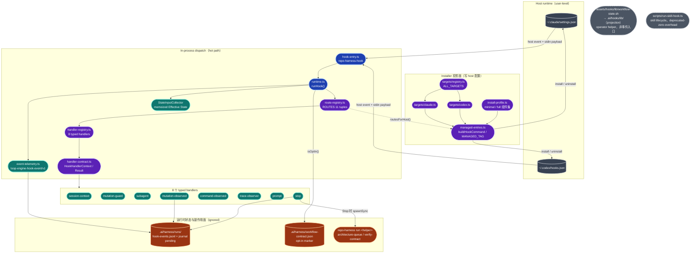
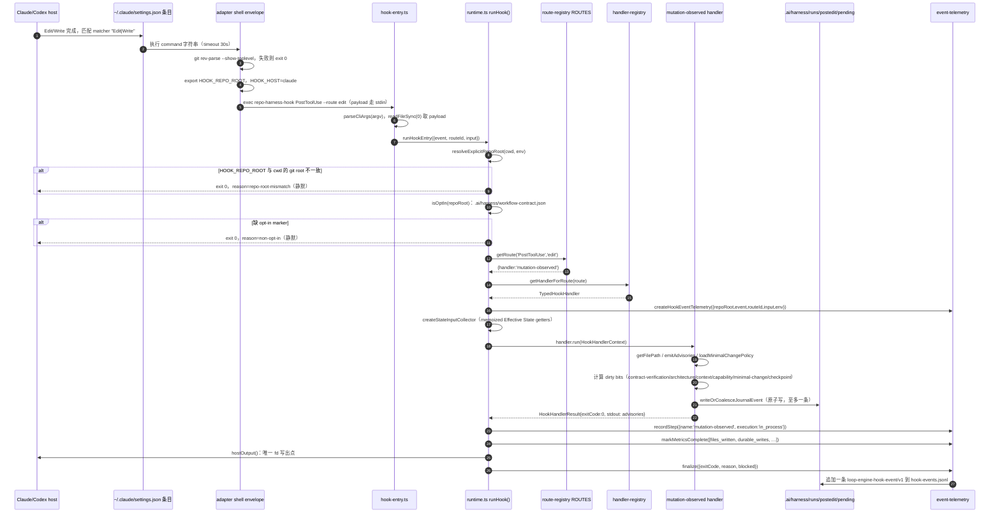
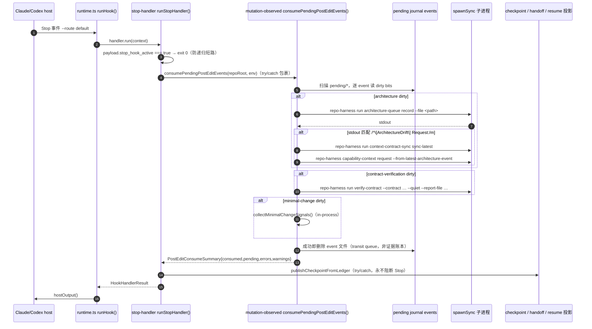

# runtime-harness/hook-adapters 架构文档

<!-- BEGIN archctx:intro -->

> 状态：基于 `main` 工作树的 by-capability 架构复核稿。
> Verified against: main@13686d8d（2026-08-08）
> Capability ID: `runtime-harness-hook-adapters`
> Matched Prefixes: `assets/hooks`、`.ai/hooks`、`scripts/run-skill-hook.ts`、`src/cli/installer`、`src/cli/hook`、`src/cli/hook-entry.ts`
> Local Contracts: `assets/hooks/AGENTS.md`、`assets/hooks/CLAUDE.md`（capabilities.json `contract_files`）
> Workstream: `tasks/workstreams/runtime-harness/hook-adapters/`
> 事实优先级：实际源码（`src/cli/hook/**`、`src/cli/installer/**`）> 本文 > 上层 `docs/architecture/index.md` 叙述 > 历史 plan/notes。本文只画**已实现、已接线**的现状；任何尚未接线的部分必须显式标注为**目标设计**，未标注即代表当前源码可复核。

<!-- END archctx:intro -->

## 0. 阅读约定

| 标记 | 含义 |
| --- | --- |
| **已实现、已接线** | 当前源码存在，且位于真实的 host-event dispatch runtime path |
| **已实现、隔离** | 当前源码存在，但不在 host-event dispatch path 上（只被 CLI/installer/测试消费） |
| **已实现、保留字段** | 类型/协议字段已存在，但当前没有生产消费者 |
| **目标设计** | 只存在于计划或提案，尚未落到源码 |
| **已退役** | 源码已删除，只在本文历史章节留档 |

本 capability 的唯一权威链是：

```
host adapter entry → repo-harness-hook → runtime.ts → ROUTES → handler-registry → 一个 typed handler
```

`ROUTES`（`src/cli/hook/route-registry.ts:66`）是 `(event, routeId, matcher)` 公开契约；每条 route 恰好绑定一个 `handler`，没有 `scripts` 数组。adapter 里的 shell 命令只是调用信封，不承载任何 hook 逻辑。

<!-- BEGIN archctx:p1 -->

## 1. P1：能力架构地图

### 1.1 模块与真实运行时边界


```mermaid
flowchart TB
  classDef host fill:#374151,stroke:#d1d5db,stroke-width:2px,color:#fff
  classDef entry fill:#1e40af,stroke:#bfdbfe,stroke-width:2px,color:#fff
  classDef contract fill:#5b21b6,stroke:#ddd6fe,stroke-width:2px,color:#fff
  classDef handler fill:#0f766e,stroke:#99f6e4,stroke-width:2px,color:#fff
  classDef store fill:#9a3412,stroke:#fed7aa,stroke-width:2px,color:#fff
  classDef isolated fill:#4b5563,stroke:#d1d5db,stroke-width:2px,color:#fff

  subgraph Host["Host runtime（user-level）"]
    direction TB
    ClaudeCfg[("~/.claude/settings.json")]:::host
    CodexCfg[("~/.codex/hooks.json")]:::host
  end

  subgraph Install["Installer 投影面（写 host 配置）"]
    direction TB
    Registry(["targets/registry.ts<br/>ALL_TARGETS"]):::contract
    ClaudeT(["targets/claude.ts"]):::contract
    CodexT(["targets/codex.ts"]):::contract
    Managed(["managed-entries.ts<br/>buildHookCommand / MANAGED_TAG"]):::contract
    Profile(["install-profile.ts<br/>minimal / full 组件集"]):::contract
    Registry --> ClaudeT
    Registry --> CodexT
    ClaudeT --> Managed
    CodexT --> Managed
    Profile --> Managed
  end

  subgraph Dispatch["In-process dispatch（hot path）"]
    direction TB
    Entry(["hook-entry.ts<br/>repo-harness-hook"]):::entry
    Runtime(["runtime.ts<br/>runHook()"]):::entry
    Routes(["route-registry.ts<br/>ROUTES 11 tuples"]):::contract
    Bind(["handler-registry.ts<br/>8 typed handlers"]):::contract
    Contract(["handler-contract.ts<br/>HookHandlerContext / Result"]):::contract
    Collector(["StateInputCollector<br/>memoized Effective State"]):::handler
    Telemetry(["event-telemetry.ts<br/>loop-engine-hook-event/v1"]):::handler
    Entry --> Runtime
    Runtime --> Routes
    Routes --> Bind
    Bind --> Contract
    Runtime --> Collector
    Runtime --> Telemetry
  end

  subgraph Handlers["8 个 typed handlers"]
    direction TB
    H1(["session-context"]):::handler
    H2(["mutation-guard"]):::handler
    H3(["subagent"]):::handler
    H4(["mutation-observed"]):::handler
    H5(["command-observed"]):::handler
    H6(["trace-observer"]):::handler
    H7(["prompt"]):::handler
    H8(["stop"]):::handler
  end

  subgraph State["运行时状态与副作用面（ignored）"]
    direction TB
    Runs[(".ai/harness/runs/<br/>hook-events.jsonl + journal pending")]:::store
    OptIn[(".ai/harness/workflow-contract.json<br/>opt-in marker")]:::store
    Helper(["repo-harness run &lt;helper&gt;<br/>architecture-queue / verify-contract"]):::store
  end

  ShLib(["assets/hooks/lib/workflow-state.sh<br/>→ .ai/hooks/lib/（projection）<br/>operator helper，非事件入口"]):::isolated
  SkillHook(["scripts/run-skill-hook.ts<br/>skill lifecycle，deprecated-zero-overhead"]):::isolated

  Managed -->|"install / uninstall"| ClaudeCfg
  Managed -->|"install / uninstall"| CodexCfg
  ClaudeCfg -->|"host event + stdin payload"| Entry
  CodexCfg -->|"host event + stdin payload"| Entry
  Routes -.->|"routesForHost()"| Managed
  Contract --> Handlers
  Runtime -->|"isOptIn()"| OptIn
  Telemetry --> Runs
  H4 --> Runs
  H8 --> Runs
  H8 -->|"Stop 时 spawnSync"| Helper

  style ShLib stroke-dasharray:5 5
  style SkillHook stroke-dasharray:5 5
```

两个虚线节点是本 capability 内**不在 host-event dispatch path 上**的表面：

- `assets/hooks/lib/workflow-state.sh`（1884 行）已从事件入口降级为 operator/workflow-state helper 库，通过 `assets/hooks/projection.json` 投影到 `.ai/hooks/`；两份内容当前 byte-identical（`cmp` 验证通过）。
- `scripts/run-skill-hook.ts` 驱动的是 `assets/skill-hooks.json` 的 init/assemble/migrate 生命周期钩子，与 Claude/Codex host event 无关。该配置自带 `"status": "deprecated-zero-overhead"`，7 个事件的 `scripts` 数组全部为空。

### 1.2 模块职责表

| 文件 | 主要 exports / 职责 | 状态 |
| --- | --- | --- |
| `src/cli/hook/route-registry.ts:66` | `ROUTES` —— 11 条冻结的 `(event, routeId, matcher, hosts?, handler)` 元组；`getRoute`、`routesForHost`、`routeSupportsHost`、`allEvents`。顺序即 adapter 写入顺序（Codex 按 `(path, event, i, j)` 哈希，重排会重新触发信任提示，见文件头注释 `:14`） | 已实现、已接线 |
| `src/cli/hook/handler-registry.ts:16` | `handlers` 冻结表，把 8 个 `HookHandlerId` 绑到实现函数；`getHandlerForRoute`、`handlerIdForRoute`、`listHandlerBindings` | 已实现、已接线 |
| `src/cli/hook/handler-contract.ts:25` | `HookHandlerContext`（event/routeId/repoRoot/input/env/now/collector/dependencies/collectSessionStdout）与 `HookHandlerResult`（exitCode/stdout/stderr/reason/sessionContexts）。handler 永不直接写 host fd | 已实现、已接线 |
| `src/cli/hook/runtime.ts:343` | `runHook()` —— repo 解析、opt-in 判定、route 查表、handler 调用、异常兜底、telemetry finalize；`hostOutput()`（`:88`）是唯一的 fd 写出点；`resolveRepoRoot`、`isOptIn`、`resolveSessionEffectiveState` | 已实现、已接线 |
| `src/cli/hook-entry.ts:18` | `runHookEntry()`，`commandName: 'repo-harness-hook'`。`import.meta.main` 分支同时承载 6 个非路由子命令（`minimal-change`、`review-rubric`、`review-subject`、`prompt-guard-decide`、`prompt-route`、`circuit-breaker-record`、`state-snapshot`）与 detached tooling populate 的 bundled 接收面（`:109`） | 已实现、已接线 |
| `src/cli/hook/event-telemetry.ts:13` | `HOOK_EVENT_TELEMETRY_PROTOCOL = 'loop-engine-hook-event/v1'`、`HOOK_EVENT_TELEMETRY_PATH = '.ai/harness/runs/hook-events.jsonl'`、10 项 metric、`ALWAYS_COMPLETE` 三项（`runtime_entries`/`child_processes`/`elapsed_ms`） | 已实现、已接线 |
| `src/cli/hook/session-context.ts`（64.6 KB，最大文件） | `buildSessionStartSections`、`ensureSessionRunIdentity`、`runDetachedToolingPopulate`、`architectureQueuePendingContext`（`:719`） | 已实现、已接线 |
| `src/cli/hook/mutation-guard.ts`（44.6 KB） | `runMutationGuard` —— `PreToolUse.edit` 的唯一阻断权威 | 已实现、已接线 |
| `src/cli/hook/mutation-observed.ts:79` | `runMutationObserved` 只写**至多一条** journal event；`consumePendingPostEditEvents`（`:853`）在 Stop 时重放外部命令；`processArchitectureCascade`（`:783`）、`processContractVerification`（`:793`）、`runRepoHarnessHelper`（`:741`）均为 Stop 时的 `spawnSync` | 已实现、已接线 |
| `src/cli/hook/prompt-handler.ts`（42.6 KB）+ `prompt-intents.ts`（27.6 KB） | `runPromptHandler` 与意图识别集合（`bdd_feature_advice` / `ux_feature_guard_advice` 等） | 已实现、已接线 |
| `src/cli/hook/subagent-handler.ts`（35.4 KB） | `runSubagentHandler`，被 4 条 route 复用（`PreToolUse.subagent` + 3 条 Codex-only） | 已实现、已接线 |
| `src/cli/hook/stop-handler.ts:466` | `runStopHandler` —— `stop_hook_active` 递归短路（`:472`）、`consumePendingPostEditEvents`（`:488`）、`publishCheckpointFromLedger`、handoff/resume/run-summary 投影 | 已实现、已接线 |
| `src/cli/hook/command-observed.ts`、`trace-observer.ts` | 两个 PostToolUse 观测器；均返回 host output 而不自己写 fd | 已实现、已接线 |
| `src/cli/hook/circuit-breaker.ts`、`hook-input.ts`、`run-identity.ts`、`session-context-budget.ts`、`prompt-router.ts`、`prompt-guard-decision.ts`、`minimal-change-*.ts`、`review-*.ts`、`state-snapshot.ts`、`legacy-active-plan-migration.ts` | handler 的支撑层：payload 解析、run identity、context 预算、断路器、minimal-change 策略与信号 | 已实现、已接线（部分仅由 `hook-entry.ts` 子命令消费） |
| `src/cli/installer/managed-entries.ts:41` | `buildHookCommand()` —— adapter 命令模板；`MANAGED_TAG = 'repo-harness-managed-hook-v1'`；`buildManagedHooks`、`stripManagedEntries`、`mergeHooks`、`isManagedEntry`；`routeInProfile`（`:58`）定义 minimal profile 的 7 条 route 白名单 | 已实现、已接线 |
| `src/cli/installer/targets/codex.ts:49` | `~/.codex/hooks.json`；`supportsLocation('local') === false`（Codex 无 project-local hook 概念）；另写 `~/.codex/config.toml` 的 `default_mode_request_user_input` | 已实现、已接线 |
| `src/cli/installer/targets/claude.ts:48` | `~/.claude/settings.json`（global）或 `<cwd>/.claude/settings.json`（local）；`supportsLocation` 恒返回 `true`（`:67`） | 已实现、已接线（见 §3.4 冲突项） |
| `src/cli/installer/targets/registry.ts:17` | `ALL_TARGETS = [codexTarget, claudeTarget]`，顺序即 `--target=all` 展示顺序 | 已实现、已接线 |
| `src/cli/installer/install-profile.ts`（1170 行） | `INSTALL_PROFILES = ['minimal','full']`、`LEGACY_INSTALL_PROFILES`、`InstalledProfileState`（protocol 2）、skill-surface manifest 校验（fail-closed，`:56`） | 已实现、已接线 |
| `src/cli/installer/shared.ts`、`types.ts` | `atomicWriteFileSync`、`formatJson`、`readJsonOrEmpty`、`deepEqual`；`AgentTarget` 接口与 `Location = 'global' \| 'local'` | 已实现、已接线 |
| `assets/hooks/lib/workflow-state.sh`（1884 行） | `workflow_policy_get`、`workflow_plan_status_projection` 等 workflow-state helper；读 `.ai/harness/policy.json`，依赖 `jq` | 已实现、隔离（非事件入口） |
| `assets/hooks/projection.json` + `.ai/hooks/.projection.json` | 投影清单与 digest（`sha256:cbd48ce7…`，`file_count: 3`） | 已实现、已接线（投影校验） |
| `scripts/run-skill-hook.ts` | `loadHookConfig`、`runHooks`；消费者只有 `scripts/assemble-template.ts:12` 与 `scripts/init-project.sh:456` | 已实现、隔离（`deprecated-zero-overhead`） |

### 1.3 规模信号

实测于 main@13686d8d：

| 面 | 生产文件数 | LOC | 设计压力 |
| --- | ---: | ---: | --- |
| `src/cli/hook/**` + `src/cli/hook-entry.ts` | 30 | 10,896 | dispatch 热路径；`session-context.ts` / `mutation-guard.ts` / `prompt-handler.ts` 三个巨型 handler 占据一半以上体量 |
| `src/cli/installer/**` | 7 | 1,739 | `install-profile.ts` 单文件 1,170 行，集中持有 profile/组件/事务状态 |
| capability 合计（TS 生产） | **37** | **12,635** | —— |
| `assets/hooks` + `.ai/hooks` | 8 | 4,105 | 其中 3,768 行是两份 byte-identical 的 `workflow-state.sh` |
| `scripts/run-skill-hook.ts` | 1 | 244 | 隔离面 |
| 相关测试文件（`tests/` 内命中 hook/route/prompt/subagent/mutation/stop/trace/session-context/installer 关键词） | 21 | —— | 契约覆盖集中在 `hook-contracts.test.ts` / `hook-runtime.test.ts` / `hook-protocol.test.ts` |

复算命令（口径：排除 `*.test.ts`；`hook-entry.ts` 单独追加）：

```bash
find src/cli/hook src/cli/installer -type f -name '*.ts' ! -name '*.test.ts' -print > /tmp/p.txt
echo src/cli/hook-entry.ts >> /tmp/p.txt
wc -l < /tmp/p.txt                 # 文件数 37
xargs wc -l < /tmp/p.txt | tail -1 # 合计 LOC 12,635

find assets/hooks .ai/hooks -type f -print0 | xargs -0 wc -l | tail -1  # 4,105
ls tests/ | grep -icE 'hook|route|prompt|subagent|mutation|stop|trace|session-context|installer'
```

### 1.4 依赖边界

**允许的出边（当前事实）**

- `src/cli/hook/**` → `src/effects/loop/state-input-collector`、`src/effects/state/resolve-effective-state`、`src/effects/evidence/post-bash-importer`、`src/core/state/*`、`src/core/loop/loop-event-protocol`、`src/core/workflow/profile`。
- `src/cli/installer/managed-entries.ts` → `src/cli/hook/route-registry`（`:18`）与 `src/core/adoption/managed-hook-config`（`:22`）。route registry 是 installer 的输入，方向单一。
- `src/cli/installer/install-profile.ts` → `src/core/skill-surface/catalog`、`profile-components`、`assets/skill-commands/manifest.json`。
- Stop 时的外部进程出边：`repo-harness run architecture-queue|context-contract-sync|verify-contract`、`repo-harness capability-context request`（`mutation-observed.ts:741-789`）。

**允许的入边**

- `src/cli/commands/install.ts:47`、`doctor.ts:231`、`status.ts:150` 消费 `ALL_TARGETS`。
- `src/cli/index.ts` 的 `hook` 子命令与独立 `repo-harness-hook` 二进制都进入 `runHook()`；`buildHookCommand` 的模板优先 `repo-harness-hook`，回落 `repo-harness hook`（`managed-entries.ts:42`）。

**禁止的边**

- `route-registry.ts` 不得反向 import 任何 handler 或 installer 模块（当前零 import，纯类型+常量）。
- handler 不得直接写 `process.stdout` / `process.exit`；fd 归 `runtime.ts:hostOutput`。唯一的受控例外是 `mutation-observed.ts:834` 的 `warnStderr`，因为 Stop 时的 journal 清理发生在 host output 成型之前，注释已就地记录该理由。
- `.ai/hooks/**` 不得成为第二权威：它是 `assets/hooks` 的投影，改动必须回到 canonical root。
- `standard-plan.ts`（`src/core/adoption/`）与 `fs-transaction.ts`（`src/effects/`）**不属于本 capability**（归 `public-surface-adoption`）。它们只在一次性迁移事务中出现，host-event dispatch 全程不查询它们。

<!-- END archctx:p1 -->

<!-- BEGIN archctx:p2 -->

## 2. P2：端到端数据流

### 2.1 主链路：PostToolUse.edit 一次真实握手


```mermaid
sequenceDiagram
  autonumber
  participant Host as Claude/Codex host
  participant Cfg as ~/.claude/settings.json 条目
  participant Sh as adapter shell envelope
  participant Entry as hook-entry.ts
  participant RT as runtime.ts runHook()
  participant Routes as route-registry ROUTES
  participant Bind as handler-registry
  participant H as mutation-observed handler
  participant FS as .ai/harness/runs/postedit/pending
  participant Tel as event-telemetry

  Host->>Cfg: Edit/Write 完成，匹配 matcher "Edit|Write"
  Cfg->>Sh: 执行 command 字符串（timeout 30s）
  Sh->>Sh: git rev-parse --show-toplevel，失败则 exit 0
  Sh->>Sh: export HOOK_REPO_ROOT，HOOK_HOST=claude
  Sh->>Entry: exec repo-harness-hook PostToolUse --route edit（payload 走 stdin）
  Entry->>Entry: parseCliArgs(argv)，readFileSync(0) 取 payload
  Entry->>RT: runHookEntry({event, routeId, input})
  RT->>RT: resolveExplicitRepoRoot(cwd, env)
  alt HOOK_REPO_ROOT 与 cwd 的 git root 不一致
    RT-->>Host: exit 0，reason=repo-root-mismatch（静默）
  end
  RT->>RT: isOptIn(repoRoot)：.ai/harness/workflow-contract.json
  alt 缺 opt-in marker
    RT-->>Host: exit 0，reason=non-opt-in（静默）
  end
  RT->>Routes: getRoute('PostToolUse','edit')
  Routes-->>RT: {handler:'mutation-observed'}
  RT->>Bind: getHandlerForRoute(route)
  Bind-->>RT: TypedHookHandler
  RT->>Tel: createHookEventTelemetry({repoRoot,event,routeId,input,env})
  RT->>RT: createStateInputCollector（memoized Effective State getters）
  RT->>H: handler.run(HookHandlerContext)
  H->>H: getFilePath / emitAdvisories / loadMinimalChangePolicy
  H->>H: 计算 dirty bits（contract-verification/architecture/context/capability/minimal-change/checkpoint）
  H->>FS: writeOrCoalesceJournalEvent（原子写，至多一条）
  H-->>RT: HookHandlerResult{exitCode:0, stdout: advisories}
  RT->>Tel: recordStep({name:'mutation-observed', execution:'in_process'})
  RT->>Tel: markMetricsComplete([files_written, durable_writes, …])
  RT->>Host: hostOutput()：唯一 fd 写出点
  RT->>Tel: finalize({exitCode, reason, blocked})
  Tel->>FS: 追加一条 loop-engine-hook-event/v1 到 hook-events.jsonl
```

关键事实：`PostToolUse.edit` **不**在当轮跑 architecture-queue。HRD-05 之后它只落一条 journal event，重活推迟到 Stop。

### 2.2 延迟副作用链路：Stop 时重放 architecture-queue


```mermaid
sequenceDiagram
  autonumber
  participant Host as Claude/Codex host
  participant RT as runtime.ts runHook()
  participant Stop as stop-handler runStopHandler()
  participant MO as mutation-observed consumePendingPostEditEvents()
  participant Pend as pending journal events
  participant Proc as spawnSync 子进程
  participant Ledger as checkpoint / handoff / resume 投影

  Host->>RT: Stop 事件 --route default
  RT->>Stop: handler.run(context)
  Stop->>Stop: payload.stop_hook_active === true → exit 0（防递归短路）
  Stop->>MO: consumePendingPostEditEvents(repoRoot, env)（try/catch 包裹）
  MO->>Pend: 扫描 pending/*，逐 event 读 dirty bits
  alt architecture dirty
    MO->>Proc: repo-harness run architecture-queue record --file <path>
    Proc-->>MO: stdout
    alt stdout 匹配 /^\[ArchitectureDrift\] Request:/m
      MO->>Proc: repo-harness run context-contract-sync sync-latest
      MO->>Proc: repo-harness capability-context request --from-latest-architecture-event
    end
  end
  alt contract-verification dirty
    MO->>Proc: repo-harness run verify-contract --contract … --quiet --report-file …
  end
  alt minimal-change dirty
    MO->>MO: collectMinimalChangeSignals()（in-process）
  end
  MO->>Pend: 成功即删除 event 文件（transit queue，非证据账本）
  MO-->>Stop: PostEditConsumeSummary{consumed,pending,errors,warnings}
  Stop->>Ledger: publishCheckpointFromLedger（try/catch，永不阻断 Stop）
  Stop-->>RT: HookHandlerResult
  RT->>Host: hostOutput()
```

级联的门控条件是 `architecture-queue.sh record` 自身的实时 stdout，而不是第二套 capability resolver —— 这是 `processArchitectureCascade`（`mutation-observed.ts:783`）刻意保留的单权威约束。

### 2.3 安装侧链路：ROUTES → host 配置

`repo-harness install --target both --location global --profile full` 的路径：

```
install.ts → ALL_TARGETS → target.install(loc, {profile})
  → buildManagedHooks(host, profile)
      → routesForHost(host)            # 过滤 route.hosts
      → routeInProfile(route, profile) # minimal 只留 7 条
      → buildHookEntry(route, host)    # matcher + command + timeout 30
  → stripManagedEntries(existing)      # 按 MANAGED_TAG 只清自己写的
  → mergeHooks(cleaned, managed)
  → 内容相同则 action='unchanged'，否则 atomicWriteFileSync
```

`buildHookCommand`（`managed-entries.ts:42`）生成的单行命令依次做：打 `MANAGED_TAG` 标记 → `git rev-parse` 求 repo root（失败 `exit 0`）→ 导出 `HOOK_REPO_ROOT` → 优先 `exec repo-harness-hook` → 回落 `exec repo-harness hook` → 两者都不在 PATH 时 `exit 0`。

### 2.4 route → handler 映射（源码复核后与 `ROUTES` 一致）

| 公开 tuple | matcher | host 范围 | handler | minimal profile |
| --- | --- | --- | --- | :---: |
| `SessionStart.default` | —— | both | `session-context` | ✅ |
| `PreToolUse.edit` | `Edit\|Write` | both | `mutation-guard` | ✅ |
| `PreToolUse.subagent` | `Task\|Agent\|SendUserMessage` | both | `subagent` | ❌ |
| `PostToolUse.edit` | `Edit\|Write` | both | `mutation-observed` | ✅ |
| `PostToolUse.bash` | `Bash` | both | `command-observed` | ✅ |
| `PostToolUse.always` | —— | both | `trace-observer` | ✅ |
| `UserPromptSubmit.default` | —— | both | `prompt` | ✅ |
| `UserPromptSubmit.delegation` | —— | codex only | `subagent` | ❌ |
| `SubagentStart.context` | —— | codex only | `subagent` | ❌ |
| `SubagentStop.quality` | —— | codex only | `subagent` | ❌ |
| `Stop.default` | —— | both | `stop` | ✅ |

11 条 tuple、8 个 handler ID：`subagent` 被 4 条 route 复用，其余一一对应。

### 2.5 错误路径与 fail-open / fail-closed 分界

**fail-open（静默 advisory，永不打断 host）**

| 触发点 | 行为 |
| --- | --- |
| `command -v repo-harness-hook` 与 `repo-harness` 均缺失（`managed-entries.ts:42`） | shell 层 `exit 0`，host 无感 |
| 不在 git repo（`runtime.ts:350`） | `exit 0`，`reason='not-in-git-repo'` |
| `HOOK_REPO_ROOT` 与 cwd git root 不一致（`runtime.ts:348`） | `exit 0`，`reason='repo-root-mismatch'` |
| 缺 opt-in marker `.ai/harness/workflow-contract.json`（`runtime.ts:351`） | `exit 0`，`reason='non-opt-in'` |
| handler 抛异常（`runtime.ts:418`） | 捕获成 `exitCode:1` + stderr，仍会 finalize telemetry，不 crash host |
| `consumePendingPostEditEvents` / `publishCheckpointFromLedger` 抛错（`stop-handler.ts:488`、`:497`） | try/catch 吞掉，Stop 永不被延迟副作用阻断 |
| `hook-entry.ts:72` 的 `prompt-route` payload 解析失败 | 跳过 advisory routing，注释明确"deterministic edit guards 仍是安全权威" |
| pending journal event 损坏 | 删除该文件 + 一行 stderr 警告，其余 event 继续处理 |

**fail-closed（阻断或显式失败）**

| 触发点 | 行为 |
| --- | --- |
| 未知 route（`runtime.ts:354`） | `exit 2`，`reason='unknown-route'`，stderr 明写 |
| route 无绑定 handler（`runtime.ts:359`） | `exit 2`，`reason='handler-unbound'` |
| `hook-entry.ts:117` argv 缺 event 或 `--route` | `exit 2` + usage |
| `mutation-guard` 判定越权编辑 | `decision: 'block'` 结构化输出，`runtime.ts:436` 记 `blocked: true` |
| Effective State 解析失败（`runtime.ts:264`） | SessionStart 投 `[HarnessStateUnavailable]`，`fail_closed: true`，明写 "Do not infer task, scope, or edit permission." |
| skill-surface catalog 非法（`install-profile.ts:56`） | 抛错，在任何 host 状态被写之前中止 |

**host output 分流**（`runtime.ts:88-141`，唯一 fd 写出点）

- `SessionStart.default` 且 `stdio === undefined`：走 `budgetSessionContext`，输出 `{hookSpecificOutput:{hookEventName:'SessionStart', additionalContext}}`，预算为空则完全静默。
- `HOOK_HOST !== 'codex'`（即 Claude）：stdout/stderr 直通。
- `HOOK_HOST === 'codex'`：只有 4 条 structured route（`PreToolUse.subagent`、`UserPromptSubmit.delegation`、`SubagentStart.context`、`SubagentStop.quality`）且返回合法 decision/additionalContext 时才写 stdout；其余成功情况刻意静默，失败时 stdout 也被降级写到 stderr。

### 2.6 遥测证据边界

`src/cli/hook/event-telemetry.ts` 是唯一的 event-record 写入方，输出到 `.ai/harness/runs/hook-events.jsonl`。一条合法的 typed route 记录：

- protocol `loop-engine-hook-event/v1`；
- `runtime_entries: 1`；
- 恰好一个 `in_process` handler step；
- 直接 route dispatch 的 `child_processes: 0`；
- `opaque_steps: []`。

只有 `runtime_entries`、`child_processes`、`elapsed_ms` 是 `ALWAYS_COMPLETE`（`event-telemetry.ts:29`）。其余 metric 必须由 handler 通过注入的 observer 显式上报后才进 `complete_metrics`：当前只有 `mutation-observed`（`runtime.ts:445`）和 `stop`（`runtime.ts:455`）在未抛异常时标记各自的写入集。**未标记 complete 的零值必须按"不可用"读，不能当作"确认为零"。** 注意 Stop 路径的 `child_processes: 0` 只描述 route dispatch 形状，不涵盖 `consumePendingPostEditEvents` 内部的 `spawnSync` 级联。

<!-- END archctx:p2 -->

## 3. P3：设计决策与不变量

### 3.1 必须保持的不变量

1. **一条公开 tuple → 一个 typed handler → 一个 host-output 边界。** `Route` 接口（`route-registry.ts:52`）根本没有 `scripts` 字段，结构上排除了第二 dispatcher。
2. **adapter 命令是信封，不是逻辑。** 任何写进 `~/.claude/settings.json` / `~/.codex/hooks.json` 的分支判断都是回归 —— host 配置无法被测试、无法被原子替换。
3. **ROUTES 顺序是稳定契约。** Codex 按 `(absolute-path, event-snake, i, j)` 哈希 adapter 条目，重排会重新弹出信任提示（`route-registry.ts:14`）。新增 route 只能追加。
4. **handler 不碰 fd。** `HookHandlerResult` 是 handler 的唯一出口，`hostOutput()` 是唯一入海口。Codex 与 Claude 的输出语义差异只能在这一个函数里表达。
5. **opt-in marker 是硬门。** 没有 `.ai/harness/workflow-contract.json` 就静默退出 —— 装了 CLI 的用户在非 harness 仓库不应付出任何代价。
6. **`assets/hooks` 是 canonical root，`.ai/hooks` 是投影。** `.projection.json` 的 digest 与 file_count 是漂移检测，不是备份。
7. **遥测非安全权威，但消费者 fail-closed。** 字段缺失、畸形、重复或混协议时消费者必须停，不得补零。
8. **单一权威不做二次推导。** architecture 级联依赖 `architecture-queue.sh` 自身 stdout，不重实现 capability resolver。

### 3.2 关键权衡

| 决策 | 权衡 |
| --- | --- |
| PostToolUse.edit 只写一条 journal event，重活推到 Stop | 换来编辑热路径近乎零成本，代价是副作用可见性延迟到 Stop；host 若在 Stop 前被杀，pending 事件留在队列等下次 Stop 重试 |
| `subagent` handler 复用 4 条 route | 避免四份近似实现，代价是该 handler 必须在内部按 `context.event` 分支（`handler-registry.ts:49` 的窄化断言即此处的类型缝合点） |
| `hook-entry.ts` 与完整 commander CLI 分离 | 热路径不冷加载非 hook 命令模块（文件头 `:5` 明写理由），代价是子命令分派在 entry 里手写成一串 `if` |
| 保留 `workflow-state.sh` 作为 operator helper | 保住 workflow-state 契约的 parity，代价是仓库里长期存在 1,884 行 × 2 份 Bash；它没有事件入口，所以不构成第二 dispatcher |
| `assets/skill-hooks.json` 保留 7 个空事件 | 零开销的扩展点，但已自标 `deprecated-zero-overhead`；不删除是因为 `scripts/init-project.sh` 与 `assemble-template.ts` 仍在调用其 runner |

### 3.3 10x 规模下先垮的点

按当前实现的可证伪顺序：

1. **`hook-events.jsonl` 的同步 `appendFileSync` 争用。** `PostToolUse.always` 对每次工具调用都触发一次 dispatch + 一次追加。10x 事件量下这是最先出现的尾延迟来源，且并发 host 进程写同一文件时记录交错风险上升。
2. **Stop 时的级联子进程。** 一次 Stop 最多可拉起 `architecture-queue` + `context-contract-sync` + `capability-context` + `verify-contract` 四类 `spawnSync`，逐 pending event 串行。pending 队列一旦积压，Stop 的墙钟时间随队列长度线性增长，而 host 的 30s adapter timeout 是硬上限。
3. **`session-context.ts` 的 64.6 KB 单文件与 SessionStart 预算。** section 数量增长时 `budgetSessionContext` 的裁剪会先牺牲低优先级 provider，诊断信息比业务上下文更早被挤掉。
4. **`resolveEffectiveState` 的锁竞争。** `runtime.ts:277` 的三次有界重试只覆盖两种已知瞬时签名（stability 重读耗尽、独占锁超时）。并行 agent 数量上去后，重试耗尽会把 SessionStart 推进 `[HarnessStateUnavailable]` 分支 —— 这是正确的 fail-closed，但用户侧表现为上下文突然消失。
5. **`install-profile.ts` 1,170 行的单点。** profile 组件矩阵继续增长时，这里是最先需要拆分的文件。

### 3.4 prose ↔ 源码冲突（需上层裁决）

- 根 `CLAUDE.md` 写"repo-local `.claude/settings.json` 与 `.codex/hooks.json` hook adapters 已退役"，但 `src/cli/installer/targets/claude.ts:67` 的 `supportsLocation` 仍恒返回 `true`，`resolvePath`（`:58`）在 `--location local` 时写 `<cwd>/.claude/settings.json`，`install.ts:63` 也仍把 `local` 当合法输入。Codex 侧已经真正关死（`codex.ts` 的 `supportsLocation('local') === false`）。**当前源码事实：Claude 的 repo-local 安装路径仍可执行。** 本文按源码记录，退役声明与实现之间的落差需要一次显式裁决（收紧实现，或把根 `CLAUDE.md` 的表述改成"不作为产品交付面推荐"）。
- 本文档旧版 P1 把 `standard-plan.ts` / `fs-transaction.ts` 列为本 capability 模块。按 `.ai/context/capabilities.json`，这两个路径属于 `public-surface-adoption` 的 prefixes。已改列为跨 capability 的一次性迁移依赖，dispatch 路径不消费它们的结论保持不变。

## 4. 历史决策记录（append-only）

> 以下小节为既有文档原文逐字保留，未翻译、未改写。

### Frontend-scoped UX advisory (2026-07-21, PR #109)

The UserPromptSubmit advisory pair is split by scope: `bdd_feature_advice`
stays generic (any feature/implement intent → the `[BDD]` Given-When-Then
reminder), while `ux_feature_guard_advice` additionally requires a frontend/UI
noun — split ZH/EN sets with explicit English word boundaries so `build` and
`suite` can never match via the `ui` substring — evaluated against the
stripped prompt (`ctx.text`), so host-injected context cannot create UX
intent. The fact is echo-only by invariant: it gates the `[UXFeatureGuard]`
push in `prompt-handler.ts` and never enters routing or blocking decisions.
The noun sets expand only with a real missed-case fixture first
(`tests/cli/prompt-intents.test.ts` pins the positive/negative matrix).

### Contract-scoped failed-check repair (2026-08-05)

- P1: `checks_failed` is verification evidence about the current candidate;
  the active contract remains the sole edit-scope authority and Effective
  State remains the profile/blocker authority.
- P2: the resolver canonicalizes the full PreEdit target batch, rejects parent
  traversal and symlink escape, and projects contract authorization into
  Effective State's shared operation readiness. `mutation-guard` consumes the
  resolved `allowedToEdit`, contract path, and `allowed_paths` snapshot without
  rereading workflow authority. The contract-scope guard still rejects every
  sibling outside `allowed_paths`.
- P3: only `allowedToEdit` can exempt the sole `checks_failed` blocker after
  canonical contract authorization. `allowedToStop` and `readyToShip` remain
  hard-blocked, and an unsafe target or any additional blocker fails closed.
  This breaks the review-evidence repair cycle without creating contradictory
  CLI/MCP/hook readiness contracts.

### HRD-09 typed-authority consolidation (原 P3 段落，逐字保留)

The invariant is one public tuple → one typed handler → one host-output
boundary. HRD-09 removes the old second authority in the same work-package:
the Bash host-event runtime and shims are deleted, while the operator helper is
retained as a projection because workflow-state parity still depends on its
contract. Keeping that helper does not keep a second dispatcher alive.

At 10x event volume, synchronous telemetry append contention or incomplete
measurement is the first expected failure. Telemetry is therefore
non-authoritative for safety, but evidence consumers fail closed when required
fields are missing, malformed, duplicated, or mixed-protocol.

### Migration to the typed authority (原 P2 段落，逐字保留)

```text
repo-harness init / runInit
  -> standard-plan (pure operation list)
  -> exact-hash retired-file checks + managed adapter stripping
  -> one FsTransaction apply + manifest
  -> user-level adapter projection remains the host boundary
```

The migration detector is scoped to this explicit transaction. A fingerprint
mismatch preserves the file and reports the mismatch. Custom sibling commands,
unknown events, and unrelated adapter blocks remain intact. Runtime dispatch
does not inspect legacy command shapes, so there is no dual-read path.

## 5. 验证面

capabilities.json 的 `verification_hints`：

```bash
bun test tests/hook-runtime.test.ts tests/hook-contracts.test.ts tests/workflow-contract.test.ts
bash scripts/check-task-workflow.sh --strict
```

本模块历史记录的补充验证命令：

- `bun test tests/cli/route-registry.test.ts tests/cli/hook.test.ts`
- `bun test tests/prompt-handler.test.ts tests/subagent-handler.test.ts`
- `bun test tests/command-observed.test.ts tests/trace-observer.test.ts`
- `bun test tests/hook-contracts.test.ts tests/hook-protocol.test.ts`
- `bun run check:type`
- `bun run check:hooks`
- `bash scripts/check-architecture-sync.sh`

## 6. Workstream

- `tasks/workstreams/runtime-harness/hook-adapters/github-issues-158-159.md`
