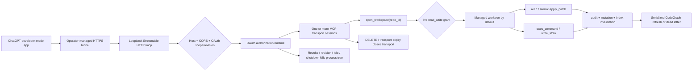

# Architecture Module: runtime-harness/mcp-sidecar

> **Capability ID**: `runtime-harness-mcp-sidecar`
> **Matched Prefixes**: `src/cli/mcp`, `src/cli/commands/mcp.ts`, `src/effects/repo-registry.ts`, ChatGPT MCP setup/reference/Skill surfaces
> **Local Contracts**: `AGENTS.md`, `CLAUDE.md`

## P1 Map

The sidecar is a loopback-only local runtime exposed to remote ChatGPT through an
operator-managed HTTPS tunnel.

- `setup.ts`, `auth.ts`, and `repo-registry.ts` own ignored v3 config, stable
  repo ids, access modes, and the monotonically increasing authorization
  revision.
- `oauth.ts` issues an opaque identity for each coding authorization grant,
  preserves it across refresh-token rotation, and bounds dynamic clients by
  capacity and expiry.
- `transports/http.ts` owns Streamable HTTP, Host/CORS, OAuth discovery,
  DCR/PKCE, redirect allowlists, transport-session lifecycle, and the bounded
  authorization-runtime registry.
- `server.ts`, `policy.ts`, and `tools.ts` select profile capabilities and keep
  planner, executor, and orchestrator unchanged.
- `state-tools.ts` owns the additive `summarize_repo_harness_state` adapter. It
  projects the canonical Effective State v1 resolver rather than interpreting
  `tasks/current.md`; the existing MCP policy profile is separately labeled
  with `profile_authority: "mcp-policy"`. The retained `current` preview is
  explicitly labeled by `current_authority` and `current_preview.authority` as
  a non-authoritative projection.
- `coding-workspaces.ts` owns explicit granted-repo selection, default managed
  worktrees, instruction discovery, and local cleanup metadata.
- `coding-tools.ts` owns workspace-relative read and rollback-capable guarded
  file mutation plus mutation/audit/index evidence.
- `process-sessions.ts` owns pipe-only local-user Bash sessions, output bounds,
  process-tree cleanup, environment scrubbing, and ownership isolation.
- CodeGraph remains an optional index adapter. The filesystem and repo registry
  remain authorization and content truth.

Cloudflare, DNS, ChatGPT app state, and service managers are external operator
surfaces; repo-harness guides and probes them but does not mutate them.

## P2 Trace

ChatGPT developer-mode app -> named tunnel -> `127.0.0.1:8765/mcp` -> Host/CORS
gate -> OAuth access token with `repo-harness.coding`, current authorization
revision, and a server-side authorization id -> one or more MCP initialize
sessions sharing that authorization runtime -> `open_workspace(repo_id)` -> explicit live
`read_write` grant -> managed `codex/mcp-*` worktree -> workspace-relative
`read`/`apply_patch` or local-user `exec_command`/`write_stdin` -> bounded result
to ChatGPT.

Patch success writes mutation/audit/index invalidation evidence and runs the
CodeGraph refresh contract. Process completion writes only command hash and
execution metadata, invalidates the repo-wide index, and triggers refresh.
MCP DELETE or transport expiry closes only that transport because ChatGPT may
initialize a fresh transport for each sequential tool call. The shared coding
runtime and its process trees close on OAuth revoke, authorization revision or
repo-grant change, coding disable, 30-minute authorization idle expiry, process
timeout, or server shutdown. Managed worktrees remain for local inspection and
require a clean, merged state before local cleanup.

For state inspection, the public MCP path is
`summarize_repo_harness_state` -> `state-tools.ts` -> the shared effectful
resolver -> pure Effective State v1 projection. Its task, phase, workflow
profile, risk floor, plan/contract, blockers, freshness/conflicts, revision,
version, and next action match CLI resolution. `current: null` preserves the
existing result key when no projection exists; otherwise the legacy redacted
preview remains additive and explicitly non-authoritative. The tool advertises
`readOnlyHint: false` because canonical resolution materializes the ignored
cache and Git-common-dir version owner while changing no workflow authority or
product data.

OAuth request limits use the direct socket plus canonical route as identity;
forwarded headers never mint new buckets. Error paths fail closed: missing
grant, stale OAuth revision, dynamic-client or rate-bucket capacity, invalid Host,
wildcard/foreign Origin, unregistered redirect, traversal, secret path,
symlink, stale file revision, process ownership mismatch, and environment
secrets return explicit errors without changing profile or falling back to a
weaker execution mode. PTY and terminal resize are not public contracts under
the Bun runtime; stdin, polling, SIGINT, and process-tree cleanup remain supported.

## Semantic Diagram

## P3 Decision

The `coding` profile is separate and default-off because arbitrary local-user
shell changes the trust model more than extending planner tools would. Explicit
user-scoped grants, profile/revision-bound OAuth, worktree-first operation, and
relative file APIs preserve the strongest repo-harness invariants without
claiming that allowed roots sandbox Bash.

At 10x load, the first bottleneck is synchronous repo-wide CodeGraph refresh
after mutations, not MCP routing. Refresh is intentionally serialized to avoid
mutation/index races; operators can recover from dead-letter evidence without
replaying the mutation. Per-authorization process count, duration, output ring,
runtime idle TTL, and retention bounds cap the untrusted concurrency surface.
