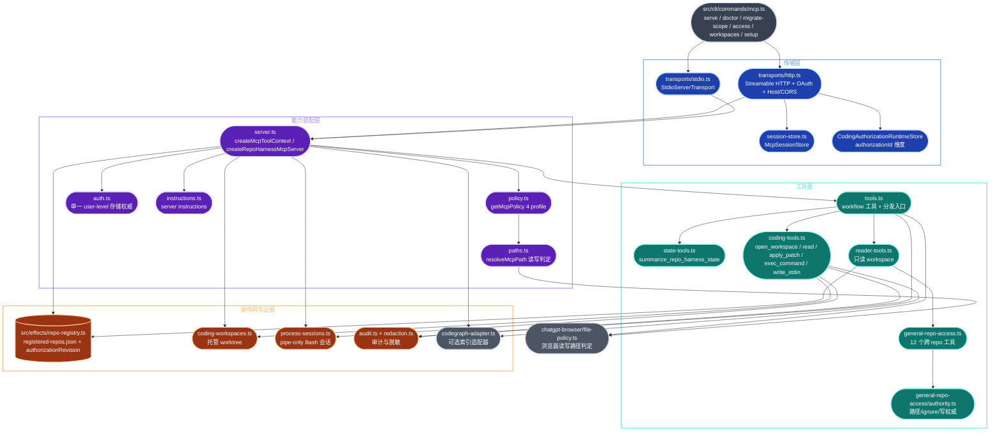
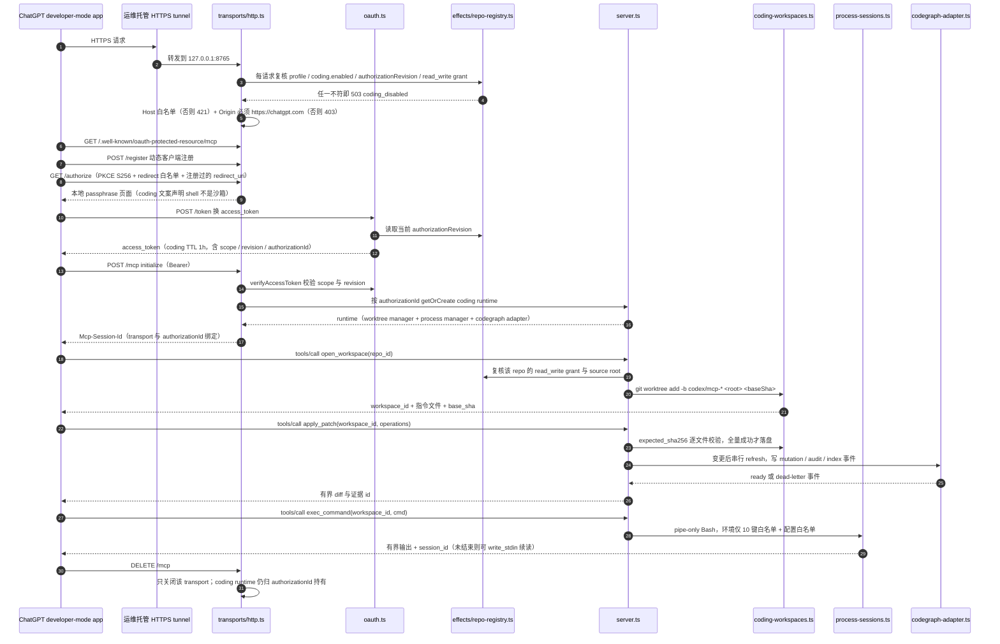

# runtime-harness/mcp-sidecar 架构文档

> 状态：基于 `main` 工作树的 by-capability 架构复核稿。
> Verified against: main@13686d8d（2026-08-08）
> **Capability ID**: `runtime-harness-mcp-sidecar`
> **Matched Prefixes**: `src/cli/mcp`、`src/cli/commands/mcp.ts`、`src/cli/chatgpt-browser/file-policy.ts`、`src/effects/repo-registry.ts`、`docs/repo-harness-chatgpt-mcp-setup.md`、`docs/reference-configs/chatgpt-coding-mcp.md`、`docs/researches/20260711-devspace-chatgpt-local-control.md`（来源：`.ai/context/capabilities.json`）
> **Local Contracts**: `AGENTS.md`、`CLAUDE.md`
> **Verification hints**（capability 注册表原值）：`bun test tests/cli/mcp*.test.ts`、`bun run check:type`、`repo-harness mcp doctor --repo . --live`
> 事实优先级：**实际源码 > 本文 > 任何叙述性文档**。本文只画已实现且已接线的现状；任何尚未落地的形态必须显式标注为「目标设计」。若本文与源码冲突，以源码为准并回改本文。

## 0. 阅读约定

| 标记 | 含义 |
| --- | --- |
| **已实现、已接线** | 源码存在，且位于 `startMcpHttp` / `startMcpStdio` 的真实 runtime path |
| **已实现、按 profile 关闭** | 源码存在，但当前 profile 的 `capabilities` 不点亮它，不会出现在 `tools/list` |
| **已实现、保留字段** | schema/config 键存在，但没有生产消费者 |
| **目标设计** | 尚未落地为源码；本文出现此标记的地方必须能指向缺失的实现 |
| **外部操作面** | Cloudflare、DNS、ChatGPT app、service manager；repo-harness 引导与探测，但不改写 |

本 capability 当前只有一个 breaking 的近期形态变化：`4618a244 feat(mcp)!: retire repo-scope config, single user-level storage authority (#167)`。repo-scope 的 `<repo>/.repo-harness/*.json` 已经不是配置或凭证读取源，只作为**迁移门禁要命名和删除的对象**存在（`src/cli/mcp/auth.ts:93`、`src/cli/mcp/auth.ts:114`）。

## 1. P1：能力架构地图

### 1.1 内部模块与强依赖


```mermaid
flowchart TB
  classDef entry fill:#374151,stroke:#d1d5db,stroke-width:2px,color:#fff
  classDef transport fill:#1e40af,stroke:#bfdbfe,stroke-width:2px,color:#fff
  classDef core fill:#5b21b6,stroke:#ddd6fe,stroke-width:2px,color:#fff
  classDef tool fill:#0f766e,stroke:#99f6e4,stroke-width:2px,color:#fff
  classDef store fill:#9a3412,stroke:#fed7aa,stroke-width:2px,color:#fff
  classDef optional fill:#4b5563,stroke:#d1d5db,stroke-width:2px,color:#fff

  CLI(["src/cli/commands/mcp.ts<br/>serve / doctor / migrate-scope / access / workspaces / setup"]):::entry

  subgraph Transport["传输层"]
    direction TB
    Http(["transports/http.ts<br/>Streamable HTTP + OAuth + Host/CORS"]):::transport
    Stdio(["transports/stdio.ts<br/>StdioServerTransport"]):::transport
    Sessions(["session-store.ts<br/>McpSessionStore"]):::transport
    RtStore(["CodingAuthorizationRuntimeStore<br/>authorizationId 维度"]):::transport
    Http --> Sessions
    Http --> RtStore
  end

  subgraph Core["能力装配层"]
    direction TB
    Server(["server.ts<br/>createMcpToolContext / createRepoHarnessMcpServer"]):::core
    Policy(["policy.ts<br/>getMcpPolicy 4 profile"]):::core
    Auth(["auth.ts<br/>单一 user-level 存储权威"]):::core
    Paths(["paths.ts<br/>resolveMcpPath 读写判定"]):::core
    Instr(["instructions.ts<br/>server instructions"]):::core
    Server --> Policy
    Server --> Auth
    Server --> Instr
    Policy --> Paths
  end

  subgraph ToolPlane["工具面"]
    direction TB
    Tools(["tools.ts<br/>workflow 工具 + 分发入口"]):::tool
    State(["state-tools.ts<br/>summarize_repo_harness_state"]):::tool
    Reader(["reader-tools.ts<br/>只读 workspace"]):::tool
    GenRepo(["general-repo-access.ts<br/>12 个跨 repo 工具"]):::tool
    GenAuth(["general-repo-access/authority.ts<br/>路径/ignore/写权威"]):::tool
    Coding(["coding-tools.ts<br/>open_workspace / read / apply_patch / exec_command / write_stdin"]):::tool
    Tools --> State
    Tools --> Reader
    Tools --> Coding
    Reader --> GenRepo
    GenRepo --> GenAuth
  end

  subgraph Side["副作用与证据"]
    direction TB
    Registry[("src/effects/repo-registry.ts<br/>registered-repos.json + authorizationRevision")]:::store
    Wsp(["coding-workspaces.ts<br/>托管 worktree"]):::store
    Proc(["process-sessions.ts<br/>pipe-only Bash 会话"]):::store
    Audit(["audit.ts + redaction.ts<br/>审计与脱敏"]):::store
    Graph(["codegraph-adapter.ts<br/>可选索引适配器"]):::optional
  end

  Browser(["chatgpt-browser/file-policy.ts<br/>浏览器读写路径判定"]):::optional

  CLI --> Http
  CLI --> Stdio
  Http --> Server
  Stdio --> Server
  Server --> Tools
  Server --> Registry
  Server --> Wsp
  Server --> Proc
  Server --> Graph
  Coding --> Wsp
  Coding --> Proc
  Coding --> Audit
  Coding --> Graph
  Reader --> Registry
  Tools --> Audit
  Tools --> Browser
  Paths --> Browser

  style Transport fill:none,stroke:#60a5fa,stroke-width:2px,color:#60a5fa
  style Core fill:none,stroke:#a78bfa,stroke-width:2px,color:#a78bfa
  style ToolPlane fill:none,stroke:#5eead4,stroke-width:2px,color:#5eead4
  style Side fill:none,stroke:#fdba74,stroke-width:2px,color:#fdba74
```

### 1.2 模块职责表

| 文件 | 主要 exports / 职责 |
| --- | --- |
| `src/cli/commands/mcp.ts:128` | `buildMcpCommand()`；子命令 `serve`、`doctor [--live]`、`migrate-scope`、`access set`、`workspaces list/cleanup`、`setup chatgpt/codex`、`install-skill`、`prepare-goal`、`print-chatgpt-guide` |
| `src/cli/mcp/transports/stdio.ts:4` | `startMcpStdio()`；三行装配，无认证面，宿主进程即信任边界 |
| `src/cli/mcp/transports/http.ts:529` | `startMcpHttp()`；Express app、Host/CORS 门（`:616`）、OAuth discovery/DCR/PKCE、`/mcp` 的 POST/GET/DELETE、优雅关停 |
| `src/cli/mcp/transports/http.ts:61` | `CodingAuthorizationRuntimeStore`；按 `authorizationId` 复用 coding runtime，带 TTL 与容量上限 |
| `src/cli/mcp/transports/http.ts:170` / `:309` | `isAllowedMcpOAuthRedirectUri()`（redirect 主机白名单）、`createOAuthRateLimitMiddleware()`（`remoteAddress:baseUrl` 作桶键） |
| `src/cli/mcp/session-store.ts:18` | `McpSessionStore`；transport session 的 TTL + 上限 + 关闭 |
| `src/cli/mcp/oauth.ts:50` / `:245` | `McpOAuthTokenStore`（磁盘 token store、dynamic client 容量与 TTL）、`createMcpOAuthProvider()`；`authorizationId` 在 `:347` 仅对 coding profile 生成，`:276` 在启动时吊销 revision 不匹配的授权 |
| `src/cli/mcp/auth.ts:60`–`:78` | `mcpStorageDir()` = `~/.repo-harness`（`REPO_HARNESS_HOME` 可覆盖）；`mcp.local.json` / `mcp.tokens.json` / `mcp.oauth.json` / `mcp.oauth-tokens.json` 的唯一路径来源 |
| `src/cli/mcp/auth.ts:93` / `:114` | `legacyRepoScopeMcpPaths()`、`assertNoLegacyRepoScopeMcpConfig()`；检测到 `<repo>/.repo-harness/mcp.local.json` 即抛错，**无读通回落** |
| `src/cli/mcp/server.ts:179` | `createMcpToolContext()`；解析 repoRoot → 拒绝 legacy 配置 → 选 profile → coding 三重门 → 归一化 allowedRoots/discoveryRoots → `getMcpPolicy` |
| `src/cli/mcp/server.ts:169` / `:48` | `createMcpCodingRuntime()` 与 `shutdownMcpCodingRuntime()`；runtime = workspaceManager + processManager + codeGraphAdapter + ownerId |
| `src/cli/mcp/server.ts:263` | `createRepoHarnessMcpServer()`；注册 `ListTools` / `CallTool` 两个 handler，`onclose` 负责自有 runtime 的回收 |
| `src/cli/mcp/policy.ts:135` | `getMcpPolicy()`；`planner` / `executor` / `orchestrator` / `coding` 四套 capabilities + read/write/deny globs + execution 开关 |
| `src/cli/mcp/policy.ts:53` | `sensitiveAllowedRootReason()`；allowed root 落在 `.ssh/**`、`secrets/**`、`.git/**` 等目录时拒绝；`:34` 单独剥离 macOS `/private` 规范化前缀 |
| `src/cli/mcp/paths.ts:85` | `resolveMcpPath()`；relative 归一化 + glob 匹配 + deny 优先，read/write 两种 intent |
| `src/cli/mcp/tools.ts:835` / `:1077` | `buildMcpToolDefinitions()` 按 policy 拼装工具清单；`callMcpTool()` 是唯一分发入口，顺序为 coding → reader → state → workflow switch |
| `src/cli/mcp/state-tools.ts:135` | `callStateTool()`；以固定 `operationKind: 'inspect'` 调用 `resolveEffectiveState`，投影 Effective State v1；`current` 被 `current_authority` 显式标为非权威 |
| `src/cli/mcp/reader-tools.ts:156` / `:433` | 只读工具 `reader_status`、`list_allowed_roots`、`open_workspace`、`tree`、`read_text`，并把 general-repo 工具合并进同一清单 |
| `src/cli/mcp/general-repo-access.ts:161` | `GENERAL_REPO_TOOLS` 12 项：`get_repo_capabilities`、`repo_manifest`、`list_tree`、`search_text`、`read_file`、`read_files`、`stat_file`、`write_file`、`apply_patch`、`move_path`、`delete_path`、`refresh_repo_index` |
| `src/cli/mcp/general-repo-access/authority.ts:323` / `:442` | `resolveRepoPath()` / `resolveRepoWritePath()`；`openNoFollow`、symlink 分类、ignore policy revision，是跨 repo 路径的唯一权威 |
| `src/cli/mcp/coding-tools.ts:235` / `:589` | 5 个 coding 工具定义与分发；`:212` `recordCodingProcessCompletion()` 把进程完成折算成审计 + 索引失效 |
| `src/cli/mcp/coding-workspaces.ts:382` | `CodingWorkspaceManager`；`open()`（`:387`）默认建 `codex/mcp-*` 托管 worktree，`get()` 每次复核 repo 授权仍指向同一 source root |
| `src/cli/mcp/coding-workspaces.ts:480` | `cleanupManagedCodingWorkspace()`；dirty 或未合并一律拒删 |
| `src/cli/mcp/process-sessions.ts:325` / `:276` / `:22` | `McpProcessSessionManager`（pipe-only、并发/时长/输出环上限）、`buildMcpProcessEnvironment()`、`MCP_PROCESS_ENV_ALLOWLIST` 10 个键 |
| `src/cli/mcp/codegraph-adapter.ts:217` / `:230` | `createCodeGraphCliAdapter()` / `refreshRepo()`；CodeGraph 缺席时返回 `available: false`，不阻断变更 |
| `src/cli/mcp/audit.ts:15` + `redaction.ts:41` | 审计条目落盘与文本脱敏 |
| `src/cli/mcp/workspaces.ts:117` | `WorkspaceManager`；reader profile 的 allowed-root → workspace 解析 |
| `src/cli/chatgpt-browser/file-policy.ts:120` / `:128` | `resolveBrowserInputPath()` / `resolveBrowserOutputPath()`；复用 `resolveMcpPath`，但用三套独立的浏览器专用 `McpPolicy` 常量（读、CLI 写、MCP 写） |
| `src/effects/repo-registry.ts:238` / `:249` / `:263` / `:368` | `readRegisteredRepoHarnessRepos()`、`repoHarnessAuthorizationRevision()`、`applyRepoHarnessRegistryBatch()`、`setRepoHarnessAccessMode()`；带文件锁 + 原子 rename 的用户级 repo 授权注册表 |

### 1.3 规模信号

| 分组 | 文件数 | LOC | 设计压力 |
| --- | ---: | ---: | --- |
| capability 生产源码（4 个代码 prefix 合计） | 28 | 12,782 | 单 capability 已接近一个中型子系统 |
| `general-repo-access.ts` 单文件 | 1 | 2,924 | 最大单文件；跨 repo 读写、索引、锁、metrics 全在一处 |
| `tools.ts` + `setup.ts` | 2 | 2,789 | 工具 schema 与安装引导两块巨型字面量 |
| `transports/http.ts` + `oauth.ts` + `session-store.ts` | 3 | 1,305 | 全部远程信任边界集中在这里 |
| `coding-tools.ts` + `coding-workspaces.ts` + `process-sessions.ts` | 3 | 1,899 | 本机执行面 |
| `tests/cli/mcp*.test.ts` | 13 | 6,721 | 测试与生产比约 1:1.9 |

复算命令：

```bash
cd /path/to/repo-harness
find src/cli/mcp src/cli/commands/mcp.ts src/cli/chatgpt-browser/file-policy.ts src/effects/repo-registry.ts \
  -type f -name '*.ts' ! -name '*.test.ts' | sort | xargs wc -l | tail -1
find tests/cli -name 'mcp*.test.ts' | xargs wc -l | tail -1
```

### 1.4 依赖边界

允许的出边（当前事实）：

- `src/cli/mcp/**` → `src/effects/repo-registry.ts`：repo 授权与 `authorizationRevision` 的唯一真相源。
- `src/cli/mcp/state-tools.ts` → `src/effects/state/resolve-effective-state`、`src/core/state/types`：MCP 只投影 Effective State v1，**不重算** readiness 与 guidance（`state-tools.ts:35` 的注释与 `tests/state/adapter-parity.test.ts` 的四适配器 parity 断言）。
- `src/cli/chatgpt-browser/file-policy.ts` → `src/cli/mcp/paths.ts` + `src/cli/mcp/types.ts`：复用路径判定内核，但自带策略常量。
- `src/cli/mcp/**` → `@modelcontextprotocol/sdk`、`express`：协议与 HTTP 栈。

允许的入边：

- `src/cli/commands/mcp.ts` → `server.ts` / `transports/*` / `setup.ts` / `coding-workspaces.ts` / `repo-registry.ts`。CLI 是唯一进程入口。

禁止的边（当前源码已成立的 invariant）：

- 任何模块 → `<repo>/.repo-harness/*`。配置与凭证只有 `mcpStorageDir()` 一个权威；`tools.ts` 的 `harness_doctor` 分支带有显式注释禁止探测退休路径。
- `policy.ts` / `paths.ts` → 文件系统。策略层是纯函数，落盘判定交给调用方。
- coding 面 → planner/executor 的 write globs 之外的工作流写入。coding profile 的 `writeGlobs` 与 planner 相同（`policy.ts:205`），真正的仓库改写只走 `apply_patch` + 托管 worktree。
- `general-repo-access/authority.ts` 之外的模块自行拼接跨 repo 绝对路径。

显式 out of scope：Cloudflare tunnel、DNS、ChatGPT connector 应用状态、launchd/systemd。`doctor --live` 只探测不改写。

## 2. P2：端到端数据流

### 2.1 coding profile 的完整握手（已实现、已接线）


```mermaid
sequenceDiagram
  autonumber
  participant GPT as ChatGPT developer-mode app
  participant Tun as 运维托管 HTTPS tunnel
  participant HTTP as transports/http.ts
  participant OAuth as oauth.ts
  participant Reg as effects/repo-registry.ts
  participant Srv as server.ts
  participant WS as coding-workspaces.ts
  participant Proc as process-sessions.ts
  participant CG as codegraph-adapter.ts

  GPT->>Tun: HTTPS 请求
  Tun->>HTTP: 转发到 127.0.0.1:8765
  HTTP->>Reg: 每请求复核 profile / coding.enabled / authorizationRevision / read_write grant
  Reg-->>HTTP: 任一不符即 503 coding_disabled
  HTTP->>HTTP: Host 白名单（否则 421）+ Origin 必须 https://chatgpt.com（否则 403）
  GPT->>HTTP: GET /.well-known/oauth-protected-resource/mcp
  GPT->>HTTP: POST /register 动态客户端注册
  GPT->>HTTP: GET /authorize（PKCE S256 + redirect 白名单 + 注册过的 redirect_uri）
  HTTP-->>GPT: 本地 passphrase 页面（coding 文案声明 shell 不是沙箱）
  GPT->>OAuth: POST /token 换 access_token
  OAuth->>Reg: 读取当前 authorizationRevision
  OAuth-->>GPT: access_token（coding TTL 1h，含 scope / revision / authorizationId）
  GPT->>HTTP: POST /mcp initialize（Bearer）
  HTTP->>OAuth: verifyAccessToken 校验 scope 与 revision
  HTTP->>Srv: 按 authorizationId getOrCreate coding runtime
  Srv-->>HTTP: runtime（worktree manager + process manager + codegraph adapter）
  HTTP-->>GPT: Mcp-Session-Id（transport 与 authorizationId 绑定）
  GPT->>Srv: tools/call open_workspace(repo_id)
  Srv->>Reg: 复核该 repo 的 read_write grant 与 source root
  Srv->>WS: git worktree add -b codex/mcp-* <root> <baseSha>
  WS-->>GPT: workspace_id + 指令文件 + base_sha
  GPT->>Srv: tools/call apply_patch(workspace_id, operations)
  Srv->>WS: expected_sha256 逐文件校验，全量成功才落盘
  Srv->>CG: 变更后串行 refresh，写 mutation / audit / index 事件
  CG-->>Srv: ready 或 dead-letter 事件
  Srv-->>GPT: 有界 diff 与证据 id
  GPT->>Srv: tools/call exec_command(workspace_id, cmd)
  Srv->>Proc: pipe-only Bash，环境仅 10 键白名单 + 配置白名单
  Proc-->>GPT: 有界输出 + session_id（未结束则可 write_stdin 续读）
  GPT->>HTTP: DELETE /mcp
  HTTP->>HTTP: 只关闭该 transport；coding runtime 仍归 authorizationId 持有
```

关键接线细节（逐条对过源码）：

- `authorizationId` 只在 coding profile 下生成（`oauth.ts:347`），并在 refresh 轮换时保留，因此一个授权跨多次 `initialize` 复用同一个 runtime（`http.ts:458`）。ChatGPT 会为顺序工具调用重开 transport，这是把 runtime 与 transport 解耦的直接原因。
- `open_workspace` 在 coding 与 reader 两侧同名，但两者不会同时出现在 `tools/list`：`getMcpPolicy('coding')` 只点亮 `workflowPlanner` + `workspaceCoder`，从不点亮 `workspaceReader`（`policy.ts:200`）。即便日后同时点亮，`callMcpTool` 的分支顺序也让 coding 版本优先（`tools.ts:1079`）。
- 状态查询路径与 coding 无关：`summarize_repo_harness_state` → `state-tools.ts:135` → `resolveEffectiveState(repoRoot, now, { targetPaths: [], operationKind: 'inspect' })`。它把 `readOnlyHint` 标为 `false`（`state-tools.ts:100`），因为规范化解析会物化被 ignore 的缓存与 Git common-dir 的 version owner。

### 2.2 错误路径要点（全部 fail closed）

| 触发点 | 位置 | 结果 |
| --- | --- | --- |
| 仓库仍带退休的 repo-scope 配置 | `auth.ts:114`（`server.ts:181`、`http.ts:533` 各调一次） | 抛错并提示 `repo-harness mcp migrate-scope`，不读通、不回落 |
| coding 但 config 非 v3 / 未 enabled / revision 过期 | `server.ts:186`、`http.ts:545` | 启动即抛错 |
| coding 但无任何 `read_write` 授权 repo | `server.ts:189`、`http.ts:557` | 启动即抛错 |
| coding 但认证模式非 OAuth | `http.ts:561` | 启动即抛错 |
| 运行中 grant / revision / enabled 变化 | `http.ts:599` 每秒轮询 + `:616` 每请求复核 | 关闭全部 session 与 runtime，返回 503 `coding_disabled` |
| Host 头不在白名单 | `http.ts:633` | 421 `host_not_allowed` |
| Origin 非 `https://chatgpt.com` | `http.ts:638` | 403 `origin_not_allowed` |
| 缺 PKCE S256 / redirect 不在白名单 / redirect 未注册 | `http.ts:264`、`:277`、`:284` | 400，各自独立错误码 |
| OAuth 请求过频或身份桶超限 | `http.ts:309` | 429；桶键用 `socket.remoteAddress` + 规范化路由，转发头不能开新桶 |
| 授权 runtime 数量超限 | `http.ts:78` | 429 `AUTHORIZATION_RUNTIME_LIMIT_REACHED` |
| session 不存在 / 过期 / 属于别的授权 | `http.ts:400`、`:416` | 404 `SESSION_NOT_FOUND` |
| allowed root 落在敏感目录 | `policy.ts:53` + `server.ts:96` | 显式配置的 root 抛错；自动推导的注册 root 静默跳过（`skipDenied`） |
| patch 的 `expected_sha256` 不匹配 | `coding-tools.ts:421` | `REVISION_CONFLICT`，整批不落盘 |
| patch 目标是符号链接 | `coding-tools.ts:407` | `SYMLINK_ESCAPE` |
| working directory 逃逸 workspace root | `process-sessions.ts:312` | `WORKING_DIRECTORY_DENIED` |
| 配置的环境变量键命中 secret 词元 | `process-sessions.ts:290` | `ENV_KEY_DENIED` |
| 托管 worktree 脏或未合并 | `coding-workspaces.ts:485`、`:488` | `WORKTREE_DIRTY` / `WORKTREE_UNMERGED`，拒绝清理 |
| CodeGraph 刷新失败 | `coding-tools.ts:203` | 变更保留，写 dead-letter 索引事件，不回滚 mutation |

未被承诺的能力：Bun runtime 下不提供 PTY 与终端 resize；stdin、轮询、SIGINT、进程树回收是支持面（`process-sessions.ts` 的 pipe-only 实现）。

## 3. P3：设计决策与不变量

### 3.1 必须保持的不变量

1. **单一存储权威。** MCP 的配置与凭证只有 `mcpStorageDir()` 一个来源。#167 之所以选择「迁移时轮换凭证而非搬运凭证」，是因为 repo-scope 的 bearer token 与 passphrase 曾经躺在 git 工作树里，可能已进入备份或历史；搬运会把一个已经泄露风险未知的秘密延寿（`setup.ts:765` 的注释即此判断）。删除 repo-scope OAuth token store 强制恰好一次重新授权，是这条决策的可观测代价。
2. **授权真相在注册表，不在 MCP 配置。** `read_write` 授权与 `authorizationRevision` 都由 `registered-repos.json` 持有，写入走文件锁 + 原子 rename（`repo-registry.ts:183`、`:149`）。MCP 配置里的 `authorizationRevision` 只是一份必须与注册表相等的副本，不相等就整体拒绝服务。
3. **coding 面默认关闭且需要三重显式条件**：v3 配置里 `profile: coding` + `coding.enabled: true`、至少一个 `read_write` 注册 repo、OAuth 认证。任意一条随时失效都立即拆掉运行时。
4. **worktree-first。** `open_workspace` 默认建独立 worktree，`checkout` 必须显式指定。这让远端代理的失败落在一根可丢弃的分支上，而不是用户的工作树。
5. **grant 选工作区，不等于 shell 沙箱。** 授权页文案直说 `exec_command` 能触达本地用户能触达的一切（`http.ts:220`）。文档与 UI 都不得反向承诺「allowed roots 沙箱化了 Bash」。
6. **MCP 只投影状态，不解释状态。** `summarize_repo_harness_state` 复用与 CLI、Stop hook 相同的解析器；保留的 `current` 预览被两处字段显式标注为非权威。
7. **CodeGraph 是可选适配器。** 文件系统与 repo 注册表是内容与授权真相；索引失败只写 dead-letter，不能反过来阻断已成功的变更。

### 3.2 已知张力

- `mcp.local.json` 的 `repo` 字段仍被写入（`setup.ts:821`），但 runtime 的 repoRoot 只来自 `--repo` 或 cwd（`server.ts:180`）。它属于**已实现、保留字段**：doctor 与迁移输出会显示它，没有解析路径消费它。
- `McpLocalConfig.version` 仍接受 `1 | 2 | 3`（`auth.ts:128`），但 coding 面硬性要求 `version === 3`。v1/v2 只对非 coding profile 有效，属于窄口径的历史宽容，不是双权威。
- `capabilities.reader` 是显式标注的 deprecated 键（`auth.ts:30`），仅在 `workspaceReader` 未定义时参与判断。

### 3.3 10x 规模下先垮的点

按当前实现，压力顺序是：

1. **mutation 后的串行 CodeGraph 全仓刷新**（`coding-tools.ts` 的 refresh 链）。它被刻意串行化以避免 mutation/index 竞态；仓库变大或并发授权变多时，这是第一个吃掉端到端延迟的环节，而不是 MCP 路由。
2. **`general-repo-access.ts` 的进程内快照缓存**：`MAX_ENTRY_METADATA_CACHE_ENTRIES = 200_000`、`MAX_SNAPSHOT_CACHE_ENTRIES = 16`、`SNAPSHOT_TTL_MS = 5min`（`general-repo-access.ts:184`–`:186`）。多个大仓交替访问会让快照命中率塌到接近零，退化为反复全量 walk。
3. **`CodingAuthorizationRuntimeStore` 的容量与 session 上限共用一个数**：两者都取 `maxSessions`（默认 64，上限 256，`http.ts:567`–`:569`）。授权数与 transport 数的增长曲线并不相同，共用上限会让先到者挤掉后到者。
4. **每请求同步复核**：`http.ts:616` 的中间件在每个请求上重读 `mcp.local.json` 与 `registered-repos.json`。这是 fail-closed 的代价，也是 QPS 上升时第一个变成同步 IO 热点的地方。

单授权维度已有的硬上限——并发进程 4、单进程最长 30 分钟、输出环 4 MiB、完成后保留 15 分钟、runtime idle 复用 `sessionTtlMs`（默认 30 分钟）——限制的是不可信侧的并发面，不解决上面四点的吞吐问题。

## 4. 历史决策记录（append-only）

重写前的 `docs/architecture/modules/runtime-harness/mcp-sidecar.md` 全文为无日期的 P1/P2/P3 叙述段落，**不含任何带日期的章节**，因此本节当前没有需要逐字保留的条目。

后续带日期的决策请在此追加，只增不改。
