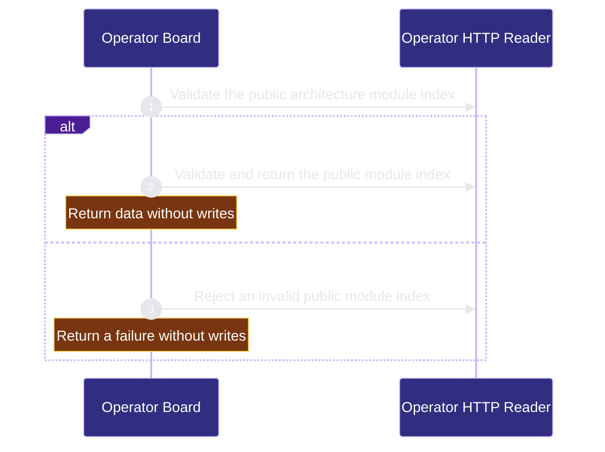

# runtime-harness/operator 架構文檔

<!-- BEGIN ARCHCONTEXT:generated target="projection_target.entity.capability-runtime-harness-operator" sourceDigest="sha256:df5d0e5a7abfc65bf58f2cbb6500b3c373787ce05514722b9c2dfb9a1f68c2d5" rendererVersion="archcontext.docs-renderer/v4" outputDigest="sha256:d00ad1906d046cd44616147a0a95177195a91773ec1b912f6b61a98aafa30525" -->
> **狀態**:`active`
> **Capability ID**:`capability.runtime-harness.operator`(kind `capability`)
> **Matched Prefixes**:`src/core/operator/**`、`src/effects/operator/**`、`src/operator-web/**`、`src/cli/commands/operator.ts`
> **Local Contracts**:`AGENTS.md`、`CLAUDE.md`
> **事實優先級**:倉庫當前狀態 > 本文檔機器區 > 本文檔人工區。機器區(引言、§1、§2)由 ArchContext 從架構模型與源碼度量投影生成,手改會在下次投影被覆蓋。本文檔不記錄出處;本次投影所驗證的 commit 見 `docs/architecture/.projection-manifest.json`。

Provides local read-only HTTP views of registered repositories.

## 1. P1:能力架構地圖

### 1.1 架構圖

- Proof: `proven` (`sha256:a8832c5c9f6e7e95b20e26d87bd6e4d7ad8966a94c6fc10bd7af8f9b6c68b967`).
- Semantic nodes: `2`; declared relations: `1`.

### 1.2 模組職責表

| 宣告入口 | 錨點 | 職責 |
| --- | --- | --- |
| `entrypoint.operator.primary` | `src/effects/operator/architecture.ts#readArchitecture` | `sink.operator.primary` → `src/core/operator/architecture.ts#decodeArchitectureModuleIndex` |

### 1.3 規模信號

- 規模量級:`50–100` 個文件 / `10k–20k` 行
- 匹配前綴:`src/core/operator/**`、`src/effects/operator/**`、`src/operator-web/**`、`src/cli/commands/operator.ts`
- 推導:掃描 `source.include` 減 `source.exclude`,跳過 `.git/` 與 `node_modules/`,再按 1–2–5 階梯分桶。精確計數不入本文檔:量級足以回答「這個能力有多大」,而逐行計數會讓覆蓋範圍內任何一次源碼改動都改寫本文檔。

### 1.4 依賴邊界

出向關係:

- `calls` → `component.operator.primary` — Return a read-only HTTP observation.

入向關係:

- 無。

## 2. P2:端到端數據流

> **Proof**: `proven` (`sha256:a8832c5c9f6e7e95b20e26d87bd6e4d7ad8966a94c6fc10bd7af8f9b6c68b967`); selectors `1/1`.

<!-- END ARCHCONTEXT:generated target="projection_target.entity.capability-runtime-harness-operator" -->

## 3. P3:設計決策與不變量

## 4. 歷史決策記錄(append-only)

## Optimization Backlog
