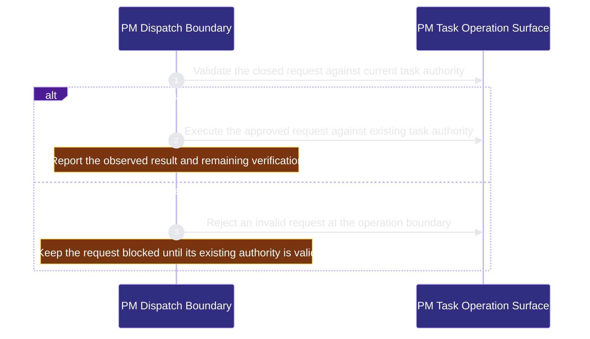

# runtime-harness/pm-dispatch 架構文檔

<!-- BEGIN ARCHCONTEXT:generated target="projection_target.entity.capability-runtime-harness-pm-dispatch" sourceDigest="sha256:cf50adce0ead8a8faf5628cb1871cdf08e32bc764a3a29f6d78ef779e28b1666" rendererVersion="archcontext.docs-renderer/v4" outputDigest="sha256:44a77669051b0563c7c4813eeef5e1a6d859c18b08a68f35cbbfc2f0096863cf" -->
> **狀態**:`active`
> **Capability ID**:`capability.runtime-harness.pm-dispatch`(kind `capability`)
> **Matched Prefixes**:`src/core/pm/**`、`src/effects/pm/**`、`src/cli/commands/pm.ts`、`src/effects/terminal/coding-isolation.ts`、`src/effects/terminal/coding-session.ts`、`src/effects/terminal/oar-coding-host.ts`、`assets/hermes/**`、`references/pm-operations.md`
> **Local Contracts**:`AGENTS.md`、`CLAUDE.md`
> **事實優先級**:倉庫當前狀態 > 本文檔機器區 > 本文檔人工區。機器區(引言、§1、§2)由 ArchContext 從架構模型與源碼度量投影生成,手改會在下次投影被覆蓋。本文檔不記錄出處;本次投影所驗證的 commit 見 `docs/architecture/.projection-manifest.json`。

Provides shared task-level PM operations and a fixed OAR coding host without adding task or result authority.

## 1. P1:能力架構地圖

### 1.1 架構圖

- Proof: `proven` (`sha256:2b8c7f988c2febb49e41c60a1acafac796fb535f64d8158b7d3d0abe8a55abd3`).
- Semantic nodes: `2`; declared relations: `1`.

### 1.2 模組職責表

| 宣告入口 | 錨點 | 職責 |
| --- | --- | --- |
| `entrypoint.pm-dispatch.request` | `src/cli/commands/pm.ts#runPmJson` | `sink.pm-dispatch.operation` → `src/effects/pm/operations.ts#executePmRequest` |
| `entrypoint.pm-dispatch.coding-host` | `src/effects/terminal/coding-session.ts#startCodingTaskAgent` | `sink.pm-dispatch.task-binding` → `src/effects/terminal/task-session.ts#startTaskApplicationHost` |

### 1.3 規模信號

- 規模量級:`10–20` 個文件 / `1000–2000` 行
- 匹配前綴:`src/core/pm/**`、`src/effects/pm/**`、`src/cli/commands/pm.ts`、`src/effects/terminal/coding-isolation.ts`、`src/effects/terminal/coding-session.ts`、`src/effects/terminal/oar-coding-host.ts`、`assets/hermes/**`、`references/pm-operations.md`
- 推導:掃描 `source.include` 減 `source.exclude`,跳過 `.git/` 與 `node_modules/`,再按 1–2–5 階梯分桶。精確計數不入本文檔:量級足以回答「這個能力有多大」,而逐行計數會讓覆蓋範圍內任何一次源碼改動都改寫本文檔。

### 1.4 依賴邊界

出向關係:

- `calls` → `component.pm-dispatch.primary` — Validate a task-level PM request before using existing task authority.

入向關係:

- 無。

## 2. P2:端到端數據流

> **Proof**: `proven` (`sha256:2b8c7f988c2febb49e41c60a1acafac796fb535f64d8158b7d3d0abe8a55abd3`); selectors `1/1`.

<!-- END ARCHCONTEXT:generated target="projection_target.entity.capability-runtime-harness-pm-dispatch" -->

## 3. P3:設計決策與不變量

The PM interface delegates work through the existing task, claim and result
records. It does not own another scheduler. The CLI validates each request
before dispatch. Host configuration supplies exact worker admission.

The fixed OAR host runs inside Herdr. OAR completion alone does not complete a
task. Collection requires a valid request-bound TaskResult. Hermes exposes the
same five PM operations. Its model tool boundary does not sandbox the whole
Hermes process. Live provider acceptance remains unverified.

## 4. 歷史決策記錄(append-only)

## Optimization Backlog
