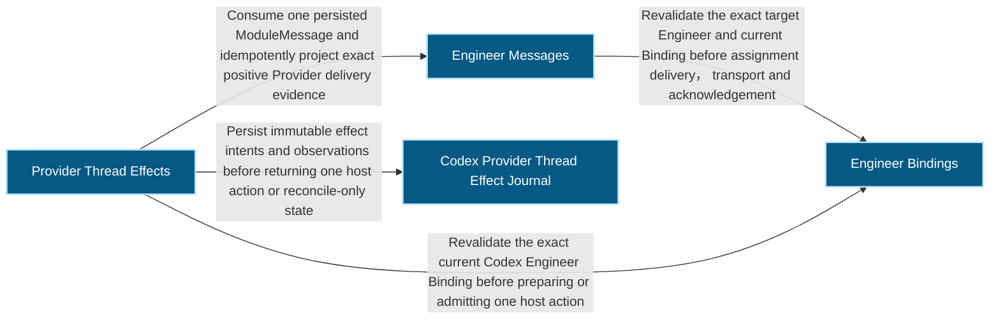
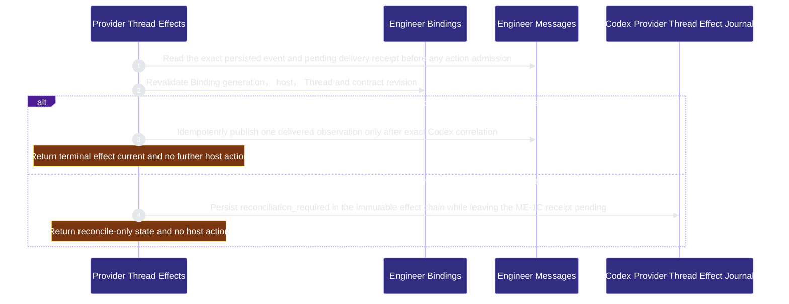

# runtime-harness/provider-thread-effects 架構文檔

<!-- BEGIN ARCHCONTEXT:generated target="projection_target.entity.capability-runtime-harness-provider-thread-effects" sourceDigest="sha256:acfe1e16369d7e4379bb79e370321b19d6cb0af38469b60218c3f3a06c3d2038" rendererVersion="archcontext.docs-renderer/v4" outputDigest="sha256:15040c9c841005c63d4ea09fd3306aa522bab84608152f715e285f5e61ebce58" -->
> **狀態**:`active`
> **Capability ID**:`capability.runtime-harness.provider-thread-effects`(kind `capability`)
> **Matched Prefixes**:`src/core/engineers/provider-thread-effect.ts`、`src/effects/engineers/provider-thread-effect-store.ts`
> **Local Contracts**:`AGENTS.md`、`CLAUDE.md`
> **事實優先級**:倉庫當前狀態 > 本文檔機器區 > 本文檔人工區。機器區(引言、§1、§2)由 ArchContext 從架構模型與源碼度量投影生成,手改會在下次投影被覆蓋。本文檔不記錄出處;本次投影所驗證的 commit 見 `docs/architecture/.projection-manifest.json`。

Journals one host-owned Codex Thread action from an exact persisted ModuleMessage and reconciles Provider evidence without owning an Agent runtime.

## 1. P1:能力架構地圖

### 1.1 架構圖

- Proof: `proven` (`sha256:c2068f872c2b238991a0fdaf1cf98d314c2c8d522068efd55f72fb0318794fcd`).
- Semantic nodes: `4`; declared relations: `4`.

### 1.2 模組職責表

| 宣告入口 | 錨點 | 職責 |
| --- | --- | --- |
| `entrypoint.provider-thread-effects.prepare` | `src/effects/engineers/provider-thread-effect-store.ts#assertCurrentBinding` | `sink.provider-thread-effects.current-binding` → `src/effects/engineers/binding-store.ts#readEngineerBindingStatus` |
| `entrypoint.provider-thread-effects.prepare` | `src/effects/engineers/provider-thread-effect-store.ts#assertPendingMessage` | `sink.provider-thread-effects.persisted-message` → `src/effects/engineers/module-inbox.ts#readModuleMessageDelivery` |
| `entrypoint.provider-thread-effects.start` | `src/effects/engineers/provider-thread-effect-store.ts#startProviderThreadEffect` | `sink.provider-thread-effects.started-observation` → `src/core/engineers/provider-thread-effect.ts#buildProviderThreadEffectObservation` |
| `entrypoint.provider-thread-effects.observe` | `src/effects/engineers/provider-thread-effect-store.ts#observeProviderThreadEffect` | `sink.provider-thread-effects.reconciliation-observation` → `src/core/engineers/provider-thread-effect.ts#buildProviderThreadEffectObservation` |
| `entrypoint.provider-thread-effects.observe` | `src/effects/engineers/provider-thread-effect-store.ts#projectSuccessfulDelivery` | `sink.provider-thread-effects.delivery-observation` → `src/effects/engineers/module-inbox.ts#recordModuleMessageDeliveryObservation` |

### 1.3 規模信號

- 規模量級:`2–5` 個文件 / `1000–2000` 行
- 匹配前綴:`src/core/engineers/provider-thread-effect.ts`、`src/effects/engineers/provider-thread-effect-store.ts`
- 推導:掃描 `source.include` 減 `source.exclude`,跳過 `.git/` 與 `node_modules/`,再按 1–2–5 階梯分桶。精確計數不入本文檔:量級足以回答「這個能力有多大」,而逐行計數會讓覆蓋範圍內任何一次源碼改動都改寫本文檔。

### 1.4 依賴邊界

出向關係:

- `calls` → `capability.runtime-harness.engineer-bindings` — Revalidate the exact current Codex Engineer Binding before preparing or admitting one host action
- `calls` → `capability.runtime-harness.engineer-messages` — Consume one persisted ModuleMessage and idempotently project exact positive Provider delivery evidence
- `calls` → `component.provider-thread-effects.primary` — Persist immutable effect intents and observations before returning one host action or reconcile-only state

入向關係:

- `calls` ← `capability.runtime-harness.engineering-overlay` — Observe exact current Provider effect and reconciliation states without executing or repairing an effect
- `calls` ← `capability.runtime-harness.mcp-sidecar` — Expose read-only capability and current effect projections to the authenticated Engineer without Provider mutation authority

## 2. P2:端到端數據流

> **Proof**: `proven` (`sha256:c2068f872c2b238991a0fdaf1cf98d314c2c8d522068efd55f72fb0318794fcd`); selectors `4/4`.

<!-- END ARCHCONTEXT:generated target="projection_target.entity.capability-runtime-harness-provider-thread-effects" -->

## 3. P3:設計決策與不變量

## 4. 歷史決策記錄(append-only)

## Optimization Backlog
