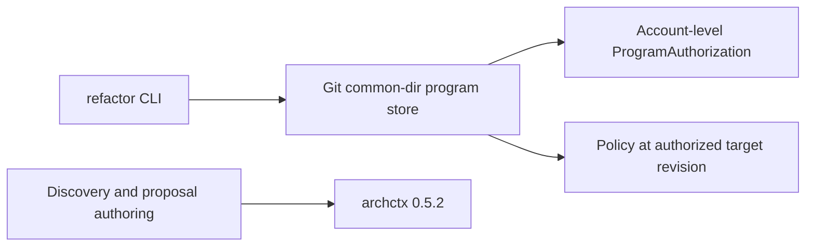
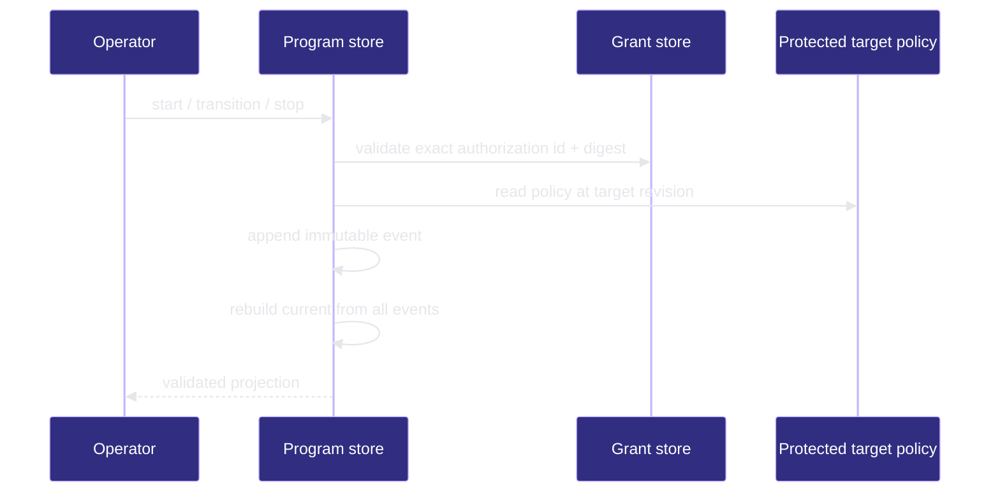

# Refactor Program

## Responsibility

The Refactor Program capability owns repo-harness orchestration around the package-local ArchContext refactor provider. ArchContext remains the only structural-analysis and recommendation-lifecycle authority; repo-harness owns accountable proposal authoring, policy, workflow routing, execution evidence, and closure.

## Runtime Boundary

- Core contracts and pure projections live under `src/core/refactor/`.
- Provider calls, Git-common-directory program state, materialization, verification, and resolution effects live under `src/effects/refactor/`.
- The operator entrypoint is `src/cli/commands/refactor.ts` once the program lifecycle is activated.

The implemented paths are:

```text
proposal-free request
  -> ArchContext scan
  -> structural observations with null scale
  -> accountable proposal author
  -> proposal-bound ArchContext scan
  -> provider-owned scale

operator start / status / stop
  -> account-level ProgramAuthorization binding
  -> policy from the exact protected target revision
  -> immutable event append under the Git common directory
  -> current projection rebuilt from the full event chain
```

- Proof: `proven` (capability node entrypoints and required flows bind discovery plus lifecycle store paths).



> **Proof**: `proven`; lifecycle selectors bind CLI sources to the program-store sinks.



## Invariants

- No local module statistics, dependency analysis, cycle detection, refactor scoring, or scale inference.
- No copied recommendation status or locally synthesized resolution.
- Every mutating program transition is append-only, idempotent by exact event identity, and rejected on conflicting replay.
- Candidate worktrees cannot relax the target revision's policy or authorization.
- Architecture-scale work always crosses the existing human architecture-acceptance boundary.
- Workflow route is a pure three-input projection of provider-owned scale, scale reason codes, and major-change reasons; a supplied route is accepted only when it equals that projection.
- Completion requires Cutover Closure plus exact post-merge ArchContext measurement.

## Verification

Run the root required checks and the focused Refactor Program tests recorded in the capability node.
