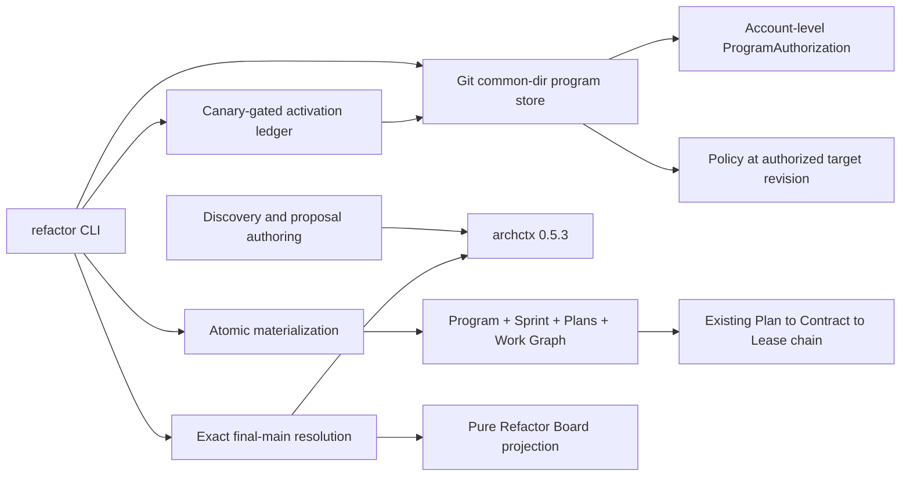
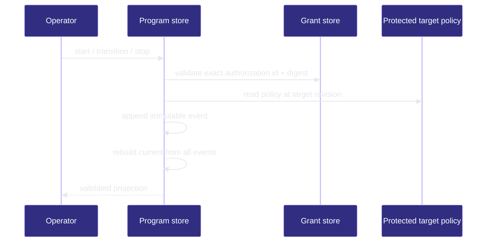

# Refactor Program

## 1. P1:能力架构地圖

### Responsibility

The Refactor Program capability owns repo-harness orchestration around the package-local ArchContext refactor provider. ArchContext remains the only structural-analysis and recommendation-lifecycle authority; repo-harness owns accountable proposal authoring, policy, workflow routing, execution evidence, and closure.

### Runtime Boundary

- Core contracts and pure projections live under `src/core/refactor/`.
- Provider calls, Git-common-directory program state, materialization, verification, and resolution effects live under `src/effects/refactor/`.
- The operator entrypoint is `src/cli/commands/refactor.ts` once the program lifecycle is activated.

## 2. P2:端到端數據流

The implemented paths are:

```text
proposal-free request
  -> ArchContext scan
  -> structural observations with null scale
  -> accountable proposal author
  -> proposal-bound ArchContext scan
  -> provider-owned scale

operator start / status / stop
  -> account-level ProgramAuthorization binding
  -> policy from the exact protected target revision
  -> immutable event append under the Git common directory
  -> current projection rebuilt from the full event chain

accepted recommendation set
  -> ArchContext Book readback proves status = accepted at current HEAD
  -> exact RefactorProgramV1 bindings
  -> one contract-gated Work Package and rollback boundary per architecture node
  -> canonical Sprint rows plus Work Graph dependencies
  -> Program, Sprint, Plans, policies, and rollback artifacts published by one Git CAS
  -> planning state; Contract and Lease remain downstream authorities

architecture-scale recommendation
  -> exact provider targetDelta readback
  -> unresolved target gate
  -> architecture_approval_required state
  -> existing architecture-projection accept receipt
  -> atomic projection-doc plus Work Package materialization

executing Work Package
  -> verify-contract
  -> Cutover Closure at exact candidate commit
  -> optional ArchContext 0.5.3 candidate preverify
  -> AcceptanceReceipt at the same contract and commit
  -> immutable candidate-verification receipt
  -> finalized PR and merge references append one execution binding

finalized merge on exact protected target
  -> append exact execution binding
  -> ArchContext verify at exact final main and worktree digest
  -> append provider resolution evidence
  -> ArchContext lifecycle resolve only for resolved evidence
  -> rebuild versioned JSON and Markdown board from authorities
  -> complete only when every bound recommendation is resolved

activation request
  -> append repository-local canary receipts bound to exact HEAD
  -> require the fixed canary subset for the next rung
  -> append one immutable activation event
  -> permit shadow, module execution, then cross-module execution without skips
```

- Proof: `proven` (capability node entrypoints and required flows bind discovery plus lifecycle store paths).



> **Proof**: `proven`; lifecycle selectors bind CLI sources to the program-store sinks.



## 3. P3:設計決策與不變量

- No local module statistics, dependency analysis, cycle detection, refactor scoring, or scale inference.
- No copied recommendation status or locally synthesized resolution.
- Materialization re-reads ArchContext lifecycle authority and accepts only exact `recommendationId` + fingerprint pairs whose current status is `accepted`.
- Every generated Work Package ID must be present in the account-level ProgramAuthorization allowlist.
- Every mutating program transition is append-only, idempotent by exact event identity, and rejected on conflicting replay.
- Candidate worktrees cannot relax the target revision's policy or authorization.
- Architecture-scale work always crosses the existing human architecture-acceptance boundary.
- An architecture approval reference is derived from the complete target delta; the existing projection receipt must bind that reference, the exact affected nodes, and the exact provider major-change reasons.
- Projection-owned architecture file changes join the same Git CAS as the Refactor Program artifacts; the refactor lane never renders architecture docs itself.
- Workflow route is a pure three-input projection of provider-owned scale, scale reason codes, and major-change reasons; a supplied route is accepted only when it equals that projection.
- Materialization never creates a Lease: it writes only Program bindings, canonical Sprint tasks, Work Packages, Plans, and their exact acceptance and rollback references.
- One affected architecture node maps to one Work Package, one rollback boundary, and one repo-scoped concurrency key; dependency topology must validate before the Git CAS.
- A failed CAS leaves the append-only program at `materializing`; replay recognizes only the exact authorized child commit and finishes the `planning` transition idempotently.
- Completion requires Cutover Closure plus exact post-merge ArchContext measurement.
- Candidate verification preserves the fixed four-gate order. A closure failure prevents provider and acceptance calls; an unavailable Stage 2 provider is recorded explicitly and never weakens Contract, closure, or AcceptanceReceipt gates.
- Execution bindings contain only immutable references. Candidate verification is a separate receipt because PR and merge identities do not exist at preverify time; no nullable or lifecycle fields represent a partial binding.
- Refactor Board joins Program, recommendation readback, execution bindings, and resolution evidence by exact recommendation ID plus digest; duplicate authorities fail closed.
- Merge observation alone is `merged_pending_measurement`. Only provider evidence bound to the exact final-main commit may resolve a card, while stale evidence requires reconciliation and all other non-resolved dispositions require follow-up.
- Discovery re-reads ArchContext lifecycle state and excludes exact resolved or superseded recommendation identities before assigning candidate aliases.
- Runtime policy is an intent ceiling, not activation evidence: shadow requires the shadow rung, active execution requires `active_module`, and cross-module materialization additionally requires `active_cross_module`.
- Activation events are append-only, advance exactly one rung, and bind the fixed canary receipt subset to the same repository and exact target revision. Architecture intervention retains its independent human approval at every rung.

## Verification

Run the root required checks and the focused Refactor Program tests recorded in the capability node.
