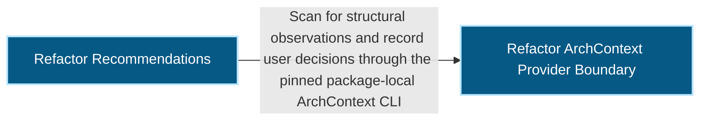
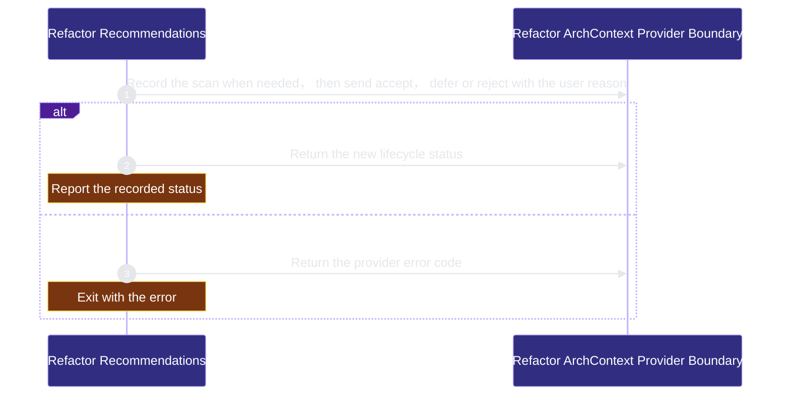
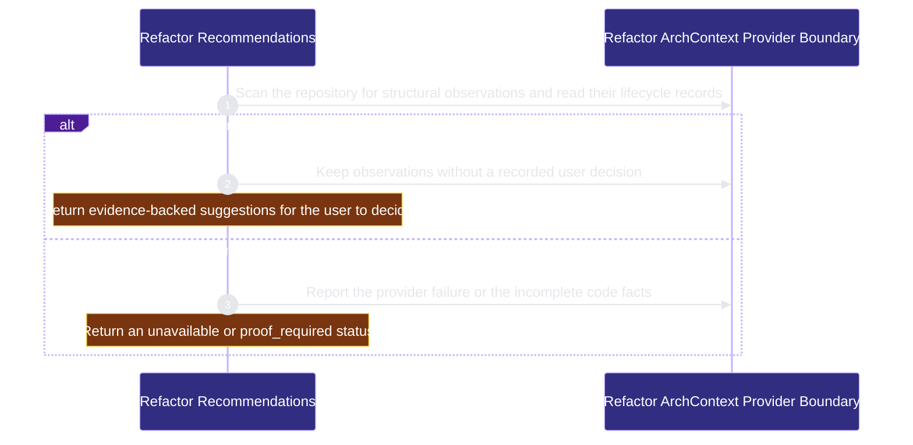

# Refactor Program
<!-- BEGIN ARCHCONTEXT:generated target="projection_target.entity.capability-runtime-harness-refactor-program" sourceDigest="sha256:9d65995a7037de891f163871edcdf0379448308c5a6cb20a9be9f6b78d291d02" rendererVersion="archcontext.docs-renderer/v4" outputDigest="sha256:3805081506b3e6a95610c393e0949ab093aa989ffe62d30992c1e0b379ffe79b" -->
> **狀態**:`active`
> **Capability ID**:`capability.runtime-harness.refactor-program`(kind `capability`)
> **Matched Prefixes**:`src/core/refactor/**`、`src/effects/refactor/**`、`src/cli/commands/refactor.ts`
> **Local Contracts**:`AGENTS.md`、`CLAUDE.md`
> **事實優先級**:倉庫當前狀態 > 本文檔機器區 > 本文檔人工區。機器區(引言、§1、§2)由 ArchContext 從架構模型與源碼度量投影生成,手改會在下次投影被覆蓋。本文檔不記錄出處;本次投影所驗證的 commit 見 `docs/architecture/.projection-manifest.json`。

Shows measured ArchContext refactor suggestions with their evidence and records the user decision; it never executes a refactor.

## 1. P1:能力架構地圖

### 1.1 架構圖

```mermaid
flowchart LR
  p1_capability_runtime_harness_refactor_program_75614af4["Refactor Recommendations"]:::component
  p1_component_refactor_program_archctx_provider_66030fac["Refactor ArchContext Provider Boundary"]:::component
  p1_capability_runtime_harness_refactor_program_75614af4 -->|"Scan for structural observations and record user decisions through the pinned package-local ArchContext CLI"| p1_component_refactor_program_archctx_provider_66030fac
  classDef actor fill:#111827,color:#ffffff,stroke:#f9fafb,stroke-width:2px
  classDef component fill:#075985,color:#ffffff,stroke:#bae6fd,stroke-width:2px
  classDef datastore fill:#3f6212,color:#ffffff,stroke:#d9f99d,stroke-width:2px
  classDef external fill:#7c2d12,color:#ffffff,stroke:#fed7aa,stroke-width:2px
```

- Proof: `proven` (`sha256:ca01f69fe60ae1e41e747adb8ee423415f10c1a048dcf8d81d02fb4dca31d472`).
- Semantic nodes: `2`; declared relations: `1`.

### 1.2 模組職責表

| 宣告入口 | 錨點 | 職責 |
| --- | --- | --- |
| `entrypoint.refactor-program.observe` | `src/effects/refactor/recommendations.ts#discoverRefactorRecommendations` | `sink.refactor-program.provider-scan` → `src/effects/refactor/archctx-provider.ts#runRefactorScan` |
| `entrypoint.refactor-program.decide` | `src/cli/commands/refactor.ts#decideRefactorRecommendation` | `sink.refactor-program.decision` → `src/effects/refactor/archctx-provider.ts#decideRecommendation` |

### 1.3 規模信號

- 規模量級:`5–10` 個文件 / `200–500` 行
- 匹配前綴:`src/core/refactor/**`、`src/effects/refactor/**`、`src/cli/commands/refactor.ts`
- 推導:掃描 `source.include` 減 `source.exclude`,跳過 `.git/` 與 `node_modules/`,再按 1–2–5 階梯分桶。精確計數不入本文檔:量級足以回答「這個能力有多大」,而逐行計數會讓覆蓋範圍內任何一次源碼改動都改寫本文檔。

### 1.4 依賴邊界

出向關係:

- `calls` → `component.refactor-program.archctx-provider` — Scan for structural observations and record user decisions through the pinned package-local ArchContext CLI

入向關係:

- 無。

## 2. P2:端到端數據流

> **Proof**: `proven` (`sha256:ca01f69fe60ae1e41e747adb8ee423415f10c1a048dcf8d81d02fb4dca31d472`); selectors `2/2`.

```mermaid
%%{init: {"theme":"base","themeVariables":{"background":"#0d1117","actorBkg":"#312e81","actorBorder":"#c4b5fd","actorTextColor":"#ffffff","signalColor":"#e5e7eb","signalTextColor":"#e5e7eb","labelBoxBkgColor":"#4c1d95","labelBoxBorderColor":"#c4b5fd","labelTextColor":"#ffffff","noteBkgColor":"#78350f","noteBorderColor":"#fcd34d","noteTextColor":"#ffffff","sequenceNumberColor":"#ffffff"}}}%%
sequenceDiagram
  autonumber
  participant p2_refactor_program_a8b792d5 as Refactor Recommendations
  participant p2_archctx_provider_3b536550 as Refactor ArchContext Provider Boundary
  p2_refactor_program_a8b792d5->>p2_archctx_provider_3b536550: Record the scan when needed， then send accept， defer or reject with the user reason
  alt ArchContext stores the decision and later scans hide the suggestion
  p2_refactor_program_a8b792d5->>p2_archctx_provider_3b536550: Return the new lifecycle status
    Note over p2_refactor_program_a8b792d5: Report the recorded status
  else An unknown suggestion or a provider error records nothing
  p2_refactor_program_a8b792d5->>p2_archctx_provider_3b536550: Return the provider error code
    Note over p2_refactor_program_a8b792d5: Exit with the error
  end
```

```mermaid
%%{init: {"theme":"base","themeVariables":{"background":"#0d1117","actorBkg":"#312e81","actorBorder":"#c4b5fd","actorTextColor":"#ffffff","signalColor":"#e5e7eb","signalTextColor":"#e5e7eb","labelBoxBkgColor":"#4c1d95","labelBoxBorderColor":"#c4b5fd","labelTextColor":"#ffffff","noteBkgColor":"#78350f","noteBorderColor":"#fcd34d","noteTextColor":"#ffffff","sequenceNumberColor":"#ffffff"}}}%%
sequenceDiagram
  autonumber
  participant p2_refactor_program_a8b792d5 as Refactor Recommendations
  participant p2_archctx_provider_3b536550 as Refactor ArchContext Provider Boundary
  p2_refactor_program_a8b792d5->>p2_archctx_provider_3b536550: Scan the repository for structural observations and read their lifecycle records
  alt Open suggestions are shown with their metrics and module statistics
  p2_refactor_program_a8b792d5->>p2_archctx_provider_3b536550: Keep observations without a recorded user decision
    Note over p2_refactor_program_a8b792d5: Return evidence-backed suggestions for the user to decide
  else A missing model， provider or complete code facts produces no suggestion
  p2_refactor_program_a8b792d5->>p2_archctx_provider_3b536550: Report the provider failure or the incomplete code facts
    Note over p2_refactor_program_a8b792d5: Return an unavailable or proof_required status
  end
```
<!-- END ARCHCONTEXT:generated target="projection_target.entity.capability-runtime-harness-refactor-program" -->
## 3. P3:設計決策與不變量

- repo-harness has no local module statistics, dependency analysis, cycle detection, refactor scoring or scale inference. ArchContext owns structural observations, recommendation identity and lifecycle status.
- A suggestion is shown with the evidence of the scan that produced it: the observation metrics and the statistics of each affected module. Nothing else is synthesized.
- repo-harness keeps no delivery ledger, cooldown or local recommendation state. A suggestion with a recorded decision (accepted, rejected, deferred, waived, resolved, superseded, expired) is not shown again.
- `decide` records the scan in ArchContext only when the suggestion is not yet recorded, then sends the decision with the user's reason.
- repo-harness never executes a refactor. An accepted suggestion goes through the normal plan and pull request workflow. The previous Refactor Program (state machine, materialization, activation canaries, execution binding, post-merge resolution) was deleted on 2026-10-10.
- An unavailable provider is silent at Stop, so repositories without an architecture model see no noise. Incomplete code facts print `proof_required` with the `codegraph init` remedy.

## Verification

Run the root required checks and the focused tests recorded in the capability node.
