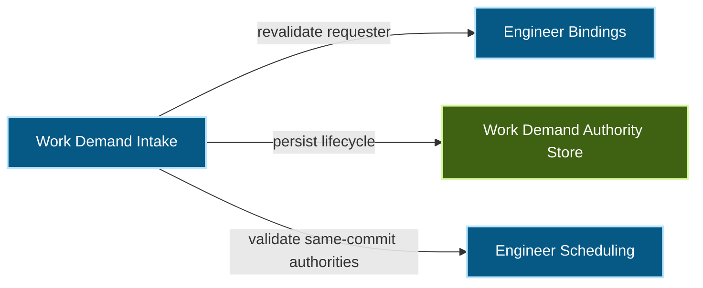
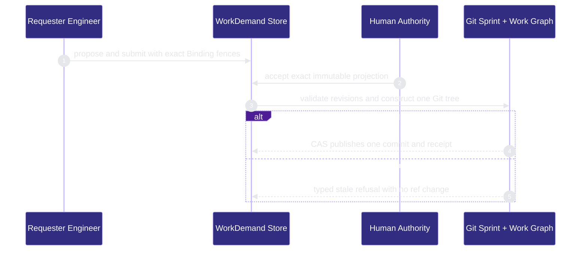

# runtime-harness/work-demand 架构文档

> **状态**: `active`
> **Capability ID**: `capability.runtime-harness.work-demand`
> **Matched Prefixes**: `src/core/engineers/work-demand.ts`、`src/effects/engineers/work-demand-store.ts`、`src/effects/engineers/work-demand-materialization.ts`

Owns durable Agent-originated requests and Human-authorized atomic task materialization.

## 1. P1: 能力架构地图

### 1.1 架构图

- Proof: `proven` (`sha256:95c87b698ac4945affb6a0fc416fce7ad02834ac8a6c072ccb30e2e0541707a0`).
- Semantic nodes: `4`; declared relations: `3`.

### 1.2 模块职责表

| 声明入口 | 锚点 | 职责 |
| --- | --- | --- |
| `entrypoint.work-demand.event` | `src/core/engineers/work-demand.ts#buildWorkDemandEvent` | 构造 closed、digest-bound 生命周期事件 |
| `entrypoint.work-demand.binding` | `src/effects/engineers/work-demand-store.ts#validateEngineer` | 复验 requester 的当前 Binding fence |
| `entrypoint.work-demand.materialize` | `src/effects/engineers/work-demand-materialization.ts#materializeWorkDemand` | 在单一 Git tree 中发布 Sprint 与 Work Graph |

### 1.3 规模信号

- 规模量级: `5–10` 个文件 / `500–1000` 行。
- 强依赖: Engineer Binding、Sprint schema 2、WorkGraphV1、Git ref CAS。
- 弱依赖: CLI、MCP 和 Operator 状态投影。

## 2. P2: 端到端数据流

> **Proof**: `proven` (`sha256:95c87b698ac4945affb6a0fc416fce7ad02834ac8a6c072ccb30e2e0541707a0`); selectors `3/3`.

压力点位于 canonical ref 的最终 CAS：此前所有 blob/tree 写入均不可见，只有 Sprint 与 Work Graph 同时存在的新 tree 才能成为权威 commit。

## 3. P3: 设计决策与不变量

请求文本和 advisory urgency/dependency hints 始终是未信任输入。Human acceptance 冻结真正的 Task 与 Work Package 字节；materialization receipt 只证明创建工作，不创建 Claim、Lease 或 WorkEnvelope。10x 规模下首先受压的是 Git-common-dir 的逐 demand 文件枚举，单 demand 锁与原子 ref 更新仍保持正确；届时可增加可重建索引，不改变权威文件。
