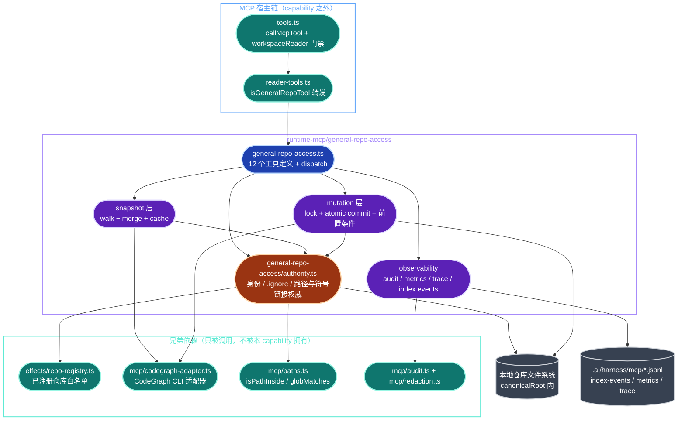
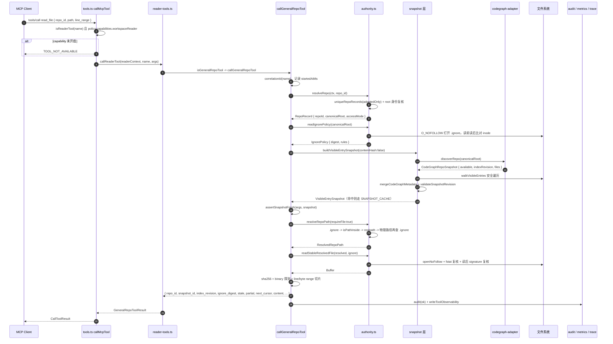
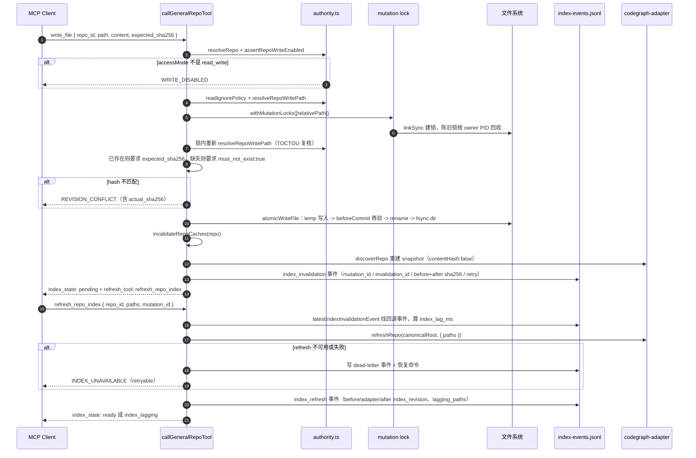

# runtime-mcp/general-repo-access 架构文档

<!-- BEGIN archctx:intro -->

> 状态：基于 `main` 工作树的 by-capability 架构复核稿。
> Verified against: main@13686d8d（2026-08-08）
> **Capability ID**: `runtime-mcp-general-repo-access`
> **Matched Prefixes**（取自 `.ai/context/capabilities.json`）：`src/cli/mcp/general-repo-access.ts`、`src/cli/mcp/general-repo-access`、`tests/cli/mcp-reader-tools.test.ts`、`tests/cli/mcp-codegraph-contract.test.ts`、`tests/cli/mcp-policy.test.ts`、`tests/cli/mcp-tools.test.ts`
> **Local Contracts**: `AGENTS.md`、`CLAUDE.md`
> **Architecture domain / capability**: `runtime-mcp` / `general-repo-access`
> **Workstream dir**: `tasks/workstreams/runtime-mcp/general-repo-access`（capabilities.json 已声明，当前尚未创建）
> 事实优先级：**实际源码 > 本文 > `docs/architecture/decisions/20260622-general-repo-codegraph-access.md` > 任何计划文档**。本文只画已实现现状；任何尚未接线的东西必须显式标注为「目标设计」或「已实现、保留字段」。

<!-- END archctx:intro -->

## 0. 阅读约定

沿用仓库既有的状态纪律，避免把规划画成现状：

| 标记 | 含义 |
| --- | --- |
| **已实现、已接线** | 当前源码存在，并位于真实 MCP dispatch runtime path |
| **已实现、保留字段** | 类型/接口/schema 已存在，但当前没有生产消费者 |
| **目标设计** | 只存在于 ADR 或计划文档，尚未成为源码 |

本 capability 的产品边界：把一个**用户已注册并已 adopt** 的本地仓库，通过 MCP 暴露给外部 agent 做完整分析与受控写入，唯一的内容级排除源是该仓库的 `.ignore`。授权、路径策略、快照语义、变更安全与审计全部由 repo-harness 自己持有；CodeGraph 只是索引元数据来源，不是策略引擎。

<!-- BEGIN archctx:p1 -->

## 1. P1：能力架构地图

### 1.1 内部模块与强依赖



### 1.2 模块职责表

| 文件 | 主要 exports / 职责 |
| --- | --- |
| `src/cli/mcp/general-repo-access.ts` | 唯一工具定义与 dispatch 拥有者。`GENERAL_REPO_TOOLS` 冻结 12 个工具名（`general-repo-access.ts:161`）；`buildGeneralRepoToolDefinitions()`（`:2671`）产出 inputSchema + annotations；`callGeneralRepoTool()`（`:2846`）是唯一入口，一个 `switch` 分派全部 12 个工具，并在 `try/catch` 里统一做 audit、redaction、correlation id 与 observability 落盘 |
| 　└ snapshot 层 | `buildVisibleEntrySnapshot()`（`:1180`）走全量可见条目；`buildManifestPageSnapshot()`（`:1087`）为 `repo_manifest` 做流式分页；`mergeCodeGraphMetadata()`（`:1069`）把 CodeGraph 元数据并入文件系统 walk 结果；`rememberSnapshot()`（`:1227`）维护 TTL=5min、上限 16 条的进程内 `SNAPSHOT_CACHE`；`validateSnapshotRevision()`（`:960`）在 walk 后复算 digest，发现漂移最多重试 1 次（`MAX_SNAPSHOT_BUILD_ATTEMPTS = 2`） |
| 　└ mutation 层 | `withMutationLocks()`（`:775`）基于 `linkSync` 的跨进程路径锁，锁目录 `mcp/mutation-locks`，含 owner.json + PID 存活检测的陈旧锁回收（`:663`–`:718`）；`atomicWriteFile()`（`:1573`）temp+rename 提交并 fsync 目录；`commitMoveNoOverwrite()`（`:1715`）用 `bun:ffi` 直接调用 `renamex_np`/`renameat2`/`MoveFileExW` 实现无覆盖原子改名；`mutationResult()`（`:1777`）/ `deleteMutationResult()`（`:1858`）产出统一的变更响应与 index invalidation 事件 |
| 　└ observability | `audit()`（`:221`）+ `writeToolObservability()`（`:532`）；三条 JSONL 落盘面：`.ai/harness/mcp/index-events.jsonl`、`metrics.jsonl`、`trace.jsonl`（`:193`–`:197`）。事件里存 hash、路径、revision、retry 指令，不存文件正文 |
| `src/cli/mcp/general-repo-access/authority.ts` | 全部安全权威。`uniqueRepoRecords()`（`authority.ts:141`）只接受 `readRegisteredRepoHarnessRepos({ adoptedOnly: true })` 里的仓库；`resolveRepo()`（`:175`）复核 canonical root 与 `dev:ino:birthtime` 身份，被换根即 `REPO_NOT_ALLOWED`；`normalizeRepoRelativePath()`（`:188`）拒绝绝对路径、`\0`、`..`；`readIgnorePolicy()`（`:222`）/ `isIgnored()`（`:284`）实现 `.ignore` 语义；`resolveRepoPath()`（`:323`）、`resolveRepoWritePath()`（`:442`）、`resolveWalkedRepoPath()`（`:492`）三个路径守卫；`readStableResolvedFile()`（`:565`）用 `O_NOFOLLOW` 打开并在读前读后各校验一次 inode 与 metadata signature；`assertRepoWriteEnabled()`（`:405`）是 `read_write` 唯一闸门 |

工具清单（`general-repo-access.ts:161`，全部**已实现、已接线**）：

| 分组 | 工具 | 需要 `read_write` |
| --- | --- | --- |
| 元信息 | `get_repo_capabilities` | 否 |
| 读平面 | `repo_manifest`、`list_tree`、`stat_file`、`read_file`、`read_files`、`search_text` | 否 |
| 写平面 | `write_file`、`apply_patch`、`move_path`、`delete_path` | 是 |
| 索引 | `refresh_repo_index` | 是（列在 `WRITE_TOOLS`，`:192`） |

### 1.3 规模信号

实测于 main@13686d8d：

| 面 | files / LOC | 设计压力 |
| --- | ---: | --- |
| 生产源码 | 2 / 3,504 | 单文件 `general-repo-access.ts` 占 2,924 行，是 capability 的绝对重心 |
| 　`general-repo-access.ts` | 1 / 2,924 | 工具定义、snapshot、mutation、observability 四类职责同居一个模块 |
| 　`general-repo-access/authority.ts` | 1 / 580 | 唯一被抽出的安全层，读写路径共享 |
| 契约测试 | 4 / 3,223 | test:prod ≈ 0.92:1；`mcp-reader-tools.test.ts` 单文件 1,852 行 |

复算命令：

```bash
find src/cli/mcp/general-repo-access.ts src/cli/mcp/general-repo-access -type f -name '*.ts' ! -name '*.test.ts' -print | sort | xargs wc -l
find tests/cli -type f \( -name 'mcp-reader-tools.test.ts' -o -name 'mcp-codegraph-contract.test.ts' -o -name 'mcp-policy.test.ts' -o -name 'mcp-tools.test.ts' \) -print | sort | xargs wc -l
```

### 1.4 依赖边界

允许的出边（当前事实）：

- `→ src/effects/repo-registry`：仓库白名单与 `RepoHarnessAccessMode` 的唯一来源。
- `→ src/cli/mcp/paths`：`isPathInside`、`globMatches` 两个纯函数。
- `→ src/cli/mcp/codegraph-adapter`：`discoverRepo` / `refreshRepo`，通过 `GeneralRepoToolContext.codeGraphAdapter` 可注入，默认落到模块级 `DEFAULT_CODEGRAPH_ADAPTER`（`:189`）。
- `→ src/cli/mcp/audit`、`redaction`、`types`：审计写入、错误文本脱敏、`McpPolicy` 类型。
- `→ 文件系统`：只在 `repo.canonicalRoot` 之内。

允许的入边：只有一条。`src/cli/mcp/reader-tools.ts:11` 是本 capability 在生产代码里的**唯一** import 站点；`reader-tools.ts:435` 用 `isGeneralRepoTool(name)` 判定后转发。`buildGeneralRepoToolDefinitions()` 的结果被 `buildReaderToolDefinitions()`（`reader-tools.ts:206`）拼进 reader 工具集。

禁止的边：

- 不得被 `coding-tools.ts`、`state-tools.ts` 或任何 CLI 命令直接 import——绕过 `reader-tools.ts` 就绕过了 `policy.capabilities.workspaceReader` 门禁（`tools.ts:1086`）。
- 不得暴露本地绝对路径给外部工具面；`repo_id` + repo-relative path 是唯一对外寻址方式，`canonicalRoot` 只是服务端注册表数据。
- 不得把 CodeGraph 结果当作授权判据或可见性判据（见 §3 不变量 I3）。
- 不得在 audit / metrics / trace / 错误消息里写入文件正文。

<!-- END archctx:p1 -->

<!-- BEGIN archctx:p2 -->

## 2. P2：端到端数据流

### 2.1 主路径：`read_file` 一次完整握手



关键契约点：

- 授权早于索引。`resolveRepo` → `readIgnorePolicy` → `resolveRepoPath` 三步全部跑完之前，任何 CodeGraph 调用都不影响是否可读；`discoverRepo` 只贡献 `indexed`、`index_revision` 与 lagging 统计。
- 每个读响应都带同一组一致性字段，由 `commonFields()`（`:788`）统一拼装：`repo_id`、`snapshot_id`、`index_revision`、`ignore_digest`、`stale`、`partial`、`next_cursor`，外加 `snapshot_state` / `snapshot_created_at` / `snapshot_expires_at` / `snapshot_ttl_ms` / `snapshot_cache` 这组 ADR 未列出的可观测字段（实现是 ADR 契约的超集）。
- `backend` 字段区分 `codegraph-indexed-filesystem-read` 与 `filesystem-fallback`（`:1953`、`:2002`）；无论哪种，读取都走同一条被守卫的文件系统路径。

### 2.2 写路径与索引失效（`write_file` → `refresh_repo_index`）



### 2.3 错误路径要点

`callGeneralRepoTool` 的 catch 分三档（`:2899`–`:2923`）：`GeneralRepoAccessError` → `blocked` + 原 code；其他异常 → `failed` + `INTERNAL_ADAPTER_ERROR`。两档的 message 都先过 `redactMcpText`。

| 触发条件 | code | 落点 |
| --- | --- | --- |
| `repo_id` 缺失、不在白名单、根被移动或换成别的目录 | `REPO_NOT_ALLOWED` | `authority.ts:177`、`:179`、`:183` |
| 绝对路径、Windows 盘符、`\0`、`..` 段 | `INVALID_RELATIVE_PATH` | `authority.ts:191`、`:198` |
| 命中 `.ignore`（含符号链接物理目标命中、open 之后再命中） | `PATH_IGNORED` | `authority.ts:331`、`:365`、`:549` |
| realpath 落到 root 之外 | `PATH_OUTSIDE_REPO` | `authority.ts:335`、`:360`、`:545` |
| 符号链接指向 root 之外，或写路径穿符号链接 | `SYMLINK_ESCAPE` | `authority.ts:353`、`:455`；`.ignore` 本身是链接也走这条（`:227`） |
| 打开/读取期间 inode、parent、metadata signature 变化 | `SNAPSHOT_STALE`（retryable） | `authority.ts:541`、`:553`、`:560`、`:574` |
| 请求的 `snapshot_id` 与当前快照不一致 | `SNAPSHOT_STALE`（retryable） | `general-repo-access.ts:1308` |
| 覆盖写缺 `expected_sha256`，或新建缺 `must_not_exist` | `REVISION_CONFLICT` | `:2067`、`:2081`、`:2120` |
| `expected_sha256` 与实际不符 | `REVISION_CONFLICT`（带 `actual_sha256`） | `:1618`、`:1626` |
| 目标已存在但要求 `must_not_exist` | `TARGET_EXISTS` | `:2060` |
| 只读仓库调用写工具 | `WRITE_DISABLED` | `authority.ts:407` |
| 二进制文件未给 `byte_range` | `BINARY_CONTENT` | `:1964` |
| `line_range` 超出字节预算 | `PAYLOAD_LIMIT_REACHED` | `:1976` |
| `line_range` 与 `byte_range` 同时给、cursor 语法错、正则非法 | `INVALID_RANGE` | `:1922`、`:1928`、`:2602` |
| CodeGraph adapter 无 `refreshRepo` 或 refresh 未成功 | `INDEX_UNAVAILABLE`（retryable，写 dead-letter） | `:2295`、`:2343` |

失败也进审计：`blocked` 与 `failed` 两条路径都调用 `audit()` 与 `writeToolObservability()`，`errorCode` 进 metrics，但 payload 正文不进。

<!-- END archctx:p2 -->

## 3. P3：设计决策与不变量

设计出处见 `docs/architecture/decisions/20260622-general-repo-codegraph-access.md`（Sprint 0 contract freeze，2026-06-22）。该 ADR 的核心判断——「不要把授权和索引搅在一起」——在当前源码里逐条可验证。

### 3.1 不变量（源码复验）

| # | 不变量 | 复验点 |
| --- | --- | --- |
| I1 | 路径先被授权，再调用 CodeGraph | `readFilePayload` 的 `resolveRepoPath` 与 `readStableResolvedFile` 与 CodeGraph 结果完全解耦；`snapshot.entriesByPath` 只提供 `indexed` 标志 |
| I2 | 每个从 CodeGraph 回来的路径要重新过 root 包含与 `.ignore` | `codeGraphMetadataIndex()`（`:1020`）在合并前过滤，`filteredPaths` 计数进响应 |
| I3 | `repo_manifest` 是可见文件集权威，search 不是完整性证明 | manifest 走安全文件系统 walk（`walkVisibleEntries`），`search_text` 的候选集来自 snapshot.entries，且**从不**调用 adapter 的搜索能力 |
| I4 | 传输上限只产生分页/分块/显式错误，不从 manifest 里删文件 | `pageEntries()`（`:1331`）与 `next_cursor`；`repo_manifest` 用流式分页而非截断 |
| I5 | 二进制与不可读条目仍以元数据可见 | `metadataForResolved()` 对不可读条目仍产出 entry；`read_file` 才抛 `BINARY_CONTENT` |
| I6 | 写工具必须有 `read_write` + revision 前置条件 | `assertRepoWriteEnabled()` 在四个写工具与 `refresh_repo_index` 的第二行；覆盖/patch/move/delete 全部强制 `expected_sha256`，新建强制 `must_not_exist` |
| I7 | 文件正文不进日志、审计、trace、错误 | 事件只写 `file_hashes`、`relative_paths`、revision；错误 message 过 `redactMcpText` |
| I8 | 外部工具面只认 `repo_id` + repo-relative path | 所有 `inputSchema` 无绝对路径字段；`normalizeRepoRelativePath` 直接拒绝绝对路径 |
| I9 | 目录形状变更不在 v1 变更层 | `move_path` / `delete_path` 只接受 regular file，目标父目录必须已存在，无递归删除 |

### 3.2 约束与权衡

- **`.ignore` 是唯一内容级排除源。** `.gitignore`、`.rgignore`、dotfile、隐藏目录、扩展名、工作流产物身份都不是隐式策略。唯一的硬编码例外是 `.ignore` 文件自身恒被排除（`authority.ts:285`）——这是 ADR 文本里没写出来的一条额外规则。
- **CodeGraph 是元数据来源，不是读取后端。** ADR 写的是「CodeGraph owns indexed code discovery and symbol/text retrieval where it can provide them」，但当前实现里 `GeneralRepoCodeGraphAdapter.searchText`（`codegraph-adapter.ts:59`）**零生产消费者**——`search_text` 全程自己扫文件，只用 `entry.indexed` 决定 `backend` 标签。这是**已实现、保留字段**，不是已接线能力。
- **快照优先于性能。** `SNAPSHOT_TTL_MS = 5min`、`MAX_SNAPSHOT_CACHE_ENTRIES = 16`、`MAX_ENTRY_METADATA_CACHE_ENTRIES = 200,000`。walk 完还要 `validateSnapshotRevision` 复算一遍 digest；漂移时最多重建一次，仍漂移就把 `stale` / `partial` 如实返回而不是重试到成功。
- **变更层是 portable v1。** 保留 mode bits，不保留 ownership、xattr、平台特有元数据；mtime 随提交改变。无覆盖改名靠 `bun:ffi` 直调三个平台的原生 syscall（`:1684`–`:1714`），代价是这一段绑死 Bun runtime。
- **锁是跨进程的但基于文件系统。** `linkSync` + owner.json + PID 存活检测。在 NFS 或容器跨节点共享的仓库上，PID 存活检测会误判。
- **权威只抽了安全逻辑。** dispatch 留在 `general-repo-access.ts`，没有引入插件接口或公共 API。代价是 2,924 行的单文件；收益是新增工具不需要跨模块协商契约。

### 3.3 10x 规模下先垮的点

按当前实现，压力顺序是：

1. **单仓库文件数 10x（≈ 数十万条目）。** `buildVisibleEntrySnapshot` 是全量同步 walk，`ENTRY_METADATA_CACHE` 上限 200k 条会开始抖动，`get_repo_capabilities` / `search_text` / 每次 mutation 响应都各重建一次快照。这是最先垮的。
2. **注册仓库数 10x。** `resolveRepo()` 每次调用都重跑 `uniqueRepoRecords()` → 读注册表 + 对每个仓库 `statSync`/`realpathSync`，是 O(N) 全表扫描，没有缓存。
3. **并发 MCP 会话 10x。** `SNAPSHOT_CACHE` 只有 16 条且是进程内全局，跨仓库共享；多仓库并发会互相驱逐，退化成每次全量重建。
4. **变更频率 10x。** `index-events.jsonl` 只追加不轮转，`readRecentIndexEvents()` 每次 refresh 都要读尾部；`refreshRepo` 走的是 repo 级 `codegraph sync`（`path_refresh_supported: false`），单次变更触发全仓重索引。

内部模块边界（entry ↔ authority）不会先垮——先垮的都是注册表查找与快照/缓存失效，这与 ADR 的 P3 判断一致。

## 4. 历史决策记录（append-only）

本文件在 main@13686d8d 之前的版本没有带日期的章节，因此没有需要保留的日期段落。为不丢失原始判断，改写前的英文原文逐字保存于下：

### 2026-08-08 之前的原始模块文档（verbatim, pre-rewrite）

> # Architecture Module: runtime-mcp/general-repo-access
>
> > **Capability ID**: `runtime-mcp-general-repo-access`
> > **Matched Prefixes**: `src/cli/mcp/general-repo-access.ts`, `src/cli/mcp/general-repo-access`, focused MCP reader/policy/tool tests
> > **Local Contracts**: `AGENTS.md`, `CLAUDE.md`
>
> ## P1 Map
>
> This capability owns the registered-repository access tool implementation and its path-authority safety boundary.
>
> - `src/cli/mcp/general-repo-access.ts` remains the single MCP tool-definition and dispatch owner.
> - `src/cli/mcp/general-repo-access/authority.ts` owns internal repository identity, ignore policy, repo-relative path normalization, symlink containment, and registered-repo checks.
> - Existing MCP auth, audit, policy, workspace, and CodeGraph modules remain sibling dependencies; this capability does not create a plugin interface or public API.
>
> The MCP tool names, input schemas, result shapes, and audit records are public behavior and remain unchanged.
>
> ## P2 Trace
>
> Concrete route: MCP request -> authentication and policy -> registered repo resolution -> path/ignore/containment validation -> read or mutation dispatch -> audit/result. Authority and path checks run before filesystem or index access. Invalid repository identity, traversal, ignored paths, symlink escape, or stale mutation preconditions fail closed.
>
> ## P3 Decision
>
> Extract only the safety logic shared by read, search, write, patch, move, and delete paths. Keep dispatch in the existing entrypoint so the change shrinks one proven responsibility without adding an extension system. At 10x repository count, registry lookup and snapshot/cache invalidation fail before the internal module boundary does.
>
> ## Verification
>
> - `bun test tests/cli/mcp-reader-tools.test.ts tests/cli/mcp-codegraph-contract.test.ts`
> - `bun test tests/cli/mcp-policy.test.ts tests/cli/mcp-tools.test.ts`
> - `bun run check:type`

## Verification

来自 `.ai/context/capabilities.json` 的 `verification_hints`：

```bash
bun test tests/cli/mcp-reader-tools.test.ts tests/cli/mcp-codegraph-contract.test.ts
bun test tests/cli/mcp-policy.test.ts tests/cli/mcp-tools.test.ts
bun run check:type
```
