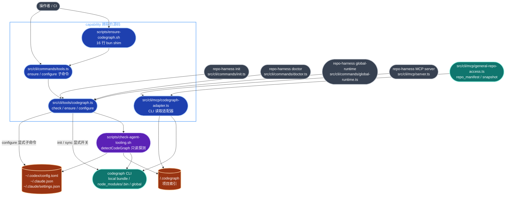
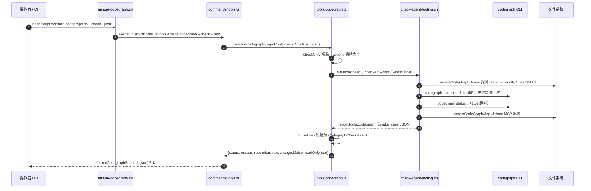

# verification/codegraph-readiness 架构文档

> 状态：基于 `main` 工作树的 by-capability 架构复核稿。
> Verified against: main@13686d8d（2026-08-08）
> Capability ID: `verification-codegraph-readiness`（domain `verification` / name `codegraph-readiness`）
> Matched Prefixes: `scripts/ensure-codegraph.sh`、`src/cli/tools/codegraph.ts`、`src/cli/mcp/codegraph-adapter.ts`、`tests/cli/codegraph-resolver.test.ts`、`docs/architecture/modules/verification/codegraph-readiness.md`
> Local Contracts: `AGENTS.md` / `CLAUDE.md`（`.ai/context/capabilities.json` 的 `contract_files`）；`workstream_dir` 声明为 `tasks/workstreams/verification/codegraph-readiness`，当前尚未创建。
> 事实优先级：实际源码 > 本文 > 任何历史 prose。本文只画**已实现、已接线**的现状；任何尚未落地的形状必须显式标注为**目标设计**。

状态标记沿用本仓架构文档约定：

| 标记 | 含义 |
| --- | --- |
| **已实现、已接线** | 当前源码存在，并位于真实 runtime path |
| **已实现、隔离** | 当前源码存在，但没有生产调用方 |
| **目标设计** | 只存在于计划或提案，尚未成为源码 |

本 capability 只做一件事：让 CodeGraph 的**就绪状态可观测**，并在被显式要求时才产生副作用。它由两条互不相同的运行时链条组成，二者共享 `codegraph` 二进制，但**不共享任何代码路径**：

- **Readiness 链**（`scripts/ensure-codegraph.sh` → `src/cli/tools/codegraph.ts` → `scripts/check-agent-tooling.sh`）：面向操作者与 `init`/`doctor`，回答"CodeGraph 装好了吗、索引在不在、host MCP 配没配"。
- **Reader 链**（`src/cli/mcp/codegraph-adapter.ts`）：面向 repo-harness 自己的 MCP server，把 CodeGraph 索引当作 general-repo-access 工具的**元数据来源**。

## 1. P1：能力架构地图



### 1.1 模块职责

| 文件 | 主要 exports / 职责 |
| --- | --- |
| `scripts/ensure-codegraph.sh` | 16 行 bun shim，唯一职责是 `exec bun src/cli/index.ts tools ensure codegraph "$@"`（`:8`），`bun` 缺失时先试 `~/.bun/bin/bun`（`:12`），再 fail-closed 退出 1（`:15`）。它本身**不含任何 CodeGraph 逻辑** |
| `src/cli/tools/codegraph.ts` | capability 的逻辑权威。`checkCodegraph`（`:160`）/ `resolveCodegraph`（`:164`）纯只读；`ensureCodegraph`（`:168`）在 `checkOnly` 时直接短路返回（`:171`）；`configureCodegraph`（`:605`）是唯一写 host MCP 配置的入口 |
| ↳ `readToolingReport`（`:112`） | 把探测彻底委派给 `bash scripts/check-agent-tooling.sh --json --host <host>`，取 `report.tools.codegraph`。本文件**不自己解析二进制或配置文件** |
| ↳ `normalize`（`:143`） | snake_case JSON → `CodegraphCheckResult`；`raw` 字段原样透传，保证 CLI `--json` 输出不丢字段 |
| ↳ `hasCodegraphDependency`（`:118`） | 读 `package.json` 三类依赖，决定 `bun install` 是否有意义 |
| ↳ `configureCodexProjectPath`（`:246`） | 正则改写 `~/.codex/config.toml` 的 `[mcp_servers.codegraph]` `args`，钉死为 `["serve","--mcp","--path","."]`（`:8`） |
| ↳ `configureClaudeProjectPath`（`:325`）/ `configureClaudeAlwaysLoad`（`:416`）/ `configureClaudeAllowedTools`（`:518`） | 分别写 `~/.claude.json` 的 `args`、`alwaysLoad=true`、以及 `~/.claude/settings.json` 的 `allowedTools` 追加 `mcp__codegraph__*`（`:6`） |
| `src/cli/mcp/codegraph-adapter.ts` | `createCodeGraphCliAdapter`（`:217`）返回 `GeneralRepoCodeGraphAdapter`（`:56`）。`discoverRepo` 走 `codegraph files --path <root> --format flat --json`（`:150`）；`refreshRepo`（`:230`）走 `codegraph sync <root>`。与 readiness 链**零共享代码** |
| ↳ `codegraphBin`（`:104`）/ `codegraphExecutionEnv`（`:94`） | `allowRepoLocalBin=false` 时把 repo 内的 PATH 条目全部剔除（`:97`），并拒绝 repo 内的 `REPO_HARNESS_CODEGRAPH_BIN`（`:107`）——这是 MCP server 的执行信任边界 |
| ↳ `revisionFor`（`:130`） | 对排序后的文件元数据取 sha256 前 16 位，生成确定性 `index_<hash>` 修订号 |
| `scripts/check-agent-tooling.sh` | 非 capability 拥有，但是 readiness 链的事实来源。`resolveCodeGraphBinary`（`:1398`）、`detectCodeGraph`（`:1468`）、`detectCodeGraphMcp`（`:1278`）、`parseCodeGraphProjectStatus`（`:1361`），并在 `--strict-readiness` 下把 `missing`/`partial` 升为退出失败（`:1596`） |
| `src/cli/commands/tools.ts` | `tools ensure codegraph`（`:113`）与 `tools configure codegraph`（`:136`）的 commander 绑定与 `--json` 格式化 |
| `tests/cli/codegraph-resolver.test.ts` | 唯一 prefix 内测试：以假 `codegraph`（`init`/`sync`/`install` 一律 exit 2）验证 `--check` 只调 `--version` 与 `status .`（`:94`-`:99`） |

### 1.2 规模信号

| 分组 | files | LOC |
| --- | ---: | ---: |
| capability 生产源码（prefix 内，排除 tests） | 3 | 1,004 |
| capability 测试（prefix 内） | 1 | 104 |
| 强依赖但不属于本 capability | 2 | 1,902 |

分布极度不均：`src/cli/tools/codegraph.ts` 676 行中约 460 行（`:225`-`:603`）是 host 配置文件改写，`codegraph-adapter.ts` 312 行几乎全是错误分支；而真正的探测逻辑 1,735 行全在 `check-agent-tooling.sh` 里，归属 `verification-evals-checks`。复算命令：

```bash
wc -l scripts/ensure-codegraph.sh src/cli/tools/codegraph.ts src/cli/mcp/codegraph-adapter.ts
wc -l tests/cli/codegraph-resolver.test.ts
wc -l scripts/check-agent-tooling.sh src/cli/commands/tools.ts
```

### 1.3 依赖边界

允许的出边（当前事实）：

- `scripts/ensure-codegraph.sh → bun → src/cli/index.ts tools ensure codegraph`，无第二条路径。
- `src/cli/tools/codegraph.ts → scripts/check-agent-tooling.sh`（只读探测）、`→ ../../effects/process-runner`（`:4`，所有子进程都经过 bounded runner）、`→ codegraph <bin> init|sync|install`（仅在显式开关下）。
- `src/cli/mcp/codegraph-adapter.ts → child_process.spawnSync`（`:1`，带 `timeout` 与 `maxBuffer` 上限，`:62`-`:63`）。

允许的入边（当前事实）：

- `src/cli/commands/tools.ts:16`、`init.ts:42`、`doctor.ts:15`、`global-runtime.ts:12` 消费 `src/cli/tools/codegraph.ts`。
- `src/cli/mcp/server.ts:133`、`general-repo-access.ts:189`、`coding-tools.ts:79` 消费 `codegraph-adapter.ts`；`reader-tools.ts:12` 与 `tools.ts:16` 只 import 类型。

禁止边（invariant，不是尚未整理的偶然状态）：

- readiness 链 **不得**自行解析 `codegraph` 二进制路径或 host 配置格式；那是 `check-agent-tooling.sh` 的单一权威。`codegraph-adapter.ts` 自己有一份 `codegraphBin`（`:104`），但它服务的是 MCP 执行面而非 readiness 判定，两者不得互相调用或互相"对齐"。
- `repo-harness install --target codex|claude|both` 只做 host adapter 安装，**不得**顺带写 CodeGraph MCP 配置。
- MCP 配置写入只允许发生在 `configureCodegraph`（以及 `init` 显式传 `configureCodegraphMcp: true` 时，`init.ts:710`），不得进入默认 ensure/check 路径。
- `_ref/` 下的 CodeGraph checkout 是参考材料，不属于就绪表面。

## 2. P2：端到端数据流

### 2.1 只读就绪查询（`--check`）

这是本 capability 最常走、也是唯一被测试钉死的路径。



输入源头是**文件系统与 `codegraph` 二进制自身**，不是任何缓存或配置声明；跨越的契约是 `check-agent-tooling.sh` 的 JSON schema（`status`/`source`/`bin_path`/`project_index`/`mcp_hosts`）。最终副作用：仅 stdout。当前仓库实测输出为 `status=present`、`source=local`、`bin_path` 指向 `node_modules/@colbymchenry/codegraph-darwin-arm64/bin/codegraph`、`project_index.status=up-to-date`（`bash scripts/ensure-codegraph.sh --check --json`，2026-08-08）。

错误路径要点：

- `runJson`（`:77`）在子进程非 ok 时直接 `throw`，不返回降级对象——探测失败必须冒泡，不得伪造 readiness。
- `codegraph --version` 超时会重试一次（`check-agent-tooling.sh:1457` 起），仍失败则 `version=null`，`status` 由后续分支决定。
- `status` 分级：无 CLI → `missing`；声明了本地依赖却落到 global、或选中 host 的 MCP 未配置、或索引 `not-initialized`/`unavailable` → `partial`；索引 `stale`/`unknown` → `warning`；全绿 → `present`。
- `--strict-readiness` 下 `missing`/`partial` 会被推入 `strictFailures`（`:1596`），把观测降级转成非零退出。

### 2.2 副作用路径（`--init` / `--sync`）与 MCP reader 路径

`ensureCodegraph` 的写路径全部由显式开关守门（`src/cli/tools/codegraph.ts:180`-`:196`）：`installDeps !== false` 且 `package.json` 声明了依赖且 `local_bin_path` 为空时才 `bun install`；`opts.init` 且索引恰为 `not-initialized` 时才 `codegraph init -i .`；`opts.sync` 时先 `mkdirSync(.codegraph)` 再 `codegraph sync .`。每一步后都重新 `readToolingReport`，即 `changed` 永远基于重新观测而非乐观假设。

MCP reader 路径是另一条链：`general-repo-access.ts` 在 `buildManifestPageSnapshot`（`:1087`，调用点 `:1089`）与 `buildVisibleEntrySnapshot`（`:1180`，调用点 `:1182`）中调 `discoverRepo`。若 `<repo>/.codegraph` 不存在，适配器立即返回 `INDEX_UNAVAILABLE` 且 `retryable=false`（`codegraph-adapter.ts:144`），上层降级为 `filesystem-fallback`（`general-repo-access.ts:528`）而**不是**报错——这是该链条与 readiness 链在失败语义上的关键差别：readiness 链 fail-loud，reader 链 fail-soft 并把失败编码进响应字段。

其余错误分支：`spawnSync` 的 `result.error` 中含 `ETIMEDOUT` 归 `INDEX_UNAVAILABLE`（可重试），其他归 `INTERNAL_ADAPTER_ERROR`（不可重试，`:160`、`:261`）；非零退出统一归 `INDEX_UNAVAILABLE`；JSON 解析失败归 `INTERNAL_ADAPTER_ERROR` 且 `retryable=false`（`:200`）。`configureCodegraph` 的失败不 throw，全部落成 `actions[]` 里的 `failed`/`skipped` 条目并附 reason（例如 Codex 无 project-local MCP 时 `--location local` 直接 `failed`，`:614`）。

## 3. P3：设计决策与不变量

不变量：

1. **只读即只读。** `--check` 路径绝不执行 `bun install`、`codegraph init`、`codegraph sync`、`codegraph install`。这条由 `tests/cli/codegraph-resolver.test.ts` 用"假 codegraph 在 init/sync/install 上 exit 2"的方式硬性钉死，而不是靠 code review。
2. **探测单一权威。** readiness 判定只有 `check-agent-tooling.sh#detectCodeGraph` 一个来源；`src/cli/tools/codegraph.ts` 是它的消费者与格式化层。任何在 TS 侧重新实现"找二进制/读配置"的代码都是重复权威。
3. **本地依赖优先于全局。** 解析顺序为 `AGENTIC_DEV_CODEGRAPH_LOCAL_BIN` → `node_modules/@colbymchenry/codegraph-<platform>-<arch>/bin/codegraph` → `node_modules/.bin/codegraph` → PATH 上的 `codegraph`（`:1398` 起，候选顺序见 `:1404`-`:1408`）。落到 global 而仓库又声明了本地依赖，会被显式判为 `partial` 而非静默通过。
4. **配置写入必须显式。** host MCP 配置只在 `tools configure codegraph` 或 `init --configure-codegraph-mcp` 下被改写；`install` 与默认 ensure/check 路径零写入。
5. **MCP 执行面不信任 repo 内的可执行文件。** `server.ts:133` 以 `allowRepoLocalBin: false` 构造适配器，PATH 中位于 repo 内的目录被剔除，repo 内的显式 bin 覆盖被拒绝。这是防"被索引的仓库反向控制索引器"的边界，不是性能取舍。
6. **下游生成仓库默认走全局 MCP。** 本自托管仓库把 CodeGraph 作为 devDependency 是特例；生成的下游仓库保持全局默认，除非本地 policy 显式选择 vendored 依赖。

约束与取舍：

- 用 shell shim 包 TS 逻辑，是为了让 hooks、文档、`check-agent-tooling.sh` 的 `ensure_command` 字段都能引用一个稳定的路径字符串，同时保持逻辑在可测试的 TS 侧。代价是多一层 `exec` 和一条 bun 缺失的 fail-closed 分支。
- host 配置改写用正则（TOML）与 JSON 原地修改而非完整重写，是为了保留用户文件里其余内容与尾随换行（`:395`、`:496`）。代价是 TOML 侧的 section 正则（`:273`）对非常规排版脆弱——找不到 section 时选择 `skipped` 而非猜测，符合 fail-closed。
- `configureCodegraph` 把失败编码为 `actions[]` 而不是抛异常，是因为它是多目标（codex + claude）批处理：一个 host 失败不应吞掉另一个 host 的结果。

10x 规模下先垮的点：

- **`discoverRepo` 的全量文件列表。** `codegraph files --format flat --json` 的输出在适配器里被整体 `JSON.parse` 到内存，上限只有 `MAX_STDOUT_BYTES = 10MiB`（`:63`）与 5s 默认超时（`:62`）。仓库文件数量上一个数量级后，先撞的是这两个常量，表现为 `INDEX_UNAVAILABLE` 而非慢——而且它在每次 manifest/snapshot 构建时都被重新调用，没有跨调用缓存。
- **`revisionFor` 的 O(n log n) 排序 + 全量 JSON 序列化**（`:130`）在同一条路径上重复执行，是第二个压力点。
- readiness 链本身不随仓库规模增长（固定几次 `--version`/`status` 调用），先垮的会是 `codegraph status .` 的 1.5s 超时，届时 `project_index.status` 退化为 `unavailable`，进而把整体 status 拉到 `partial`。

## 4. 历史决策记录（append-only）

原模块文档（`Last Updated: 2026-05-28`）全文逐字保留，未作翻译或改写：

````markdown
# CodeGraph Readiness

> **Domain**: verification
> **Capability**: codegraph-readiness
> **Status**: Active slice
> **Last Updated**: 2026-05-28

## Responsibility

Make CodeGraph readiness observable through the repo tooling surface without
changing host adapter installation semantics.

## Boundaries

- `scripts/check-agent-tooling.sh` is the read-only detector and reports
  local/global binary resolution, MCP registration, project index status, and
  update status.
- `scripts/ensure-codegraph.sh` is the mutating entrypoint for local dependency
  installation and index init/sync.
- `src/cli/tools/codegraph.ts` owns CLI resolution and
  `src/cli/mcp/codegraph-adapter.ts` owns MCP index integration.
- `repo-harness install --target codex|claude|both` remains host adapter
  installation only.
- MCP config writes stay explicit and out of the default ensure/check path.

## Runtime Flow

```text
bun install
  -> node_modules/.bin/codegraph
  -> scripts/check-agent-tooling.sh --json reports source=local

scripts/ensure-codegraph.sh --check --json
  -> scripts/check-agent-tooling.sh --json --host codex
  -> read-only report

scripts/ensure-codegraph.sh --init|--sync
  -> local CodeGraph binary first
  -> global fallback only when local is absent
  -> no MCP config writes
```

## Invariants

- Read-only checks must not run `bun install`, `codegraph init`,
  `codegraph sync`, or `codegraph install`.
- Repo-local `node_modules/.bin/codegraph` wins over global `codegraph`.
- Generated downstream repos keep the global MCP default unless local policy
  explicitly opts into a vendored dependency.
- `_ref/` CodeGraph checkouts are reference material only and are not part of
  the committed readiness surface.

## Verification

- `bun test tests/check-agent-tooling.test.ts tests/cli/codegraph-resolver.test.ts`
- `bash scripts/ensure-codegraph.sh --check --json`
- `bash scripts/check-agent-tooling.sh --host both --strict-readiness --json`
````

### 与当前源码的偏差记录（2026-08-08 复核）

以下三处历史 prose 与 main@13686d8d 源码不一致，按事实优先级以源码为准：

1. "`scripts/ensure-codegraph.sh` is the mutating entrypoint" — 该脚本当前只有 16 行，是 `repo-harness tools ensure codegraph` 的 bun shim；变更逻辑在 `src/cli/tools/codegraph.ts#ensureCodegraph`。
2. "`src/cli/mcp/codegraph-adapter.ts` owns MCP index integration" — 该文件是 repo-harness **自身 MCP server** 读取 CodeGraph 索引的适配器（`discoverRepo`/`refreshRepo`），与 host MCP 配置注册无关；host MCP 配置由 `configureCodegraph` 负责。
3. "Repo-local `node_modules/.bin/codegraph` wins over global" — 方向正确但不完整：平台包 `node_modules/@colbymchenry/codegraph-<platform>-<arch>/bin/codegraph` 排在 `node_modules/.bin/codegraph` 之前（`check-agent-tooling.sh:1406`-`:1407`），本仓实测解析到的正是平台包路径。

## 5. Verification

- `bun test tests/check-agent-tooling.test.ts tests/cli/codegraph-resolver.test.ts`
- `bash scripts/ensure-codegraph.sh --check --json`
- `bash scripts/check-agent-tooling.sh --host both --strict-readiness --json`
