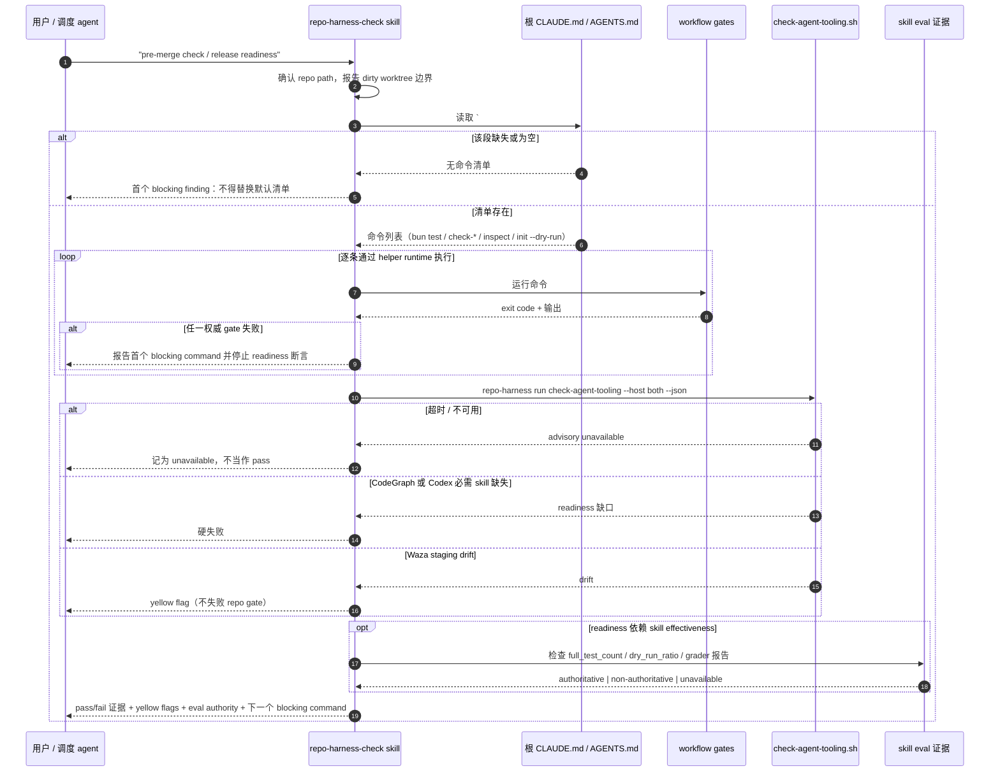

# verification/evals-checks 架构文档

> 状态：基于 `main` 工作树的 by-capability 架构复核稿。
> Verified against: main@13686d8d（2026-08-08）
> **Capability ID**: `verification-evals-checks`
> **Matched Prefixes**: `tests`, `evals`, `scripts/run-skill-evals.ts`, `scripts/run-harness-profile-benchmark.ts`, `scripts/validate-harness-profile-benchmark.ts`, `scripts/run-bounded-verifier-command.ts`, `scripts/verify-contract.sh`, `scripts/verify-sprint.sh`, `scripts/check-task-workflow.sh`, `scripts/check-task-sync.sh`, `scripts/check-agent-tooling.sh`, `scripts/check-brain-manifest.sh`, `scripts/sync-brain-docs.sh`
> **Local Contracts**: `AGENTS.md`, `CLAUDE.md`
> 事实优先级：实际源码（`scripts/*`、`tests/*`、`evals/*`、`package.json`）> 本文 > 计划与历史记录。本文只画已实现现状；任何尚未落地的形态必须显式标注为**目标设计**。

## 0. 阅读约定

| 标记 | 含义 |
| --- | --- |
| **已实现、已接线** | 当前源码存在，并被某条真实 gate/命令链调用 |
| **已实现、非权威** | 当前源码存在，但其输出被显式定义为不可用于 release/readiness 断言 |
| **目标设计** | 尚未落地为可执行文件或未接入任何 gate |

本能力面把验证拆成五层，彼此的权威边界是硬约束而非风格差异：regression tests、workflow gates、bounded contract verifier、eval fixtures、profile benchmark。**证据生产者**（profile benchmark）与**证据消费者**（bounded verifier / verify-sprint）不可互换，见 §3。

## 1. P1：能力架构地图

### 1.1 分层图

```mermaid
flowchart TB
  classDef entry fill:#374151,stroke:#d1d5db,stroke-width:2px,color:#fff
  classDef gate fill:#1e40af,stroke:#bfdbfe,stroke-width:2px,color:#fff
  classDef verifier fill:#5b21b6,stroke:#ddd6fe,stroke-width:2px,color:#fff
  classDef producer fill:#9a3412,stroke:#fed7aa,stroke-width:2px,color:#fff
  classDef store fill:#0f766e,stroke:#99f6e4,stroke-width:2px,color:#fff
  classDef advisory fill:#4b5563,stroke:#d1d5db,stroke-width:2px,color:#fff

  Skill(["repo-harness-check skill<br/>assets/skill-commands/repo-harness-check"]):::entry
  Root(["root CLAUDE.md / AGENTS.md<br/>## Required Checks"]):::entry

  subgraph Gates["Workflow gates（权威）"]
    direction TB
    BunTest(["bun test<br/>tests/**"]):::gate
    TaskSync(["check-task-sync.sh"]):::gate
    Workflow(["check-task-workflow.sh --strict"]):::gate
    ArchSync(["check-architecture-sync.sh"]):::gate
    SqlOrder(["check-deploy-sql-order.sh"]):::gate
    Inspect(["inspect-project-state.ts"]):::gate
    DryRun(["init --repo . --dry-run"]):::gate
  end

  subgraph Verifier["Bounded contract verifier（证据消费者）"]
    direction TB
    Sprint(["verify-sprint.sh"]):::verifier
    Contract(["verify-contract.sh"]):::verifier
    Bounded(["run-bounded-verifier-command.ts"]):::verifier
    Validate(["validate-harness-profile-benchmark.ts"]):::verifier
    Emit(["emit-verify-evidence.ts"]):::verifier
  end

  subgraph Producer["Evidence producers（证据生产者）"]
    direction TB
    Bench(["run-harness-profile-benchmark.ts<br/>3x9 matrix"]):::producer
    SkillEval(["run-skill-evals.ts<br/>30 evals"]):::producer
  end

  subgraph Fixtures["Eval fixtures / reports"]
    direction TB
    EvalsJson[("evals/evals.json<br/>evals/benchmark.config.json")]:::store
    FixDirs[("evals/fixtures/**<br/>evals/bdd2 · bdd3 · skill-routing")]:::store
    Report[("evals/harness/reports/<br/>profile-comparison.{json,md,sha256.json}")]:::store
  end

  subgraph Advisory["Advisory probes（非阻断）"]
    direction TB
    Tooling(["check-agent-tooling.sh"]):::advisory
    Brain(["check-brain-manifest.sh<br/>sync-brain-docs.sh"]):::advisory
  end

  Skill --> Root
  Root --> BunTest
  Root --> TaskSync
  Root --> Workflow
  Root --> ArchSync
  Root --> SqlOrder
  Root --> Inspect
  Root --> DryRun
  Skill -.->|"advisory readiness"| Tooling

  Sprint --> Contract
  Contract --> Bounded
  Sprint --> Validate
  Sprint --> Emit
  Validate --> Report
  Bench --> Report
  Bench --> EvalsJson
  SkillEval --> EvalsJson
  SkillEval --> FixDirs
  Bench --> FixDirs
  BunTest --> FixDirs

  style Gates fill:none,stroke:#60a5fa,stroke-width:2px,color:#60a5fa
  style Verifier fill:none,stroke:#a78bfa,stroke-width:2px,color:#a78bfa
  style Producer fill:none,stroke:#fb923c,stroke-width:2px,color:#fb923c
  style Fixtures fill:none,stroke:#2dd4bf,stroke-width:2px,color:#2dd4bf
  style Advisory fill:none,stroke:#9ca3af,stroke-width:2px,color:#9ca3af
```



### 1.2 模块职责表

| 文件 | 主要职责（关键锚点） |
| --- | --- |
| `tests/**` | 回归套件，`bun test` 的唯一输入面；177 个 `*.test.ts` + 6 个支撑 `.ts`，另有 json/md/sh 夹具 |
| `evals/evals.json` | skill eval 清单，`skill_name` + 30 条 `evals`（`initialize-new-project`、`route-*`、`repair-*` 等） |
| `evals/benchmark.config.json` | agent（`claude`/`codex`）与 profile（`with_skill`/`without_skill`）配置，见 `scripts/run-skill-evals.ts:22-25` |
| `scripts/run-skill-evals.ts` | skill eval runner；产出 `dryRunRatio` / `graderPassRate` / `graderStatus`（`:161-176`），并强制 disposable root/评估边界（`:271`、`:308`） |
| `scripts/run-harness-profile-benchmark.ts` | 3 profile × 9 scenario 的 harness 对照矩阵生产者；`BENCHMARK_PROFILES`（`:21`）、`BENCHMARK_PROVIDERS`（`:23`）、`BENCHMARK_WALL_TIME_BUDGET_MS = 50 min`（`:25`）、report protocol `.../report/v2`（`:112`）、`acquireExpensiveRunLock`（`:10`） |
| `scripts/validate-harness-profile-benchmark.ts` | 只读校验器（39 行）：调用 `validateHarnessBenchmarkReport` + `reportByteBindingPath`，输出 `benchmark_subject_sha256` 与 `report_evidence_sha256`；不启动矩阵 |
| `scripts/run-bounded-verifier-command.ts` | 有界子命令执行器；`detached` 进程组（`:66-67`）、TERM → grace → KILL 并在 leader 先退出时仍寻址原进程组（`:110-117`）、`FORCED_TERMINATION_CONFIRM_MS = 500`（`:40`） |
| `scripts/verify-contract.sh` | 契约验证器；`VERIFICATION_BUDGET_MS`（`:5`）、`run_bounded()`（`:556`）、`is_evidence_producer_command()`（`:512`）拒绝 benchmark/`codex exec`/`claude -p`/非 dry-run `init`/非 dry-run `install`、`write_report()`（`:568`） |
| `scripts/verify-sprint.sh` | 收口 gate；只读调用 `verify-contract.sh --strict --read-only`（`:650`）、按 `evidence_requirements.benchmark` 绑定 benchmark 指纹（`:661-684`）、`emit_verify_evidence()`（`:432`）、`finalize_prepared_acceptance()`（`:517`） |
| `scripts/check-task-workflow.sh` | strict workflow 必需目录/文件面；`check_required_dir`（`:865`）、`check_required_file`（`:642`）、`check_helper_runtime_files`（`:877`）、`check_tracked_ignored_runtime_artifacts`（`:918`） |
| `scripts/check-task-sync.sh` | 70 行；把改动分成 `tasks/*` + `docs/researches/*` 同步类与实质改动类，实质改动无同步则 exit 1（`:69`）；`tasks/archive/*` 计入实质改动；benchmark 报告两文件豁免（`:33-38`） |
| `scripts/check-agent-tooling.sh` | 外部工具探针；`--host claude\|codex\|both`、`--check-updates`、`--strict-readiness`（`:54`）；CodeGraph MCP 条目与 `alwaysLoad` 检测（`:1288-1357`） |
| `scripts/check-brain-manifest.sh` · `scripts/sync-brain-docs.sh` | 外部 brain-vault manifest 校验与显式导出；operator-invoked，不进任何 gate |
| `scripts/emit-verify-evidence.ts` | 唯一 evidence emitter 权威；退出码 0 / 1（真实失败）/ 3（cannot-bind 拒绝），见文件头 `:14-30` |

### 1.3 规模信号

| 面 | 文件数 | LOC |
| --- | ---: | ---: |
| `tests/**` `*.test.ts` | 177 | — |
| `tests/**` 全部 `.ts`（含 6 个支撑文件） | 183 | 66,345 |
| `evals/**` 全部文件 | 239 | — |
| └ `evals/bdd2` | 102 | — |
| └ `evals/bdd3` | 60 | — |
| └ `evals/fixtures`（9 个 fixture repo） | 54 | — |
| └ `evals/skill-routing` | 13 | — |
| └ `evals/harness/reports` | 5 | — |
| 本能力持有的 11 个 `scripts/` 文件 | 11 | 8,954 |

单文件 LOC（降序）：`check-agent-tooling.sh` 1,735 · `run-skill-evals.ts` 1,484 · `run-harness-profile-benchmark.ts` 1,434 · `check-task-workflow.sh` 1,262 · `verify-contract.sh` 1,149 · `verify-sprint.sh` 1,002 · `sync-brain-docs.sh` 381 · `check-brain-manifest.sh` 244 · `run-bounded-verifier-command.ts` 154 · `check-task-sync.sh` 70 · `validate-harness-profile-benchmark.ts` 39。

复算命令：

```bash
find tests -type f -name '*.test.ts' | wc -l
find tests -type f -name '*.ts' -print0 | xargs -0 wc -l | tail -1
find evals -type f | wc -l
wc -l scripts/run-skill-evals.ts scripts/run-harness-profile-benchmark.ts \
      scripts/validate-harness-profile-benchmark.ts scripts/run-bounded-verifier-command.ts \
      scripts/verify-contract.sh scripts/verify-sprint.sh scripts/check-task-workflow.sh \
      scripts/check-task-sync.sh scripts/check-agent-tooling.sh \
      scripts/check-brain-manifest.sh scripts/sync-brain-docs.sh
```

### 1.4 依赖边界：权威检查 vs 非权威 smoke（Non-authoritative smoke）

| 命令 | 权威性 | 边界依据 |
| --- | --- | --- |
| `bun test` | **权威** | 根 `## Required Checks`；`tests/**` 是唯一回归输入面 |
| `bash scripts/check-deploy-sql-order.sh` | **权威** | 读可选 `.ai/harness/policy.json#operations.deploy_sql`；配置畸形则 fail closed，不回落默认布局 |
| `bash scripts/check-architecture-sync.sh` | **权威** | 根 `## Required Checks` |
| `bash scripts/check-task-sync.sh` | **权威** | 实质改动缺 `tasks/` 同步即 exit 1 |
| `repo-harness run check-task-workflow --strict` | **权威** | strict 必需目录/文件面；不检查外部 brain-vault |
| `bun scripts/inspect-project-state.ts --repo . --format text` | **权威** | 根 `## Required Checks` |
| `bun src/cli/index.ts init --repo . --dry-run` | **权威** | 自迁移 dry-run；非 dry-run 形态被 verifier 显式列为禁止的 evidence producer |
| non-dry-run `bun run benchmark:skills --eval <slug>` | **权威**（仅当 release/readiness 断言依赖 skill effectiveness 时） | 需 `full_test_count > 0`、`dry_run_ratio <= 30%`、graders 已报告；归档须记录 `effectiveness_authority` |
| `bun scripts/run-harness-profile-benchmark.ts --execute --provider <codex\|claude>` | **权威**（`--require-authoritative` 追加全项要求） | 每份报告绑定单一 provider，一个 run ID 绑 source commit / provider version / runner·manifest·fixture·workspace evidence hash |
| `bun run benchmark:skills --dry-run` | **已实现、非权威** | 只证明 eval harness 接线。It is not skill-effectiveness evidence for release/readiness claims. |
| 无 `--execute` 的 profile benchmark | **已实现、非权威** | provider-owned 指标全部留 null，不做估算 |
| `--regrade-existing` | **已实现、非权威** | 只能在 grader 修复后对保留 workspace 重算确定性验收；不能改 provider 流，也不能把 unavailable 的 usage 记录变成权威 |
| `bash scripts/check-agent-tooling.sh --host both --check-updates` | **advisory**（CodeGraph 就绪除外） | CodeGraph host/index 就绪是 agent 导航硬要求；版本新鲜度与其余外部工具仅在用户明确要求工具维护时才处理 |
| `check-brain-manifest.sh` / `sync-brain-docs.sh` | **能力外** | 外部 brain-vault drift 刻意排除在验证之外，只由 operator 手动运行 |

## 2. P2：端到端数据流

### 2.1 pre-merge `repo-harness-check` 握手



### 2.2 verify-sprint 的证据消费链

`verify-sprint.sh` 是消费端，不生产 provider 证据：

1. 读契约 `task_profile`、active plan、worktree 与 diff base（`:111-306`），算出 `allowed_paths_check`（`:347`）。
2. 只读调用 `bash "$helper_dir/verify-contract.sh" --contract <c> --strict --read-only --report-file <temp>`（`:650`）。`verify-contract.sh` 把每条契约命令交给 `run_bounded()`（`:556`）→ `run-bounded-verifier-command.ts --deadline-ms <绝对 epoch-ms>`，所有命令共享同一个由 `VERIFICATION_BUDGET_MS`（`:5`）推出的绝对截止点（`:667`）。
3. 执行前 `is_evidence_producer_command()`（`:512`）拒绝 `benchmark:harness`、`run-harness-profile-benchmark`、`codex exec`、`claude -p`、非 dry-run 的本 CLI `init`、非 dry-run `install`；命中记 exit code 126 的失败（`:999`）。
4. 按 `evidence_requirements.benchmark` 三分支（`required` / `not_applicable` / 其他）绑定已产出报告的 `benchmark_evidence_fingerprint` 与 `benchmark_subject_sha256`；缺失或声明非法一律 `invalid` 并把 `contract_exit` 置 1（`:661-684`）。校验本身由只读的 `validate-harness-profile-benchmark.ts` 完成。
5. `emit_verify_evidence()`（`:432`）经 `scripts/emit-verify-evidence.ts` 落证据，exit 3 = cannot-bind 拒绝、exit 1 = 真实失败（subject mismatch / store 错误）。

### 2.3 错误路径要点

- `check-deploy-sql-order.sh`：有效 override 选其 roots / naming modes / invariant file，缺省选 `deploy/sql/` 直接子项 + `ordered4` 命名；畸形或不安全路径 fail closed，不回落默认布局。
- `check-task-sync.sh`：实质改动缺 `tasks/` 同步 → exit 1；`tasks/archive/*` 被算作实质改动而非同步；`evals/harness/reports/profile-comparison.{json,md}` 豁免，避免重新生成 benchmark 证据被迫编造 `tasks/` 叙事。
- `check-task-workflow.sh --strict`：缺契约文件、遗留文档、缺 JSON runtime、deploy SQL 顺序破损均失败；不检查外部 brain-vault。
- bounded verifier：deadline 到期或收到 SIGINT/SIGTERM/SIGHUP 时先 TERM 整个进程组，grace 后即使 leader 已退出仍对**原**进程组补 KILL，再用 500 ms 轮询确认组已消失；确认不了就不假装干净退出。
- profile benchmark：`PRODUCER_TERMINATING` 后拒绝新 arm（`:321`），wall-clock 预算耗尽即拒绝启动（`:323`），provider 进程组未终止则抛错（`:359`），cleanup 未 drain 干净就不释放 expensive-run lock（`:278-281`）。
- skill eval 证据缺失或 dry-run 过重 → 非权威；release 归档必须记录缺口或修复命令。
- 外部工具更新检查可能被跳过或超时；CodeGraph host/index 就绪是硬要求，版本新鲜度等其余项保持 advisory。

## 3. P3：设计决策与不变量

**为什么验证面这么宽。** 本仓库同时是产品源码和自托管样例，自托管 runtime 文件、生成模板、已安装副本三者不得静默漂移。这是整个能力面的根不变量。

**必须守住的不变量：**

1. **生产者/消费者单向分离。** profile benchmark 生产证据，bounded verifier 与 `verify-sprint` 只消费。`is_evidence_producer_command()`（`scripts/verify-contract.sh:512`）把这条边界写成执行前拒绝，而不是靠约定——否则收口 gate 会退化成无界 job runner。
2. **evidence emitter 单一权威。** `scripts/emit-verify-evidence.ts` 是唯一 emitter；已安装 helper 按包布局解析它，缺失时 fail-closed 返回 cannot-bind，从不复制 emitter 或合成证据路径。
3. **有界执行 + 进程组回收。** 每条契约命令跑在自己的 detached 进程组里，共享一个绝对截止点；force-kill 阶段寻址原始 PGID 而非当前 leader，堵住 TERM-resistant 后代的逃逸口。
4. **昂贵通道串行化。** 权威 benchmark 在任何 run workspace/report 变更前取 Git-common-dir expensive-run lock 并跨 provider 生命周期持有；dry-run 与 regrade-only 不占该通道。owner 异常死亡时 token 不可回收，留给人工恢复而非自动重开通道。
5. **非权威永远不能升格。** dry-run eval、无 `--execute` 的 benchmark、`--regrade-existing` 三者的输出形状允许存在，但不得被当作 effectiveness 证据；provider-owned 指标宁可留 null 也不估算。
6. **`## Required Checks` 是唯一清单来源。** `repo-harness-check` skill 不维护自己的副本；该段缺失是首个 blocking finding，不是套用默认清单的理由。

**与现有 prose 的冲突（以源码为准）：**

- 下方 2026-07-14 段落写 `verify-contract.sh` 是 "one fixed 600-second deadline"。当前源码 `scripts/verify-contract.sh:5` 是 `VERIFICATION_BUDGET_MS=1200000`，即 1200 秒（20 分钟）。历史段落按 append-only 原样保留，**当前事实以 1200 秒为准**。
- 旧 P1 段把权威清单写成 `bash scripts/check-task-workflow.sh --strict`；根 `## Required Checks` 现用 `repo-harness run check-task-workflow --strict`（helper runtime 调用形态），且额外含 `bash scripts/check-architecture-sync.sh`。本文 §1.4 按根契约列出。
- `assets/skill-commands/repo-harness-check/SKILL.md` 把 Codex 必需 skill 写作 `health`/`check`/`mermaid`，仓库根 `CLAUDE.md` 写的是 `health`、`check`、`diagram-design`。两处未对齐，本文不替任一方裁定。

**10x 规模下先垮的点。** 不是 verifier，而是全量测试成本与证据生产延迟：183 个测试文件 / 66,345 LOC 已是 `bun test` 的主要壁钟成本，而 3×9 矩阵单次授权跑受 50 分钟绝对预算约束。当前拆分让小切片跑聚焦测试、release/pre-merge 才跑全量 gate；再放大一个量级时，先撑不住的是 benchmark 的 evidence-production latency 与 expensive lane 的串行度，而不是有界验证本身。

## 4. 历史决策记录（append-only）

以下段落逐字保留自本文件的历史版本，不翻译、不改写。

## 2026-08-05 Deployed-helper evidence binding

- `scripts/emit-verify-evidence.ts` remains the single evidence-emitter
  authority. It is already included by the package's declared `scripts/`
  publication surface.
- The installed helper executes from `assets/templates/helpers/` and resolves
  that package-owned emitter through the deterministic package layout before
  the explicit source-checkout override. Direct source-helper execution still
  resolves the emitter as a sibling.
- Missing sibling, package, and explicit source-root locations remain a
  fail-closed cannot-bind result; no emitter copy or synthesized evidence path
  was added.

## 2026-07-14 Verifier Evidence Lifecycle Cutover

- `verify-contract.sh` is a bounded evidence consumer: one fixed 600-second
  deadline covers all declared tests and commands, each child runs in its own
  process group, and timeout terminates descendants while preserving duration,
  signal, exit, and timeout evidence.
- Verifier-owned command lists reject benchmark/provider production, adoption,
  evidence producers, and substantive install before execution. `verify-sprint`
  invokes contract verification read-only and validates an already-produced
  authoritative benchmark report without launching the matrix.
- The profile benchmark owns schema v2 evidence production. Its content subject
  binds runner/scenario/fixture/install/provider-schema inputs; its sidecar binds
  the final JSON and Markdown bytes. Three immutable profile bases feed 27
  isolated writable overlays, preserving the 3x9 matrix with three setup passes.
  Execution uses a fixed two-arm pool and a non-configurable 50-minute absolute
  deadline; provider arms are detached process groups and deadline expiry sends
  termination to the whole group, so producer cost cannot silently exceed its
  declared evidence SLO or orphan provider descendants.
- Each arm records its pre-provider baseline revision. Grading and workspace
  evidence compare that baseline to final `HEAD` plus the working tree, so a
  provider commit or fast-forward remains visible final content instead of
  disappearing from a `git status`-only view. Authoritative execution fails
  fast on the first invalid arm and terminates its in-flight sibling group.
- Workspace overlays are full `--no-hardlinks` clones whose `origin` is replaced
  by a bare repository owned by that arm;
  HOME overlays rebase absolute cache symlinks from the profile base to the arm
  copy. Provider-local merge/push/install behavior therefore cannot write back
  through Git remotes, shared object inodes, or copied absolute links.
- Harness-enabled arms (`adaptive-lite` and `strict-harness`) create a private
  primary clone and expose the graded workspace as its linked `codex/benchmark`
  worktree. Adaptive Lite may rise to Strict from runtime risk signals, so the
  topology must exist before provider execution; guards, provider output,
  focused checks, and the grader then observe one workspace instead of an
  ungraded second-level worktree. Strict alone receives preprojected plan and
  contract inputs. No Harness remains a plain isolated clone. Ignored runtime
  inputs such as the resume projection are materialized again in each graded
  linked workspace after worktree creation.
- Authoritative fail-fast still terminates an in-flight sibling. A sibling with
  no structured provider completion is producer cancellation evidence, not an
  independent product regression.
- At 10x scale the first failure would be evidence-production latency, not the
  verifier. Keeping production explicit and verification bounded prevents a
  closeout gate from becoming an unbounded job runner.

## 2026-07-16 Closeout Runner Guardrails

- P1: bounded verification remains an evidence consumer and the profile
  benchmark remains the evidence producer. Their execution policy now consumes
  neutral process/lock effects without moving evaluator or report authority.
- P2: the bounded verifier's force-kill phase is no longer cancelled when the
  process-group leader exits on TERM; after the fixed grace it still addresses
  the original group, closing the TERM-resistant descendant gap. Authoritative
  benchmark main acquires the Git-common-dir expensive-run lock before any run
  workspace/report mutation and holds its explicit token across the awaited
  provider lifecycle.
- Helper execution uses a launcher start barrier so the PGID is durable before
  target execution. If the async supervisor itself stalls, the synchronous
  facade uses that PGID for its final TERM/grace/KILL backstop rather than
  returning with an untracked descendant group.
- P3: release verification and benchmark production serialize through one
  cross-worktree lock, while dry-run and regrade-only benchmark modes do not
  occupy the expensive lane. During the async provider phase, signal cleanup
  retains each PGID through TERM/grace/KILL and releases the token only after
  every group drains, including when a leader exits first. A signal delivered
  while the benchmark is blocked in a synchronous subprocess is handled only
  after that subprocess returns; abnormal owner death leaves the non-reclaimable
  token for manual recovery instead of reopening the lane. CRG-01 uses only
  short sentinel and linked-worktree regressions; it does not regenerate the
  3x9 matrix or change its subject/evaluator contract.

## 2026-06-12 Architecture Queue Closeout

- The strict workflow required-file surface now tracks
  `scripts/architecture-queue.sh` instead of the retired
  `scripts/architecture-drift.sh`.
- Focused coverage for queue behavior lives in `tests/architecture-queue.test.ts`
  and covers card merge, reindex self-heal, cutoff triage, gate modes, and
  archive roundtrip.
- Existing hook/runtime/contract tests continue to assert hook parity and the
  advisory PostToolUse behavior around architecture queue failures.

## Optimization Backlog

- Add capability registry validation to strict workflow checks once the new registry has one more real edit cycle.
- Keep external tooling probes read-only unless a command explicitly targets tooling maintenance.
- The 2026-07-13 Claude matrix passed 27/27 but measured Adaptive Lite at 496 s,
  69 model calls, and 68 s of hooks versus Strict at 391 s, 55 calls, and 60 s
  of hooks. Optimize cold hook execution and Standard/Strict promotion cost
  before claiming a performance win; do not lower deterministic risk floors.

- `tasks/workstreams/verification/evals-checks/github-issues-158-159.md`
