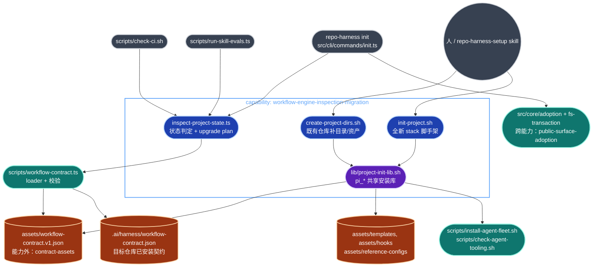
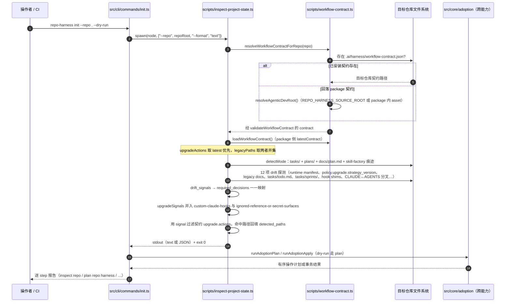
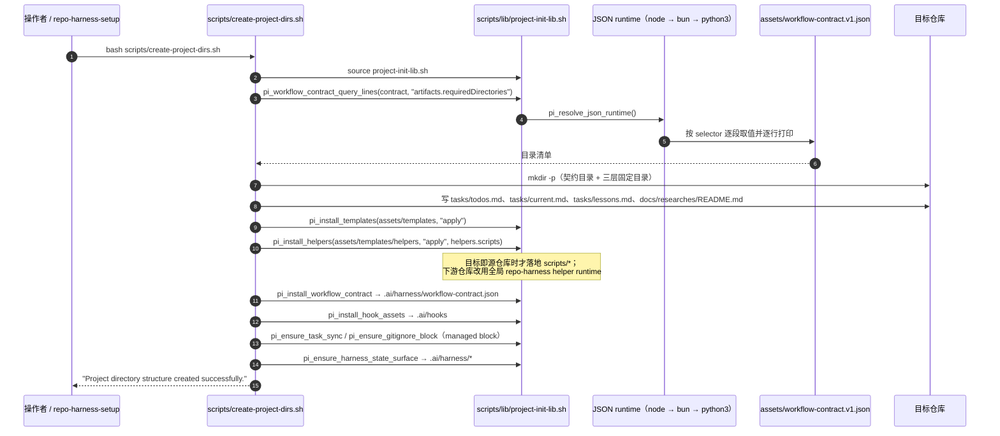

# workflow-engine/inspection-migration 架构文档

> 状态：基于 `main` 工作树的 by-capability 架构复核稿。
> Verified against: main@13686d8d（2026-08-08）
> **Capability ID**: `workflow-engine-inspection-migration`
> **Matched Prefixes**（源自 `.ai/context/capabilities.json`）: `scripts/inspect-project-state.ts`、`scripts/create-project-dirs.sh`、`scripts/init-project.sh`、`scripts/lib`
> **Local Contracts**: `scripts/AGENTS.md`、`scripts/CLAUDE.md`
> **Workstreams**: `tasks/workstreams/workflow-engine/inspection-migration/20260703-inspection-migration.md`、`.../20260712-inspection-migration.md`、`.../agent-fleet-specialists.md`
> **事实优先级**：实际源码 > 本文 > 历史 closeout 段落。本文只画已实现现状；任何尚未落地的东西必须显式标注为**目标设计**，否则按"已实现、已接线"理解。

## 0. 阅读约定

| 标记 | 含义 |
| --- | --- |
| **已实现、已接线** | 当前源码存在，且位于真实 runtime path（被 CLI、check 或 helper 调用） |
| **已实现、手动入口** | 当前源码存在，但没有自动调用方，只能由人或 skill 显式执行 |
| **跨能力依赖** | 源码存在，但归属另一个 capability 的 prefix，本能力只调用不拥有 |
| **目标设计** | 尚未落地的形态 |

一条边界纪律先说清楚：`src/core/adoption/` 与 `src/effects/fs-transaction.ts` 已经不在本能力的 prefixes 里，它们属于 `public-surface-adoption`（见 `.ai/context/capabilities.json`）。本能力只负责**判定状态**与**shell 侧脚手架**，不拥有 TS 迁移事务本体。

## 1. P1：能力架构地图

### 1.1 内部模块与依赖



### 1.2 模块职责

| 文件 | 主要 exports / 职责 | 状态 |
| --- | --- | --- |
| `scripts/inspect-project-state.ts` | `inspectRepo(repo)`（:100）返回 `InspectionResult`：`mode`、`legacy_contract_version`、`drift_signals`、`required_decisions`、`safe_defaults`、`detected_paths`、`upgrade_plan`。`detectMode`（:82）用 `tasks/` + `plans/` + legacy 痕迹四分为 `audit / migrate / initialize / repair`。`--format text` 走 `renderText`（:262），默认 JSON。 | 已实现、已接线 |
| `scripts/lib/project-init-lib.sh` | 2721 行 `pi_*` 共享库，是本能力真正的重量所在。契约读取 `pi_workflow_contract_query_lines`（:760）、`pi_workflow_contract_upgrade_action_paths`（:813）；安装面 `pi_install_templates`（:932）、`pi_install_helpers`（:996）、`pi_install_workflow_contract`（:917）、`pi_install_hook_assets`（:591）、`pi_install_reference_configs`（:1228）；状态面 `pi_write_harness_policy`（:1675）、`pi_write_context_map`（:2102）、`pi_write_capability_registry`（:1496）、`pi_ensure_harness_state_surface`（:2301）；外部工具面 `pi_maybe_install_agent_fleet`（:1166）、`pi_print_external_tooling_report`（:1130）。 | 已实现、已接线 |
| `scripts/create-project-dirs.sh` | 对**已存在**仓库补齐三层目录（immutable/mutable/supporting）、bootstrap `tasks/todos.md`、`tasks/current.md`、`tasks/lessons.md`、`docs/spec.md`、`deploy/README.md`，再顺序调 `write_templates → install_workflow_helpers → install_workflow_contract → install_hook_assets → ensure_task_sync_package_script → write_runtime_gitignore_block`（:169-177）。契约必需目录来自 `artifacts.requiredDirectories`（:46-51），不是硬编码。 | 已实现、手动入口 |
| `scripts/init-project.sh` | 全新项目脚手架：`main()`（:471）串 `run_skill_hook pre-init → check_package_manager → create_project → create_structure → install_dev_tools → write_version_stamp → post-init`，末尾跑 `pi_maybe_install_agent_fleet` 与 `pi_print_external_tooling_report`（:492-493）。支持 5 个 stack（vite-tanstack / remix / umi-antd-pro / expo-nativewind / monorepo，:108-184）。`REPO_HARNESS_SOURCE_ONLY=1` 时只 source 不执行（:497）。 | 已实现、手动入口 |
| `scripts/workflow-contract.ts` | 跨文件共享 loader：`resolveAgenticDevRoot`、`resolveWorkflowContractForRepo`（安装契约优先，回落 package 契约）、`loadWorkflowContract` + `validateWorkflowContract` / `validateHelperInventory`（拒绝含 `/`、`..`、非 `.sh`/`.ts`、重名的 helper 条目）。 | 跨能力依赖（无 prefix 归属） |
| `src/core/adoption/*`、`src/effects/fs-transaction.ts` | 有序 TS 迁移计划与带回滚的事务执行。`repo-harness init` 在跑完 inspector 之后调用它们。 | 跨能力依赖（`public-surface-adoption`） |

### 1.3 规模信号

| 面 | 生产文件数 | LOC |
| --- | ---: | ---: |
| `scripts/inspect-project-state.ts` | 1 | 292 |
| `scripts/lib/project-init-lib.sh` | 1 | 2,721 |
| `scripts/init-project.sh` | 1 | 499 |
| `scripts/create-project-dirs.sh` | 1 | 274 |
| **合计（prefix 内非 Markdown）** | **4** | **3,786** |
| 本地契约 `scripts/{AGENTS,CLAUDE}.md` | 2 | 152 |
| 绑定测试（3 个 hint 文件） | 3 | 1,582 |

复算命令：

```bash
CAP_PREFIXES="scripts/inspect-project-state.ts scripts/create-project-dirs.sh scripts/init-project.sh scripts/lib"
find $CAP_PREFIXES -type f ! -name '*.md' -print | sort
find $CAP_PREFIXES -type f ! -name '*.md' -print0 | xargs -0 wc -l | tail -1
wc -l tests/migration-script.test.ts tests/create-project-dirs.runtime.test.ts tests/workflow-contract.test.ts
```

比例值得记一笔：4 个生产文件里 72% 的行数集中在 `project-init-lib.sh` 一个文件。它不是"工具函数集合"，而是本能力事实上的实现主体，三个入口脚本只是薄编排。

### 1.4 依赖边界

允许的出边：

- `scripts/workflow-contract.ts`（契约 loader，本能力唯一的契约读取通道之一；shell 侧用 `pi_workflow_contract_query_lines` 直读 JSON）。
- `assets/workflow-contract.v1.json` / `.ai/harness/workflow-contract.json`（只读，契约资产由 `workflow-engine-contract-assets` 拥有）。
- `assets/templates/`、`assets/hooks/`、`assets/reference-configs/`（只读源，投影到目标仓库）。
- `scripts/install-agent-fleet.sh`、`scripts/check-agent-tooling.sh`（策略驱动的外部工具面，由 `pi_*` 以子进程方式调用）。

允许的入边：

- `src/cli/commands/init.ts:637`（inspector）。
- `scripts/check-ci.sh:78`（inspector smoke）。
- `scripts/run-skill-evals.ts:588`（评测 boundary 内的 inspector）。
- 人或 `repo-harness-setup` skill 手动调 `create-project-dirs.sh` / `init-project.sh`。

禁止的边：

- 本能力不得直接 import `src/core/adoption/*` 或 `src/effects/fs-transaction.ts`——inspector 只产出判定，迁移事务由 adoption 能力单独持有；两条路径不能互相内联。
- 契约资产是只读的：本能力不写 `assets/workflow-contract.v1.json`。
- helper resolution 不得扫目录、猜扩展名、查 home 目录或走 legacy env alias；只认契约 inventory。
- `create-project-dirs.sh` 与 `init-project.sh` **不是** public command（`assets/skill-commands/manifest.json#nonPublicInternalSteps`），不得被包装成对外命令。

## 2. P2：端到端数据流

### 2.1 主路径：`repo-harness init` 中的 inspector 握手

真实观测（`bun scripts/inspect-project-state.ts --repo . --format text`，2026-08-08 本仓库）：

```
mode: audit
legacy_contract_version: current-v1
drift_signals: (none)
upgrade_plan:
- preserve reference-and-secret-surfaces-preserve [high, user_local]: _ref/, .codegraph/, _ops/
```



关键契约点：

- 输入源头是**目标仓库的文件系统**加**两份契约 JSON**，不是 CLI 参数。inspector 除 `--repo` / `--format` 外没有可调旋钮。
- 契约解析双读是刻意的：`contract` 是目标仓库已安装的旧契约（可能落后），`latestContract` 是当前 package 契约。`upgrade.actions` 以 latest 为准（否则老仓库永远看不到新的修复动作），`legacyPaths` 取并集（否则会漏掉旧契约才认识的遗留路径）。见 `inspect-project-state.ts:101-108`。
- inspector 是**纯读**的。整个文件里没有任何写操作，唯一副作用是 stdout。所有变更由后续 adoption 事务承担。
- `drift_signals → required_decisions` 是显式映射表（:188-214），不是模板生成；`root-agent-context-divergent` 的决策文案直接写死"由人协调，repo-harness 从不覆盖用户撰写的 root 文件"。

### 2.2 次路径：shell 脚手架的契约投影



`init-project.sh` 走的是同一套 `pi_*`，差别在于它先 `create_project`（真的去跑 `bun create vite` / `create-remix` 之类的外部脚手架），并在末尾加 `write_version_stamp`（`.claude/.skill-version`）与 agent fleet / external tooling 报告。

### 2.3 错误路径

- **契约缺失**：`resolveAgenticDevRoot` 在没有 `REPO_HARNESS_SOURCE_ROOT` 且 package asset 不存在时抛错，要求显式指定 source checkout；`REPO_HARNESS_SOURCE_ROOT` 必须是绝对路径且其下必须真有 `assets/workflow-contract.v1.json`，否则立刻 throw。不做 home 目录搜索。
- **契约损坏**：`loadWorkflowContract` 分三段失败——读不到文件、JSON 解析失败、`validateWorkflowContract` 结构校验失败——每段带上契约路径。任何一段失败都在任何仓库变更之前发生。
- **helper inventory 不安全**：`validateHelperInventory` 对含 `/`、`\`、`.`、`..`、非 `.sh`/`.ts` 后缀、文件名重复、helper id 重复的条目直接 throw。目录扫描与扩展名回落都不参与解析。
- **JSON runtime 缺失**：`pi_resolve_json_runtime` 三级探测（node → bun → python3）全失败时 `pi_workflow_contract_query_lines` 打 `[warn]` 到 stderr 并 `return 1`，调用方拿到空清单——这是本能力里唯一一处"降级而非 fail-closed"，见 §3.3。
- **policy 缺失或非 auto**：`pi_maybe_install_agent_fleet` 在没有 `.ai/harness/policy.json`、`install_mode != auto-install-on-init`、dry-run 模式、或 installer 脚本解析不到时，一律只打印引导语并 `return 0`；即使真的执行安装失败也只是 `[warn]` 非致命。全局 agent 目录在 dry-run 下绝不被写。
- **JSON 解析容错**：inspector 的 `jsonPathExists` 对损坏的 policy JSON 返回 `false`，从而产出 `policy-missing-upgrade-strategy` 信号——把"读不懂"当成"需要修"，而不是当成"没问题"。
- **Bash 严格模式差异**：`create-project-dirs.sh` 是 `set -euo pipefail`，`init-project.sh` 只有 `set -e`。后者容忍未定义变量，这是一处真实的不对称。

## 3. P3：设计决策与不变量

### 3.1 必须保持的不变量

1. **inspector 只读**。判定与变更彻底分离：`inspect-project-state.ts` 没有任何写路径，因此可以在任意脏仓库、任意 CI 阶段安全反复运行。`check-ci.sh` 正是靠这一点把它当 smoke 用。
2. **用户内容优先保全**。安全默认写死在 `safeDefaults`（:111-116）：保留 repo-local tasks-first 工作流、归档不确定的遗留内容而非覆盖、只删除 manifest 声明为 `known_generated` 的文件。契约里 `_ref/`、`_ops/`、`.codegraph/` 的动作是 `preserve` 且 `risk: high` / `ownership: user_local`——本仓库当前的 upgrade plan 里唯一一条就是它。
3. **根 `CLAUDE.md` / `AGENTS.md` 永不覆盖**。检测到两者分叉时只产出 required decision 让人处理。
4. **契约是唯一 inventory 权威**。目录清单、helper 清单、legacy 路径、upgrade 动作全部来自 `assets/workflow-contract.v1.json`，脚本里不得再维护第二份平行清单。
5. **helper 解析 fail-closed**。不扫目录、不猜扩展名、不查 home、不认 legacy env alias；不合法条目直接抛错而不是跳过。
6. **下游不装 helper wrapper**。`pi_install_helpers` 只在"目标目录就是源仓库自己"时才把 helper 拷进 `scripts/`；下游仓库统一走全局 repo-harness helper runtime。
7. **dry-run 不碰用户级目录**。agent fleet 安装在非 apply 模式下只打印。

### 3.2 有意接受的约束

- **shell 与 TS 双语言实现**是能力边界的直接结果：判定与事务在 TS（inspector + adoption），脚手架与安装在 shell（`pi_*`）。合并成一种语言会把 adoption 能力的所有权拖进本能力，代价高于收益。
- **`init-project.sh` 会联网装依赖**（`bun create vite`、`npx shadcn` 等）。这是脚手架命令的本分，但也意味着它不能在离线 CI 里当检查用——所以 CI 只跑 inspector。
- **三级 JSON runtime 探测**换来的是在没有 node/bun 的机器上也能读契约。代价是 python3 分支与 node 分支是两份独立实现的 selector 解析逻辑（`project-init-lib.sh:780-810`），语义漂移只能靠测试兜。

### 3.3 10x 规模下先垮的点

按危险度排序：

1. **`project-init-lib.sh` 单文件 2,721 行**。它同时承担契约读取、模板安装、policy 生成、context map 生成、capability registry 生成、harness 状态面、gitignore managed block、外部工具报告七类职责。目标仓库形态每多一种，新分支就往这一个文件里加。这是本能力最先垮的地方——不是因为性能，而是因为没有任何模块边界能阻止一个 `pi_*` 函数偷偷依赖另一个的副作用。
2. **selector 解析的双实现漂移**。python3 与 node 两条分支各写一遍嵌套取值。今天语义一致，但只要有人给 node 分支加一个数组索引语法而忘了 python3 分支，行为就会随机器而变。这一处是 §3.1 第 4 条"单一权威"原则的实际缺口。
3. **`pi_workflow_contract_query_lines` 静默降级**。没有 JSON runtime 时它返回空并只打 warn，调用方 `create_contract_directories` 会安静地一个目录都不建。这与仓库的 fail-closed 原则冲突，但目前没有调用方检查它的返回码。
4. **drift 探测的硬编码常量**。`generatedClaudeHookPaths`（inspector :123-130）与 `ignoredReferenceOrSecretPaths`（:131-134）是 TS 里的字面量，不来自契约。契约里已有对应的 `legacy-claude-hook-shims` / `reference-and-secret-surfaces-preserve` 动作，两边同时改才不漂移。第 4 条不变量在这两处还没有真正兑现。
5. **stack 分支的组合爆炸**。`init-project.sh` 的 5 个 stack 各自硬编码依赖列表。第 6 个 stack 的边际成本是线性的，但每个 stack 的依赖版本腐化是独立的，没有任何检查覆盖它们。

### 3.4 验证面

```bash
bun test tests/migration-script.test.ts tests/create-project-dirs.runtime.test.ts tests/workflow-contract.test.ts
bun src/cli/index.ts init --repo . --dry-run
bun scripts/inspect-project-state.ts --repo . --format text
```

前两条是 `.ai/context/capabilities.json#verification_hints` 的原文。1,582 行测试对 3,786 行生产代码，其中 `create-project-dirs.runtime.test.ts` 一个文件 1,066 行——脚手架的真实行为几乎全靠它兜。

## 4. 历史决策记录（append-only）

以下段落逐字保留自本文件前一版本，不翻译、不改写。

### 2026-07-11 Helper Authority Closeout

- `src/core/source-projection.ts` is the shared filesystem projection primitive
  used by hook and helper projections; it preserves bytes and executable mode,
  rejects symlinks, and writes atomically.
- `scripts/sync-helper-sources.ts` reads the helper inventory only from the
  workflow contract, rejects unclassified package files, and preserves the one
  declared migration delegate.
- `src/cli/runtime/helper-runner.ts` resolves only contract-listed helpers from
  the package or an explicit source checkout. Missing contracts, malformed JSON,
  unsafe inventory entries, ambiguous helper IDs, and missing implementation
  files fail closed.
- `scripts/workflow-contract.ts` accepts the package-local contract, an installed
  target-repo contract, or an explicit source checkout. It no longer searches
  home directories or legacy skill roots.

### 2026-07-06 Delegation Policy Template Closeout

- `scripts/lib/project-init-lib.sh` now emits the same `delegation.mode=auto`
  policy explanation as the self-host `.ai/harness/policy.json`, so generated
  repos understand auto mode as install-time standing authorization for bounded
  Codex delegation.
- The change stays inside policy generation text. It does not alter migration
  ownership, helper installation, idempotency rules, or protected local runtime
  state.

### 2026-07-12 Agent Fleet Policy Seed Closeout

- `scripts/lib/project-init-lib.sh` and `scripts/ensure-task-workflow.sh` emit
  the same `external_tooling.agent_fleet` seed with
  `source: package:agents/fleet`; their deterministic helper projection carries
  the same bytes into generated repos.
- Downstream policy stays advisory by default while this self-host repo opts
  into automatic installation. Dry-run remains read-only and never touches the
  user-level Claude or Codex agent directories.
- The cutover is intentionally one-way: no `fable_agents` alias, remote fetch,
  source override, or legacy policy reader participates in inspection,
  migration, or installation.

### 2026-07-12 Six-role Fleet Seed Closeout

- `scripts/lib/project-init-lib.sh` and `scripts/ensure-task-workflow.sh` now
  seed the same six-role `external_tooling.agent_fleet.managed_agents` list as
  the self-host policy and packaged tooling default.
- The two additions are `root-cause-prover` and `harness-evaluator`;
  migration auditing is represented inside the evaluator persona and does not
  add an inspection parser, adoption operation, compatibility key, or second
  policy authority.
- Downstream advisory installation and self-host automatic installation keep
  their existing behavior. Missing or malformed packaged persona sources still
  fail before any user-level agent target is mutated.

复验状态（main@13686d8d）：四段 closeout 的核心断言与当前源码一致——六角色清单见 `scripts/lib/project-init-lib.sh:1973` 与 `scripts/ensure-task-workflow.sh:1288`，`install_mode: "advisory"` 下游默认见 `project-init-lib.sh:1976`，`scripts/workflow-contract.ts` 的三源解析与 fail-closed 校验见 §1.2 与 §2.3。

## Optimization Backlog

- Reduce duplicated required-path lists that still exist across shell scripts.

- `tasks/workstreams/workflow-engine/inspection-migration/20260712-inspection-migration.md`

- `tasks/workstreams/workflow-engine/inspection-migration/agent-fleet-specialists.md`
