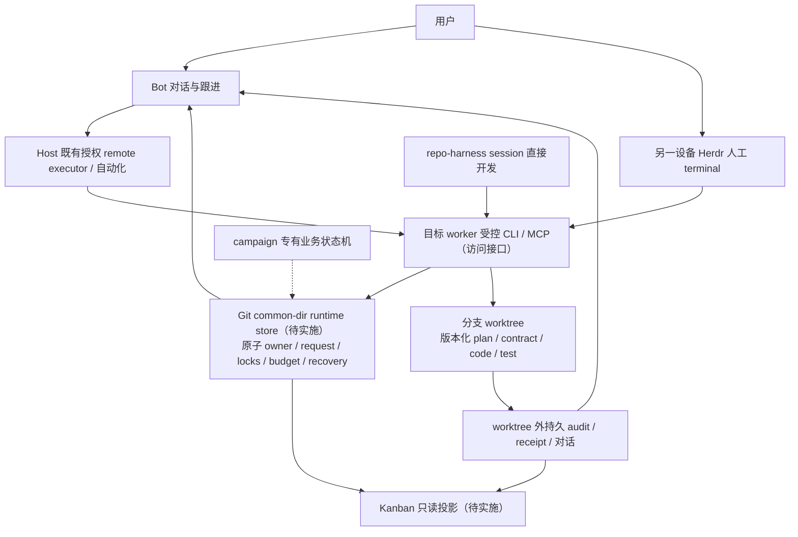

# 可移植开发调度 Skill：正式 Plan

计划 ID：development-scheduler-v1。本文件是正式架构设计；[skill/SKILL.md](skill/SKILL.md)是唯一调度 SOP，[Host 导入说明](skill/references/hosts.md)和[repo-harness 薄适配](skill/references/repo-harness.md)按需引用，不另维护流程规则。

本交付包含通用 Bot Skill、薄适配、Host 导入指引和 campaign Docker 退役设计。原候选经过 Herdr 派出的独立 Codex 审查，最终 PASS。用户随后授权将交付 commit/push 到 repo-harness；此分支只归档文档，不安装到全局 Bot、不修改产品实现或执行 campaign 删除，不合并、部署。

公开路径在归档时调整；三个 Skill 文件保留原候选逐字内容。私人会话、进程记录和原始验证材料不发布，公开摘要只记录验证结论与证据边界。当前尚未实现的 shared store/CAS/fence/只读 Kanban 不得冒称已可用；缺失工具阻塞依赖动作，外部审计记录不是新的数据库或锁服务。

## Host 加载与导入边界

Grok Bot 对话保存、slash 引用和插件管理入口与 Grok Build/native local 目录不同，详见 Host 说明及其中官方来源。任意 SKILL.md ZIP native import 未建立；原文材料交接须现场保存/回读，不能以摘要形成竞争 SOP。Hermes 可写 external dirs 与同名 shadow 须核对，不能用 learn 重写权威。此轮完成文档和隔离验证，未做各 Host 原生加载、多设备或外部接入实测。

Herdr 具体命令由当前官方 Skill/help 决定；远控入口参考 [Persistence and remote access](https://herdr.dev/docs/persistence-remote/)与[Connecting machines](https://herdr.dev/docs/connecting-machines/)。Host 现有 cloud/remote/automation 提供 transport，不新增控制平面；machine add 的安装/启动/替换语义另行判断授权。

## 正式架构决定与实施边界

Bot 与 session 模式共用受控小工具，Bot 承担需求、验收标准、派工、监工与反馈；Kanban 只观看。以下是产品后续实施设计，尚未实现的 store、原子变更接口与人工 handoff fence 必须标为前置条件。

### 状态在哪里，谁可写

| 信息 | 权威与生命周期 | 两模式如何使用 |
|---|---|---|
| task/owner/session/request/phase/locks/lease/budget/idempotence/recovery | 目标 worker 的仓库 Git common dir 下，共用持久 runtime store；跨该仓库 worktree、cleanup 不丢；机器原子维护 | Bot 与 session CLI/MCP调用同一受控工具、使用稳定 handle与 revision；接口不是存储 |
| plan/contract/code/test | 随分支版本化，验收后按授权合入 main | 同一候选与subject，工具自动产生/校验内部digest，Bot不手工管理大量SHA |
| final audit、双方对话、receipt/恢复证据 | worktree 外持久审计区；可恢复、可索引 | 文档只索引真实证据；Bot摘要、云端缓存与Kanban投影不成为可写多副本权威 |
| 用户目标、反馈、澄清、审批意图 | Bot对话入口，映射到受控request | 自然语言不绕过安全检查、批准凭据或特定动作授权；敏感凭据不进文档 |

新通用 store 建议 namespace 为 `<git-common-dir>/repo-harness/runtime/v1`（设计建议，不是已实现路径/CLI）。复用现有 Git common-dir resolver、短同步锁、append事件/原子持久快照、lease/budget/idempotence/receipt/cleanup原语，选最小可表达业务的不变量；不搬整套 campaign schema、不新造远端控制平面或同步可写副本。既有 campaign store 已在 common-dir 下，不应误称当前全部状态只在 worktree；要替换的是专属状态模型及业务控制链。

机器接口的语义设计为 observe/register/acquire-owner/submit-request/capture-candidate/collect/review-evidence/handoff/resume/close/recover，不宣称这些是当前 CLI 命令名。每个 mutation由同一权威 store校验expected revision、执行owner、授权/批准凭据、资源/文件锁、预算与去重键后原子提交；并发失败返回冲突或reconciliation，不reset预算、二次dispatch或从Bot摘要合成状态。候选校验保留；SHA由工具捕获和绑定，Bot仅使用稳定handle。

repo-harness session模式可直接用现有CLI做开发操作；Bot模式调用同一检查/受控工具，承担需求与监督。云端基础设施、多设备transport、自动化、凭据管理复用Host现成能力。目标机harness仍执行其本地fs/ps/kill/Unixsocket接口；经已授权remoteexecutor在该目标运行，不把本机endpoint字段伪装成远程MCP地址。

目标架构图（共用 store/fence、只读 Kanban 待产品实施）：

人工接手须显式handoff事件及单写者fence：先暂停Bot的新指令与本任务自动化发送，核对/收集在途request，确认当前owner与真实session，然后交给人工；Bot只读监工。resume也必须显式由当前owner归还，机器校验revision/fence后Bot才能发送。pane idle、断连、关闭窗口不是接手/归还凭证。现有Herdr远程terminal可作为连接路径，但现有工具未提供上述完整原子跨入口fence的实测证据，必须在产品实施阶段补齐，不能用手写日志称已实现安全锁。

### 只读基线与当前能力

固定源码基线为 `1d3c2f017fa867cfbaf3cd61873395b4945e6f04`（package 0.20.0）。此处源码结论绑定该版本；不代表已安装 CLI、draft PR 或远端后续提交已现场验收。PR473/474/476 在核验时为 draft，PR475 已合并；使用新能力前须重新核对合并状态与现场证据。

- [campaign runtime](https://github.com/Ancienttwo/repo-harness/blob/1d3c2f017fa867cfbaf3cd61873395b4945e6f04/src/effects/automation/campaign-runtime.ts#L60)直接Docker隔离下Codex exec，并非Herdr task-agent薄consumer。已有auto-campaign Skill、group/slot、GPTPro author、adoption/plan/acquisition与closeout链；不能按“只有派工”删掉安全/持久化部分。
- [旧持久store](https://github.com/Ancienttwo/repo-harness/blob/1d3c2f017fa867cfbaf3cd61873395b4945e6f04/src/effects/automation/development-campaign-store.ts#L25)已复用Git common dir和exclusive-directory-lock；新store复用通用原语，删除业务绑定。policy的development_campaign/external_sources为off只是版本化配置，不能证明目标机没有旧runs、grant或containers。
- [revision evidence decoder](https://github.com/Ancienttwo/repo-harness/blob/1d3c2f017fa867cfbaf3cd61873395b4945e6f04/src/core/automation/campaign-revision-evidence.ts#L106)已经读取实际capture与exact revision。旧BRC6a的“active全disabled”不是当前结论，不照抄。
- [HerdrEndpoint](https://github.com/Ancienttwo/repo-harness/blob/1d3c2f017fa867cfbaf3cd61873395b4945e6f04/src/effects/terminal/herdr.ts#L6)只有session/configPath/home，验证本地socket，不能据此声称remoteendpoint支持。
- [task-agent CLI](https://github.com/Ancienttwo/repo-harness/blob/1d3c2f017fa867cfbaf3cd61873395b4945e6f04/src/cli/commands/task-agent.ts#L4)在固定main源码已有start/send/result/collect/status/history/read/close/cancel。此前Mini旧checkout/已安装0.19.5未定位到该接口，二者版本需分开；源码存在不等于安装 CLI/MCP 暴露或本次已现场验收。`src/cli/mcp/types.ts:3` 与 `tools.ts:1070` 的 dev runner 仍为 codex|claude，约束该执行接口，不排除外部 Grok/Hermes Bot 入口。当前 task-agent journal 位于 primary_root 的 `.ai/harness/runs/task-agents`（`task-session.ts:356-359`），不是设计中的统一 Git common-dir runtime store；不能把全部现状统称 worktree-only 或已统一持久化。
- 当前PR476的generic review/OAR/Task-agent/Deep-reasoner路径不等于campaignruntime已迁移；Claude actual-model/Receipt边界及外层隔离仍是明确前置条件，不能以Codex fixture canary声明完整验收。此设计不等待draft即可写，产品使用新能力则需要真实可用/权限/身份和结果证据。

### 删除、保留、共享耦合

退役删 campaign 专有group/slot/GPTPro author lane、successor/fresh-audit业务编排、专有CLI/UI/Skill/container脚本和schema。在每项删除前按真实消费者核对，不为清字符串删除历史审计。task-agent、contract、ordinary/selected acquisition、lease、budget、idempotence、receipt和cleanup等通用原语保留；没有真实其他消费者的campaign-only机制随专有实现删除，不保留空壳抽象。

| 共享影响范围 | 设计处理与实施前证据 |
|---|---|
| src/effects/fleet/acquire.ts | 拆除campaign admission/proof/capacity绑定；保留普通offer/claim/authority与幂等，追踪每个非campaign消费者 |
| src/effects/engineers/scheduling-acquire-next.ts、src/cli/commands/engineer.ts | 清理campaign R2 policy/callback/cutover专用面；普通R1和已存在的 selected acquisition 原语和 PR474 待合并入口不能一起删 |
| core/effects automation budget/projection/store | 原子owner/预算/恢复所需通用原语保留并进入共用store；不照搬campaign业务schema |
| core/effects operator automation-summary、src/operator-web、src/effects/operator/server.ts | 改成权威runtime只读投影；去专有campaign卡片与控制动作，不造board state source |
| scripts/contract-run.ts与assets/templates/helpers镜像 | 去campaign handoff/provider专属路径，保留合同执行/收集/安全/恢复语义；镜像按同一owner更新 |
| scripts/ensure-task-workflow.sh、core/adoption/standard-plan、policy、assets/skill-commands/manifest.json | 清理默认activation与auto-campaign入口，保留普通plan/contract/tool路径及迁移检查 |
| core/architecture/model与projection、effects/architecture投影 | 删除活跃专有模型与投影，不为历史展示保留新core双读；历史audit独立归档和索引 |

campaign Docker 删除面：Bot 与 session-Herdr 通路不依赖旧 campaign Docker。退役实施在完成上述 drain/cutover 前置后，删除专用 image 定义/构建上下文 `deploy/campaign-container/`（Dockerfile、campaign-init.c）、`scripts/build-campaign-image.sh`、`scripts/run-campaign-preflight.ts`、`scripts/cleanup-campaign-container.ts`、`src/effects/automation/campaign-container.ts` 及 runtime 的专用 container/image 依赖（含 BRC_CAMPAIGN_IMAGE），并清理对应 package/脚本依赖、专用测试、CI 配置和活跃文档说明。历史 audit 不删。此处是产品删除设计，本任务不执行删除或 Docker 命令。

固定只读基线已见 campaign-runtime、preflight 和 cleanup 脚本直接消费 campaign-container，build 脚本复制专用 Dockerfile/init；这些是 campaign 专用消费者，不能据此保留空壳。实施时逐项列实际非 campaign consumer 的源码调用链与用途，才保留它需要的通用 Docker/安全隔离；当前核对未建立足以保留该专用容器实现的其他消费者。CI/docs/dependency 全量引用盘点属于实施前检查，不能凭局部搜索称已全部移除，也不虚构已有 Docker build CI job；删除相关专用检查、工作流步骤及文档，保留有据的其他消费者检查。不得以“保留安全”为名保留无 consumer 的 campaign image、脚本或配置壳。

Kanban只读：保留进度/阻碍/候选/证据的GET投影及刷新，不接受反馈、审批、dispatch/retry/accept/mutation。固定基线[operator server route inventory](https://github.com/Ancienttwo/repo-harness/blob/1d3c2f017fa867cfbaf3cd61873395b4945e6f04/src/effects/operator/server.ts#L139)当前实际唯一browser write是task-message POST，不能虚构已有所有派工按钮。实施明确删除该POST路由、handler/授权payload/UI composer及任何实查到的可变入口；结构测试要求browser write route=0，GET投影不产生mutation。反馈、改需求、催办、澄清和审批都回Bot，经过相同受控工具与批准凭据。Session CLI保留直接开发入口。

### 单次退役顺序与回滚

1. 在目标worker只读盘点live grant/lease/owner、containers、请求/outbox、pending mutations和旧common-dir runs；记录版本与恢复证据。tracked tasks/campaigns缺失及policy off不能替代盘点。未知writer留reconciliation，禁止reset budget或重复dispatch。
2. 先实现/验收共用小工具通路与持久store、原子fence、subject/receipt校验、只读projection；既有Host云/远控/自动化提供transport和定时运行，不新增orchestrator服务。此步骤是待产品代码实施，不是本次Skill能力。
3. 禁止新的campaign admission，固定旧binary与其状态路径，仅有界drain已知owned旧工作。保留结果、证据、sessions及grant/lease终态；不能让新旧writer同时接管同一任务。
4. 全部旧writer/在途mutation已确认排空后，做一次明确cutover，将必要runtime事实经机器校验写到唯一新store；保留不可变历史audit，删除专有实现/入口。新core不留双读/双写兼容补丁；必要迁移工具有明确一次性用途与移除条件。
5. 在两模式同一store上做真实验收，包括重复request、并发owner、重启/断连、跨worktree、人工handoff/resume、candidate漂移/receipt、预算与清理恢复、Kanban零write。Grok Bot多设备仍需可用授权入口实测，当前只user-reported；dot单机、Hermes能力逐项自检。未验收不宣称完成退役。

回滚先暂停并排空新writer，保存新store/在途request/预算/候选和审计，核对没有跨代owner；按明确映射恢复旧binary/状态，再验证唯一writer。仅git revert代码既不回滚运行状态，也可能重复执行，因此不作为充分回滚。未确认quiescence时保留阻塞并升级，不拆未知锁或销毁未知资源。

### 独立资源释放

Herdr operating guide 仅作为流程参考，Skill 不授予资源清理或发布权限。此任务的独立审查已收集并完成授权 owned 资源释放，完整记录另行归档。通用生命周期按以下保存、独立核实与授权前置执行；具体 Herdr 命令按当前官方 Skill/help 核对。

先在 worktree 外保存 session 审计/恢复信息、候选、证据和有用 untracked 并核验；正常停止 owned process 后独立 process-readback，再关闭 owned pane 后独立 pane-readback。仅当 owned 任务 Tab 无其他任务共享才关闭 Tab，并独立 Tab-readback；process stopped 不是 pane/Tab closed。共享 Tab 保留须记录 owner/共享者/原因，不称已关闭；意外残留逐项报告，不笼统 cleanup complete。worktree 清理另行判定，默认保留 branch/history，不因进程退出顺带删除。

### 本次验收与实现缺口

此次验收限于可加载Skill、正式设计与有证据独立审查：入口仍可用已核验的Herdr CLI做有界协调；凡依赖新generic runtime store/CAS/handoff fence/只读Kanban产品变化的动作须明确尚待实现。独立审查检查source版本、删除/保留消费者、单写者/权限和历史/恢复边界；加隔离原始判断场景：store不等于CLI/MCP、Kanban不能变更、未知writer不能reset/re-dispatch；另含process退出但无人共享的pane/Tab残留与Tab共享他人任务。不给 evaluator 预期 verdict。只做文档/本地fixture验证，不实际删campaign、改产品UI、配置设备、drain生产或运行付费故障测试。用户新增明确决定形成S002有界范围变化，不把未来全部实现验收无限加到此文档任务。

| 实现缺口 | 足够的下一阶段验收面（本任务不执行） |
|---|---|
| generic runtime store 与原子 mutation 尚未实现 | 两入口同一 Git common-dir authority；重复 request、revision 冲突、预算/锁、重启和跨 worktree/cleanup 恢复；未知 writer 保持 reconciliation |
| handoff/resume 单写者 fence 未完整验收 | 明确 owner 交接、在途 request 收集、旧 owner mutation 拒绝及显式 resume；现有远程连接不是 fence |
| Kanban 只读产品变更未实施 | 删除实际 task-message POST/handler/composer 与实查可变入口；write inventory=0，GET 不写 authority，Bot 使用受控工具跟进 |
| campaign 退役与共享消费者重构未实施 | 保留 ordinary/selected acquisition、contract/lease/budget/idempotence/receipt/cleanup；排空旧 writer后一次 cutover；新 core 无双读；回滚先排空新 writer |
| PR476 generic review 仍 draft，Claude actual-model/Receipt 与隔离边界有缺口 | 同一 subject/真实请求的 model 来源、receipt 和隔离/清理证据；Codex fixture/canary 不证明 Claude 或 campaign runtime 已迁移 |
| Host/machine 接入未做现场验证 | Grok 多设备只 user-reported、优先设计验证；dot 当前单机；Hermes 逐项自检。配置/凭据/跨设备验证另需授权 |

本次候选、独立判断、实际验证层级和交付来源见[归档验收摘要](../../../tasks/archive/review-20261003-development-scheduler-skill.md)。这是已有验收的公开投影，不把原候选 PASS 冒充为未实现产品能力或新的发布候选独立审查。
