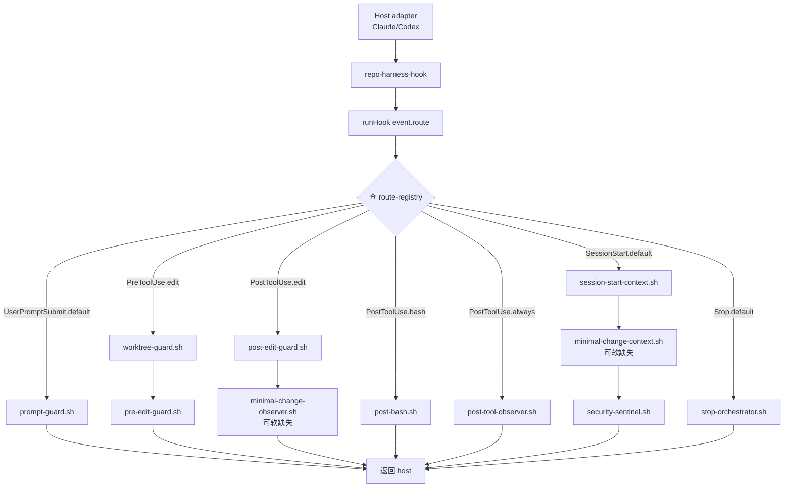
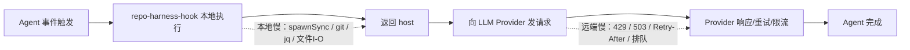

# repo-harness 钩子时延与 LLM 提供商限流归因研究报告

## 执行摘要

这份审查的核心结论是：**`repo-harness` 的确会引入“同步、串行、阻塞式”的 hook 执行路径**，因为它的统一入口 `runHook()` 会对每个 route 中登记的脚本按顺序调用 `spawnSync('bash', ...)`，并在进入仓库时还会先同步执行 `git rev-parse` 来解析 repo root；这意味着只要某个脚本慢，整个 Agent 事件链就会被阻塞，直到该脚本返回。就“是否会让 Agent 处理时间变长”这个问题，答案是**会，且是设计上就会**。但从当前源码看，热路径里**没有发现显式 `sleep`、无限循环、线程竞争、全局锁、网络轮询或 async/await 被同步 API 卡住的典型灾难性问题**；更像是“固定同步开销 + 个别脚本的文件系统 / git / jq / Bun 子进程开销叠加”，而不是“明显 bug 导致的长时间卡死”。

从 route 数量看，`repo-harness` 的阻塞成本在**工具密集型会话**里最明显。比如一次普通 `Edit|Write` 可能走 `PreToolUse.edit` 的两个脚本、`PostToolUse.edit` 的两个脚本、再加 `PostToolUse.always` 的一个脚本；而所有这些脚本都由 `runHook()` 串行执行。换句话说，**“每次工具调用多出若干个同步 shell 子进程”** 本身就是确定存在的本地时延来源。

不过，把“最近 Agent 处理时间突然显著上升”完全归因到这个仓库，也不够严谨。源码里最可疑、最可能放大时延的部分，主要是：`SessionStart` 上的上下文拼装、可选的安全扫描、可选的更新检查，以及大量 `jq` / `git` / `find` / `awk` / `wc` / `tail` 等命令式调用；这些会随仓库规模、磁盘速度、文件数量、是否有 `jq`、是否在网络文件系统、是否首次冷启动而波动。与此同时，官方文档和状态页显示，LLM 提供商侧的限流、短时间窗口限制、重试/退避，以及近几天的服务错误事件同样真实存在：OpenAI 明确说明限流可能按更短窗口生效并建议指数退避；Anthropic 文档也说明组织级 RPM/TPM/Spend limits，且其状态页在 2026 年 6 月中下旬连续出现 API elevated error 事件；Google Cloud 也记录过 Vertex AI Gemini API 全球端点错误率升高的事故。**所以如果你的变慢是“跨仓库、跨会话、跨机器都出现，且伴随 429/503、Retry-After、provider status incident”，那么提供商限流/服务波动更可能；如果变慢主要发生在这个仓库、且集中在 `SessionStart`、`Edit`、`Bash` 这些 hook 丰富的阶段，那么 `repo-harness` 更可能是直接原因。**

我对这两个假设的综合判断是：**`repo-harness` 确实引入了可观但通常“有限、可测”的本地同步开销；“最近突然变慢”若呈现出强时间相关和平台相关特征，则 LLM 提供商限流或服务波动更值得优先排查。** 最稳妥的处理方式不是二选一猜测，而是按本文给出的 A/B 试验、strace/perf/网络计时，把“本地 hook 时间”与“远端模型时间”拆开量化。

## 仓库形态与可复现实验基线

`repo-harness` 并不是传统“先编译再运行”的 Node 包。`package.json` 的 `bin` 直接把 `repo-harness` 指向 `src/cli/index.ts`，把 `repo-harness-hook` 指向 `src/cli/hook-entry.ts`；同时 `engines` 要求 Bun，说明它依赖 **Bun 直接执行 TypeScript 入口**。仓库脚本也没有单独的 `build` 脚本，维护者常规验证更接近“安装依赖 + typecheck + tests + 各种检查脚本”。CI 里明确使用 Bun 1.3.10，并执行 `bun install --frozen-lockfile` 与 `bun test`。

因此，在 Linux x86_64 + Bun 环境下，最接近维护者路径的复现实验基线可以写成下面这样：

```bash
git clone https://github.com/Ancienttwo/repo-harness
cd repo-harness

# 与 CI 对齐
bun install --frozen-lockfile

# 基础验证
bun run check:type
bun run check:hooks
bun test

# 文档/流程检查
bash scripts/check-task-workflow.sh --strict
bash scripts/check-architecture-sync.sh
```

这些命令的依据来自仓库脚本和 README 的维护/验证说明。尤其是 README 中文版给出的安装、adopt 后验证，以及维护者验证列表，说明 `bun test`、`check-task-workflow.sh --strict`、若干 `check-*` 脚本才是它的“构建/验收”惯例，而不是产出一个独立编译物。

从文档来看，仓库试图把 Claude/Codex 的会话固化成 file-backed workflow，并强调“给 Agent 一个完整 PRD/Sprint，之后就是 review and `next`，或者 `/goal` 后 AFK”。这是一种**产品级循环叙事**，不是 runtime 执行语义本身。真正的 runtime 执行路径由 route registry 和 hook runtime 决定，而不是 README 的高层 loop 图。这个区别很重要，因为很多“看起来像长循环”的描述，未必对应“代码里存在持续轮询/后台循环”。

## 钩子注册点、执行顺序与真实热路径

仓库的 hook 事件与 route 定义集中在 `src/cli/hook/route-registry.ts`。从这里可以看到固定事件类型包括 `SessionStart`、`PreToolUse`、`PostToolUse`、`UserPromptSubmit`、`SubagentStart`、`SubagentStop`、`Stop`；route id 包括 `default`、`edit`、`subagent`、`bash`、`always`、`delegation`、`context`、`quality`。真正决定“一个事件会跑哪些脚本”的，是 `ROUTES` 这张表。

最关键的是，`runHook()` 并不并发执行这些脚本，而是先按 `getRoute(event, routeId)` 找到 route，再对 `route.scripts` 做 `for ... of` 顺序遍历，然后对每个脚本执行一次 `spawnSync('bash', [scriptPath, ...])`。这意味着**注册顺序就是执行顺序**，并且 route 里的脚本是严格同步串行的。

当前主干上热路径的登记关系如下。`SessionStart.default` 依次登记 `session-start-context.sh`、`minimal-change-context.sh`、`security-sentinel.sh`；`PreToolUse.edit` 登记 `worktree-guard.sh` 和 `pre-edit-guard.sh`；`PreToolUse.subagent` 登记 `subagent-return-channel-guard.sh`；`PostToolUse.edit` 登记 `post-edit-guard.sh` 与 `minimal-change-observer.sh`；`PostToolUse.bash` 登记 `post-bash.sh`；`PostToolUse.always` 登记 `post-tool-observer.sh`；`UserPromptSubmit.default` 登记 `prompt-guard.sh`；Codex 专有还包括 `UserPromptSubmit.delegation`、`SubagentStart.context`、`SubagentStop.quality`；`Stop.default` 登记 `stop-orchestrator.sh`。

因此，一个典型的会话事件序列更接近下面这张图，而不是 README 中那张产品规划 loop 图：



这张图对应的关键判断是：**任何“Edit 很慢”“Bash 完成后卡住”“新会话启动慢”都可以先映射到具体 route，而不是笼统说 Agent 慢。** 例如一次 Edit 往往至少会命中 `PreToolUse.edit`、`PostToolUse.edit`、`PostToolUse.always` 三段，合计最多五个同步脚本；一次 Bash 通常至少会命中 `PostToolUse.bash` 与 `PostToolUse.always`；新会话启动则命中 `SessionStart.default`。

此外，runtime 还存在一层“central-first hooks resolution”。`resolveHooksDir()` 会按环境变量 `REPO_HARNESS_HOOK_SOURCE`、仓库策略 pin、打包内 `assets/hooks`、最后 repo 内 `.ai/hooks` 的顺序解析脚本目录。这意味着你实际运行的 hook，未必是仓库当前工作区的 `.ai/hooks`，也未必一定是最新打包资产；排查时必须先确认实际 hook 来源。

## 静态分析结果

### 同步阻塞点与可疑慢路径

最上游的同步阻塞点是 `runHook()` 自身：进入 hook 时先用 `execFileSync('git', ['-C', cwd, 'rev-parse', '--show-toplevel'])` 解析 repo root，随后对每个脚本做 `spawnSync('bash', ...)`。仅此一项就已经说明：**安装 repo-harness 后，hook 时延不可能是“零成本”**，因为每个 hook 事件都至少有一次 Node/Bun 进程中的同步子进程调用，很多事件还会再扇出多个 shell 子进程。

更具体地看，`SessionStart` 是最值得怀疑的冷路径。`session-start-context.sh` 本身有近 600 行代码，会加载 `hook-input.sh` 与 `workflow-state.sh`，并做事件日志轮转、handoff/resume 解析、活跃 plan/contract 读取、请求目录扫描、git 快照读取，以及可选的 tooling update advisory。它还会在某些分支上读取 `.ai/harness/capability-context/requests.jsonl`，遍历请求目录 `find ... -name '*.md'`，并通过 `git show` / `git rev-parse` 读取目标分支上的快照。对大仓库、慢磁盘、NFS 工作区或第一次冷启动来说，这些都是合理的延迟放大器。

`security-sentinel.sh` 的行为相对温和，但不能完全忽略。它会对若干高价值配置文件做指纹计算；只有指纹变化时才调用 `repo-harness security scan --json`，并把结果落到 `.ai/harness/security/latest.json`。这意味着它**不是每次 SessionStart 都全量扫描**，但在安装/配置刚变更、或者 home 目录/仓库配置文件变化时，会同步跑一次安全扫描。源码中没有 `sleep`、没有轮询，但有哈希、JSON 解析与扫描命令调用。

`PostToolUse.always` 的 `post-tool-observer.sh` 是最稳定的热路径之一，因为它会在所有工具调用后执行。它做的工作包括：解析 stdin、读取 session key、必要时标记 codegraph 使用、轮转 `.claude/.trace.jsonl`、再写入一条 JSONL trace。它没有 `sleep` 和显式锁，但会在每次调用上执行 `wc -l`，超过阈值时再 `tail` + `mv` 轮转。这种设计在单进程下通常不算重，但在**高频工具调用**或**多子代理并发写 trace**时，`wc/tail/mv` 会形成稳定的 I/O 成本，而且由于没有 `flock`，还存在轻微竞态风险。

`post-edit-guard.sh` 是 Edit 热路径中更重的部分。脚本里不仅会处理 plan/todo/task state，还会调用 `git diff --shortstat HEAD`、`git diff --name-only HEAD | head -10`，写 `.claude/.task-handoff.md`，并刷新 workflow handoff。这里没有显式睡眠，但**每次 edit 后都触发 git diff + handoff 写入**，如果你的 Agent 频繁使用 Edit/Write，这一段开销会被持续叠加。

`workflow-state.sh` 也是多个脚本共享的“开销放大器”。它内部会在 `load_changed_paths()` 中调用 `git status --porcelain=v1 --untracked-files=no` 来缓存变更路径；还会用 `find plans -maxdepth 1 -type f -name 'plan-*.md'` 查找最新计划文件，用 `find "$research_dir" -type f -name '*.md' -print0` 遍历研究文档，并在某些函数中遍历 `git worktree list --porcelain` 与 `git for-each-ref`。这些都不是 bug，但说明：**repo-harness 的一部分时延与仓库规模、worktree 数量、文档目录大小直接相关。**

### 异步、线程、锁与阻塞式 async 误用

在最关键的 `runtime.ts` 中，没有看到 `await`；它是**显式同步设计**，而不是“异步 API 被误用成同步阻塞”的情况。换言之，这里的问题不在“误用 async”，而在“根本就是同步 hook runtime”。`prompt-guard` 的 TypeScript 决策逻辑同样没有 `await`；CLI 入口 `runPromptGuardDecideCli()` 通过 `readFileSync(0, 'utf-8')` 读取 stdin，解析 JSON 后立刻给出 verdict。

在我重点审查的热路径脚本里，没有发现显式 `flock`、`sleep`、后台 while-polling 这类典型“人为拉长延迟”的模式。`session-start-context.sh` 里的 tooling update advisory 反而做了相对合理的处理：默认路径下会尝试用 `mkdir lock_dir` 获得一个目录锁，然后把 `repo_harness_setup_check` 放到 subshell 背景执行；只有设置环境变量 `REPO_HARNESS_TOOLING_ADVISORY_SYNC=1` 时，才会同步执行更新检查。也就是说，**这里真正要警惕的是有人把同步开关打开了**。

不过，“没有锁”并不总是好消息。`post-tool-observer.sh`、`session-state.sh`、若干 workflow 状态文件更新都没有采用 `flock` 或原子追加协调；在单 Agent 单会话下问题不大，但在多 subagent / 多工具并发、特别是 Codex/Claude 混跑时，trace/state 文件可能出现竞争写入。这类问题往往表现为**偶发抖动**、日志截断、或者某次 hook 异常变慢，而不是稳态的大幅增加。

### README 与实际代码、打包资产的差异

这部分值得特别指出，因为它直接影响你对“loop”与“hook 成本”的认知。

首先，README 英文和中文都用很强的产品叙事来描述 loop：给 Agent 一个 PRD/Sprint，之后“review and `next`”，或者 `/goal` 后 AFK；同时又在“0.4.x loop-system surfaces”里画了一个涵盖 heartbeat、state-snapshot/eval evidence、route cutover 等概念的大流程图。**但 runtime 代码里并不存在一个叫“loop”的独立执行器；实际执行面仍然只是固定事件 + 固定 route + 固定 shell 脚本的同步分发。** 因而 README 的 loop 更像 workflow 概念，不是一个常驻循环线程或后台服务。

其次，`docs/reference-configs/hook-operations.md` 说 `SessionStart.default` 会聚合 `session-start-context.sh`、`minimal-change-context.sh`、`security-sentinel.sh`，而 `route-registry.ts` 也这样登记。早期需要重点核对的是 packaged assets 是否缺 `minimal-change-context.sh`；**当前 main 已包含 `assets/hooks/minimal-change-context.sh`**。如果下游仍只跑 2 个脚本，应优先归因为 installed/runtime copy stale，而不是主干资产缺失。这个点不直接造成长卡顿，但会造成“你以为跑了 3 个脚本，实际安装副本只跑了 2 个”的诊断偏差。

再次，README 里还提到 `finalize-handoff.sh`，说它与 `post-edit-guard.sh` 一起在 stop 和 edit 后写回 handoff；但当前 `assets/hooks/` 列表与 route registry 中真正可见的 stop 脚本是 `stop-orchestrator.sh`，而不是一个已打包的 `finalize-handoff.sh`。这说明 README 至少保留了部分旧命名或旧实现叙事。对于你判断“哪些脚本可能拖慢 Stop 阶段”，应该以 route registry 与已打包脚本为准，而不是 README 文案。

## 动态诊断与精确测量方案

### 先把“本地 hook 时间”和“远端模型时间”拆开

最重要的思路，是把时延拆成两段：



如果 B→C 慢，而 C→E 正常，问题在 hook/本地环境。反之，如果 B→C 很快，但 D→E 慢，并且伴随 429/503/重试/退避，那么更像提供商限流或服务波动。这个分段方法与仓库运行模型是一一对应的，因为 hook 在本地同步执行，provider 调用发生在 hook 返回之后。

### 建议的精确测量命令

先准备一个**可复用的事件 payload**。最好从实际 host 适配器抓一份 `PostToolUse`、`PreToolUse`、`UserPromptSubmit`、`SessionStart` 的真实 JSON，再用于离线回放。示例命名如下：

```bash
mkdir -p bench/payloads
# 把真实事件分别保存为：
# bench/payloads/session-start.json
# bench/payloads/pretool-edit.json
# bench/payloads/posttool-edit.json
# bench/payloads/posttool-bash.json
# bench/payloads/userprompt.json
```

对单次 hook 做 wall time 测量，优先用 `/usr/bin/time`：

```bash
/usr/bin/time -f 'real=%e user=%U sys=%S maxrss=%MKB' \
  repo-harness-hook PostToolUse --route always \
  < bench/payloads/posttool-edit.json
```

**预期输出**会类似：

```text
real=0.18 user=0.03 sys=0.06 maxrss=28544KB
```

这里如果 `real` 明显大于 `user+sys`，说明在等待子进程或 I/O；如果 `sys` 很高，说明文件系统/进程调度成本较重；如果 `user` 很高，说明 jq/Bun/awk/sed 等解析逻辑占比较大。

对 p50/p95 做批量统计，推荐 `hyperfine` 或 shell 循环：

```bash
hyperfine --warmup 5 \
  'repo-harness-hook PostToolUse --route always < bench/payloads/posttool-edit.json' \
  'repo-harness-hook PostToolUse --route bash < bench/payloads/posttool-bash.json' \
  'repo-harness-hook SessionStart --route default < bench/payloads/session-start.json'
```

或者：

```bash
for i in $(seq 1 50); do
  /usr/bin/time -f '%e' repo-harness-hook PostToolUse --route always \
    < bench/payloads/posttool-edit.json 2>> /tmp/hook-times.txt >/dev/null
done
sort -n /tmp/hook-times.txt | awk '
{a[NR]=$1}
END{
  printf("n=%d p50=%.3f p95=%.3f p99=%.3f\n",
    NR,
    a[int(NR*0.50)],
    a[int(NR*0.95)],
    a[int(NR*0.99)]
  )
}'
```

如果你要看**系统调用级别**究竟慢在哪，`strace` 是最直接的：

```bash
strace -ff -ttT -s 256 \
  -o /tmp/rh.strace \
  repo-harness-hook PostToolUse --route edit \
  < bench/payloads/posttool-edit.json
```

然后重点看：

```bash
grep -E 'execve|wait4|stat|openat|read|write|rename|clone' /tmp/rh.strace* | tail -200
```

**预期判读**如下：

- 如果你看到很多 `execve("git", ...)`、`execve("jq", ...)`、`execve("bash", ...)`，再加明显的 `wait4(... <0.1~1.0s>)`，说明慢在 hook 子进程链。
- 如果系统调用很快，但上层总时间长，那么要去看 provider 请求阶段。
- 如果 `openat/read/stat` 很多而且耗时高，慢点更偏向文件系统或网络盘。

`perf` 适合看 CPU hot spots：

```bash
perf record -F 99 -g -- \
  repo-harness-hook PostToolUse --route always \
  < bench/payloads/posttool-edit.json

perf report --stdio | head -80
```

**预期输出**如果主要集中在 `jq`、`bun`、`awk`、`grep`、`libc` 字符串处理，说明是本地解析开销；如果主要集中在 `wait4`，则是同步等待子进程。对 Bun/Node 栈想看火焰图时，也可以：

```bash
perf script | stackcollapse-perf.pl | flamegraph.pl > /tmp/repo-harness-hotpath.svg
```

如果你的 Agent 是 Python 包装器或 Python 守护进程里再调用 hook，那么可以用 `py-spy` 抓上层等待与子进程时间：

```bash
py-spy record -o /tmp/agent.svg --subprocess -- python your_agent.py
```

**预期图形**里如果大多数时间都卡在 `subprocess.run` / `wait` / event loop 的阻塞段，而实际 CPU 火焰不高，说明“慢”主要是外部 hook/网络等待，而不是 Python 自己算得慢。

如果你的 Agent 运行在 JVM 进程里，例如某个 Java 宿主再调用 repo-harness，那么 `async-profiler` 是补充项：

```bash
./profiler.sh -d 30 -e wall -f /tmp/agent-wall.html <PID>
./profiler.sh -d 30 -e cpu  -f /tmp/agent-cpu.html  <PID>
```

这里要看 wall profile 里是否大量时间停在 `Process.waitFor`、JNI 子进程调用、或 HTTP client 重试逻辑。

最后，**网络阶段**一定要单独抓。对 provider 请求做 header + timing 观察：

```bash
curl -sS -D /tmp/llm.headers -o /dev/null \
  -w 'dns=%{time_namelookup} connect=%{time_connect} tls=%{time_appconnect} ttfb=%{time_starttransfer} total=%{time_total} code=%{http_code}\n' \
  https://api.openai.com/v1/responses \
  -H "Authorization: Bearer $OPENAI_API_KEY" \
  -H "Content-Type: application/json" \
  -d @request.json
```

或者抓包：

```bash
sudo tcpdump -i any -nn -w /tmp/llm.pcap \
  'host api.openai.com or host api.anthropic.com or host generativelanguage.googleapis.com'
```

**预期判读**如下：

- `code=429` / `503`、响应头里出现 `Retry-After`、x-ratelimit 余量很低，基本指向 provider 端限流或排队。
- `ttfb` 很长而本地 hook 已经很快结束，更偏向 provider 或网络。
- DNS/connect/TLS 很高，说明网络/代理层问题更大。  
这些判断与 OpenAI/Anthropic 对限流和重试的官方说明是一致的。

### 建议加一层“每脚本延迟日志”

现有 runtime 没有内建 per-script latency log，这使得实际定位很痛苦。最小可用改法如下：

```diff
diff --git a/src/cli/hook/runtime.ts b/src/cli/hook/runtime.ts
@@
-import { execFileSync, spawnSync, type StdioOptions } from 'child_process';
+import { execFileSync, spawnSync, type StdioOptions } from 'child_process';
+import { performance } from 'node:perf_hooks';
@@
   for (const script of route.scripts) {
     const scriptPath = path.join(hooksDir, script);
+    const t0 = performance.now();

     const child = spawnSync('bash', [scriptPath, ...(opts.args ?? [])], {
       cwd: repoRoot,
       stdio,
       env: { ...process.env, HOOK_REPO_ROOT: repoRoot },
+      timeout: Number(process.env.REPO_HARNESS_HOOK_TIMEOUT_MS ?? 5000),
+      killSignal: 'SIGKILL',
     });
+
+    const elapsedMs = Math.round(performance.now() - t0);
+    if (elapsedMs >= Number(process.env.REPO_HARNESS_HOOK_SLOW_MS ?? 200)) {
+      process.stderr.write(
+        `[repo-harness][hook-latency] ${opts.event}.${opts.routeId} ${script} ${elapsedMs}ms\n`
+      );
+    }
```

这个改动的价值不在“优化”，而在**先量化**。只要把每个脚本的耗时打出来，你很快就能知道慢点到底在 `session-start-context.sh`、`post-edit-guard.sh` 还是 `prompt-guard.sh`。这个思路完全建立在当前 `spawnSync` 串行结构之上。

## 如何区分仓库引入迟缓与提供商限流

### 可复现的 A/B 试验设计

最推荐的做法是用**同一台机器、同一份 payload、同一时间窗口**做四组实验：

1. **Hook-only 基线**：直接回放 `repo-harness-hook`，不发任何 LLM 请求。
2. **Hook-on + 实际 Agent**：保持当前安装与 opt-in 仓库设置。
3. **Hook-off + 实际 Agent**：在一个**临时副本仓库**里把 `.ai/harness/workflow-contract.json` 暂时移走，使 `runHook()` 走 `non-opt-in` 快速返回。
4. **Hook-on + provider 直连压测**：Agent 不变，但单独并发打 provider API，看 429/503 与 backoff。

这样你就能把“本地 hook 固定成本”和“远端 provider 波动”分离。`runHook()` 在没有 git repo、repo root mismatch、非 opt-in 仓库时都会早返回，这为 A/B 提供了非常干净的关闭路径。

Hook-only 回放命令示例：

```bash
# SessionStart 冷启动
/usr/bin/time -f 'real=%e user=%U sys=%S' \
  repo-harness-hook SessionStart --route default \
  < bench/payloads/session-start.json

# Edit 热路径
/usr/bin/time -f 'real=%e user=%U sys=%S' \
  repo-harness-hook PreToolUse --route edit \
  < bench/payloads/pretool-edit.json

/usr/bin/time -f 'real=%e user=%U sys=%S' \
  repo-harness-hook PostToolUse --route edit \
  < bench/payloads/posttool-edit.json

/usr/bin/time -f 'real=%e user=%U sys=%S' \
  repo-harness-hook PostToolUse --route always \
  < bench/payloads/posttool-edit.json
```

Hook-off A/B 可以在**临时克隆**里这样做：

```bash
cp -a your-target-repo your-target-repo.nohook
cd your-target-repo.nohook
mv .ai/harness/workflow-contract.json .ai/harness/workflow-contract.json.bak

# 再跑同样 Agent 任务 / 同样 payload 回放
```

如果 hook-off 后本地段时间显著下降，而 provider 请求时间变化不大，那么仓库就是主要原因；如果 hook-off 后总时间变化很小，但 provider 侧仍有长 TTFB、429、retry/backoff，那么 provider 更可疑。

### Provider 限流与服务波动的特征

OpenAI 官方帮助文档明确指出，429 不只是“每分钟超限”，还可能出现在更短的时间分片上；失败请求也会计入限制，因此持续重发会让情况更糟，推荐指数退避。Anthropic 官方文档同样说明 rate limits 是组织级别并按 tier 管理 RPM/TPM，另外还有不同 service tier。换言之，**如果你看到的是“同样的输入，在多个仓库都突然变慢，而且日志里出现 retry/backoff/429/503”，那比 hook 更像 provider 端的容量约束。**

近期状态页也支持这种谨慎判断。OpenAI 当前公开状态页显示一般 API 聚合可用性较高，页面上的当前问题是 FedRAMP 范围；Anthropic 状态页则在 2026 年 6 月 11 日到 20 日之间连续记录了多次 Claude API / Opus 4.8 elevated error 事件；Google Cloud 历史摘要也记录过 Vertex AI Gemini API global endpoint 错误率升高。**这说明“最近 provider 有波动”并不是拍脑袋假设。** 但因为你未指定 provider，我不会把某一家状态页直接等同于你的实际问题，只能说 provider 侧近期确有先例。

### 根因对比表

下表把最常见的四类根因并排比较，便于操作上快速缩小范围。表中的“指标”与“诊断动作”都可以由上面的命令直接验证。仓库侧判断主要依据 route/runtime/hook 脚本设计；provider 侧判断主要依据官方限流文档与状态页。

| 可能根因 | 典型现象 | 关键指标 | 首选诊断动作 | 更可能成立的条件 |
|---|---|---|---|---|
| `repo-harness` 钩子同步开销 | `SessionStart`、`Edit`、`Bash` 后卡顿明显；不同 route 卡顿模式不同 | `repo-harness-hook` 本地 `real` 时间高；`strace` 中 `execve/wait4/git/jq/bash` 明显 | 回放 hook payload；做 hook-on / hook-off A/B | 只在接入该仓库后出现，且与工具事件高度相关 |
| 本地环境/文件系统 | 同一路由在大仓库、远程盘、低性能主机更慢 | `sys` 时间高；`openat/stat/read` 多；git/find 变慢 | `strace`、`perf`、磁盘/FS 对比、仓库副本对比 | 换台机器、换本地盘后明显好转 |
| LLM 提供商限流/服务波动 | 模型回复前等待长；跨仓库也慢；经常出现 retry | 429/503、`Retry-After`、x-ratelimit 余量低、TTFB 高 | `curl -D - -w ...`、provider SDK debug log、状态页对照 | hook-off 后仍慢，且多个项目/用户/模型都受影响 |
| 网络/代理层 | DNS/TLS/connect 阶段长，时好时坏 | `time_namelookup/time_connect/time_appconnect` 高 | `curl` timing、`tcpdump`、代理旁路测试 | 本地 hook 很快，但连接建立异常慢 |

### 一个实用的并发限流验证脚本

若你怀疑 provider 限流，最好直接做小规模并发验证，而不是看单次请求：

```bash
seq 1 20 | xargs -I{} -P 5 bash -lc '
  curl -sS -o /dev/null -D /tmp/h.$$.txt \
    -w "id={} code=%{http_code} ttfb=%{time_starttransfer} total=%{time_total}\n" \
    https://api.openai.com/v1/responses \
    -H "Authorization: Bearer $OPENAI_API_KEY" \
    -H "Content-Type: application/json" \
    -d @request.json
  grep -Ei "retry-after|x-ratelimit|x-request-id" /tmp/h.$$.txt || true
'
```

如果并发略增就出现 429，且单次 hook-only 基准一直很快，那么 root cause 基本不在 repo-harness，而在 provider 限流、账户 tier、项目限额、或 provider 侧拥塞。OpenAI 与 Anthropic 的官方文档都支持你在这里重点看限流头、tier、退避策略。

## 优化建议与优先行动计划

### 直接针对 repo-harness 的优化建议

第一优先级不是“立刻重写所有 hook”，而是**先把慢点可观测化**。在当前代码结构下，最小收益最大的改动，就是在 `runtime.ts` 为每个脚本记录 elapsed time，并加一个可配置 timeout。因为根问题不是“看不见慢”，而是“现在只知道整段事件慢，不知道哪一个脚本慢”。上面给出的 diff 属于**低风险、小工作量、高收益**。

第二优先级是压缩热路径里的**重复子进程解析开销**。`hook-input.sh` 虽然已经缓存了 stdin，但每次 `hook_json_get()` 仍会走 `jq` 或 Bun 提取；热脚本里如果连续取多个字段，就会重复 spawn parser。建议把常用字段一次性提成 TSV，然后在 shell 内部复用。例如：

```bash
IFS=$'\t' read -r event tool file exit_code duration_ms <<'EOF'
$(printf '%s' "$HOOK_STDIN_JSON" | jq -r '[
  .hook_event_name // "",
  .tool_name // "",
  .tool_input.file_path // "",
  (.exit_code // 0 | tostring),
  (.duration_ms // 0 | tostring)
] | @tsv')
EOF
```

这样做的前提，是热点脚本里字段读取确实很多。`post-tool-observer.sh`、`post-bash.sh`、`prompt-guard.sh` 都是很适合做这类“批提字段”的地方。

第三优先级是降低 `PostToolUse.always` 的固定 I/O 成本。现在 `post-tool-observer.sh` 每次都 `wc -l` 检查 trace 文件行数，超过阈值时再 `tail` 与 `mv`。更好的做法，是把轮转改为**基于文件大小**或**每 N 次调用才检查一次**，把“每次工具调用都做一次完整行数统计”降成“低频维护动作”。如果你确实有多 subagent 并发，再加一个短超时 `flock` 会更稳。当前脚本没有锁，适合优化。

第四优先级是控制 `SessionStart` 冷路径。`session-start-context.sh` 是最大的变慢嫌疑点之一，尤其当它需要读 plan/contract/handoff、扫 request 目录、做 git show，或者在某些环境变量下同步跑 tooling advisory。建议生产环境默认：

```bash
export REPO_HARNESS_TOOLING_ADVISORY=1
export REPO_HARNESS_TOOLING_ADVISORY_SYNC=0   # 切勿开启同步模式
```

如果你只是想排除法验证是否它在拖慢启动，可以暂时关掉 advisory：

```bash
export REPO_HARNESS_TOOLING_ADVISORY=0
```

这不会改变主执行流，只会减少 SessionStart 的冷路径工作量。其依据是当前脚本确实已经把 update advisory 设计成“默认后台、可切同步”的模式。

第五优先级是把文档与资产漂移纳入回归检查。主干资产已经补齐 `minimal-change-context.sh`；真正需要固定的是 README、package-only host 模板和旧 bash 原型必须持续跟 `route-registry.ts` 一致，尤其是 `SessionStart.default` 的 `minimal-change-context.sh`、`PostToolUse.edit` 的 `minimal-change-observer.sh`，以及 Stop 阶段使用 `stop-orchestrator.sh` 而不是旧名 `finalize-handoff.sh`。这类漂移本身未必致慢，但会严重干扰诊断与运维。

### 如果更可能是 provider 限流，应该怎么改

如果实验结果指向 provider，则应该在 Agent/SDK 层实现**明确的并发限制、指数退避和熔断**，而不是继续把问题归咎于 hook。OpenAI 官方建议指数退避，并提醒失败请求也会计入额度；Anthropic 也有组织级 rate limits 与不同 service tier。对于多 subagent 同时发请求的系统，我建议把 provider 调用统一套一个令牌桶或漏桶限流器，并对 429/503 做 bounded retries。

一个最简化的伪代码如下：

```python
# 伪代码：provider client 层做共享限流
limiter = TokenBucket(rps=1.0, burst=3)

@retry(
    retry=retry_if_exception_type((RateLimitError, ServiceUnavailableError)),
    wait=wait_exponential(multiplier=0.5, min=0.5, max=8),
    stop=stop_after_attempt(5),
)
def call_llm(req):
    limiter.acquire()
    return provider.responses.create(**req)
```

如果 hook 已经不可避免地引入本地同步开销，而 provider 侧又存在短时间窗口限流，那么**本地快一点 + 远端稳一点**都要做，不能只做其一。

### 优先行动计划

下面是我建议的落地顺序，按“收益 / 工作量 / 风险”综合排序。

| 优先级 | 动作 | 目标 | 预计工作量 | 风险 |
|---|---|---|---|---|
| P0 | 给 `runHook()` 加每脚本耗时日志与 timeout | 先定位慢点，不再盲猜 | 0.5–1 天 | 低 |
| P0 | 做 hook-on / hook-off / provider 直连三组 A/B | 判断根因归属 | 0.5–1 天 | 低 |
| P1 | 关闭或保持异步 `SessionStart` tooling advisory | 缩短冷启动 | <0.5 天 | 低 |
| P1 | 优化 `post-tool-observer.sh` 的 trace 轮转 | 缩短所有工具调用后的固定成本 | 1 天 | 低 |
| P1 | 批量提取 stdin JSON 字段，减少重复 `jq`/Bun 子进程 | 缩短热路径解析成本 | 1–2 天 | 中 |
| P2 | 修正文档与打包资产漂移 | 避免误诊断、减少维护噪音 | 1 天 | 低 |
| P2 | 对 trace/state 文件写入加轻量锁或更原子的写法 | 降低并发竞态与偶发抖动 | 1–2 天 | 中 |
| P3 | 若 provider 是主因，在 SDK 层加共享 rate limiter / backoff / circuit breaker | 降低 429/503 对体验的放大 | 1–3 天 | 中 |

### 最后的归因判断

综合仓库代码、打包 hook 资产、README/操作文档，以及当前 provider 官方限流/状态信息，我的判断可以浓缩成一句话：

**`repo-harness` 一定会引入同步阻塞 hook 行为，因此它完全有能力解释“工具事件相关的处理变慢”；但从源码看，它更像稳定的本地开销叠加，而不是明显的长阻塞 bug。若你的“最近突然慢”跨仓库、跨场景、伴随 429/503/重试退避或 provider 状态事件，则“LLM 提供商限流/服务波动”更可能是主因。**

对你当前的问题，我会把排查优先级定为：

1. **先量本地 hook**，不要先猜 provider。  
2. 如果单个 `repo-harness-hook` 回放已经明显慢，先修 hook。  
3. 如果 hook-only 很快，而实际调用慢在 HTTP TTFB/429/backoff，上 provider 限流与状态排查。  
4. 如果两边都慢，先把 hook 的固定成本压下去，再给 provider 调用加共享限流器与退避。  

这样做能最快把“是不是 repo-harness 安装导致 Agent 变慢”从猜测变成证据。
